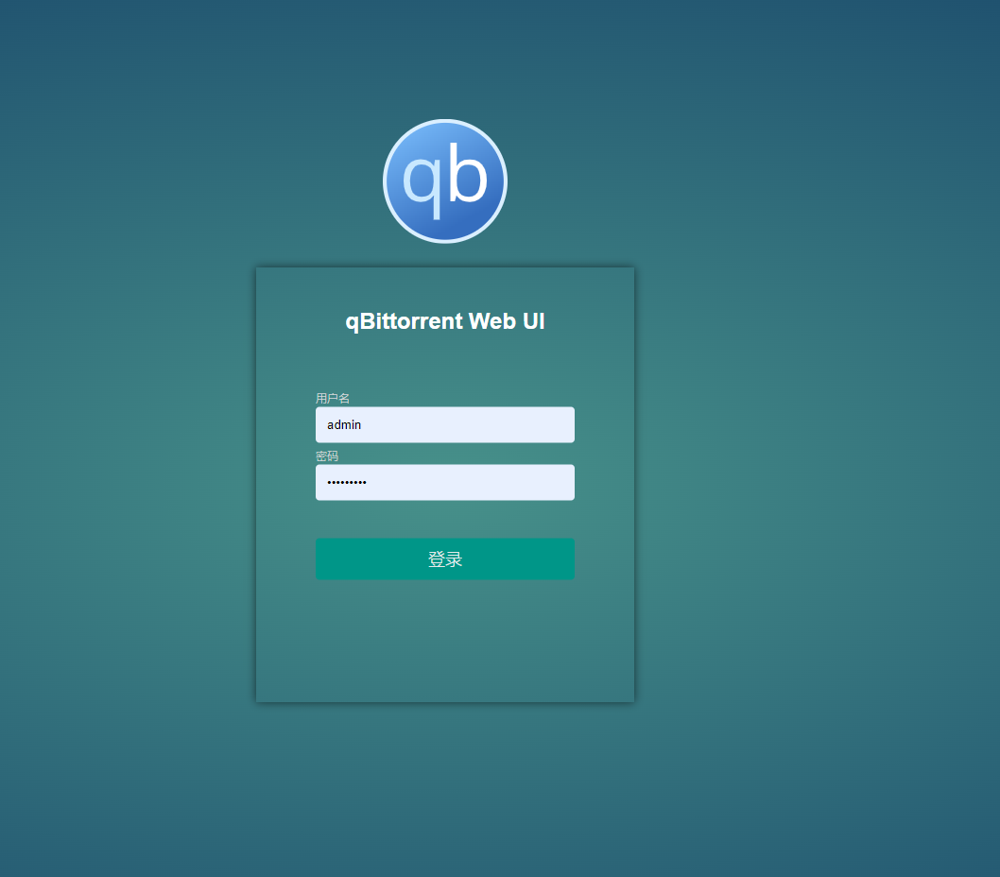
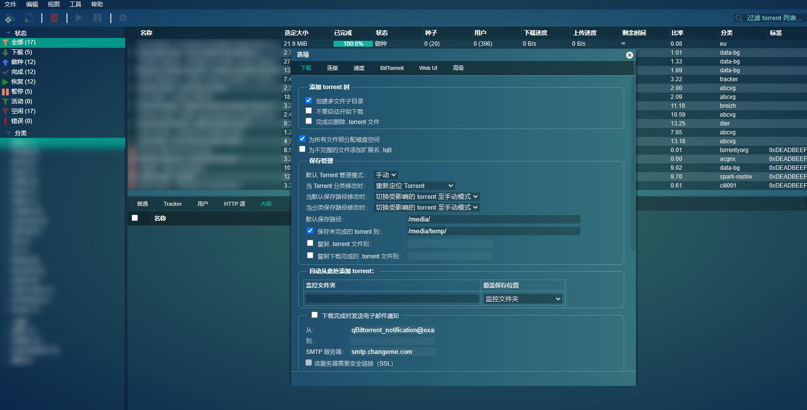
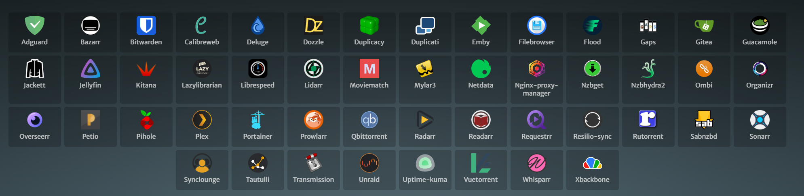

## Einleitung

Diejenigen von uns, die gerne mit NAS herumspielen, sind im Grunde wie ich, die **älteren Männer**:

- Vor Jahren gekaufte Artikel, die immer noch funktionieren, ohne den **Wunsch** zu haben, sie gegen etwas modischeres oder trendigeres auszutauschen.

- Kleidung und Schuhe, die einfach und klassisch sind, mit Priorität auf Qualität und Langlebigkeit.

- Die Verwendung des Standard-Klingeltons, ein 3 Jahre altes Telefon fühlt sich brandneu an, nur mit einem Displayschutz und einer neuen Hülle.

...

Wir sind die **am wenigsten beachteten** in der Konsumarmee... [**Mädchen > Kinder > Junge Frauen > Ältere > Hunde > Männer**]

Aber... das bedeutet nicht, dass wir eine Gruppe von schlampigen, altmodischen Kerlen sind.

Tatsächlich: Wir streben auch nach **Schönheit**, und wir mögen auch **auffällige und trendige** Dinge; es ist nur so, dass wir Männer rationaler sind, Langlebigkeit suchen und weniger wahrscheinlich in Konsumfallen tappen...

Heute breche ich mit der Norm. Anstatt praktische Tutorials zu teilen, werde ich Sie Schritt für Schritt anleiten, um Ihr NAS und die Oberflächen verschiedener Mainstream-Software-Dienste (qBittorrent, Jellyfin, Emby usw.) von oben bis unten zu verschönern.

Die Inspiration kam von

Vor ein paar Tagen sah ich einen Artikel von einem Community-Experten, Stark-C, über ["【VueTorrent】Ein erstaunliches qBittorrent-Theme, zugänglich für jeden"](https://post.smzdm.com/p/an9ero87/), der eine cool aussehende Alternative zu qBittorrent vorstellte, genannt VueTorrent.


Beim Lesen der Kommentare haben viele Leute dieses trendige Theme ausprobiert, aber leider scheint es nicht reibungslos zu funktionieren. Es gab viele Fehler, weit entfernt von der Stabilität und Zuverlässigkeit unseres alten qBittorrent, und der Wechsel zu einem neuen Dienst erforderte viel Aufwand...

Aber das Aussehen von qBittorrent ist einfach zu hässlich.


Heute bringe ich Ihnen etwas Neues und werde Ihnen Schritt für Schritt eine einfache Methode beibringen, um Ihr qBittorrent und andere Dienste komplett zu transformieren.





Nicht nur qBittorrent, sondern auch andere **Mainstream-Software** wie Jellyfin, Emby usw., mit **mehreren Themes zur Auswahl**.


Ohne weitere Umschweife, lassen Sie uns beginnen. Das gesamte Tutorial ist sehr einfach.

## Vorstellung von Theme-Park

**Theme.Park** ist eine Sammlung von Themes/Skins für über 50 selbst gehostete Anwendungen.


Unterstützte Anwendungen umfassen, sind aber nicht beschränkt auf:

- **Mediendienste**: Plex, Jellyfin, Emby, Sonarr, Radarr, Lidarr usw.
- **Download-Tools**: qBittorrent, Deluge, ruTorrent, Transmission usw.
- **Systemüberwachung**: Netdata, Portainer, Pi-hole usw.
- **Andere Tools**: Bitwarden, Duplicacy, Gitea, Unraid usw.



Vorteile der Nutzung:

- Keine Notwendigkeit, bestehende Dienste zu modifizieren oder zu ersetzen.
- Null Eingriff.
- Mehrere Themes zur Auswahl.

Erreichen Sie mühelos Ihre ästhetischen Ziele.

Als Nächstes beginnen wir offiziell mit dem Einrichtungsprozess.

---

Einrichtungsschritte:

## Wichtige Punkte

"Drücken Sie den kostenlosen Folgen-Button", um sich nicht zu verirren.

## 2. Bereitstellung

Da ich etwas wie Nginx, den **Nginx Proxy Manager** als meinen Reverse-Proxy verwende, ist der gesamte Prozess sehr einfach und erfordert nur wenige Konfigurationen:


Fügen Sie einfach diesen Code ein:

```
proxy_set_header Accept-Encoding "";
sub_filter
'</body>'
'<link rel="stylesheet" type="text/css" href="https://theme-park.dev/css/base/emby/space-gray.css">
</body>';
sub_filter_once on;
```

Und das Theme wird angewendet:


#### Konfigurationserklärung:

- Fügen Sie links eine benutzerdefinierte Position hinzu, kopieren Sie von der rechten Seite wie sie ist
- Für das Symbol an Position 3, wenn Sie es nicht geändert haben, sollte es **/** sein
- Der Hauptteil des Codes, der zu modifizieren ist: https://theme-park.dev/css/base/{Softwarename}/{Themename}.css

Für den Softwarenamen wird empfohlen, die unterstützte Software auf der [offiziellen Website](https://docs.theme-park.dev/) zu überprüfen, und die Themes können dort ebenfalls eingesehen werden.

Damit endet das gesamte Tutorial...

Wenn Ihr Reverse-Proxy Caddy, Traefik, Apache usw. ist, können Sie **die offizielle Website** für weitere Informationen besuchen.

## 3. Selbsthosting von Theme-Park

Wenn Sie das gesamte Theme-Park **privatisieren** möchten, anstatt die offiziellen CSS-Themes zu verwenden (die langsam sein könnten), ist es einfach, nur einen Docker-Container bereitzustellen:

```
version: "2.1"
services:
  theme-park:
    image: ghcr.io/themepark-dev/theme.park
    container_name: theme-park
    environment:
      - PUID=0
      - PGID=0
      - TZ=Asia/Shanghai
    ports:
      - 32080:80
      - 34443:443
    restart: unless-stopped
```

Nach der Einrichtung, wenn Sie Themes referenzieren, können Sie den lokalen Pfad verwenden:

> Die IP ist die IP Ihres NAS (hier ist meine 172.16.23.106), und der Port ist wie in der Konfigurationsdatei oben definiert, wenn Sie meinem Tutorial folgen, ist es 32080

Ersetzen Sie den ersten Teil des href im Code aus Schritt 2

```
proxy_set_header Accept-Encoding "";
sub_filter
'</body>'
'<link rel="stylesheet" type="text/css" href="http://172.16.23.106:32080/css/base/emby/space-gray.css">
</body>';
sub_filter_once on;
```

## 4. Zusätzliche Informationen

Für einige Anwendungen unterscheidet sich die Bereitstellungsmethode, da ich einige der Anwendungen selbst nicht habe. Daher müssen diejenigen, die Schönheit lieben, selbst forschen und herumbasteln. Sie können auch einen Kommentar hinterlassen, und ich werde mein Bestes tun, um zu antworten.


## Zusammenfassung

Das Leben ist schon kompliziert und düster genug. Ich hoffe, der heutige Beitrag kann Ihrem NAS und Ihrem privaten Cloud-Ökosystem einen Farbtupfer verleihen.

Wenn Ihnen dieser Artikel gefällt, denken Sie bitte daran, zu liken, zu speichern und 【Dads Digital Garden】 zu folgen, wo wir weiterhin mehr praktische Selbsthosting-Anwendungsleitfäden bringen werden. Zusammen nehmen wir die Kontrolle über unsere Daten und erschaffen unsere eigene digitale Welt!

Wenn Sie während des Einrichtungsprozesses auf Probleme stoßen oder Vorschläge haben, zögern Sie nicht, unten einen Kommentar zu hinterlassen, um gemeinsam zu diskutieren und zu lernen.