## Introduction

Those of us who enjoy playing with NAS are essentially like me, the **older men**:

- Items purchased years ago that still work, with **no desire** to switch them out for something more fashionable or trendy.

- Clothes and shoes that are simple and classic, prioritizing quality and durability.

- Using the default phone ringtone, a 3-year-old phone feels brand new with just a screen protector and a new case.

...

We've become the **least regarded** in the consumer army... [**Girls > Children > Young Women > Elderly > Dogs > Men**]

But... this doesn't mean we are a group of sloppy, old-fashioned guys.

In fact: We also strive for **beauty**, and we also **like flashy and trendy** things; it's just that as men, we are more rational, seek longevity, and are less likely to fall into consumer traps...

Today, I'm breaking the norm. Instead of sharing practical tutorials, I'll guide you step by step to beautify your NAS and the interfaces of various mainstream software services (qBittorrent, Jellyfin, Emby, etc.) from top to bottom.

The inspiration came from

A couple of days ago, I saw an article by a community expert, Stark-C, about ["【VueTorrent】An Amazing qBittorrent Theme, Accessible to Everyone"](https://post.smzdm.com/p/an9ero87/), introducing a cool-looking alternative to qBittorrent called VueTorrent.

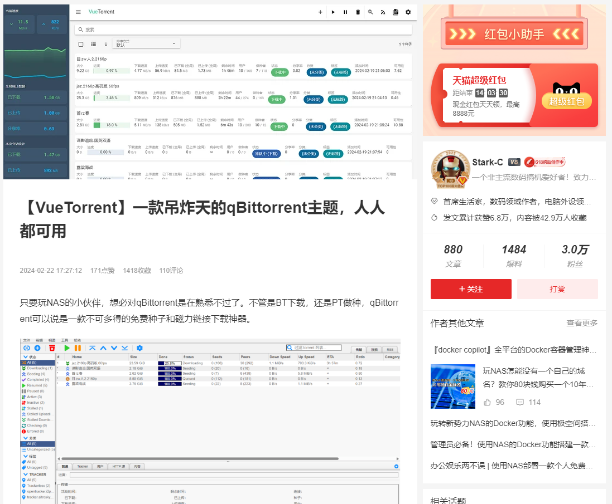

Reading the comments, many people tried this trendy theme, but unfortunately, it seems not to go smoothly. There were many errors, far from the stability and reliability of our old qBittorrent, and switching to a new service required a lot of effort...

But qBittorrent's appearance is just too ugly.

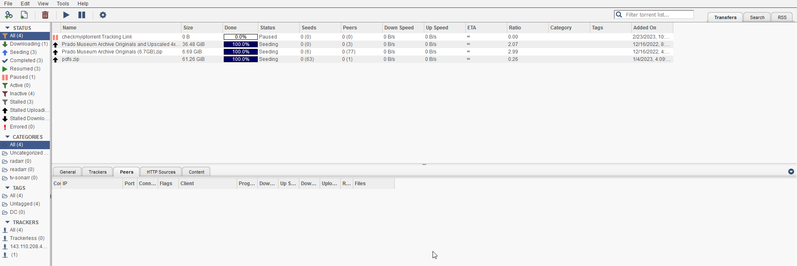

Today, I bring you something new and will teach you, step by step, a simple method to completely transform your qBittorrent and other services.

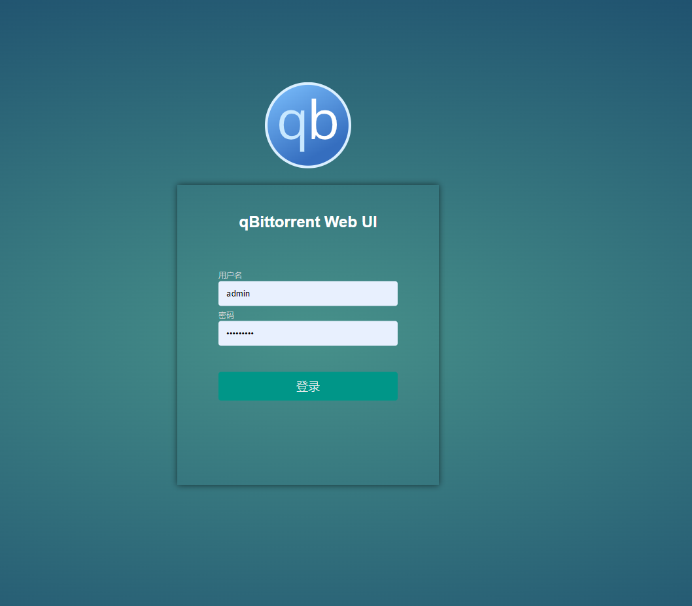

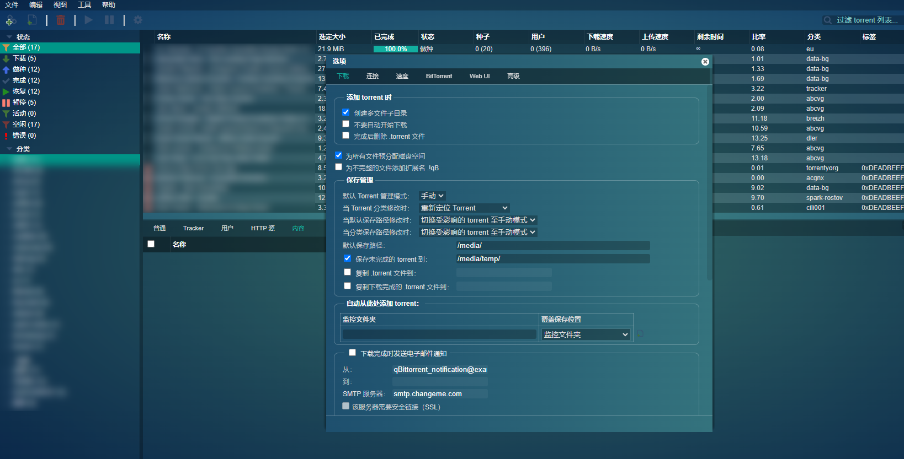

Not just qBittorrent, but other **mainstream software** like Jellyfin, Emby, etc., with **multiple themes to choose from**.

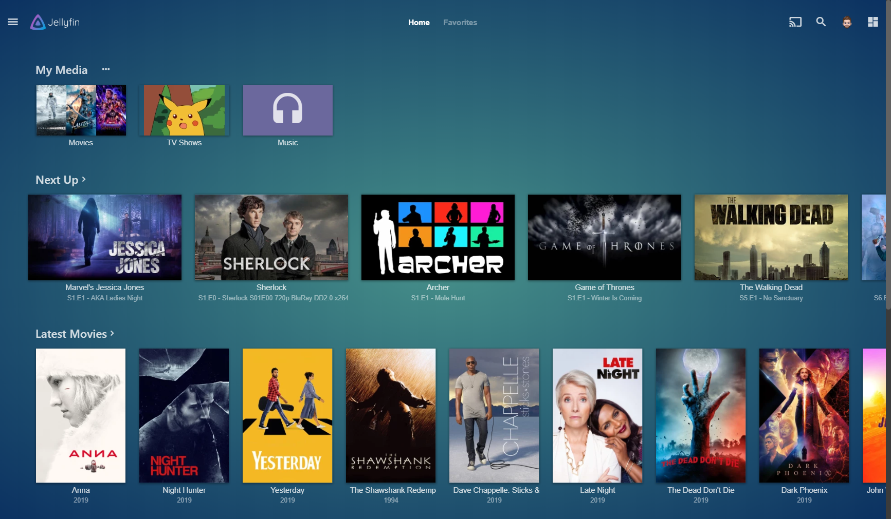

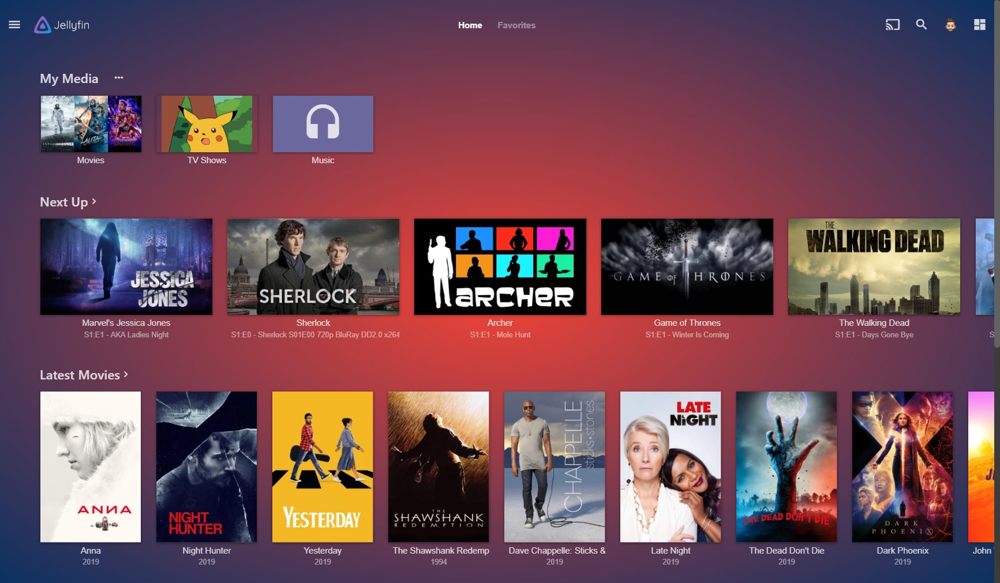

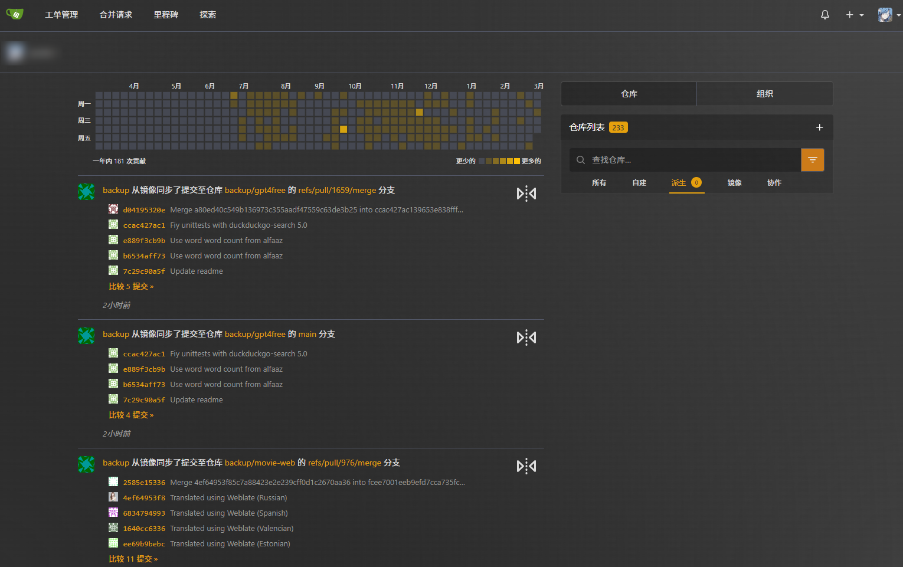

Without further ado, let's get started. The entire tutorial is very simple.

## Introducing Theme-Park

**Theme.Park** is a collection of themes/skins for over 50 self-hosted applications.

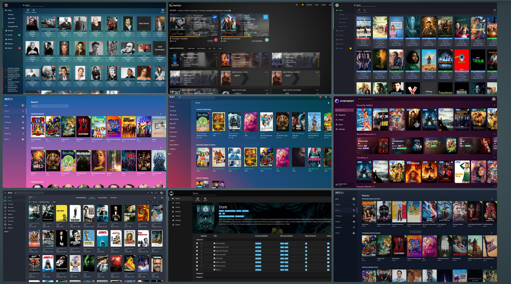

Supported applications include, but are not limited to:

- **Media Services**: Plex, Jellyfin, Emby, Sonarr, Radarr, Lidarr, etc.
- **Download Tools**: qBittorrent, Deluge, ruTorrent, Transmission, etc.
- **System Monitoring**: Netdata, Portainer, Pi-hole, etc.
- **Other Tools**: Bitwarden, Duplicacy, Gitea, Unraid, etc.

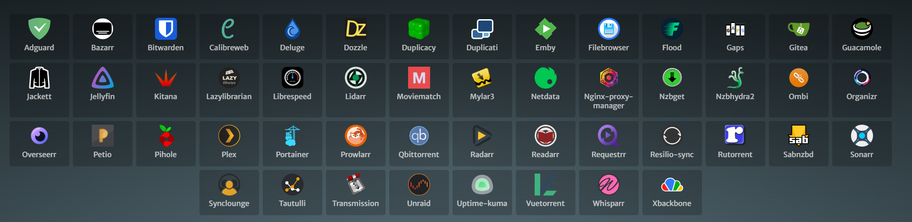

Benefits of using it:

- No need to modify or replace existing services.
- Zero intrusion.
- Multiple themes to choose from.

Easily achieve your aesthetic goals.

Next, we'll officially start the setup process.

---

Setup Steps:

## Key Points

"Hit the free follow button" to not get lost.

## 2. Deployment

Since I am using something like Nginx, the **Nginx Proxy Manager** as my reverse proxy, the whole process is very simple and only requires a few configurations:

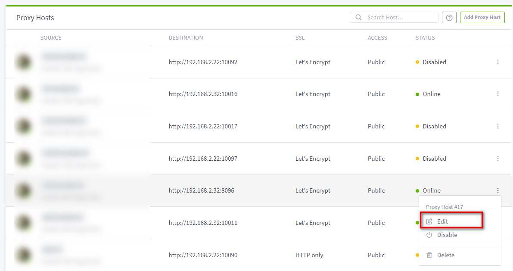

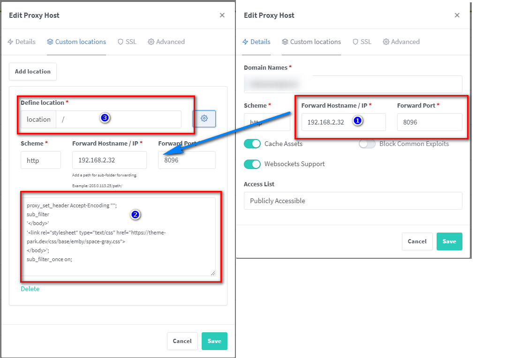

Just paste this code:

```
proxy_set_header Accept-Encoding "";
sub_filter
'</body>'
'<link rel="stylesheet" type="text/css" href="https://theme-park.dev/css/base/emby/space-gray.css">
</body>';
sub_filter_once on;
```

And the theme will be applied:

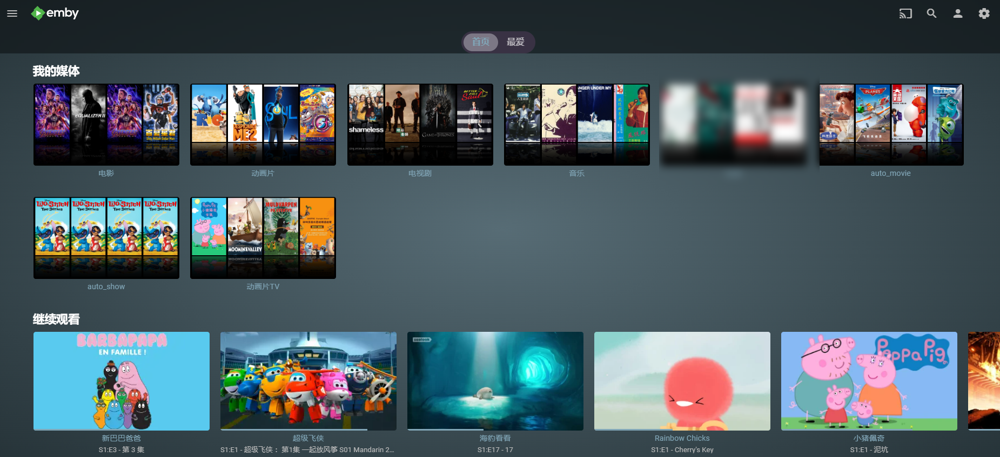

#### Configuration Explanation:

- Add a custom location on the left, copy from the right side as is
- For the icon in place 3, if you haven't changed it, it should be **/**
- The main part of the code to modify is: https://theme-park.dev/css/base/{software name}/{theme name}.css

For the software name, it's recommended to check the supported software on the [official website](https://docs.theme-park.dev/), and the themes can also be viewed there.

This concludes the entire tutorial...

If your reverse proxy is Caddy, Traefik, Apache, etc., you can **visit the official website** for more information.

## 3. Self-hosting theme-park

If you want to **privatize the entire theme-park** instead of using the official CSS themes (which might be slow), it's simple, just deploy a Docker container:

```
version: "2.1"
services:
  theme-park:
    image: ghcr.io/themepark-dev/theme.park
    container_name: theme-park
    environment:
      - PUID=0
      - PGID=0
      - TZ=Asia/Shanghai
    ports:
      - 32080:80
      - 34443:443
    restart: unless-stopped
```

After setting up, when referencing themes, you can use the local path:

> The IP is your NAS's IP (mine here is 172.16.23.106), and the port is as defined in the configuration file above, if you follow my tutorial, it is 32080

Replace the first part of the href in the code from step 2

```
proxy_set_header Accept-Encoding "";
sub_filter
'</body>'
'<link rel="stylesheet" type="text/css" href="http://172.16.23.106:32080/css/base/emby/space-gray.css">
</body>';
sub_filter_once on;
```

## 4. Additional Information

For some applications, the deployment method differs because I don't have some of the applications myself. Therefore, those who love beauty will need to research and tinker on their own. You can also leave a comment, and I will try my best to answer.

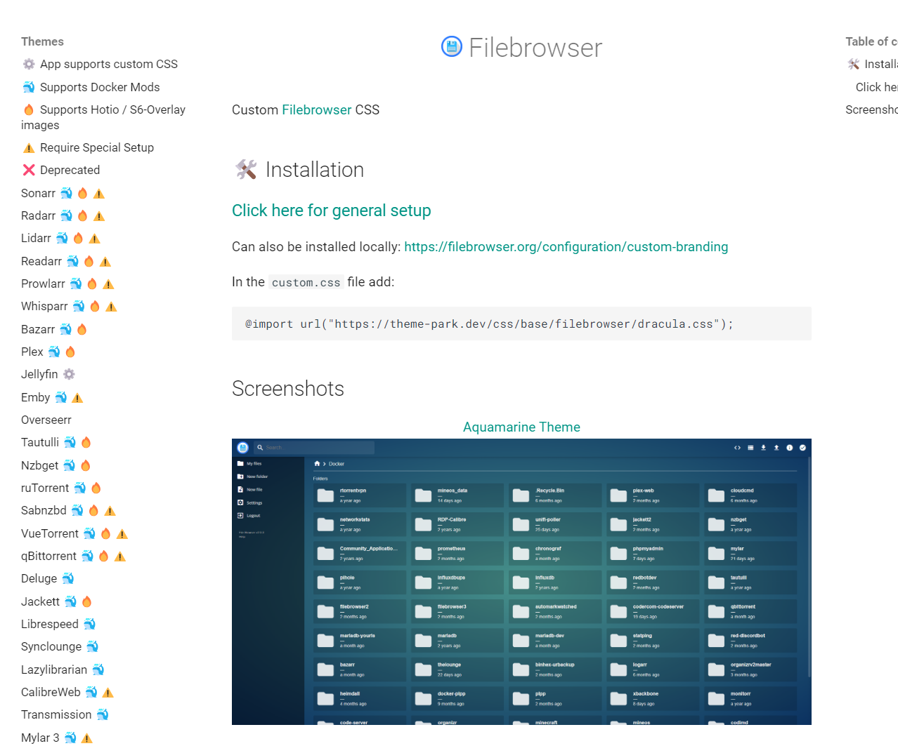

## In Conclusion

Life is already complicated and gloomy enough. I hope today's share can bring a splash of color to your NAS and private cloud ecosystem.

If you like this article, please remember to like, save, and follow 【Dad's Digital Garden】, where we will continue to bring more practical self-hosting application guides. Together, let's take control of our data and create our own digital world!

If you encounter any problems during the setup process, or have any suggestions, feel free to leave a comment below to discuss and learn together.