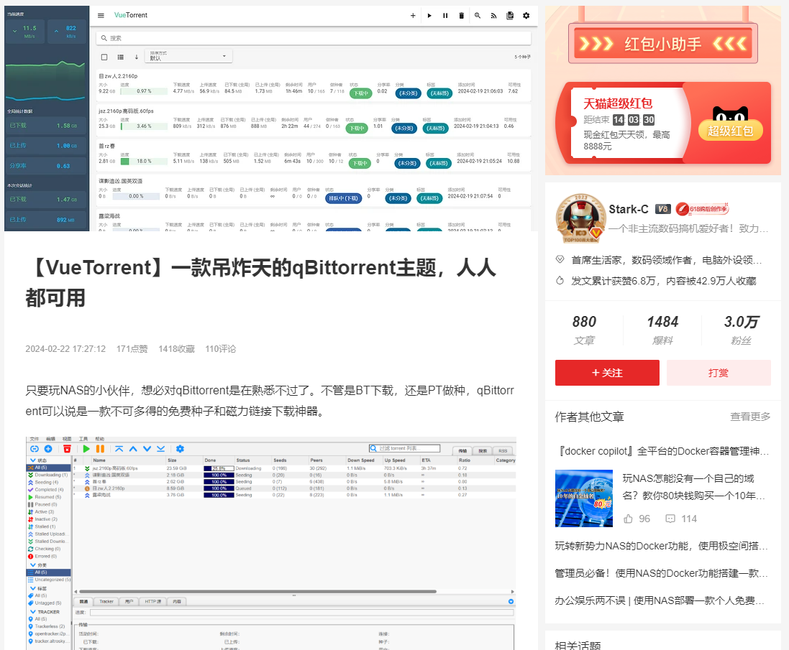
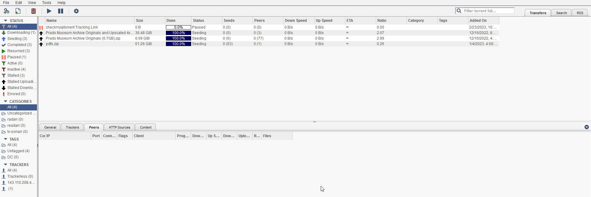
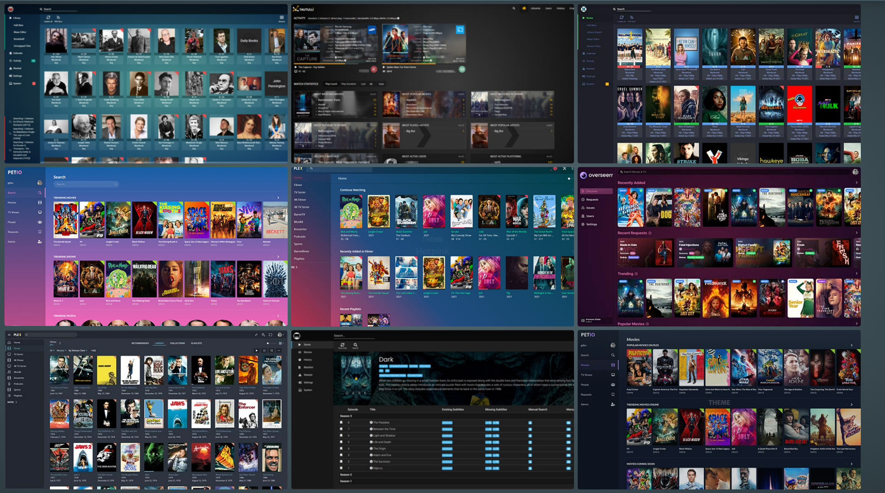
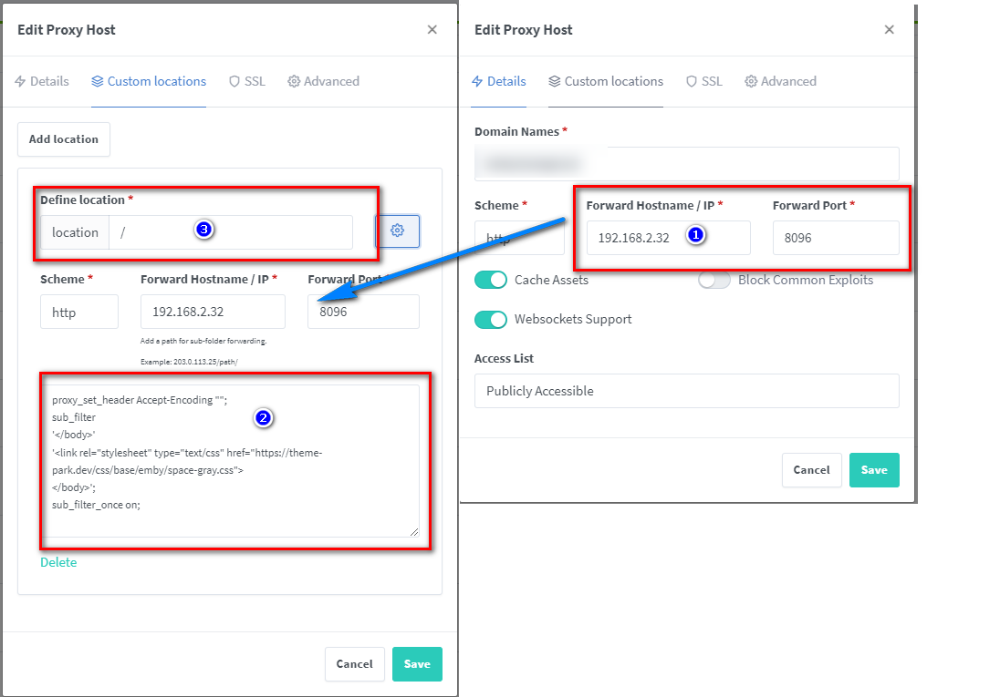
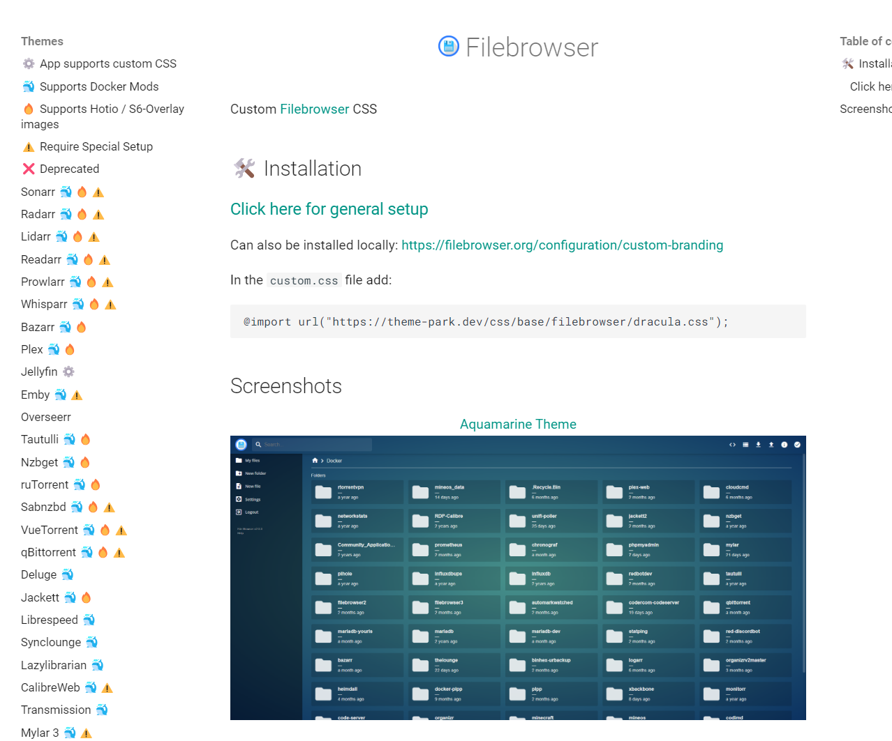

## 1. 前言

爱玩nas的人，基本上都是和我一样的**老男人**

- 几年前买的东西，不坏，根本**没欲望**为了时尚，新潮去换

- 衣服鞋子简单经典，追求质量、耐用

- 默认手机铃声，3年前的手机贴个膜换个壳就跟新的一样

  ...

我们成了消费军团里，**不如狗**的存在... 【**少女>儿童>少妇>老人>狗>男人**】

但...这并不代表，我们是一群邋遢、古板，糙老爷们儿

事实上：我们也希望**追求美**、我们也**喜欢炫酷新潮**的东西，只是作为男人，更加理性，更追求长久，更不容易掉入消费陷阱...


今儿我就破例，不分享什么实用性教程，而是跟着我，一步步的把你的nas，把你每天都要面对的各种主流软件服务（qBittorrent、jellyfin、emby等），从头到脚美化一遍


起因是

前两天看到社区的大神Stark-C 写了一篇关于[《【VueTorrent】一款吊炸天的qBittorrent主题，人人都可用》](https://post.smzdm.com/p/an9ero87/)的文章

介绍了一个外观炫酷、吊炸天的qb替代品 vuetorrent




我看评论大家许多人都为了这么新潮的主题尝试，但是不幸的是似乎并不那么顺利，错误很多，远远不如我们的老qBittorrent，稳定踏实，而且还得换一个新的服务，许多都要折腾...

但是qb的样子实在是太丑太丑了




今天我就带一个新东西，并且教你你来一步步的，用简单的方法，让你的qb，以及其他的各种服务大变样


不仅仅是qb，其他的诸如jellyfin，emby等等**主流的软件**，而且有**多种主题可选**


废话不多说我们开始正题，整个教程非常简单


## 介绍Theme-Park

**Theme.Park**是一套集成了50多个自托管应用的主题/皮肤集合




支持的应用包括但不限于： 

- **媒体服务**：Plex、Jellyfin、Emby、Sonarr、Radarr、Lidarr等 

- **下载工具**：qBittorrent、Deluge、ruTorrent、Transmission等 

- **系统监控**：Netdata、Portainer、Pi-hole等

- **其他工具**：Bitwarden、Duplicacy、Gitea、Unraid等

  


使用它的好处

- 不需要修改、替换原有服务

- 0入侵

- 多种主题可选

  轻松让你实现美的目的


接下来我们正式进入搭建步骤


---

搭建步骤：

## 1. 重点

`点个免费关注`，不迷路


## 2. 部署

由于我是使用，类nginx的**Nginx Proxy Manager**来作为我的反向代理，那么整个过程非常简单，只需要简单配置即可：





贴入这段代码即可：

```
proxy_set_header Accept-Encoding "";
sub_filter
'</body>'
'<link rel="stylesheet" type="text/css" href="https://theme-park.dev/css/base/emby/space-gray.css">
</body>';
sub_filter_once on;
```


主题即可生效：


#### 配置解释：

- 左侧添加自定义location，复制右侧即可
- 图标3地方，如果你没改动，那就是**/**
- 代码部分主要修改：https://theme-park.dev/css/base/{软件名}/{主题名}.css

软件名，建议去[官网](https://docs.theme-park.dev/)查询支持的软件，主题也是从官网查看

到此整个教程就该结束了...


如果你的反向代理是caddy、traefik，apache等等，可以**移步官网**查看

## 3. 自托管theme-park

如果你想要**私有化整个theme-park**，而不是使用官方的css主题（可能网络慢），那么简单，部署一个docker即可

```
version: "2.1"
services:
  theme-park:
    image: ghcr.io/themepark-dev/theme.park
    container_name: theme-park
    environment:
      - PUID=0
      - PGID=0
      - TZ=Asia/Shanghai
    ports:
      - 32080:80
      - 34443:443
    restart: unless-stopped
```


搭建完成后，引用主题，就可以使用本地的路径了：

> ip为你nas所在ip（这里我的是172.16.23.106），端口为上面配置文件定义，如果你按照我的教程，则是32080

替换步骤2的代码部分的href前半部分

```
proxy_set_header Accept-Encoding "";
sub_filter
'</body>'
'<link rel="stylesheet" type="text/css" href="http://172.16.23.106:32080/css/base/emby/space-gray.css">
</body>';
sub_filter_once on;
```


## 4. 补充

部分应用，部署方式有所区别，因为部分应用，我自己都没有，因此需要各位爱美的老爷们儿们，需要自行研究，折腾，也可以留言，尽可能解答



## 最后

生活已经够复杂了，灰暗了，希望今天的分享，能为你的nas、私有云生态带来一抹亮色

如果你喜欢这篇文章，请记得点赞，收藏，并关注【老爸的数字花园】，我们将会持续带来更多实用的自搭建应用指南。一起，让我们掌握自己的数据，创建自己的数字世界！

如果你在搭建过程中遇到任何问题，或者有任何建议，也欢迎在下方留言，一起探讨和学习。