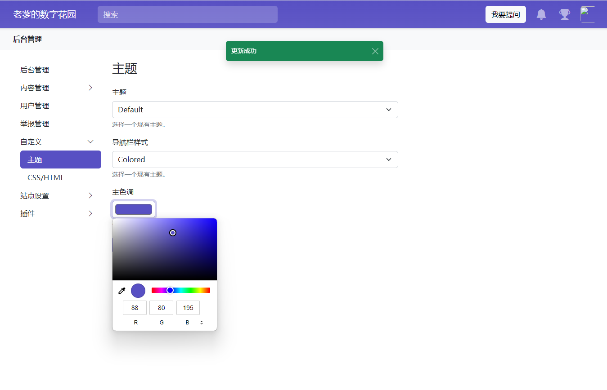

## 1. Einleitung

Hast du dir jemals gewünscht, einen Ort zu haben, an dem du deine Anfragen dokumentieren kannst?

Oder eine Plattform ähnlich wie Zhihu (Q&A-Website), um mit deinen Freunden oder Kunden in Kontakt zu treten?

Vielleicht benötigst du eine Plattform für Diskussionen, Dokumentation und Lösung von Fragen, um die Kommunikation mit Freunden zu verbessern und Kunden dabei zu helfen, deine Produkte oder Dienstleistungen zu verstehen.

Heute werden wir eine Zhihu-ähnliche Plattform - Answer - auf deinem NAS erstellen.


---

## Vorstellung von Answer

Answer ist eine Open-Source-Wissensgemeinschaftssoftware. Mit ihr kannst du schnell deine Q&A-Community für technischen Support, Kundensupport und Benutzerinteraktion aufbauen. Wenn du nach einer einfachen Möglichkeit suchst, mit Kunden und Benutzern zu interagieren, könnte Answer das richtige Werkzeug für dich sein.

**Hauptmerkmale:**

1. **Open Source**: Das bedeutet, dass du Answer kostenlos nutzen kannst und eine große Entwicklergemeinschaft Unterstützung bietet. Du kannst es an deine Bedürfnisse anpassen.
2. **Wissensbasierte Gemeinschaft**: Im Gegensatz zu allgemeinen Foren ist Answer darauf ausgelegt, Fragen zu beantworten. Es kann dir helfen, die Antworten, die du benötigst, schnell zu finden und die Effizienz zu steigern.
3. **Technischer Produktsupport**: Wenn dein Produkt technische Probleme hat, kannst du Answer verwenden, um Lösungen anzubieten. Dadurch können deine Kunden dein Produkt besser verstehen und nutzen.
4. **Kundensupport**: Du kannst Kundensfragen über Answer sammeln und beantworten. Dadurch lernst du deine Kunden besser kennen und steigerst die Kundenzufriedenheit.
5. **Benutzerinteraktion**: Answer kann auch eine Plattform für Benutzerinteraktion sein. Deine Benutzer können sich gegenseitig helfen, Erfahrungen austauschen und Vorschläge machen.
6. **Zufällige Gedanken**: Natürlich kannst du es auch als Ort für zufällige Gedanken nutzen (so verwende ich es).
7. **Markdown-Unterstützung**.


---

Als nächstes gehen wir die Einrichtungsschritte durch:

## 1. Wichtiger Punkt

`Klicke auf die kostenlose Folgen-Schaltfläche`, um nicht den Überblick zu verlieren

## 2. Portainer installieren

Anleitung: 
[Installiere das unverzichtbare NAS-Tool Portainer in 30 Sekunden](/posts/how-to-install-portainer-in-nas/)

##  3. File Station

Öffne den Docker-Ordner in der File Station und erstelle den Ordner `answer`


## 4. Stack erstellen


## 5. Code bereitstellen

```yaml
version: "3"
services:
  answer:
    image: answerdev/answer
    ports:
      - '9080:80'
    restart: on-failure
    volumes:
      - /volume1/docker/answer:/data
```

1. Wähle den Stack aus
2. Gib 'answer' in das Namensfeld ein
3. Gib den obigen Code in den Editor ein
4. Klicke auf Bereitstellen


## 6. Erfolg


## 7. Verwendung

Gib das Programm im Browser ein: [IP]:[Port]

> Die IP ist die deines NAS (meine ist hier 172.16.23.106) und der Port ist in der obigen Konfigurationsdatei definiert. Wenn du meiner Anleitung gefolgt bist, ist es 9080.


## 8. Konfiguration

### Datenbank konfigurieren

Du kannst SQLite verwenden. Wenn es für den Unternehmenseinsatz ist, wird empfohlen, MySQL, pg usw. zu verwenden.


Nächster Schritt


Grundkonfiguration


## 9. Verwendung

Erstelle eine neue Frage (unterstützt Markdown):


- Listenansicht:


- Detailansicht


### Theme festlegen



### Backend-Verwaltung


## Abschließend

Wenn dir dieser Artikel gefallen hat, denke bitte daran, ihn zu liken, zu bookmarken und "NasDaddy" zu folgen. Wir werden weiterhin praktische Anleitungen zur Einrichtung eigener Anwendungen bereitstellen. Gemeinsam nehmen wir unsere Daten in die Hand und erschaffen unsere digitale Welt!

Wenn du während des Einrichtungsprozesses auf Probleme stößt oder Vorschläge hast, hinterlasse gerne einen Kommentar. Lass uns diskutieren und gemeinsam lernen.