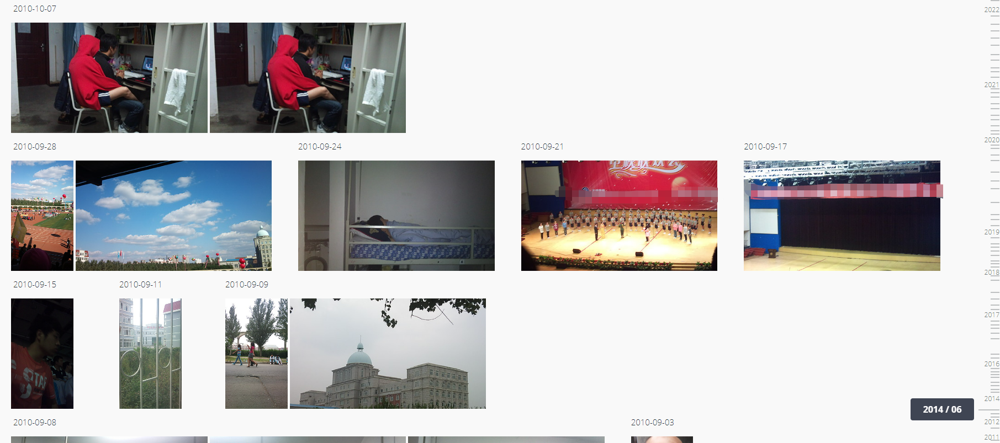
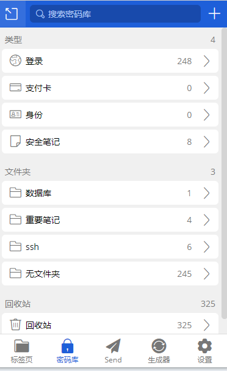
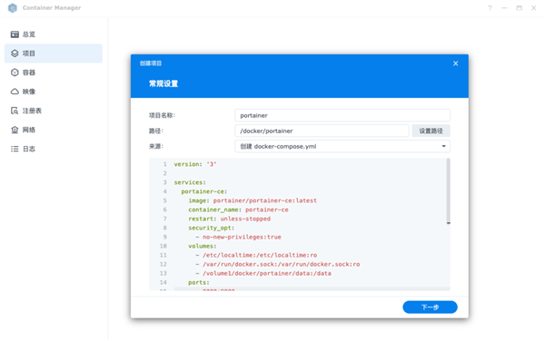
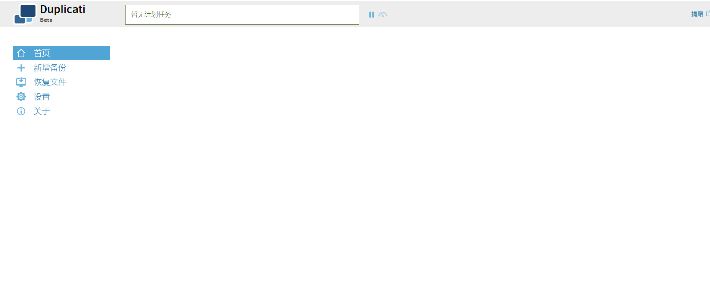
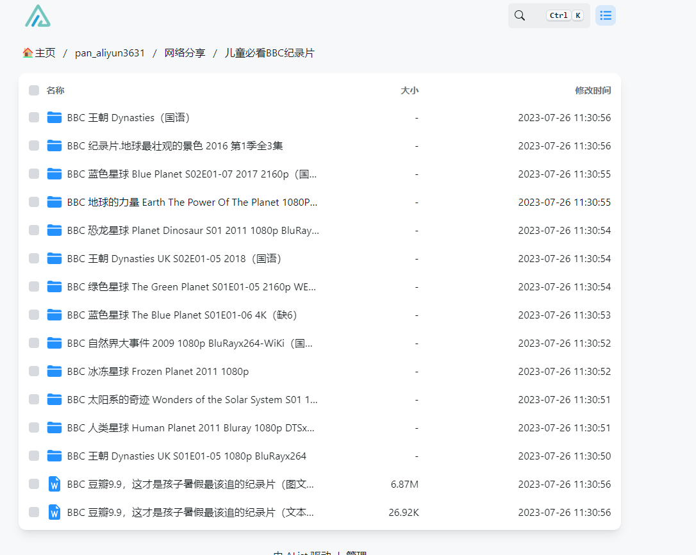
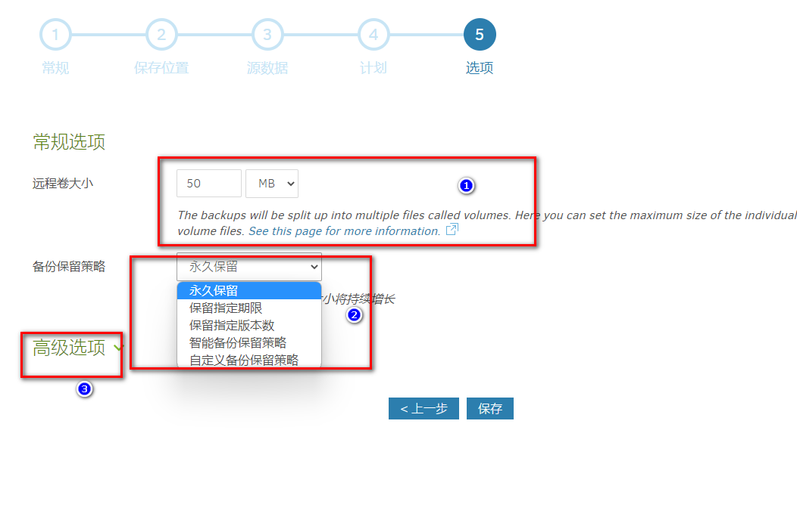
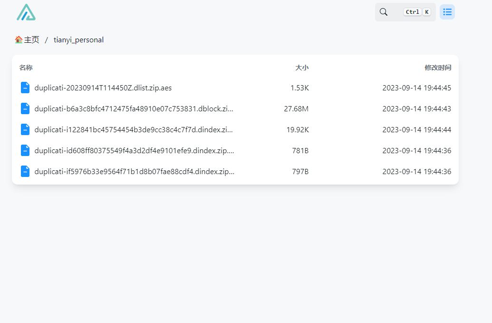
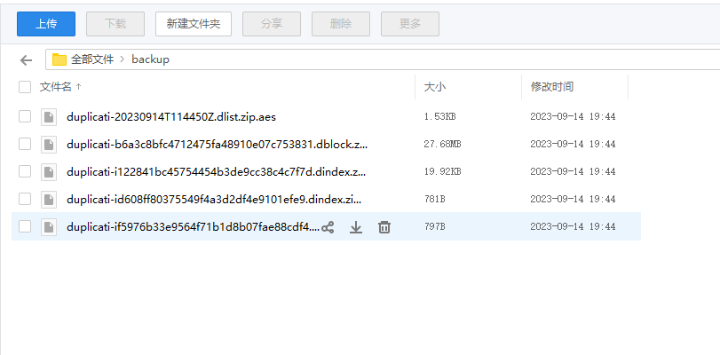
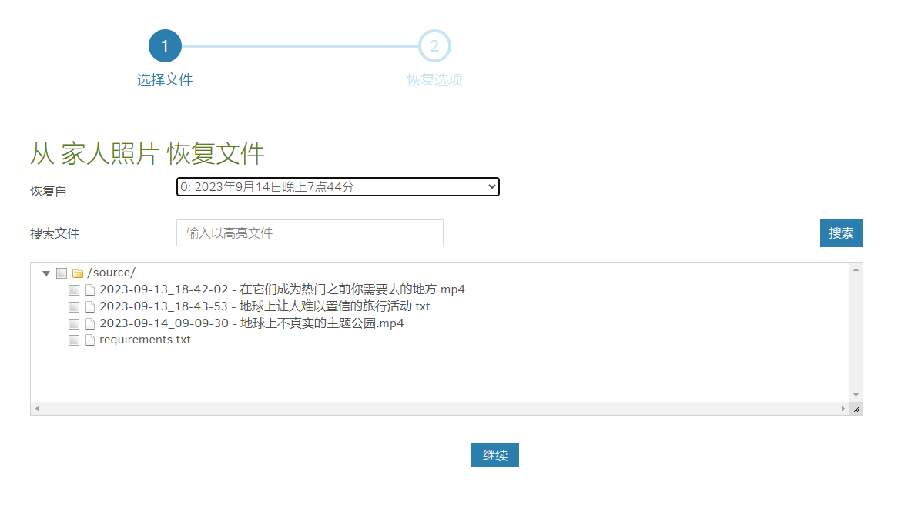
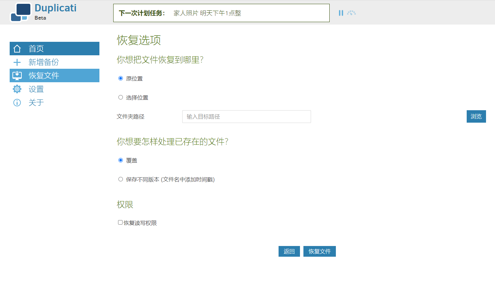

Erfahren Sie, wie Sie Duplicati verwenden, um eine sichere NAS-Sicherung einzurichten und Ihre Heimdaten sorgenfrei zu schützen!
<!--more-->

## 1. Einführung

Ich glaube, dass viele NAS-Player wie ich ihr NAS für verschiedene Zwecke nutzen, wie zum Beispiel als Download-Center, Heimmedien, privaten Speicher, Dokumentencenter und tragbares USB-Laufwerk.

Wie das Sprichwort sagt: "Herumspielen bringt vorübergehende Freude, aber Datenverlust bringt Tränen."

Ich erinnere mich noch gut an einen Morgen im Jahr 2021, als ich wie gewohnt aufwachte und meine Arbeit begann. Als ich mein Arbeitsverzeichnis öffnen wollte, sah ich folgende Szene:


Mir stockte das Herz und ich dachte immer wieder darüber nach, ob ich diese Daten gesichert hatte. Wenn ich sie nicht finden kann, wo sollte ich suchen? Wenn ich mich an die Situation zu dieser Zeit erinnere, verspüre ich immer noch eine bleibende Angst.


Glücklicherweise habe ich keinen zufälligen Anleitungen gefolgt und keine unüberlegten Operationen durchgeführt. Es handelte sich nur um einen Systemfehler und ich konnte das System erfolgreich neu installieren, sodass die Daten gelesen und wiederhergestellt werden konnten.

Der Grund, warum ich so nervös war, lag eigentlich an der Kernfrage: "Wo sollte ich suchen und habe ich Backup-Daten, wenn diese Daten fehlen?"

Als NAS-Player haben wir uns "aus dem Schutz der öffentlichen Cloud-Dienste" zurückgezogen und uns dafür entschieden, "Speicherdaten zu privatisieren". Daher müssen wir die Probleme der Datensicherheit und des Backups selbst lösen.

Und dieser Artikel ist hier, um dieses Problem zu lösen.

Ich werde Ihnen ein Backup-Tool vorstellen, das ich selbst benutze. Es ist für nahezu jedes System geeignet. Es handelt sich um einen kostenlosen und Open-Source-Backup-Client, der "verschlüsselte, inkrementelle und komprimierte" Backups lokal, auf Cloud-Speicherdiensten und auf entfernten Dateiservern sicher speichern kann - Duplicati.


**Gewährleistung der Datensicherheit**: Im Internet fürchtet jeder, dass seine Fotos durchsickern, insbesondere in dieser KI-Ära. Niemand möchte, dass seine Daten für Schulungszwecke verwendet werden. Duplicati bietet eine leistungsstarke Verschlüsselung, um sicherzustellen, dass Ihre Daten für andere nutzlos sind. Solange Sie ein starkes Passwort wählen, sind Ihre Backup-Dateien auf öffentlichen Webservern sicherer als unverschlüsselte Dateien in Ihrem Zuhause.

**Speicherung von Backups entfernt**: Duplicati speichert Backups auf verschiedenen entfernten Dateiservern und unterstützt inkrementelle Backups, sodass nur die geänderten Teile übertragen werden müssen. Dadurch können Sie das Ziel weit entfernt von den Originaldaten festlegen.

**Regelmäßige Backups**: Wenn Datenverlust auftritt, ist das Schlimmste, dass ich ein Backup gemacht habe, aber es ist von vor einem Monat... Duplicati verfügt über einen integrierten Zeitplaner, der es einfach macht, regelmäßige und aktuelle Backups aufrechtzuerhalten. Darüber hinaus verwendet Duplicati Dateikomprimierung und kann inkrementelle Backups speichern, um Speicherplatz und Bandbreite zu sparen.

Bevor wir mit dem Haupttext beginnen, möchte ich ein wenig über das Datenbackup sprechen:

- Welche Daten sollten gesichert werden
- Wie man Daten sichert
- Wie Duplicati uns bei der Lösung dieses Problems helfen kann

## Backup-Strategie

Derzeit ist die gängige Datenverwaltungsstrategie für Spieler sowohl im Inland als auch international die 3-2-1-Backup-Strategie.

> Dies ist auch die von der US-Regierung übernommene Datenbackup-Strategie.


3: Bedeutet, dass Ihre Daten mindestens `3 Backups` haben sollten.

2: Davon sind `zwei lokal`, aber auf `unterschiedlichen Geräten`.

1: Mindestens ein Backup sollte `extern` (in der Cloud) sein.

Die Vorteile dieses Ansatzes sind:

1. Schnelle Datenwiederherstellung, Zeitersparnis

Mit 2 lokalen Backups können wir Daten im Falle eines Datenverlusts schnell wiederherstellen. Wenn zum Beispiel eine Festplatte ausfällt, können wir die Daten schnell auf eine neue Festplatte kopieren und verwenden.

2. Reduzierung des Risikos eines erheblichen Datenverlusts

Mit 2 lokalen Backups können wir Daten schnell wiederherstellen. Wenn jedoch gleichzeitig unerwartete Ereignisse bei beiden lokalen Backups auftreten, wie Feuer, Diebstahl, Überschwemmungen usw., schützen uns Backup-Dateien an verschiedenen Orten oder eines in der Cloud sehr gut vor Datenverlust.

Deshalb verwenden wir Duplicati. Es kann Daten einfach verschlüsseln und remote sichern.

Die 3-2-1-Strategie kann auch in verschiedenen Bereichen erweitert und angepasst werden, wie z.B. 3-2-1-1-0 (mit einer zusätzlichen 0 für Fehlerkorrektur) oder 4-3-2 (mit zwei unabhängigen Netzwerkbackups).

Diese Datenbackup-Strategie ist die umfassendste, aber sie mag `für Sie möglicherweise nicht am besten geeignet sein`. Als Nächstes werde ich meine Backup-Strategie teilen, welche Daten gesichert werden müssen und wie ich sie sichere.

## Meine Datenbackup-Strategie

> Dieser Teil ist eine sehr subjektive Meinung. Wenn Sie nur das Tutorial sehen möchten, können Sie ihn direkt überspringen.

Meiner Meinung nach lautet die Prioritätenreihenfolge der zu sichernden Daten wie folgt:

1. **Familienfotoalben**

Dies ist meiner Meinung nach der `wichtigste` Teil.



Filme, verschiedene Dokumente, Tutorials und Git sind nicht so wichtig wie Familienfotoalben.

Mein Körper wird jeden Tag älter, meine Kinder wachsen jeden Tag auf und mein Gehirn verschlechtert sich auch jeden Tag.

Es kann nicht so viele `Erinnerungen` festhalten.

Ich kann diese Filme erneut herunterladen, ich kann wählen, sie nicht anzusehen, und wenn ein Dienst verschwindet, kann ich einen öffentlichen Cloud-Dienst als Ersatz verwenden.

Aber wenn die Fotos weg sind, sind sie `für immer verloren`.

Deshalb verwende ich für Familienfotoalben die 3-2-1-Strategie.

2. **Wichtige Notizdaten**

Obsidian sowie DokuWiki, Notion und Evernote-Ausschnitte haben möglicherweise bereits Zehntausende von Notizen.


Für diesen Teil verwende ich ebenfalls die 3-2-1-Strategie.

3. **Wichtige Servicedaten**

Konfigurationsdateien und einige Daten von Docker-Containern wie Vaultwarden, Gitea, Emby und PVE-Backups sowie Kompositionsdateien.



Für große Systembackups wie PVE-Virtual Machines, unter Berücksichtigung der relativ hohen Kosten für Cloud-Speicher, werden `große Daten lokal in mehreren Blöcken` gesichert.

Nun lassen Sie uns mit dem Tutorial-Abschnitt beginnen.

---

## Einführung in Duplicati

Duplicati verfügt über eine Reihe leistungsstarker Funktionen, die es zum bevorzugten Werkzeug für Cloud-Backups im Self-Service machen:

- **Starke Verschlüsselung**: Duplicati verwendet AES-256-Verschlüsselung (oder GNU Privacy Guard), um die Daten vor dem Hochladen zu sichern.
- **Inkrementelles Backup**: Duplicati lädt anfangs ein vollständiges Backup hoch und speichert dann kleinere inkrementelle Updates, um Bandbreite und Speicherplatz zu sparen.
- **Geplantes Backup**: Der integrierte Zeitplaner hält das Backup automatisch auf dem neuesten Stand.
- **Integrierte Benachrichtigungen**: Duplicati benachrichtigt Sie umgehend, wenn das Backup abgeschlossen oder fehl

- **Flexible backup options**: Duplicati ermöglicht es Ihnen, Ordner, Dokumententypen (wie Dokumente oder Bilder) oder benutzerdefinierte Filterregeln zu sichern.
- **Benutzerfreundliche Benutzeroberfläche und Befehlszeilentool**: Duplicati kann als Anwendung mit einer benutzerfreundlichen Benutzeroberfläche oder als Befehlszeilentool verwendet werden.
- **Unterstützung für das Sichern von geöffneten oder gesperrten Dateien**: Duplicati kann den Volume Shadow Copy Service (VSS) unter Windows oder den Logical Volume Manager (LVM) unter Linux verwenden, um geöffnete oder gesperrte Dateien korrekt zu sichern. Dadurch kann Duplicati Microsoft Outlook PST-Dateien sichern, während Outlook ausgeführt wird.
- **Benutzerdefinierte Filter-, Löschungs-, Übertragungs- und Bandbreitenoptionen usw.**.

---

Einrichtungsschritte:

## 1. Schlüsselpunkte

`Folgen Sie kostenlos`, um nicht den Überblick zu verlieren.

## 2. Docker-Verwaltungstools mit grafischer Benutzeroberfläche

#### Synology DSM 7.2 oder höher kann direkt den *Container Manager* verwenden



#### QNAP ContainerStation


#### Installieren Sie Portainer selbst

Tutorial-Referenz: [30-Sekunden-Installation von Portainer, ein Muss für NAS](/how-to-install-portainer-in-nas/)

Als nächstes verwenden wir Portainer als Beispiel.

## 3. File Station

Öffnen Sie den Docker-Ordner in der File Station und erstellen Sie einen Ordner mit dem Namen `Duplicati`.


## 4. Stack erstellen


## 5. Code bereitstellen

```yaml
version: "2.1"
services:
  duplicati:
    image: lscr.io/linuxserver/duplicati:latest
    container_name: duplicati
    environment:
      - PUID=0 # Für Linux die 'id'-Befehl verwenden, um die aktuelle Benutzer-PUID abzufragen, 0 für root
      - PGID=0 # Gleich wie oben
      - TZ=Asia/Shanghai
      - CLI_ARGS= #optional
    volumes:
      - /volume1/docker/duplicati/config:/config # Duplicati-Konfigurationsdateien speichern
      - /volume1/docker/duplicati/backups:/backups # Lokales Backup-Verzeichnis angeben (optional)
      - /volume1/docker/duplicati/source:/source  # Lokale Datenquelle angeben (zu sichernde Daten), nach Bedarf hinzufügen
      # - /volume1/photo:/photo  # Der Teil vor dem Doppelpunkt ist das NAS-Verzeichnis, das gesichert werden soll, und der Teil nach dem Doppelpunkt ist das Verzeichnis innerhalb des Duplicati-Containers (wird später verwendet)
    ports:
      - 8200:8200
    restart: unless-stopped
```

1. Stack auswählen.
2. Geben Sie "duplicati" in das Namensfeld ein.
3. Geben Sie den obigen Code in den Editor ein.
4. Klicken Sie auf Bereitstellen.

> Parametererklärung
>
> backups (optional): Angeben, wann Backups lokal gespeichert werden sollen, kann ignoriert werden, wenn nicht zutreffend.
>
> source (erforderlich): Der Ordner/die Ordner, die/den Sie sichern möchten - `mehrere können ohne Begrenzung angegeben werden`

## 6. Erfolg


## 7. Verwendung

Greifen Sie über Ihren Browser auf das Programm zu: [ip]:[port]

> Ersetzen Sie "ip" durch die IP-Adresse Ihres NAS (in diesem Fall ist meine 172.16.23.106) und "port" durch den in der Konfigurationsdatei definierten Port (wenn Sie meinem Tutorial gefolgt sind, wäre es 8200).



## 8. Präsentation besonderer Funktionen

### Initialisierung

Wenn Sie zum ersten Mal auf das Programm zugreifen, werden Sie aufgefordert, einen Benutzer zu erstellen. Wenn Sie es lokal verwenden, können Sie "nein" wählen und Duplicati erfordert keine Benutzeranmeldung. Andernfalls wählen Sie "ja".


### Backup konfigurieren

1. **Neues Backup hinzufügen**

Sie können wählen, ob Sie ein neues Backup erstellen oder aus einer Konfigurationsdatei importieren möchten.


2. **Backup-Informationen festlegen**

   Stellen Sie sicher, dass Sie das Passwort "merken", da Sie ohne es nicht auf das Backup zugreifen können.


3. Backup-Ziel auswählen

Wenn Sie Backups lokal speichern, wählen Sie den im Compose-File definierten "backup"-Ordner.


Wenn Sie wie ich in eine Cloud-Laufwerk sichern möchten, bietet Duplicati verschiedene Optionen wie S3, FTP usw.

Ich habe mich hier für WebDAV von **alist** entschieden.

#### Was ist alist?

> alist ist ein Dateilistungsprogramm, das mehrere Speicheroptionen unterstützt. Es kann Cloud-Laufwerke aggregieren, Upload-/Download-/Freigabefunktionen bereitstellen und WebDAV unterstützen (das ist das, was wir verwenden werden).

Sobald konfiguriert, sieht es so aus. Dies ist mein Aliyun Drive.




Hier verwende ich Tianyi Cloud Drive, weil ich China Telecom Breitband habe, das Mitgliedervorteile wie 4 TB Speicher, keine Geschwindigkeitsbegrenzung und vor allem wird Tianyi von China Telecom betrieben, also ist es stabil und ich muss mir keine Sorgen machen, dass es eines Tages geschlossen wird.


Für spezifische Konfigurationsdetails können Sie die Dokumentation von alist konsultieren. Bei hoher Nachfrage kann ich ein detailliertes Video-Tutorial erstellen.

4. **Zurück zu Duplicati**

Hier müssen Sie die `alist WebDAV`-Adresse eingeben.


5. Datenbanken der Quelle konfigurieren (zu sichernde Daten)


1. Entsprechend der im Compose-File zugeordneten Quelle (das Verzeichnis, das Sie sichern möchten) auswählen, Sie können mehrere auswählen.
2. Dateien hinzufügen, die Sie filtern möchten.
3. Dateien ausschließen, die Sie nicht verpacken und sichern möchten.


6. **Backup-Zeitplan konfigurieren**

Hier gibt es viele Optionen zur Auswahl.


7. Backup-Optionen konfigurieren



1. Wählen Sie die Größe des komprimierten Pakets. Dateien werden komprimiert und aufgeteilt, geeignet für bestimmte Cloud-Laufwerke, die das Hochladen großer Dateien nicht zulassen.
2. Backup-Aufbewahrungsrichtlinie, Sie können angeben, Backups eine Woche lang oder 5 Kopien aufzubewahren.
3. Erweiterte Optionen können verwendet werden, um Benachrichtigungen usw. zu konfigurieren (in diesem Tutorial nicht behandelt)


Nach dieser Konfiguration ist das Backup eingerichtet.


Lassen Sie es sofort laufen.


Das Alist-Cloud-Laufwerk hat die Backup-Informationen angezeigt.



Das Tianyi-Cloud-Laufwerk hat es auch.



### Dateien wiederherstellen

Sie können die Backups direkt einsehen und herunterladen, um sie wiederherzustellen.






Nun haben Sie bereits die leistungsstarken Funktionen von Duplicati verstanden und warum es ein ausgezeichnetes Cloud-Backup-Tool für den Selbstservice ist.

Wenn Ihnen die Sicherheit Ihrer Daten wichtig ist, sollten Sie es unbedingt ausprobieren.

## Abschließend

Wenn Ihnen dieser Artikel gefällt, denken Sie bitte daran, [Dad's Digital Garden](https://example.com) zu liken, zu bookmarken und zu folgen. Wir werden weiterhin praktische Anleitungen für selbst gehostete Anwendungen bereitstellen. Gemeinsam nehmen wir die Kontrolle über unsere eigenen Daten in die Hand und erschaffen unsere eigene digitale Welt!

Wenn Sie während des Einrichtungsprozesses auf Probleme stoßen oder Vorschläge haben, zögern Sie nicht, unten einen Kommentar für Diskussion und Lernen zu hinterlassen.