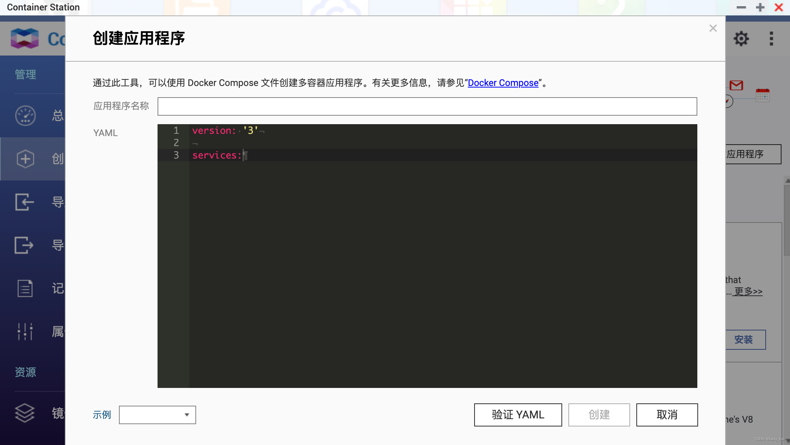

Learn how to use Duplicati to set up a secure NAS backup and protect your home data worry-free!
<!--more-->

## 1. Introduction

I believe that like me, many NAS players use their NAS for various purposes such as a download center, home media, private storage, document center, and portable USB drive.

As the saying goes, "Tinkering brings temporary joy, but data loss brings tears."

I still remember one morning in 2021, when I woke up as usual and started my day's work. When I was about to open my work directory, I saw this scene:


My heart sank, and I kept thinking over and over again, did I back up these data? If I can't find them, where should I look? Recalling the situation at that time, I still feel a lingering fear.


Fortunately, I didn't follow any random tutorials and make reckless operations. It was just a system failure, and I successfully reinstalled the system, which allowed the data to be read and restored to normal.

The reason why I was so nervous was actually because of the core question: "Where should I look and do I have backup data when these data are missing?"

As NAS players, we have "departed from the shelter of public cloud services" and chosen to "privatize storage data." Therefore, we need to solve the issues of data security and backup ourselves.

And this article is here to solve this problem.

I will introduce you to a backup tool that I have been using. It is suitable for almost any system. It is a free and open-source backup client that can securely store "encrypted, incremental, and compressed" backups locally, on cloud storage services, and remote file servers—Duplicati.


**Ensuring Data Security**: On the Internet, I believe everyone is afraid of their photos being leaked, especially in this AI era. No one wants their data to be used for training purposes. Duplicati provides powerful encryption to ensure that your data is garbage to others. As long as you choose a strong password, your backup files on public web servers will be more secure than unencrypted files in your home.

**Storing Backups Remotely**: Duplicati stores backups on various remote file servers and supports incremental backups, so only the changed parts need to be transferred. This allows you to set the destination far away from the original data.

**Regular Backups**: When data loss occurs, the worst-case scenario is that I have made a backup, but it's from a month ago... Duplicati has a built-in scheduler, making it easy to maintain regular and up-to-date backups. In addition, Duplicati uses file compression and is able to store incremental backups to save storage space and bandwidth.

Before we start the main text, I would like to talk a bit about data backup:

- What data should be backed up
- How to backup data
- How Duplicati can help us solve this problem

## Backup Strategy

Currently, the mainstream data management strategy for players both domestically and internationally is the 3-2-1 backup strategy.

> This is also the data backup strategy adopted by the US government.


3: Means that your data should have at least `3 backups`.

2: Among them, `two are local`, but on `different devices`.

1: At least one backup should be `offsite` (in the cloud).

The benefits of this approach are:

1. Quick data recovery, saving time

Having 2 local backups allows us to quickly restore data in case of data loss. For example, if a hard drive fails, we can quickly copy the data to a new hard drive and use it.

2. Reducing the risk of significant data loss

Having 2 local backups allows us to quickly restore data. However, if unexpected events occur simultaneously to both local backups, such as fire, theft, flooding, etc., having backup files in different locations or one in the cloud greatly protects our data.

This is why we use Duplicati. It can easily encrypt and backup data remotely.

The 3-2-1 strategy can also be expanded and modified in different fields, such as 3-2-1-1-0 (with an additional 0 for error correction) or 4-3-2 (with two independent network backups).

This data backup strategy is the most comprehensive, but it may `not be the most suitable for you`. Next, I will share my backup strategy, which data needs to be backed up and how I back it up.

## My Data Backup Strategy

> This part is a very subjective opinion. If you only want to see the tutorial, you can skip it directly.

In my opinion, the priority order of data to be backed up is as follows:

1. **Family Photo Albums**

This is the most `core` part in my opinion.


Movies, miscellaneous documents, tutorials, and git are not as important as family photo albums.

My body is getting older every day, my children are growing up every day, and my brain is also deteriorating every day.

It cannot hold so many `memories`.

I can download those movies again, I can choose not to watch them, and if a service is gone, I can use a public cloud service as a replacement.

But if the photos are gone, they are `lost forever`.

Therefore, for family photo albums, I use the 3-2-1 strategy.

2. **Important Note Data**

Obsidian, as well as DokuWiki, Notion, and Evernote clippings, may already have tens of thousands of notes.


For this part, I also use the 3-2-1 strategy.

3. **Important Service Data**

Configuration files and some data files of Docker containers such as Vaultwarden, Gitea, Emby, and PVE backups, as well as compose files.


For large system backups such as PVE virtual machines, considering the relatively high cost of cloud storage, `large data is backed up locally in multiple blocks`.

Now let's begin the tutorial section.

---

## Introduction to Duplicati

Duplicati has a range of powerful features that make it the preferred tool for self-service cloud backup:

- **Strong encryption**: Duplicati uses AES-256 encryption (or GNU Privacy Guard) to secure the data before uploading.
- **Incremental backup**: Duplicati uploads a full backup initially and then stores smaller incremental updates to save bandwidth and storage space.
- **Scheduled backup**: The built-in scheduler can automatically keep the backup up to date.
- **Integrated application notifications**: Duplicati notifies you promptly when the backup is complete or fails, allowing you to sleep well.
- **Support for multiple targets**: Encrypted backup files can be transferred to FTP, Cloudfiles, WebDAV, SSH (SFTP), Amazon S3, and other targets.

> All the cloud storage services supported by Duplicati are foreign services. I will introduce later how to use domestic cloud storage services in combination.

- **Flexible backup options**: Duplicati allows you to back up folders, document types (such as documents or images), or custom filtering rules.
- **User-friendly interface and command-line tool**: Duplicati can be used as an application with an easy-to-use user interface or as a command-line tool.
- **Support for backing up open or locked files**: Duplicati can use the Volume Shadow Copy Service (VSS) on Windows or the Logical Volume Manager (LVM) on Linux to correctly back up open or locked files, allowing Duplicati to back up Microsoft Outlook PST files while Outlook is running.
- **Custom filtering, deletion rules, transfer, and bandwidth options, etc.**.

---

Setup Steps:

## 1. Key Points

`Follow for free` to avoid getting lost.

## 2. Docker Management GUI Tools

#### Synology DSM 7.2 or above can directly use *Container Manager*


#### QNAP ContainerStation




#### Install Portainer Yourself

Tutorial reference: [30-second Installation of Portainer, a Must-have Tool for NAS](/how-to-install-portainer-in-nas/)

Next, we will use Portainer as an example.

## 3. File Station

Open the docker folder in File Station and create a `Duplicati` folder.


## 4. Create Stack


## 5. Deploy the Code

```yaml
version: "2.1"
services:
  duplicati:
    image: lscr.io/linuxserver/duplicati:latest
    container_name: duplicati
    environment:
      - PUID=0 # For Linux, use 'id' command to query the current user's PUID, 0 for root
      - PGID=0 # Same as above
      - TZ=Asia/Shanghai
      - CLI_ARGS= #optional
    volumes:
      - /volume1/docker/duplicati/config:/config # Store Duplicati configuration files
      - /volume1/docker/duplicati/backups:/backups # Specify the local backup directory (optional)
      - /volume1/docker/duplicati/source:/source  # Specify the local data source (data to be backed up), can be added as needed
      # - /volume1/photo:/photo  # The part before the colon is the NAS directory to be backed up, and the part after the colon is the directory inside the Duplicati container (will be used later)
    ports:
      - 8200:8200
    restart: unless-stopped
```

1. Select stack.
2. Enter "duplicati" in the name field.
3. Enter the above code in the editor.
4. Click deploy.

> Parameter Explanation
>
> backups (optional): Specify when you want to store backups locally, can be ignored if not applicable.
>
> source (required): The folder(s) to be backed up - `multiple can be specified without limit`

## 6. Success


## 7. Usage

Access the program in your browser: [ip]:[port]

> Replace "ip" with the IP address of your NAS (in this case, mine is 172.16.23.106), and "port" with the port defined in the configuration file (if you followed my tutorial, it would be 8200).


## 8. Special Features Showcase

### Initialization

When you first access the program, you will be prompted to create a user. If you are using it locally, you can choose "no" and Duplicati will not require user login. Otherwise, choose "yes".


### Configure Backup

1. **Add New Backup**

You can choose to create a new backup or import from a configuration file.


2. **Set Backup Information**

   Make sure to "remember password" as you won't be able to access the backup without it.


3. Choose Backup Destination

If you are storing backups locally, select the "backup" folder defined in the compose file.


If you want to backup to a cloud drive like me, Duplicati provides various options including S3, FTP, etc.

I chose to use **alist**'s WebDAV here.

#### What is alist?

> alist is a file listing program that supports multiple storage options. It can aggregate cloud drives, provide upload/download/share functionality, and support WebDAV (which is what we're going to use).

Once configured, it looks like this. This is my Aliyun Drive.


Here, I'm using Tianyi Cloud Drive because I have China Telecom broadband, which includes membership benefits like 4TB storage, no speed limit, and most importantly, Tianyi is operated by China Telecom, so it's stable and I don't have to worry about it shutting down one day.


For specific configuration details, you can refer to alist's documentation. If there is high demand, I can create a detailed video tutorial.

4. **Back to Duplicati**

Here, you need to enter the `alist WebDAV` address.


5. Configure Source Databases (data to be backed up)


1. Corresponds to the source mapped in the compose file (the directory you want to back up), you can select multiple.
2. Add files you want to filter.
3. Exclude files you don't want to package and back up.


6. **Configure Backup Schedule**

There are many options to choose from here.


7. Configure Backup Options


1. Select the size of the compressed package. Files will be compressed and split, suitable for certain cloud drives that don't allow uploading large files.
2. Backup retention policy, you can specify keeping backups for a week or 5 copies.
3. Advanced options can be used to configure notifications, etc. (not covered in this tutorial)


After this, the backup is configured.


Let's run it immediately.


The Alist cloud drive has displayed the backup information.


The Tianyi cloud drive also has it.


### Restore Files

You can directly see the backups and download them for recovery.


Now, you have already understood the powerful features of Duplicati and why it is an excellent self-service cloud backup tool.

If you care about the security of your data, you must give it a try.

## Finally

If you like this article, please remember to like, bookmark, and follow [Dad's Digital Garden](https://example.com). We will continue to bring more practical self-hosted application guides. Together, let's take control of our own data and create our own digital world!

If you encounter any problems during the setup process or have any suggestions, please feel free to leave a comment below for discussion and learning.