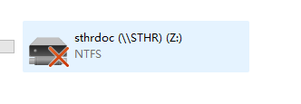
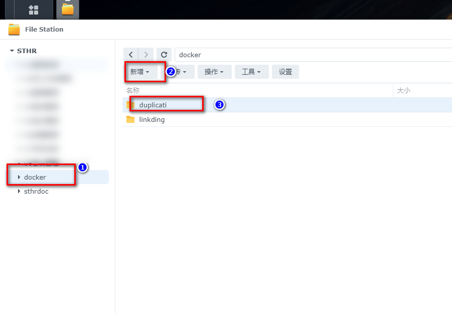
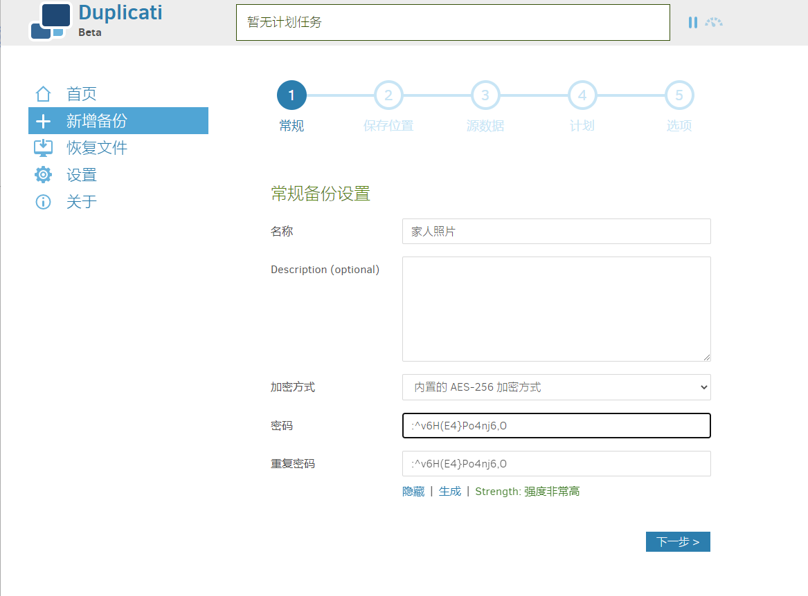
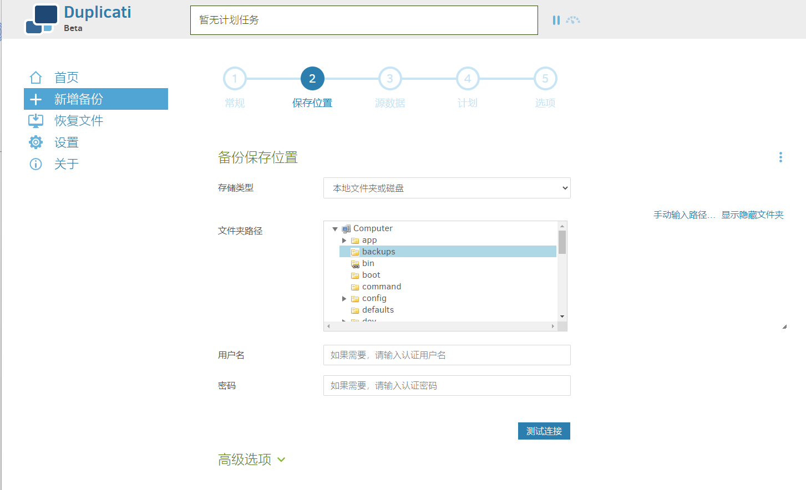
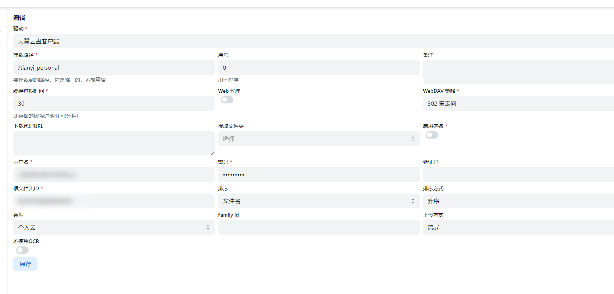
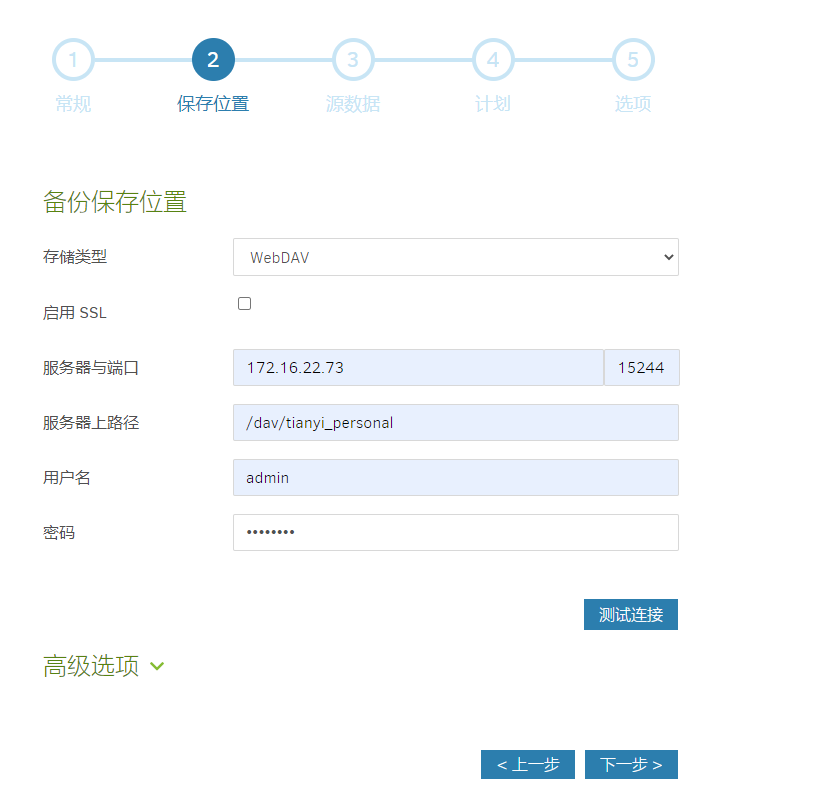
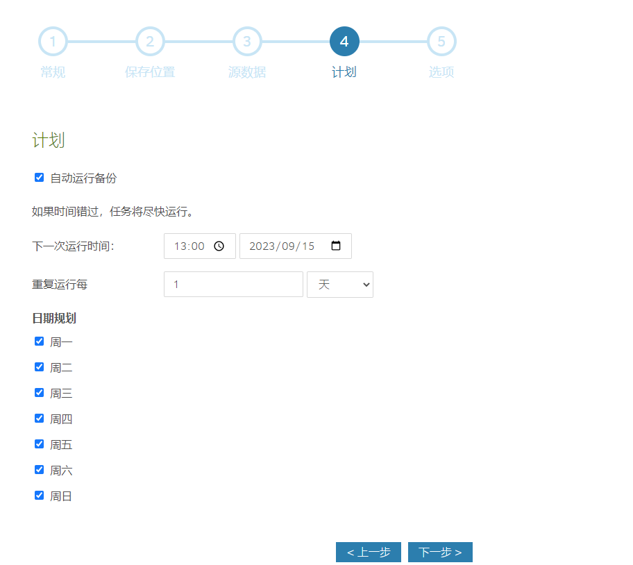
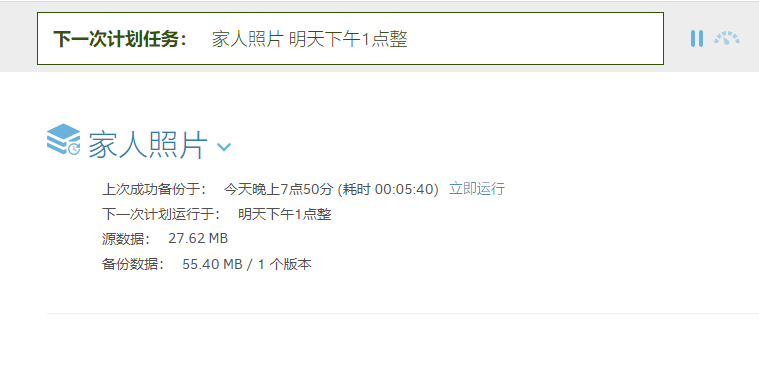
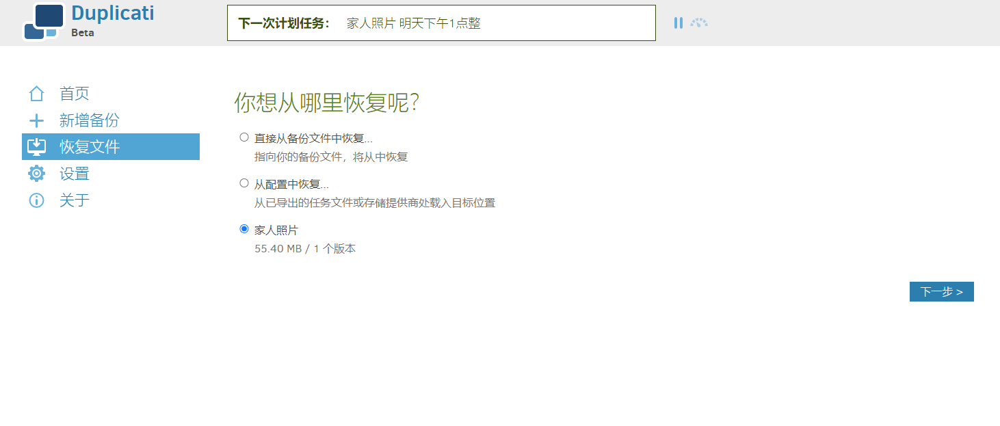

学会使用Duplicati搭建安全的NAS备份，保护家庭数据，无忧无虑！
<!--more-->

## 1. 前言

相信各位玩NAS的朋友和我一样，NAS对于自己来说，可能是下载中心、家庭影音、私有存储、文档中心、随身U盘等等

俗话说，`折腾下载一时爽，数据爆炸两行泪`

我还记得21年的一天早上，一天早上，照例起床，开始一天的工作，当我准备打开工作目录的时候，看到了这样的场景



顿时心凉了一截，脑海中一遍遍的在回想，这些数据有没有备份，如果找不到，我该去哪里找，回想当时的场景，我至今心有余悸


最终结果，还好我没有乱找教程瞎操作，只是系统故障，最后顺利的重做了系统，数据被系统读取到，恢复正常


其实造成我如此紧张的，最核心原因就是：`当这些数据没有的时候，我该去哪里找，有没有备份数据`


作为Nas玩家来说，我们`脱离公有云服务的庇护`，选择`私有化存储数据`，对于数据安全与备份这部分工作，就需要我们自己来解决

而这一篇则是来解决这个问题的


我将带大家介绍一个我一直在用的备份工具，适用于几乎任何系统，它是一个免费、开源的备份客户端，可以安全地将`加密、增量、压缩`的备份存储在本地、云存储服务和远程文件服务器上--`Duplicati`


**保护数据的安全性**：在互联网上，我相信每个人都怕自己的照片泄露，尤其是这个ai时代，大家都不希望自己的数据被拿去训练吧。Duplicati提供强大的加密，确保你的数据对其他人来说是垃圾。只要你选择了一个很好的密码，你的备份文件在公共Web服务器上将比你家中的未加密文件更安全。

**将备份存储在远处**：Duplicati将备份存储在各种远程文件服务器上，并支持增量备份，因此只需传输已更改的部分。这使得可以将目的地设置在原始数据远离的地方。

**定期备份**：当发生数据丢失的情况，最坏的情况莫过于，我备份了，但是是一个月前的...Duplicati具有内置的计划程序，因此很容易保持定期、最新的备份。此外，Duplicati使用文件压缩，并能够存储增量备份，以节省存储空间和带宽。


在我们开始正文之前，我还是想啰嗦一些关于数据备份的事情

- 应该备份哪些数据
- 用什么方式备份
- Duplicati如何可以帮助我们解决这个问题

## 备份策略

目前国内外玩家对于数据管理主流策略：3-2-1 备份策略

> 这也是美国政府一直采用的数据备份策略


3：意味着你的数据至少有`3个备份`

2： 其中`两个本地`，但在`不同设备`上

1：至少有一个`备份在异地`（云上）


这样做的好处在于

1. `快速恢复数据`，节约时间

2个本地备份，可以让我们在发生数据丢失的时候，迅速在本地恢复数据。比如当硬盘损失，迅速拷贝一份新的硬盘，插上去即可使用

2. 降低`大量数据损失`的风险

本地两份备份让我们可以迅速恢复数据，但是如果两份本地备份同时发生意想不到的情况，如火灾、盗窃、水淹等等

这时候备份文件不在同一个地方，或者一个在云上，就会极大的保全我们的数据

这就是为什么使用Duplicati原因，它可以轻松将数据加密备份在远端


3-2-1策略还在不同领域扩展变化成：3-2-1-1-0（多一个0错误部分），4-3-2（两个独立网络备份）

这个数据备份是最全面的，但是并`不一定是最适合你的`，接下来分享我的备份策略，哪些数据需要备份，我又是如何备份的

## 我的数据备份策略

>  这部分是一个很主观的看法，如果只是想要看教程的，可以直接略过

备份哪些数据，在我的内心当中，数据的优先级排序

1. **家庭相册**

这个部分是我个人认为`最核心`的东西


什么电影，乱七八糟的文档，教程，git都没有家人的相册来的重要

我的身体正在一天天老去，孩子一天天在长大，我的大脑也在一天天退化

它无法装下那么多`回忆`

其他这些电影没了，我可以再下，可以不看，服务没了，可以用共有云服务替代

但是照片没了，就`永远消失`了

所以，对于家庭相册，我才用的是3-2-1


2. **重要笔记数据**

obsidian，以及dokuwiki，notion，加上evernote剪藏，可能已经有几万条笔记了


这部分我也是采用3-2-1


3. **重要服务数据**

aultwarden、gitea、emby，pve备份等等这些docker 容器的配置文件及部分数据文件，以及compose 文件


大型系统备份如，pve等虚拟机，考虑到云存储价格比较高，`大的数据均在本地，分多块备份`


接下来开始教程正式部分

---

## 介绍Duplicati

Duplicati拥有一系列强大的功能，使其成为自助式云备份的首选工具：

- **强大的加密**：Duplicati使用AES-256加密（或GNU隐私卫士）来在上传之前保护所有数据的安全性。
- **增量备份**：Duplicati首次上传完整备份，然后存储较小的增量更新，以节省带宽和存储空间。
- **定时备份**：内置的计划程序可以自动保持备份最新。
- **集成应用提醒**：Duplicati会在备份完成，失败后及时通知你，让你睡个好觉
- **支持多种目标**：加密的备份文件可以传输到FTP、Cloudfiles、WebDAV、SSH（SFTP）、Amazon S3等目标。

> Duplicati支持的全部都是国外网盘，后面我会介绍，如何使用国内网盘搭配使用

- **灵活的备份选项**：Duplicati允许备份文件夹、文档类型（如文档或图片）或自定义过滤规则。
- **用户友好界面和命令行工具**：Duplicati既可用作具有易于使用的用户界面的应用程序，也可用作命令行工具。
- **支持打开或锁定文件备份**：Duplicati能够使用Windows下的卷快照服务（VSS）或Linux下的逻辑卷管理器（LVM）来正确备份已打开或锁定的文件，这使得Duplicati能够在Outlook运行时备份Microsoft Outlook PST文件。
- **自定义过滤、删除规则、传输和带宽选项等**。

---

搭建步骤：

## 1. 重点

`点个免费关注`，不迷路

## 2. docker管理图形工具

#### 群晖 DSM 7.2版本以上可以直接使用 *Container Manager*


#### 威联通 ContainerStation 


#### 自行安装Portainer

教程参考：
[30秒安装Nas必备神器 Portainer](/how-to-install-portainer-in-nas/)


接下来以Portainer 为例

##  3. File Station

File Station 打开docker 文件夹，创建`Duplicati`文件夹



## 4. 创建stack


## 5.  部署代码

```yaml
version: "2.1"
services:
  duplicati:
    image: lscr.io/linuxserver/duplicati:latest
    container_name: duplicati
    environment:
      - PUID=0 # linux使用 id 查询当前用户puid，0为root
      - PGID=0 # 同上
      - TZ=Asia/Shanghai
      - CLI_ARGS= #optional
    volumes:
      - /volume1/docker/duplicati/config:/config # 存放duplicati配置文件
      - /volume1/docker/duplicati/backups:/backups # 指定本地备份目录（可选）
      - /volume1/docker/duplicati/source:/source  # 指定本地数据源(要备份的数据) 可随意增加
      # - /volume1/photo:/photo  # 冒号前为想要备份的nas目录，冒号后面是duplicati容器内部目录（后面会用）
    ports:
      - 8200:8200
    restart: unless-stopped
```

1. 选择stack
2. name栏输入duplicati
3. edditor输入：上面代码
4. 点击deploy

> 参数解释
>
> backups（可选）：当你想要将备份放在本地时，需要指定，如果不是可忽略
>
> source（必须）：即将备份的文件夹----`可指定多个不限`

## 6. 成功


## 7. 使用

浏览器进入程序：[ip]:[端口]

> ip为你nas所在ip（这里我的是172.16.23.106），端口为上面配置文件定义，如果你按照我的教程，则是8200


## 8. 特殊功能展示

### 初始化

第一次进入会选择是否创建用户，如果只是本地使用，可以选择no，那么duplicati则不需要用户登录，否则选择yes


### 配置备份

1. **添加新备份**

可以选择新建，或者从配置文件导入


2. **设置备份信息**

   一定要`记住密码`，这个忘了就无法解开备份



3. 选择备份文件存放位置

如果你是本地，那么选择刚才compose文件中的backup




如果你是和我一样想要备份到云盘，那么duplicati提供了大量网盘选项，包括s3，ftp等

我这里选择使用**alist**的webdav

#### 什么是alist

> alist是一个支持多种存储的文件列表程序，它可以将网盘集合在一起，上传下载分享，并且支持webdav（这就是我们要用的）

配置好就是这样的，这是我的阿里云盘


这里我使用的是天翼云盘，因为我是电信宽带，送了会员，有4t空间，不限速，并且更重要的是天翼是电信的，足够稳定，不用担心哪一天跑路了




具体这部分配置可以参考alist的文档，如果大家呼声高，我可以出一期视频详细来讲解

4. **回到duplicati部分**

这里需要填写`alist 的webdav`地址



5. 配置源数据库（要备份的数据）


1. 对应刚才compose文件映射的source（你要备份的目录）可以选多个
2. 添加你想要过滤的文件啊
3. 排除不想要打包和备份的文件


6. **配置备份计划**

这里有非常丰富的选项可以选择




7. 配置备份选项


1. 选择压缩包的大小，文件会被压缩切分，适用于某些网盘不允许上传过大文件
2. 备份保留策略，可以指定保留一周的，或者5份
3. 高级选项则可以配置一些通知等等（本教程不涉及）


紧接着这个备份就配置好了


我们立即运行一次




alist云盘已经显示了备份信息


天翼盘也有了


### 恢复文件

直接可以看到有哪些备份，以及直接下载备份恢复




现在，你已经了解了Duplicati的强大功能以及为什么它是一个出色的自助式云备份工具。

如果你关心数据的安全性，一定要尝试一下

## 最后

如果你喜欢这篇文章，请记得点赞，收藏，并关注【老爸的数字花园】，我们将会持续带来更多实用的自搭建应用指南。一起，让我们掌握自己的数据，创建自己的数字世界！

如果你在搭建过程中遇到任何问题，或者有任何建议，也欢迎在下方留言，一起探讨和学习。