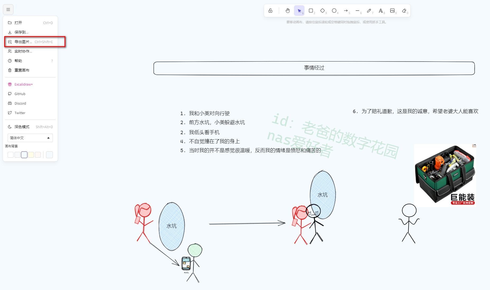
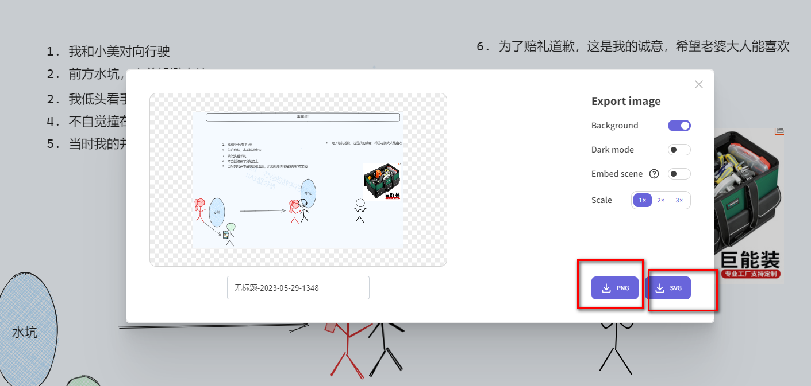
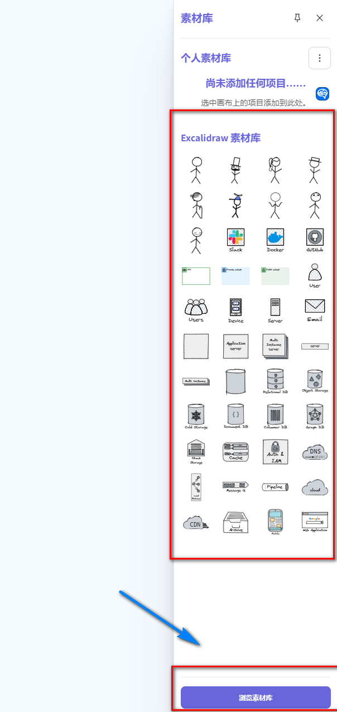
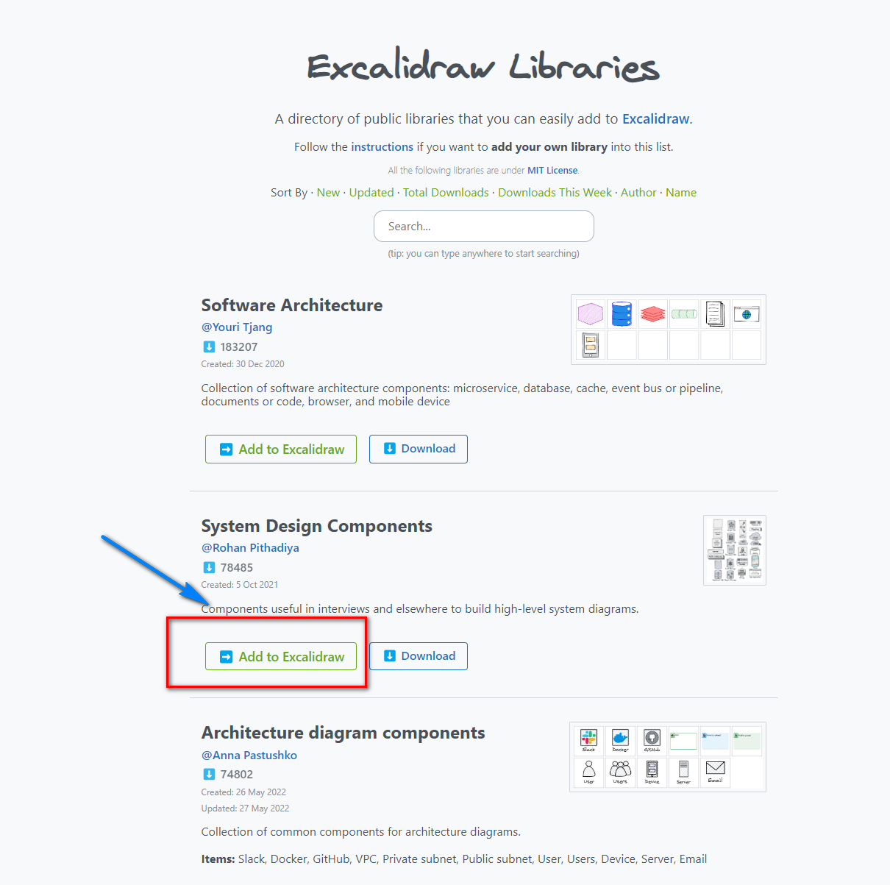

## 1. 前言

你是不是常常和女朋友因为一些事情而在微信`文字+语音`里争论不已


隔着屏幕，信息又是被文字传递，不可避免会出现各种`理解上的偏差`

造成的后果

- 😒小则女朋友跑路
- 😫大则妻离子散


那么该怎么办呢？

这时候没有什么是`一（X）`解决不了的

我指的是`一张图`，你需要的是`一个工具`，可以清晰的描绘你的想法，而不是文字或者语言

这个时候，`Excalidraw`可以完美的解决你的问题

---

## 案例展示

以下是我用一张图化解了我和女朋友志坚的一场意外

整个过程，不需要文字，你就能知道事情的经过是什么，完美解决沟通问题


---

## 介绍Portainer

Excalidraw 是一款在线的画板工具，它允许用户随意绘制简单的手绘图。这款工具的特点

- 简单易用，没有复杂的功能，非常适合进行快速的`思维导图`绘制或者`简单的图解`
- Excalidraw 提供了线条、形状、文本等`基本绘图工具`，以及颜色、大小等属性设置，非常`直观`，即使没有绘图经验的人也能`快速上手`。
- 支持`多人协作`，和朋友们一起在同一个画布上绘制，这对于团队合作或者远程教学都非常有帮助
- 强大的`素材库`管理

---

## 1. 重点

`点个免费关注`，不迷路

## 2. 安装Portainer

教程参考：
[30秒安装Nas必备神器 Portainer](/how-to-install-portainer-in-nas/)


## 3. 创建stack


## 4. 创建stack

```yaml
version: "3.9"
services:
  excalidraw:
    container_name: Excalidraw
    healthcheck:
     test: curl -f http://localhost:80/ || exit 1
    image: excalidraw/excalidraw:latest
    ports:
      - 3765:80 # 端口号不要与原来冲突
    restart: on-failure:5
    stdin_open: true
    environment:
      - NODE_ENV=production
```

1. 选择stack
2. name栏输入excalidraw
3. edditor输入：上面代码
4. 点击deploy


## 5. 成功


## 6. 使用

1. 浏览器输入地址：https://[`nas所在ip`]:3765
2. 随意的画画
3. 导出（png，svg）






## 7. 添加素材

excalidraw拥有大量网友素材，可以随意添加，而且这是你自己的




添加方法：

1. 点击浏览素材
2. 添加喜欢的素材




## 最后

希望你能够喜欢这篇教程，如果你觉得有帮助，记得点赞和收藏，也欢迎你分享给你的朋友们。

如果你在搭建过程中遇到任何问题，或者有任何建议，也欢迎在下方留言，我们可以一起探讨和学习。

如果你的女朋友不让你买NAS，你可以告诉她，买NAS是为了更好的爱她🤣

关注【老爸的数字花园】

分享好玩有趣的nas玩具 私有云部署