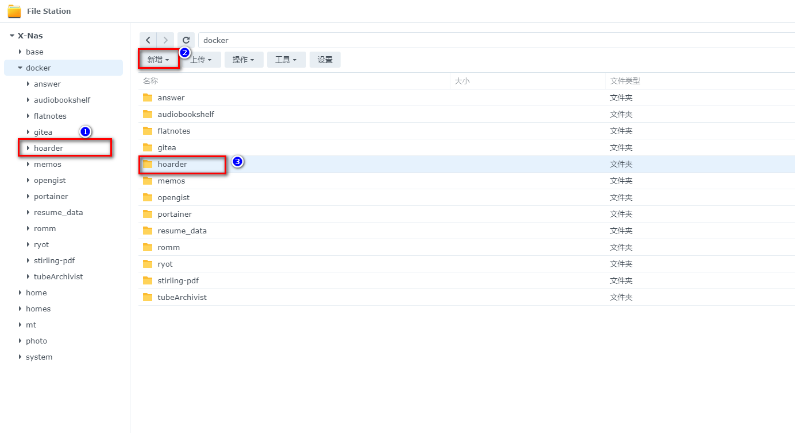
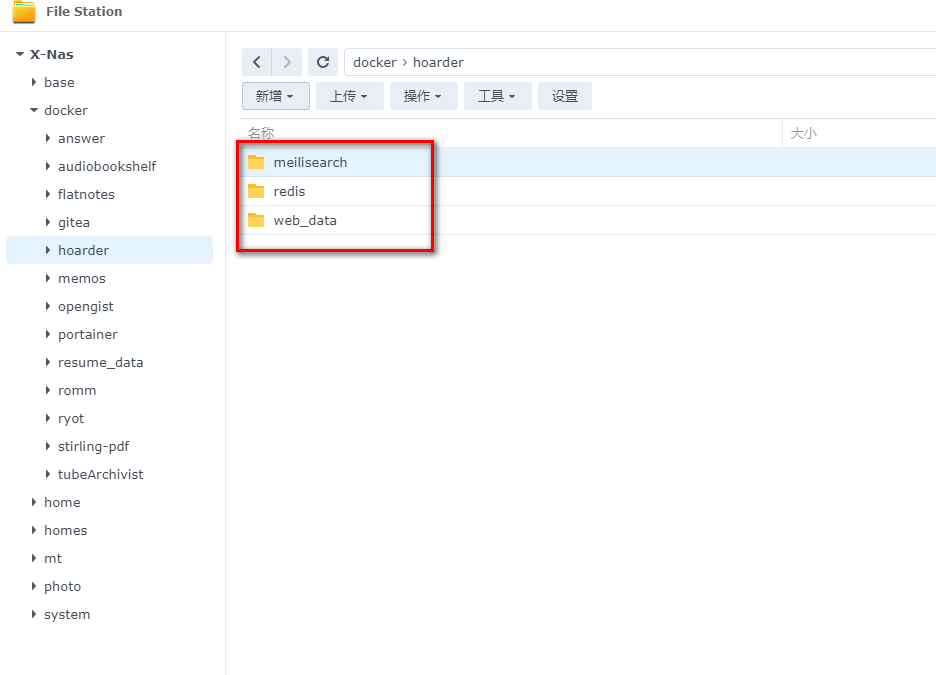
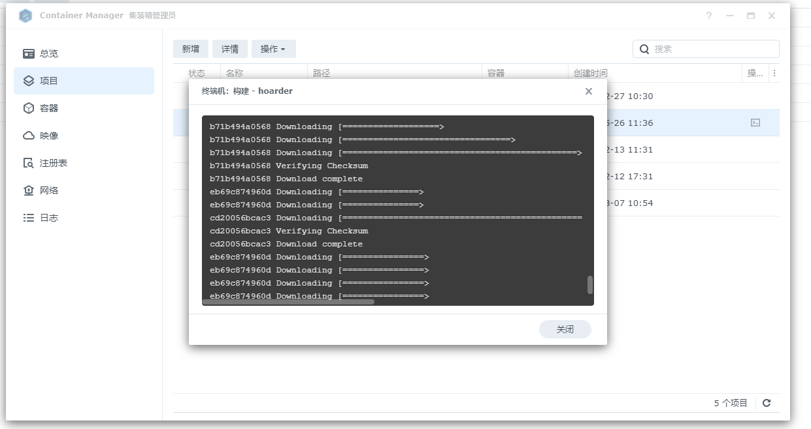
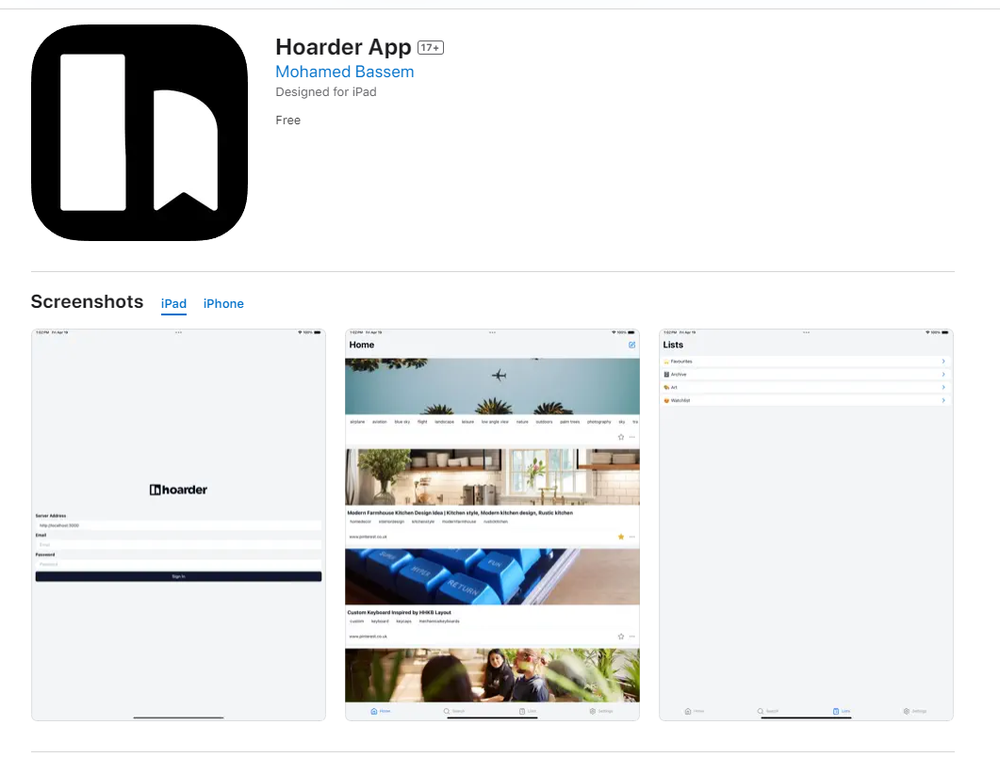

Der KI-Lesezeichenordner für NAS-Nutzer
<!--more-->
# Das perfekte lokale Lesezeichen-Management für NAS-Nutzer: Eine All-in-One-Lösung für Informationsmanagement - Wie man Hoarder einrichtet und nutzt, um Ihre digitalen Informationen zu verwalten?

## 1. Einleitung

Heute freue ich mich, allen NAS-Enthusiasten ein `neues Spielzeug` vorzustellen - ein brandneues Lesezeichen- und Notizverwaltungssystem.

Ich habe mich absolut `verliebt` und plane, meinen aktuellen Dienst zu ersetzen.

Ich habe zuvor über meine Nutzung von `linkding` [linkding](/how-to-install-linkding-in-nas/) gesprochen.


### Warum brauchen Sie einen Lesezeichen-Manager?

In dieser Ära der Informationsüberflutung durchsuchen wir täglich unzählige Informationen auf SMZDM, WeChat-Offiziellen-Konten und im Internet, sei es interessante Artikel, praktische Tools oder flüchtige Inspirationen. Wir hoffen, sie wiederzufinden, wenn wir sie brauchen.

Jedoch können herkömmliche Lesezeichenverwaltungstools nur einen Teil des Problems lösen. Oft `sammeln wir, aber öffnen nie wieder`, was unseren wirklichen Bedürfnissen nach Informationsmanagement nicht gerecht wird.

Aber die heutige Vorstellung von `Hoarder` — einer selbstgehosteten Lesezeichenanwendung, die für Datensammler konzipiert ist, ausgestattet mit `KI-Smart-Tags` und `Volltextsuche`-Fähigkeiten, wird die Art und Weise, wie Sie Informationen sammeln, vollständig verändern.

Stellen Sie sich vor, Sie könnten tiefgründige Artikel, die spät in der Nacht entdeckt wurden, oder Inspirationsbilder, die früh am Morgen begegnet wurden, mit einem Klick speichern, jederzeit und überall zugänglich.


Als Nächstes werde ich Sie Schritt für Schritt durch die Einrichtung Ihres leistungsstarken Hoarder-Lesezeichen- und Notizverwaltungstools führen.

## Vorstellung von Hoarder

Hoarder ist nicht nur eine selbstgehostete Lesezeichenanwendung; es integriert KI-Technologie, mit dem Ziel, Datensammlern ein ultimatives Informationsmanagement-Erlebnis zu bieten. Hier sind die Kernfunktionen von Hoarder:

- **Lesezeichen setzen, einfache Notizen machen, Bilder speichern**: Eine All-in-One-Lösung für Informationsbedürfnisse.
- **Automatisches Abrufen von Linktiteln, Beschreibungen und Bildern**: Überspringen Sie die mühsame manuelle Bearbeitung, um Effizienz zu steigern.
- **Lesezeichen in Listen organisieren**: Benutzerdefinierte Kategorisierung, einfach umfangreiche Inhalte verwalten.
- **Volltextsuche**: Schnell jeden gespeicherten Inhalt finden, wichtige Informationen nie wieder verlieren.
- **KI-basiertes automatisches Tagging-System**: Verwenden Sie lokale oder Online-Modelle, wie ollama, für intelligentes Tagging, um die Inhaltsorganisation intelligenter zu machen.


- **Unterstützt Chrome- und Firefox-Erweiterungen**: Schnelles Setzen von Lesezeichen mit einem Klick, nahtlose Integration des Browsererlebnisses.
- **iOS- und Android-Apps**: Verwalten Sie Ihre Informationsbibliothek jederzeit und überall.


- **Unterstützung für Nachtmodus**: Schützen Sie Ihre Augen, passen Sie sich verschiedenen Nutzungsumgebungen an.
- **Priorität auf Selbsthosting**: Volle Kontrolle über Ihre Daten und Privatsphäre.

---

Einrichtungsschritte:

## 1. Wichtigster Punkt

`Drücken Sie den kostenlosen Folgen-Button`, um nicht verloren zu gehen.

## 2. Docker-Verwaltungsgrafiktool

#### Für Synology DSM 7.2 und höher können Sie direkt den *Container-Manager* verwenden


#### QNAP ContainerStation 


#### Portainer selbst installieren

Tutorial-Referenz:
[Installieren Sie das wesentliche NAS-Tool Portainer in 30 Sekunden](/how-to-install-portainer-in-nas/)

Als Nächstes verwenden wir den Container-Manager von Synology als Beispiel.

##  3. Dateistation

Öffnen Sie den Docker-Ordner in der Dateistation, erstellen Sie einen `hoarder`-Ordner.



Erstellen Sie der Reihe nach folgende Verzeichnisse:

- web_data
- redis
- meilisearch



Erstellen Sie eine .env-Datei.


Inhalt der .env-Datei:

```
HOARDER_VERSION=release
NEXTAUTH_SECRET=AP8jEDXsVZ7bmnO+dQeqDP0uX+Y0yNV/BaQWrDXG/aSCwVSf
MEILI_MASTER_KEY=5BMHyWfjut7F10vbuHR2sGEAeaQEySDLOEzxxXuw+nmpBeb1
NEXTAUTH_URL=http://localhost:3000
# Optional, wenn Sie keine KI zur Kategorisierung benötigen, entfernen Sie die folgenden zwei Zeilen
OPENAI_BASE_URL=https://xxx.com/v1
OPENAI_API_KEY=sk-xxxxx
```

Besondere Konfigurationserklärung:

NEXTAUTH_SECRET: Hauptsächlich bezogen auf den JWT-Schlüssel, generieren Sie ihn mit `openssl rand -base64 36`, oder Sie können meinen direkt kopieren.

MEILI_MASTER_KEY: Wie oben.

Wenn Sie die KI verwenden möchten, um entsprechende Tags zu generieren, müssen Sie die folgenden zwei konfigurieren:

OPENAI_BASE_URL: Konfigurieren Sie Ihren KI-Knoten.

OPENAI_API_KEY: Entsprechender Schlüssel.

Wie wir alle wissen, `können Sie nicht auf OpenAI zugreifen`, also verwende ich Tools wie OneAPI, um meinen eigenen OpenAI-Knoten zu bauen. Dieses Tutorial wird nicht tiefer eintauchen, aber wenn Sie mehr erfahren möchten, können Sie gerne mit mir kommunizieren.

## 4. Container-Manager 

Für diesen Zweck verwende ich den Container-Manager von Synology für die Einrichtung, Portainer und QNAP sind ähnlich:


Kopieren Sie die folgende Konfiguration:

```
version: "3.8"
services:
  web:
    image: ghcr.io/hoarder-app/hoarder-web:${HOARDER_VERSION:-release}
    restart: unless-stopped
    volumes:
      - /volume1/docker/hoarder/web_data:/data
    ports:
      - 23000:3000
    env_file:
      - .env
    environment:
      REDIS_HOST: redis
      MEILI_ADDR: http://meilisearch:7700
      DATA_DIR: /data
  redis:
    image: redis:7.2-alpine
    restart: unless-stopped
    volumes:
      - /volume1/docker/hoarder/redis:/data
  chrome:
    image: gcr.io/zenika-hub/alpine-chrome:123
    restart: unless-stopped
    command:
      - --no-sandbox
      - --disable-gpu
      - --disable-dev-shm-usage
      - --remote-debugging-address=0.0.0.0
      - --remote-debugging-port=9222
      - --hide-scrollbars
  meilisearch:
    image: getmeili/meilisearch:v1.6
    restart: unless-stopped
    env_file:
      - .env
    environment:
      MEILI_NO_ANALYTICS: "true"
    volumes:
      - /volume1/docker/hoarder/meilisearch:/meili_data
  workers:
    image: ghcr.io/hoarder-app/hoarder-workers:${HOARDER_VERSION:-release}
    restart: unless-stopped
    volumes:
      - /volume1/docker/hoarder/web_data:/data
    env_file:
      - .env
    environment:
      REDIS_HOST: redis
      MEILI_ADDR: http://meilisearch:7700
      BROWSER_WEB_URL: http://chrome:9222
      DATA_DIR: /data
    depends_on:
      web:
        condition: service_started

```

Wie gezeigt einsetzen.



## 5. Nutzung

Geben Sie das Programm im Browser ein: [ip]:[port]

> Die IP ist die IP Ihres NAS (meine hier ist 172.16.23.106), und der Port ist in der obigen Konfigurationsdatei definiert, was 23000 ist, wenn Sie meinem Tutorial gefolgt sind.


Nach der Registrierung und Anmeldung,


Wenn Sie nicht möchten, dass andere Ihren Dienst nutzen,

Nach der Registrierung Ihres Kontos, deaktivieren Sie die Kontoregistrierungsfunktion in der Umgebungsvariablen. Fügen Sie diese Zeile zum .env-Teil hinzu:

DISABLE_SIGNUPS=true

## 6. Besondere Funktionen-Vorstellung

#### Browser-Erweiterung

Suchen Sie nach hoarder.app


`Konfigurieren Sie Ihre Serveradresse`:


#### App-Download

iOS



Android


#### Nutzung der Browser-Erweiterung

Am Beispiel des Artikels des Community-Modells `Jinsheng Nai Ba's Müllmann`,

Einfach auf den Erweiterungsbutton klicken, um zu sammeln.


Zurück auf der Web-Seite können Sie sehen, dass der Artikel erfolgreich gesammelt wurde, und er ist bereits von `KI` kategorisiert.


Hier werden einige `Bilder nicht angezeigt`, wahrscheinlich wegen des `Hotlink-Schutzes` der Plattform.

Hier, wenn ich mein eigenes Open-Source-Projekt social-auto-upload sammle, `sind die Bilder normal`.


KI-basierte Kategorisierungstags können auch mit `benutzerdefinierten Tags` und `Notizen` ergänzt werden.

Sie können auch umschalten, um `Screenshots zu der Zeit` zu erfassen.


Das System kann alle Tags sehen, einschließlich KI und Ihren eigenen.


#### Unterstützt Volltexterkennung

Es unterstützt `Volltextsuche` für alle gesammelten Webseiten oder Notizen. Dies hilft uns zweifellos, schnell das zu finden, was wir aus den gesammelten Notizen und Links wollen.

Zum Beispiel erscheint das Wort `Zufallszahl` in dieser Sammlung:


Dann können Sie direkt nach `Zufallszahl` in der Suche suchen.


Versuchen wir diesen sehr spezifischen Begriff: `UGOS`.


Es hat auch den Artikel gefunden, der `UGOS` erwähnt.


## Zusammenfassung

Wenn Ihnen dieser Artikel gefallen hat, denken Sie bitte daran, zu liken, zu sammeln und [Papas Digitalen Garten] zu folgen. Wir werden weiterhin mehr praktische Anleitungen zur Selbsthosting-Anwendung bringen. Zusammen nehmen wir die Kontrolle über unsere Daten und erschaffen unsere eigene digitale Welt!

Wenn Sie während des Einrichtungsprozesses auf Probleme stoßen oder Vorschläge haben, zögern Sie nicht, unten einen Kommentar zu hinterlassen. Lassen Sie uns diskutieren und gemeinsam lernen.