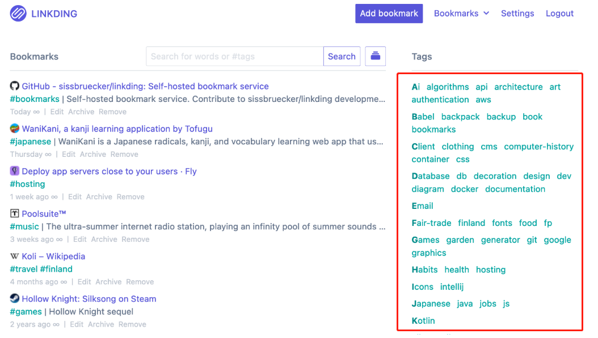
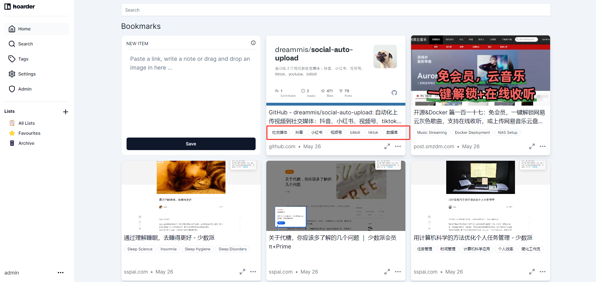
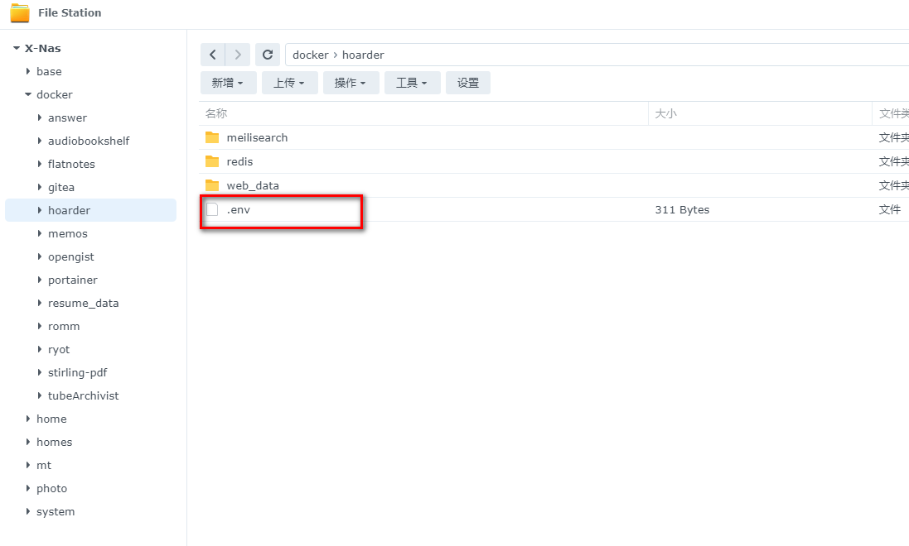
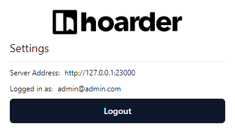
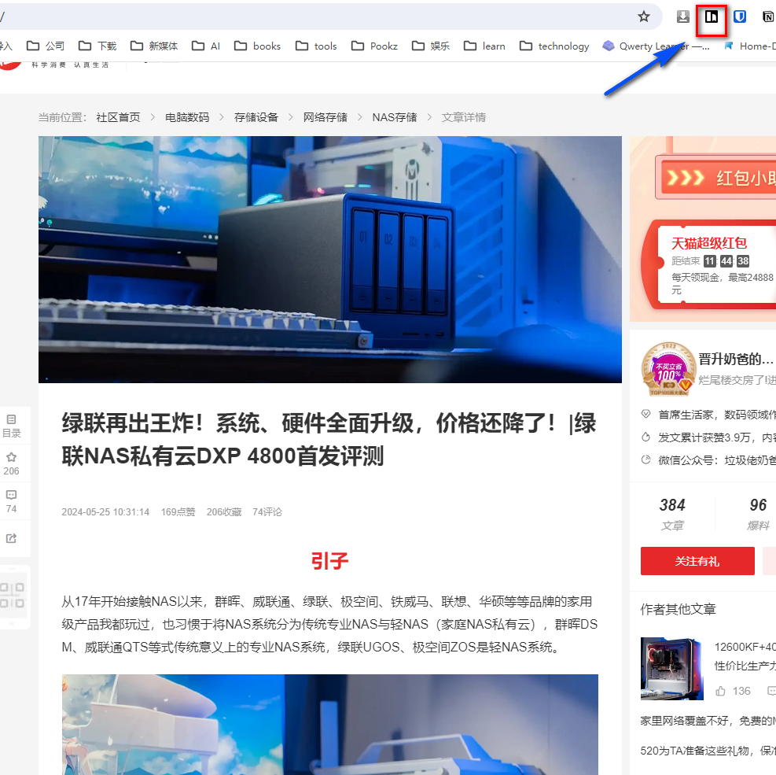
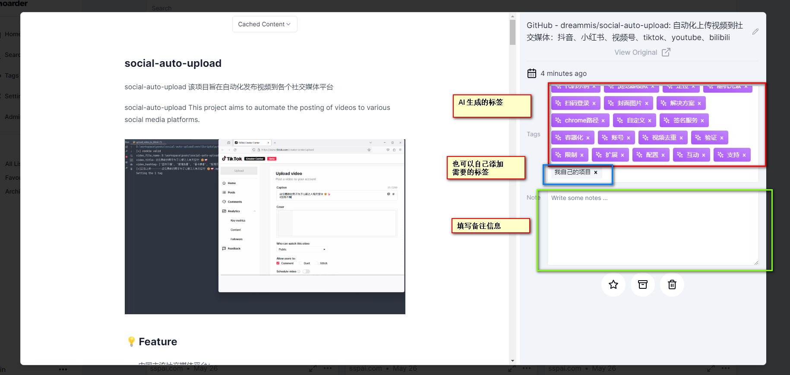
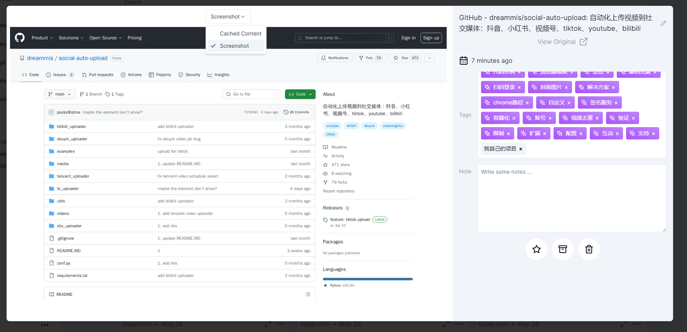
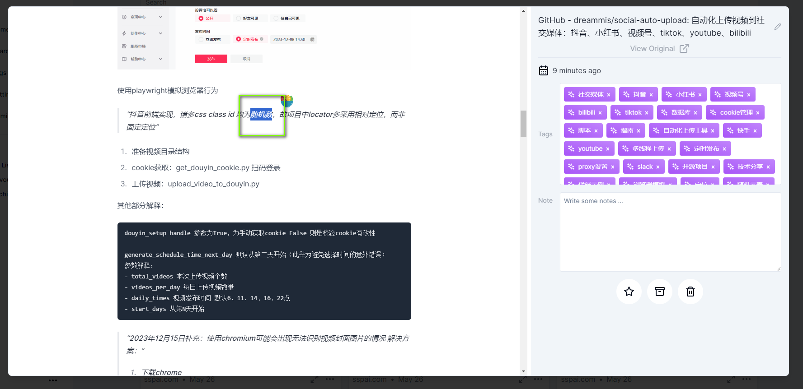

The AI bookmark folder for NAS users
<!--more-->
# The Perfect Local Bookmark Management for NAS Users: A One-Stop Information Management Solution - How to Set Up and Use Hoarder to Manage Your Digital Information?

## 1. Introduction

Today, I'm excited to introduce a `new toy` to all NAS enthusiasts - a brand-new bookmark and note management system.

I've absolutely `fallen in love` with it and plan to replace my current service.

I've previously talked about my use of `linkding` [linkding](/how-to-install-linkding-in-nas/).



### Why Do You Need a Bookmark Manager?

In this era of information overload, we browse countless pieces of information daily on SMZDM, WeChat official accounts, and the internet, whether interesting articles, practical tools, or fleeting inspirations. We hope to `find them again` when needed.

However, conventional bookmark management tools can only solve part of the problem. Often, we `collect but never open again`, failing to meet our real needs for information management.

But today's introduction of `Hoarder` — a self-hosted bookmark application designed for data collectors, equipped with `AI smart tags` and `full-text search` capabilities, will completely change the way you collect information.

Imagine being able to save deep articles discovered late at night or inspiration images encountered early in the morning with a single click, accessible anytime, anywhere.



Next, I'll guide you step-by-step on setting up your powerful Hoarder bookmark and note management tool.

## Introducing Hoarder

Hoarder is not just a self-hosted bookmark application; it integrates AI technology, aiming to provide data collectors with an ultimate information management experience. Here are the core features of Hoarder:

- **Bookmark links, take simple notes, store images**: A one-stop solution for information collection needs.
- **Automatically fetch link titles, descriptions, and images**: Skip the tedious manual editing, increasing efficiency.
- **Organize bookmarks into lists**: Custom categorization, easily manage vast content.
- **Full-text search**: Quickly find any stored content, never lose important information again.
- **AI-based automatic tagging system**: Use local or online models, like ollama, for smart tagging, making content organization more intelligent.


- **Supports Chrome and Firefox extensions**: Quick bookmarking with a single click, seamlessly integrating browsing experience.
- **iOS and Android apps**: Manage your information library anytime, anywhere.


- **Night mode support**: Protect your eyes, adapt to different usage environments.
- **Self-hosting priority**: Full control over your data and privacy.

---

Setup Steps:

## 1. Key Point

`Hit the free follow button`, don't get lost.

## 2. Docker Management Graphic Tool

#### For Synology DSM 7.2 and above, you can directly use *Container Manager*


#### QNAP ContainerStation 


#### Installing Portainer Yourself

Tutorial reference:
[Install the Essential NAS Tool Portainer in 30 Seconds](/how-to-install-portainer-in-nas/)

Next, we'll use Synology's Container Manager as an example.

##  3. File Station

Open the docker folder in File Station, create a `hoarder` folder.


Create the following directories in order:

- web_data
- redis
- meilisearch


Create a .env file.



.env file content:

```
HOARDER_VERSION=release
NEXTAUTH_SECRET=AP8jEDXsVZ7bmnO+dQeqDP0uX+Y0yNV/BaQWrDXG/aSCwVSf
MEILI_MASTER_KEY=5BMHyWfjut7F10vbuHR2sGEAeaQEySDLOEzxxXuw+nmpBeb1
NEXTAUTH_URL=http://localhost:3000
# Optional, if you don't have or need AI to categorize for you, then remove the following two lines
OPENAI_BASE_URL=https://xxx.com/v1
OPENAI_API_KEY=sk-xxxxx
```

Special configuration explanation:

NEXTAUTH_SECRET: Mainly related to the JWT key, generate using `openssl rand -base64 36`, or you can directly copy mine.

MEILI_MASTER_KEY: Same as above.

If you want to use the AI to generate corresponding tags, you need to configure the following two:

OPENAI_BASE_URL: Configure your AI node.

OPENAI_API_KEY: Corresponding key.

As we all know, `you can't access OpenAI`, so I use tools like OneAPI to build my own OpenAI node. This tutorial won't delve deeper, but if you want to learn more, feel free to communicate with me.

## 4. Container Manager 

For this, I'm using Synology's Container Manager for setup, Portainer and QNAP are similar:


Copy the following configuration:

```
version: "3.8"
services:
  web:
    image: ghcr.io/hoarder-app/hoarder-web:${HOARDER_VERSION:-release}
    restart: unless-stopped
    volumes:
      - /volume1/docker/hoarder/web_data:/data
    ports:
      - 23000:3000
    env_file:
      - .env
    environment:
      REDIS_HOST: redis
      MEILI_ADDR: http://meilisearch:7700
      DATA_DIR: /data
  redis:
    image: redis:7.2-alpine
    restart: unless-stopped
    volumes:
      - /volume1/docker/hoarder/redis:/data
  chrome:
    image: gcr.io/zenika-hub/alpine-chrome:123
    restart: unless-stopped
    command:
      - --no-sandbox
      - --disable-gpu
      - --disable-dev-shm-usage
      - --remote-debugging-address=0.0.0.0
      - --remote-debugging-port=9222
      - --hide-scrollbars
  meilisearch:
    image: getmeili/meilisearch:v1.6
    restart: unless-stopped
    env_file:
      - .env
    environment:
      MEILI_NO_ANALYTICS: "true"
    volumes:
      - /volume1/docker/hoarder/meilisearch:/meili_data
  workers:
    image: ghcr.io/hoarder-app/hoarder-workers:${HOARDER_VERSION:-release}
    restart: unless-stopped
    volumes:
      - /volume1/docker/hoarder/web_data:/data
    env_file:
      - .env
    environment:
      REDIS_HOST: redis
      MEILI_ADDR: http://meilisearch:7700
      BROWSER_WEB_URL: http://chrome:9222
      DATA_DIR: /data
    depends_on:
      web:
        condition: service_started

```

Deploy as shown.


## 5. Usage

Enter the program in the browser: [ip]:[port]

> The IP is your NAS's IP (mine here is 172.16.23.106), and the port is defined in the configuration file above, which is 23000 if you followed my tutorial.


After registering and logging in,


If you don't want others to use your service,

After registering your account, disable the account registration feature in the environment variable. Add this line to the .env part:

DISABLE_SIGNUPS=true

## 6. Special Feature Showcase

#### Browser Extension

Search for hoarder.app


`Configure your server address`:



#### App Download

iOS


Android


#### Using the Browser Extension

Taking the article of the community model `Jinsheng Nai Ba's Garbage Man` as an example,

Simply click the extension button to collect.



Back on the web side, you can see the article has been successfully collected, and it's already categorized by `AI`.


Here, some `images are not displayed`, likely due to the platform's `hotlink protection`.

Here, when I collect my own open-source project social-auto-upload, `the images are normal`.



AI-based categorization tags can also be added with `custom tags` and `notes`.

You can also switch to capture `screenshots at that time`.



The system can see all tags, including AI and your own.


#### Supports Full-Text Detection

It supports `full-text search` for any collected web pages or notes. This undoubtedly helps us quickly find what we want from the collected notes and links.

For example, the word `random number` appears in this collection:



Then you can directly search for `random number` in the search.


Let's try this very niche term: `UGOS`.


It also found the article that mentioned `UGOS`.


## In Conclusion

If you like this article, please remember to like, collect, and follow [Dad's Digital Garden]. We will continue to bring more practical self-hosting application guides. Together, let's take control of our data and create our own digital world!

If you encounter any problems during the setup process, or have any suggestions, feel free to leave a comment below. Let's discuss and learn together.