nas用户的AI收藏夹
<!--more-->
# Nas用户的完美本地运行的书签管理 一站式信息管理：如何搭建和使用Hoarder 管理你的数字信息？

## 1. 前言

今天给各位nas爱好者，介绍一个`新玩具`-一个全新的书签笔记管理系统

我对它真的是`爱不释手`，并且我打算替换掉我现有的服务

我之前介绍过我使用的`linkding`  [linkding](/how-to-install-linkding-in-nas/)

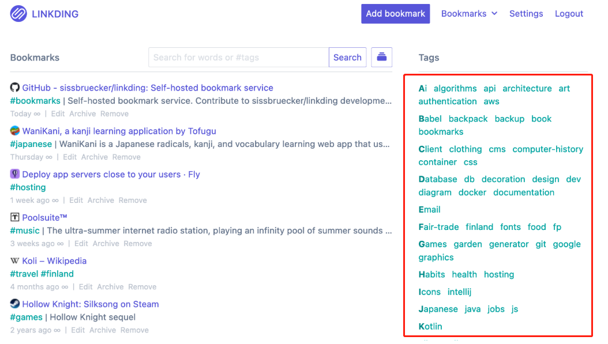

### 为什么你需要一个书签管理呢？

在这个信息爆炸的时代，我们每天都会在smzdm、公众号，互联网上浏览无数信息，不论是有趣的文章、实用的工具还是一闪而过的灵感，都希望能在需要时`重新找到`它们。

但普通的书签管理工具往往只能解决一部分问题，很多时候，`只是在收藏，从未再打开过`，难以满足我们对信息管理的真正需求。

而今天的介绍的`Hoarder` —— 一个专为数据收藏者打造的自托管书签应用，配备`AI智能标签`和`全文搜索`功能，彻底改变您的信息收藏方式。

想象一下，不论是深夜发现的深度文章，还是清晨偶遇的灵感图片，都能一键保存，随时随地自由访问。

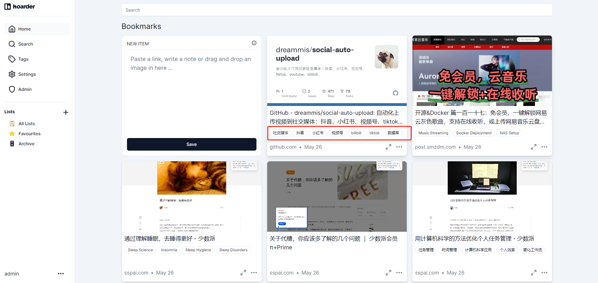

接下来我会一步步带你搭建属于你的强大Hoarder 书签笔记管理工具

## 介绍hoarder

Hoarder不仅仅是一个自托管的书签应用，它结合了AI技术，旨在为数据收藏者提供极致的信息管理体验。以下是Hoarder的核心功能：

- **书签链接、记录简单笔记、存储图片**：一站式解决信息收集的需求。 
- **自动获取链接标题、描述和图片**：省去手动编辑的繁琐，效率倍增。 
- **将书签整理进列表**：自定义分类，轻松管理大量内容。 
- **全文搜索**：快速找到存储的任何内容，再也不怕丢失重要信息。
- **基于AI的自动标签系统**：使用本地或在线模型，如ollama，智能标注，让内容组织更加智能。

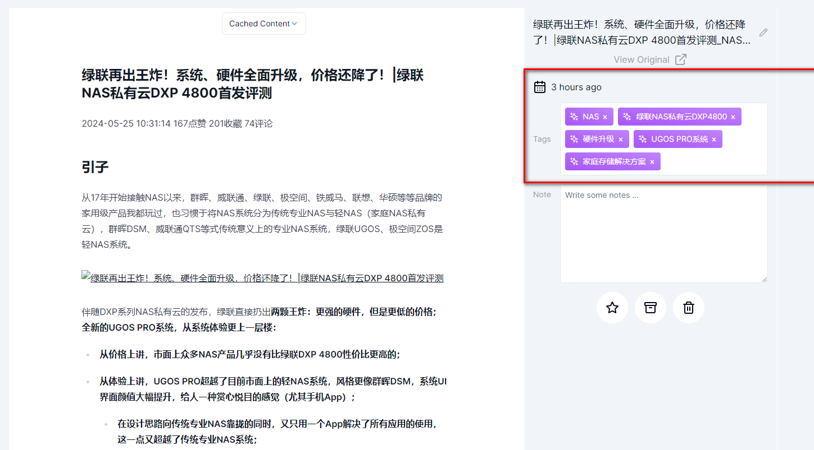

- **支持Chrome插件和Firefox插件**：一键快速书签，无缝集成浏览体验。
- **iOS和Android应用**：随时随地管理你的信息库。


- **夜间模式支持**：保护眼睛，适应不同的使用环境。
- **自托管优先**：完全控制你的数据和隐私。 


---

搭建步骤：

## 1. 重点

`点个免费关注`，不迷路

## 2. docker管理图形工具

#### 群晖 DSM 7.2版本以上可以直接使用 *Container Manager*


#### 威联通 ContainerStation 


#### 自行安装Portainer

教程参考：
[30秒安装Nas必备神器 Portainer](/how-to-install-portainer-in-nas/)


接下来以群晖的Container Manager为例

##  3. File Station

File Station 打开docker 文件夹，创建`hoarder`文件夹

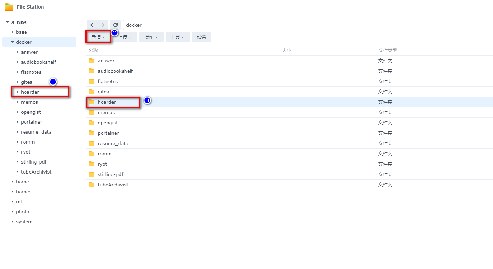

依次创建如下目录：

- web_data
- redis
- meilisearch

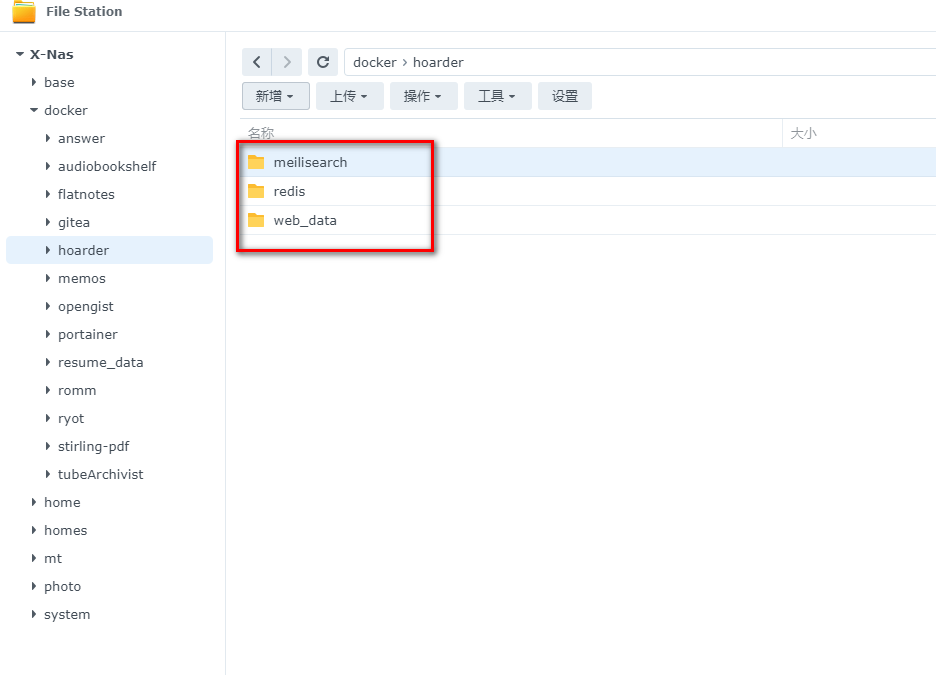

创建.env 文件

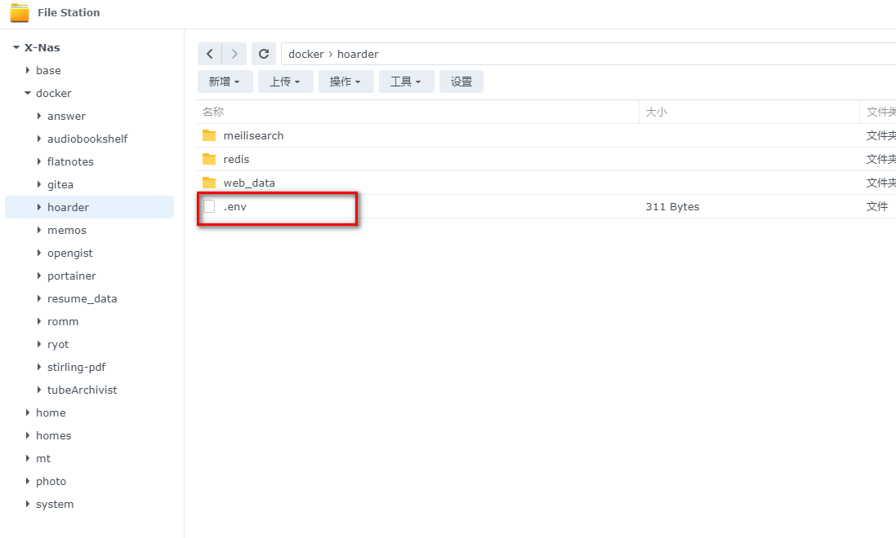

.env 文件内容：

```
HOARDER_VERSION=release
NEXTAUTH_SECRET=AP8jEDXsVZ7bmnO+dQeqDP0uX+Y0yNV/BaQWrDXG/aSCwVSf
MEILI_MASTER_KEY=5BMHyWfjut7F10vbuHR2sGEAeaQEySDLOEzxxXuw+nmpBeb1
NEXTAUTH_URL=http://localhost:3000
# 非必须，如果你没有或者不需要ai帮你分类，那么去掉下面两行
OPENAI_BASE_URL=https://xxx.com/v1
OPENAI_API_KEY=sk-xxxxx
```

特殊配置说明：

NEXTAUTH_SECRET： 主要是jwt相关的密钥，使用`openssl rand -base64 36` 生成，如果你不知道怎么办可以直接copy我这个

MEILI_MASTER_KEY：同上

如果你要使用ai生成对应标签的功能则需要配置如下两个：

OPENAI_BASE_URL：配置你的ai节点

OPENAI_API_KEY： 对应的密钥

众所周知，`openai你是上不去的`，所以我是使用oneapi这样的工具，搭建自己的openai节点，这篇教程不深入探讨，如果想要了解更多，可以和我沟通交流

 ## 4. Container Manager 

本次我使用的是群晖的Container Manager来搭建 ，Portainer与威联通基本类似：

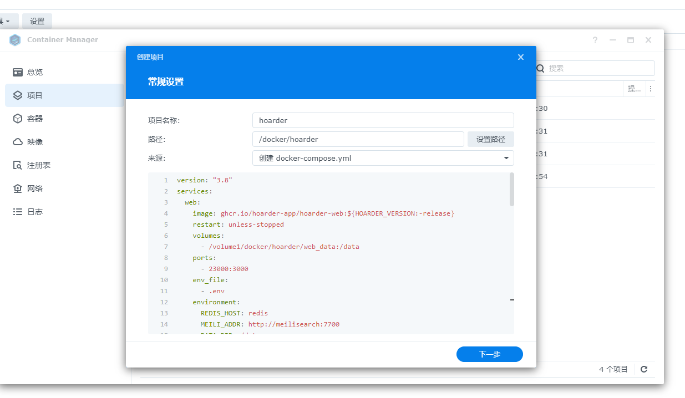

复制下列配置：

```
version: "3.8"
services:
  web:
    image: ghcr.io/hoarder-app/hoarder-web:${HOARDER_VERSION:-release}
    restart: unless-stopped
    volumes:
      - /volume1/docker/hoarder/web_data:/data
    ports:
      - 23000:3000
    env_file:
      - .env
    environment:
      REDIS_HOST: redis
      MEILI_ADDR: http://meilisearch:7700
      DATA_DIR: /data
  redis:
    image: redis:7.2-alpine
    restart: unless-stopped
    volumes:
      - /volume1/docker/hoarder/redis:/data
  chrome:
    image: gcr.io/zenika-hub/alpine-chrome:123
    restart: unless-stopped
    command:
      - --no-sandbox
      - --disable-gpu
      - --disable-dev-shm-usage
      - --remote-debugging-address=0.0.0.0
      - --remote-debugging-port=9222
      - --hide-scrollbars
  meilisearch:
    image: getmeili/meilisearch:v1.6
    restart: unless-stopped
    env_file:
      - .env
    environment:
      MEILI_NO_ANALYTICS: "true"
    volumes:
      - /volume1/docker/hoarder/meilisearch:/meili_data
  workers:
    image: ghcr.io/hoarder-app/hoarder-workers:${HOARDER_VERSION:-release}
    restart: unless-stopped
    volumes:
      - /volume1/docker/hoarder/web_data:/data
    env_file:
      - .env
    environment:
      REDIS_HOST: redis
      MEILI_ADDR: http://meilisearch:7700
      BROWSER_WEB_URL: http://chrome:9222
      DATA_DIR: /data
    depends_on:
      web:
        condition: service_started

```

部署即可

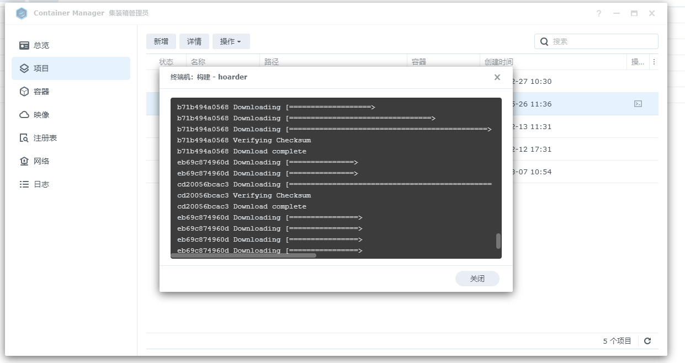


## 5. 使用

浏览器进入程序：[ip]:[端口]

> ip为你nas所在ip（这里我的是172.16.23.106），端口为上面配置文件定义，如果你按照我的教程，则是23000

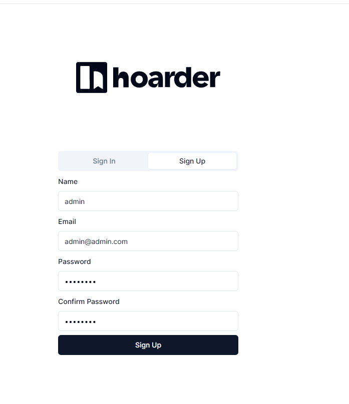

注册账号登录后

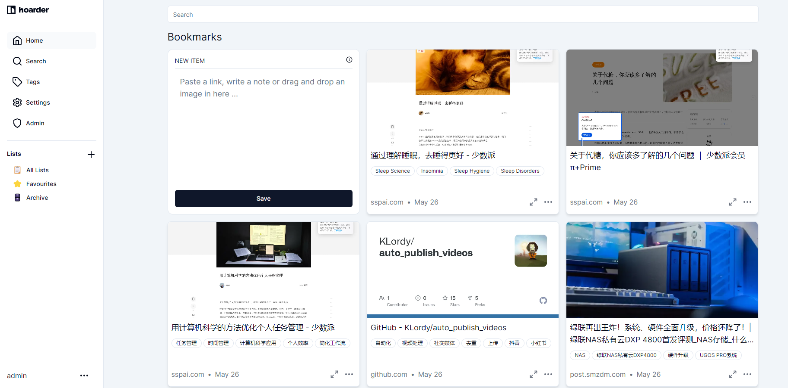

如果你不想让别人使用你的服务

在你注册完账号后，在环境变量里`禁用账号注册`功能。前面.env部分加入这句话：

DISABLE_SIGNUPS=true

## 6. 特殊功能展示

#### 浏览器插件 

搜索hoarder.app

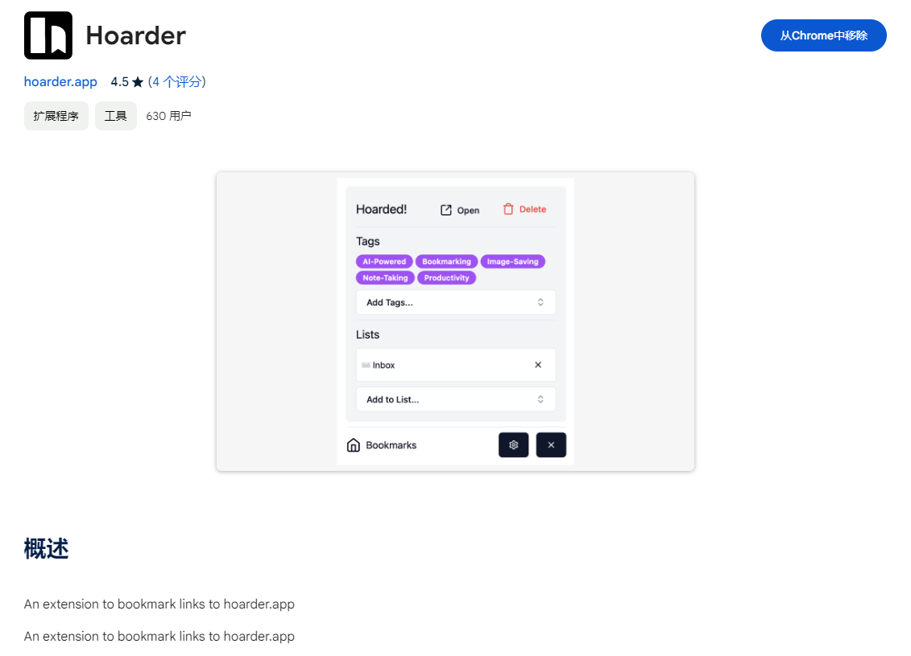

`配置你的服务器地址`：

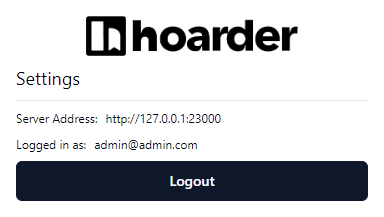


#### app 端 自行下载

ios

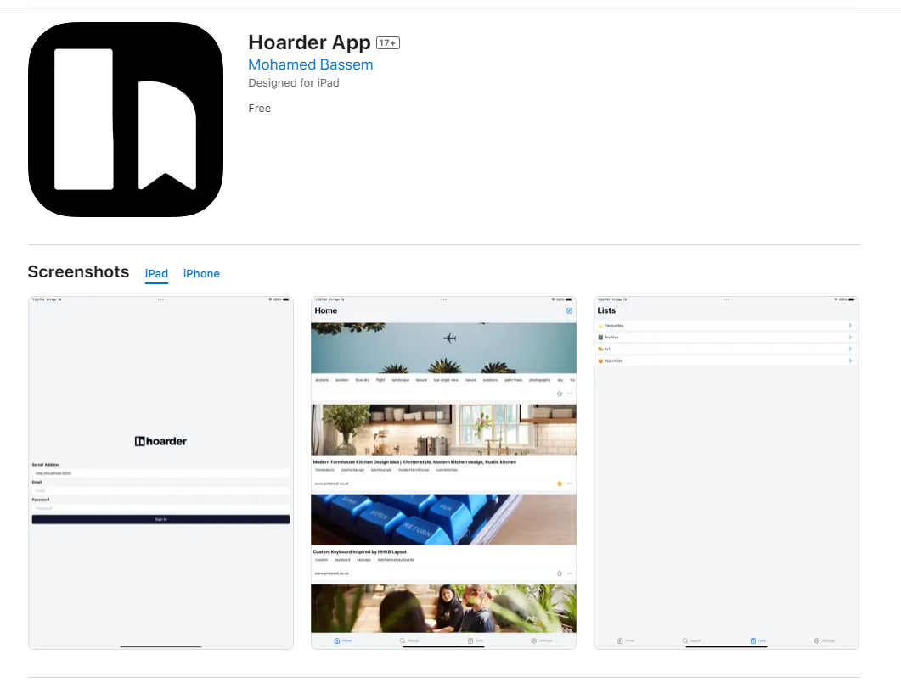

android

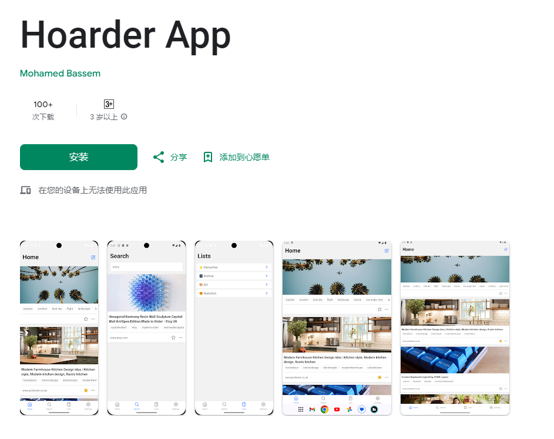

#### 浏览器插件使用

拿社群劳模`晋升奶爸的垃圾佬`的文章举例

直接点击插件按钮即可收录

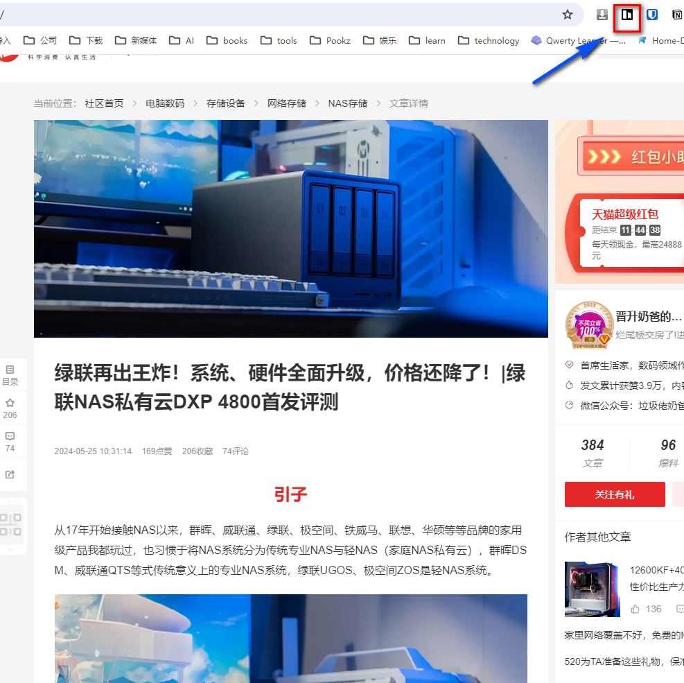


回到web端，你就能看到这篇文章成功被收藏，并且已经通过`ai分好了类别`


这里看到有些`图片并未显示`，应该是平台`防盗链`导致的

这里我收藏我自己的开源项目social-auto-upload，`图片就是正常的`

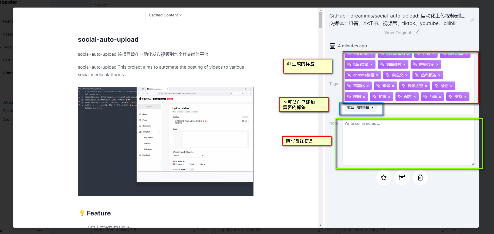

ai根据文章内容做出的分类标签，也可以自行添加`自定义的标签`，以及`备注信息`

同时还可以切换截取`当时的截屏`

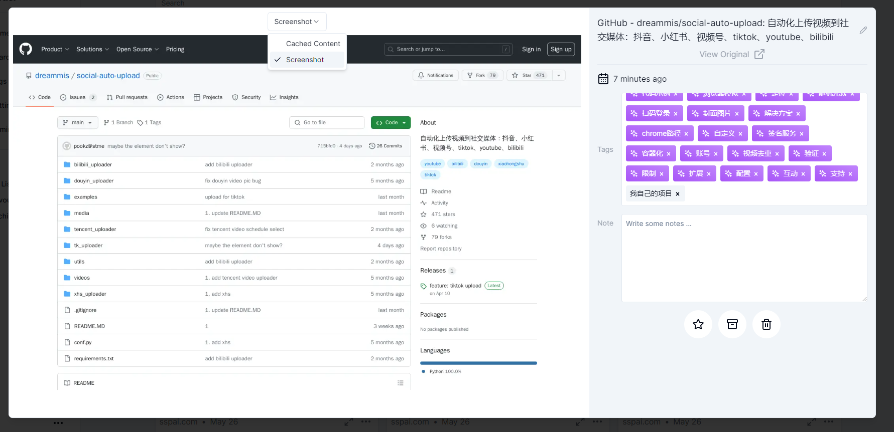


系统可以看到所有标签，包括ai以及你自己的

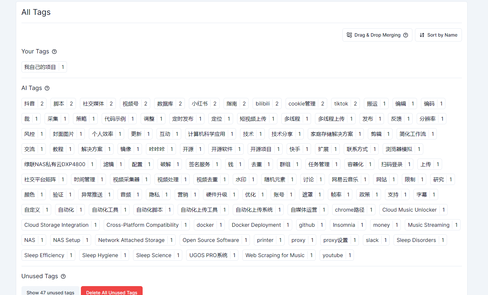


#### 支持全文检测

它支持`全文搜索`任意收藏网页或者笔记中的。这无疑帮助我们能快速的从收藏的笔记和链接中`迅速`找到我们想要的东西

比如这篇收藏中出现了`随机数`这个词：

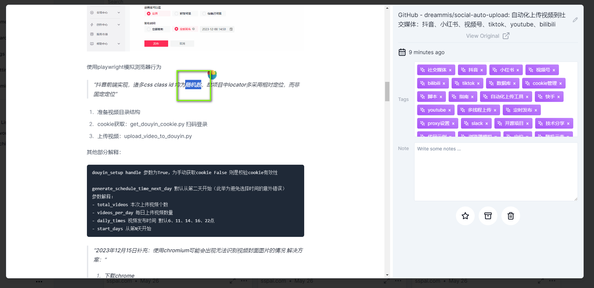


那么就可以在搜索中直接通过`随机数`搜索到

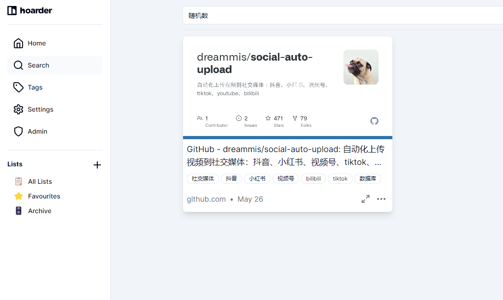

再试试这个非常冷门的词汇：`UGOS`

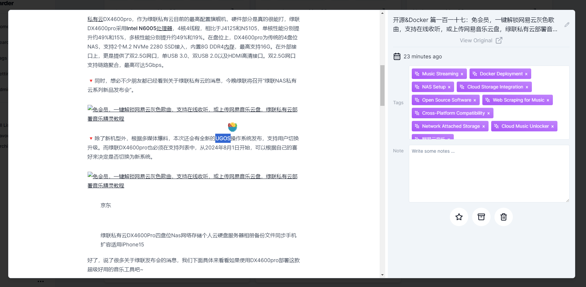


同样也搜出来出现过`UGOS`的文章

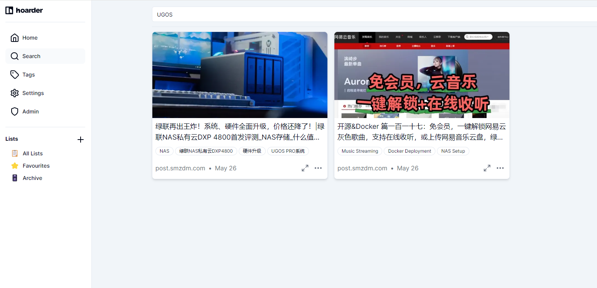

## 最后

如果你喜欢这篇文章，请记得点赞，收藏，并关注【老爸的数字花园】，我们将会持续带来更多实用的自搭建应用指南。一起，让我们掌握自己的数据，创建自己的数字世界！

如果你在搭建过程中遇到任何问题，或者有任何建议，也欢迎在下方留言，一起探讨和学习。