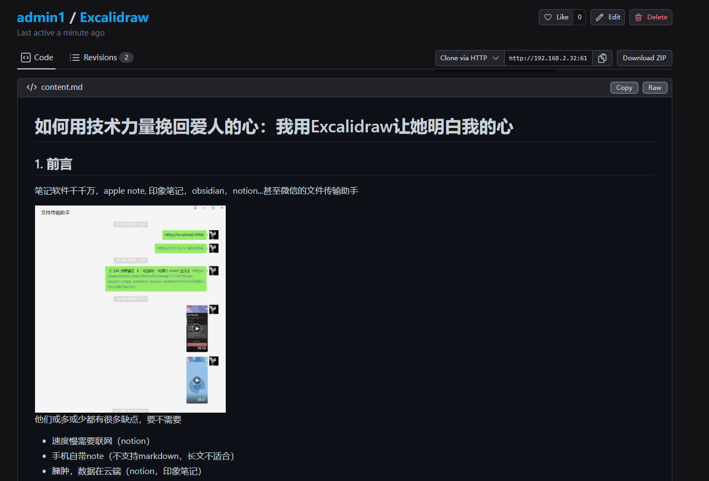
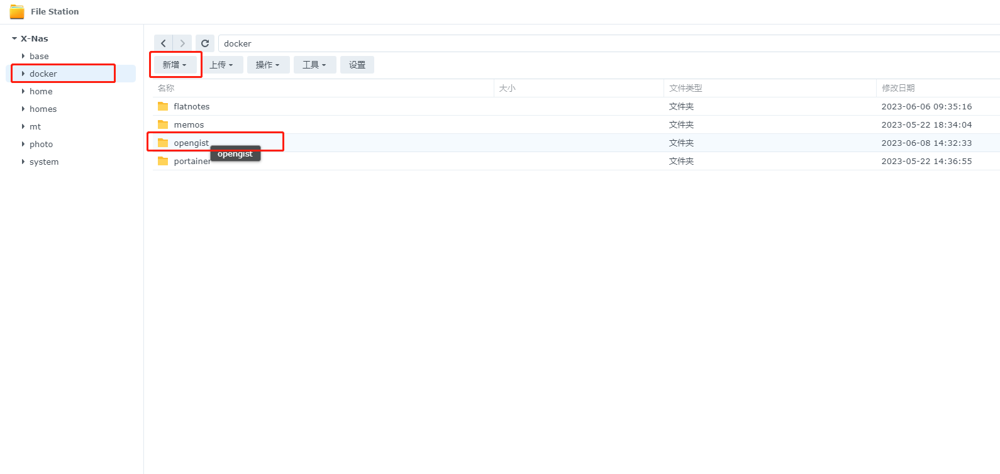

## 1. Einführung

Wissen Sie, wie Sie und Ihre Freunde Dokumente, Tutorials, Notizen oder Code-Schnipsel teilen?

Dies ist ein typischer Anwendungsfall, bei dem Sie einen dedizierten Ort benötigen, einen Ort, an dem Sie Code einfach hochladen, teilen, anzeigen und verwalten können. Deshalb müssen wir unsere eigene Opengist erstellen.



---

## Vorstellung von Opengist

Opengist ist ein selbst gehostetes Pastebin, das von Git unterstützt wird. Es ist eine Online-Plattform, auf der Sie Code-Schnipsel erstellen, teilen und verwalten können. Es bietet viele Funktionen:

- **Öffentliche oder versteckte Dokumente/Code-Schnipsel erstellen**: Sie können öffentliche Code-Schnipsel erstellen oder Schnipsel, die nur über einen Link zugänglich sind, je nach Bedarf.


- **Code-Schnipsel mit Git klonen/ziehen/pushen**: Sie können vertraute Git-Operationen verwenden, um Ihre Code-Schnipsel zu verwalten.
- **Versionsverlauf**: Sie können alle Änderungsprotokolle Ihrer Code-Schnipsel einsehen und deren Entwicklungsprozess nachvollziehen.


- **Code-Hervorhebung, Unterstützung für Markdown und CSV**: Ihr Code wird automatisch hervorgehoben und unterstützt die Dateiformate Markdown und CSV, um Ihren Code besser lesbar zu machen.
- **Code-Schnipsel liken/teilen**: Sie können den Code anderer Personen liken und Ihren Code mit anderen teilen.
- **Suche nach allen Code-Schnipseln oder Code-Schnipseln von bestimmten Benutzern**: Finden Sie bequem den Code, den Sie benötigen.
- **Hell-/Dunkelmodus**: Passen Sie das Erscheinungsbild der Benutzeroberfläche Ihren Vorlieben an.
- **Reaktionsfähige Benutzeroberfläche**: Die Benutzeroberfläche passt sich automatisch an Ihre Bildschirmgröße an, egal ob Sie einen Computer oder ein Mobiltelefon verwenden.

Als Administrator haben Sie außerdem folgende Berechtigungen:

- **Registrierung aktivieren oder deaktivieren**: Sie können steuern, wer sich auf Ihrer Opengist-Plattform registrieren kann.
- **Einschränkungen für die Sichtbarkeit von Schnipseln für anonyme Benutzer beschränken oder aufheben**: Sie können steuern, welche Code-Schnipsel anonyme Benutzer sehen können.
- **Admin-Panel: Benutzer/Code-Schnipsel löschen, Datenbank/Dateisystem durch Synchronisierung von Code-Schnipseln aufräumen**: Sie können Ihre Opengist-Plattform einfach verwalten.

Das ist die grundlegende Einführung in Opengist. Als Nächstes zeige ich Ihnen, wie Sie Ihre eigene Opengist erstellen können.

---

Installationsanleitung:

## 1. Wichtiger Punkt

`Folgen Sie kostenlos` und verlaufen Sie sich nicht

## 2. Portainer installieren

Anleitung zur Referenz:
[30-Sekunden-Installation von Portainer, einem unverzichtbaren Tool für NAS](/how-to-install-portainer-in-nas/)

## 3. File Station

Öffnen Sie die File Station und erstellen Sie einen Ordner namens `opengist` im Docker-Ordner.



## 4. Stack erstellen


## 5. Bereitstellung

```yaml
version: "3.9"

services:
  opengist:
    container_name: Opengist
    image: ghcr.io/thomiceli/opengist:1
    healthcheck:
     test: curl -f http://localhost:6157/ || exit 1
    mem_limit: 2g
    cpu_shares: 768
    security_opt:
      - no-new-privileges:true
    restart: on-failure:5
    ports:
      - 6157:6157
     #- 2222:2222 # SSH-Port, falls nicht benötigt, kann entfernt werden
    volumes:
      - /volume1/docker/opengist:/root/.opengist
    environment:
      CONFIG: |
        log-level: info
```

1. Stack auswählen
2. Geben Sie "opengist" in das Namensfeld ein
3. Geben Sie den obigen Code in den Editor ein
4. Klicken Sie auf "Bereitstellen"

## 6. Erfolg


## 7. Verwendung

Greifen Sie über Ihren Browser auf das Programm zu: [IP]:[Port]

> Die IP ist die IP-Adresse Ihres NAS (meine ist 172.16.23.106) und der Port ist in der obigen Konfigurationsdatei definiert. Wenn Sie meiner Anleitung gefolgt sind, wäre es 6157.


## 8. Registrierung


## 9. Gist erstellen


## 10. Registrierung deaktivieren


## Abschließend

Wenn Ihnen dieser Artikel gefallen hat, denken Sie bitte daran, "Dad's Digital Garden" zu liken, zu bookmarken und zu folgen. Wir werden Ihnen weiterhin praktische Anleitungen zur Selbsthosting von Anwendungen bieten. Gemeinsam nehmen wir unsere Daten in die Hand und erschaffen unsere eigene digitale Welt!

Wenn Sie während des Einrichtungsprozesses auf Probleme stoßen oder Vorschläge haben, können Sie gerne einen Kommentar hinterlassen. Lassen Sie uns diskutieren und gemeinsam lernen.