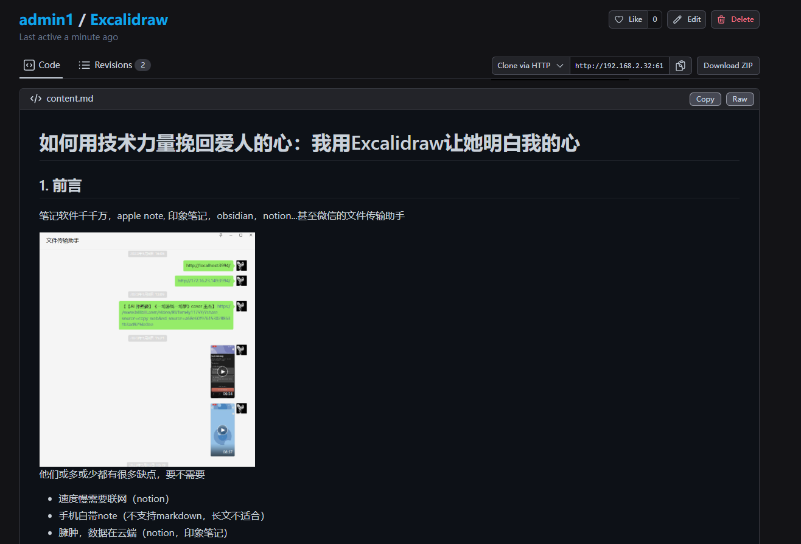
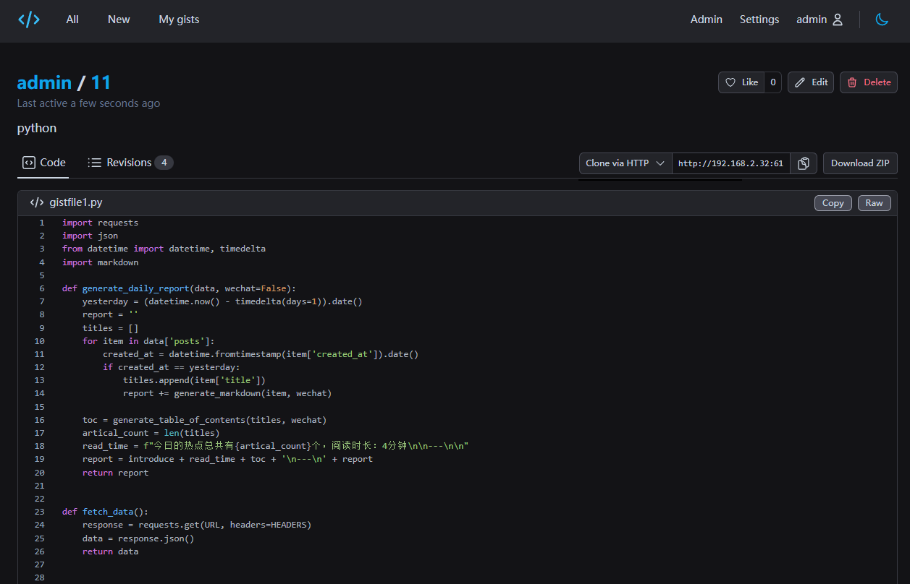
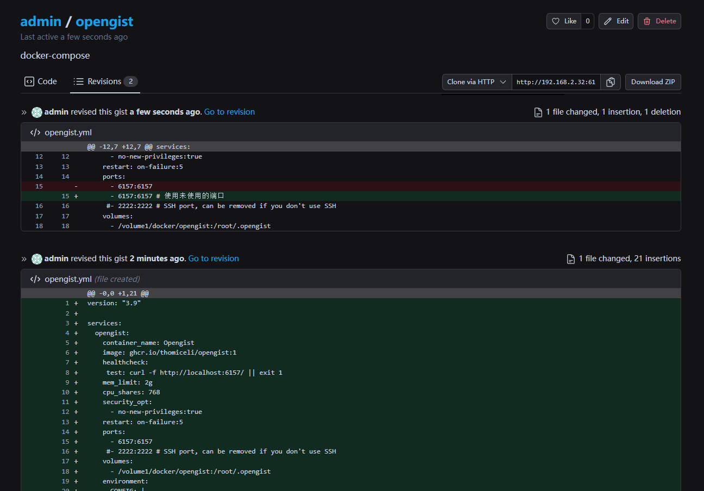
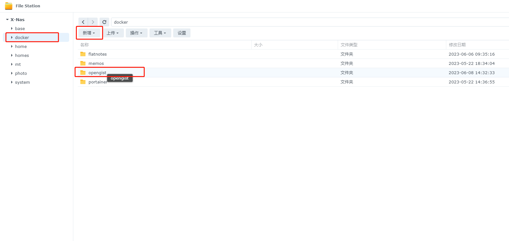
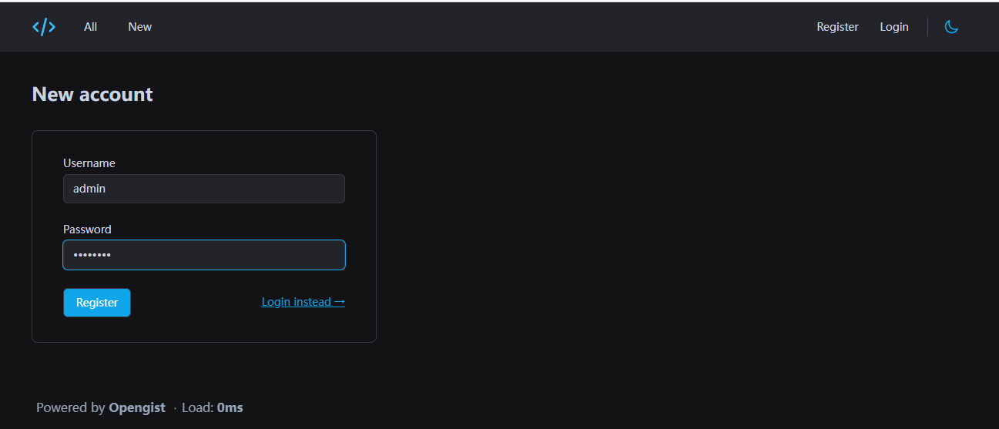
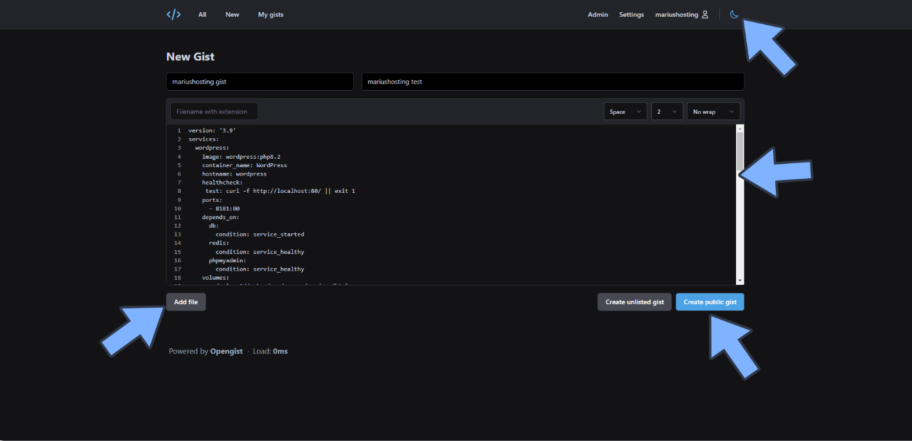
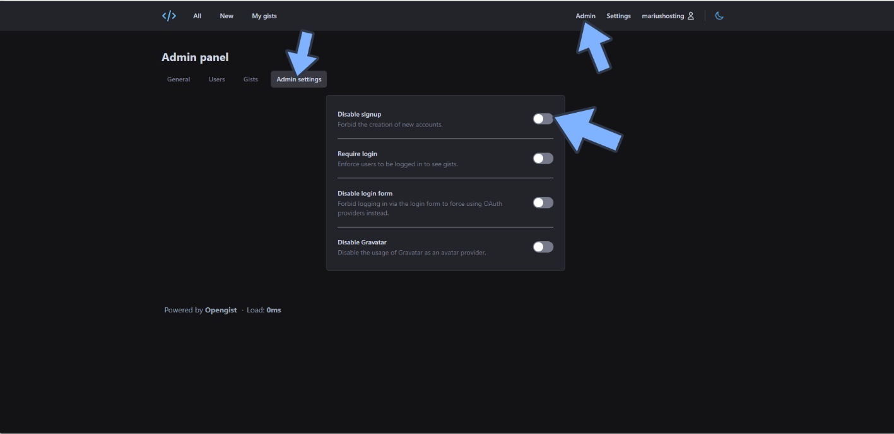

## 1. Introduction

Do you know how you and your friends share documents, tutorials, notes, or code snippets?

This is a typical use case where you need a dedicated place, a place where you can easily upload, share, view, and manage code. This is why we need to build our own Opengist.



---

## Introducing Opengist

Opengist is a self-hosted pastebin powered by Git. It is an online platform where you can create, share, and manage your code snippets. It has many features:

- **Create public or hidden documents/code snippets**: You can create public code snippets or snippets that can only be accessed through a link, depending on your needs.



- **Clone/Pull/Push code snippets using Git**: You can use familiar Git operations to handle your code snippets.
- **Revision history**: You can see all the modification records of your code snippets and understand their development process.



- **Code highlighting, support for Markdown and CSV**: Your code will be automatically highlighted and supports Markdown and CSV file formats, making your code more readable.
- **Like/Share code snippets**: You can like other people's code and share your code with others.
- **Search for all code snippets or code snippets from specific users**: Conveniently find the code you need.
- **Light/Dark mode**: Set the interface theme according to your preference.
- **Responsive user interface**: The interface will automatically adapt to your screen size, whether you are on a computer or a mobile phone.

In addition, as an administrator, you have the following permissions:

- **Enable or disable registration**: You can control who can register on your Opengist platform.
- **Restrict or remove restrictions on the visibility of snippets for anonymous users**: You can control which code snippets anonymous users can see.
- **Admin panel: Delete users/code snippets, clean up the database/file system by synchronizing code snippets**: You can easily manage your Opengist platform.

That's the basic introduction to Opengist. Next, I will show you how to build your own Opengist.

---

Installation Steps:

## 1. Key Point

`Follow for free` and don't get lost

## 2. Install Portainer

Tutorial reference:
[30-second Installation of Portainer, a Must-Have Tool for NAS](/how-to-install-portainer-in-nas/)

## 3. File Station

Open File Station and create an `opengist` folder in the docker folder.



## 4. Create Stack


## 5. Deployment

```yaml
version: "3.9"

```

services:
  opengist:
    container_name: Opengist
    image: ghcr.io/thomiceli/opengist:1
    healthcheck:
     test: curl -f http://localhost:6157/ || exit 1
    mem_limit: 2g
    cpu_shares: 768
    security_opt:
      - no-new-privileges:true
    restart: on-failure:5
    ports:
      - 6157:6157
     #- 2222:2222 # SSH port, if not needed, can be removed
    volumes:
      - /volume1/docker/opengist:/root/.opengist
    environment:
      CONFIG: |
        log-level: info
```

1. Select stack
2. Enter "opengist" in the name field
3. Enter the above code in the editor
4. Click deploy

## 6. Success


## 7. Usage

Access the program in your browser: [ip]:[port]

> The IP is the IP address of your NAS (mine is 172.16.23.106), and the port is defined in the configuration file above. If you followed my tutorial, it would be 6157.


## 8. Register




## 9. Create gist



## 10. Disable registration



## Finally

If you liked this article, please remember to like, bookmark, and follow "Dad's Digital Garden". We will continue to bring you more practical self-hosted application guides. Together, let's take control of our data and create our own digital world!

If you encounter any problems or have any suggestions during the setup process, feel free to leave a comment below. Let's discuss and learn together.