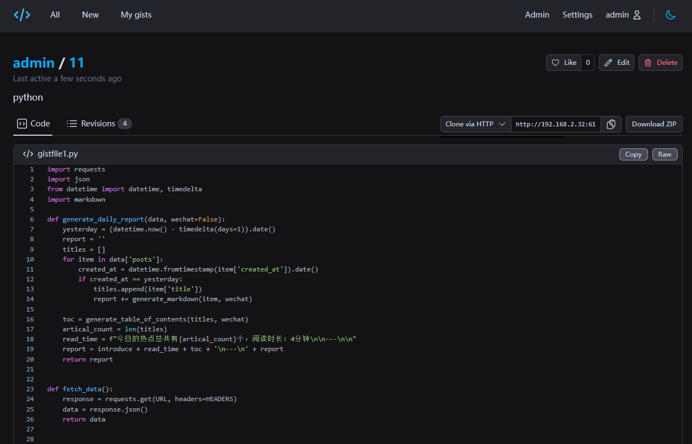

## 1. 前言

不知道大家和你的朋友是怎么分享文档，教程，笔记或者代码片段的？

这就是一个典型的需求场景，你需要一个专门的地方，一个你能方便地上传、分享、查看和管理代码的地方。这就是我们为什么需要自己搭建Opengist的原因。


---

## 介绍Opengist

Opengist是一个自托管的pastebin，由Git驱动。它是一个在线平台，你可以在上面创建、分享并管理你的代码片段。它的特性非常丰富：

- **创建公开或隐藏的文档/代码片段**：你可以根据需要创建公开的或者只有链接才可以访问的代码片段。



- **通过Git克隆 / 拉取 / 推送代码片段**：你可以用熟悉的Git操作来处理你的代码片段。
- **修订历史**：你可以看到你的代码片段的所有修改记录，了解其发展过程。


- **代码高亮，支持Markdown和CSV**：你的代码会被自动高亮，且支持Markdown和CSV格式的文件，使你的代码更易读。
- **点赞 / 分享代码片段**：你可以给别人的代码点赞，也可以分享你的代码给别人。
- **搜索所有代码片段或特定用户的代码片段**：方便你找到你需要的代码。
- **光明/黑暗模式**：根据你的喜好设置界面主题。
- **响应式用户界面**：无论你是在电脑还是手机上，界面都会自动适应你的屏幕大小。

另外，作为管理员，你还有以下权限：

- **启用或禁用注册**：你可以控制谁可以注册你的Opengist平台。
- **限制或取消限制对匿名用户的片段可见性**：你可以控制匿名用户可以看到哪些代码片段。
- **管理面板：删除用户/代码片段，通过同步代码片段清理数据库/文件系统**：你可以方便地管理你的Opengist平台。

以上，就是Opengist的基本介绍。接下来，我将向你展示如何自己搭建一个Opengist。

---

搭建步骤：

## 1. 重点

`点个免费关注`，不迷路

## 2. 安装Portainer

教程参考：
[30秒安装Nas必备神器 Portainer](/how-to-install-portainer-in-nas/)

##  3. File Station

File Station 打开docker 文件夹，创建`opengist`文件夹


## 4. 创建stack


## 5.  部署

```yaml
version: "3.9"

services:
  opengist:
    container_name: Opengist
    image: ghcr.io/thomiceli/opengist:1
    healthcheck:
     test: curl -f http://localhost:6157/ || exit 1
    mem_limit: 2g
    cpu_shares: 768
    security_opt:
      - no-new-privileges:true
    restart: on-failure:5
    ports:
      - 6157:6157
     #- 2222:2222 # SSH port, 如果不需要ssh，可以去掉
    volumes:
      - /volume1/docker/opengist:/root/.opengist
    environment:
      CONFIG: |
        log-level: info
```

1. 选择stack
2. name栏输入opengist
3. edditor输入：上面代码
4. 点击deploy

## 6. 成功


## 7. 使用

浏览器进入程序：[ip]:[端口]

> ip为你nas所在ip（这里我的是172.16.23.106），端口为上面配置文件定义，如果你按照我的教程，则是6157


## 8. 注册


## 9. 创建gist


## 10. 关闭注册


## 最后

如果你喜欢这篇文章，请记得点赞，收藏，并关注【老爸的数字花园】，我们将会持续带来更多实用的自搭建应用指南。一起，让我们掌握自己的数据，创建自己的数字世界！

如果你在搭建过程中遇到任何问题，或者有任何建议，也欢迎在下方留言，一起探讨和学习。