## 1. Einleitung

Ein Lebenslauf spielt eine entscheidende Rolle bei der Jobsuche, der Bewerbung für Schulen oder der Präsentation persönlicher Fähigkeiten.

Viele Berufstätige haben möglicherweise die Frustration erlebt, hart an einem Lebenslauf zu arbeiten, nur um von der Personalabteilung aufgrund von Formatierungs- oder Vorlagenproblemen abgelehnt zu werden.


Wie können Sie also einen professionellen und ansprechenden Lebenslauf erstellen?

In der heutigen Anleitung werde ich Ihnen dabei helfen, einen Service aufzubauen, mit dem Sie Ihren Lebenslauf einfach erstellen, aktualisieren und teilen können: Reactive-Resume.

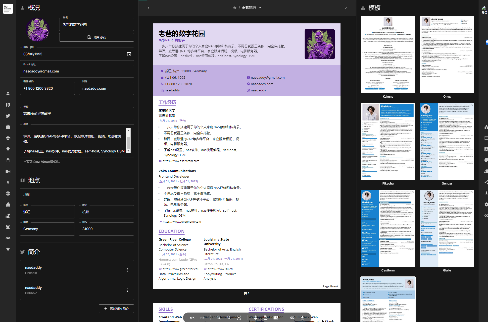

Warum müssen wir unseren eigenen Lebenslauf-Generator erstellen? Es gibt zwei Hauptgründe:

- Er kann Ihren individuellen Lebenslauf-Anforderungen gerecht werden, sodass Sie Layouts frei anpassen, Farben und Vorlagen auswählen und sogar Lebensläufe im Dark Mode erstellen können.

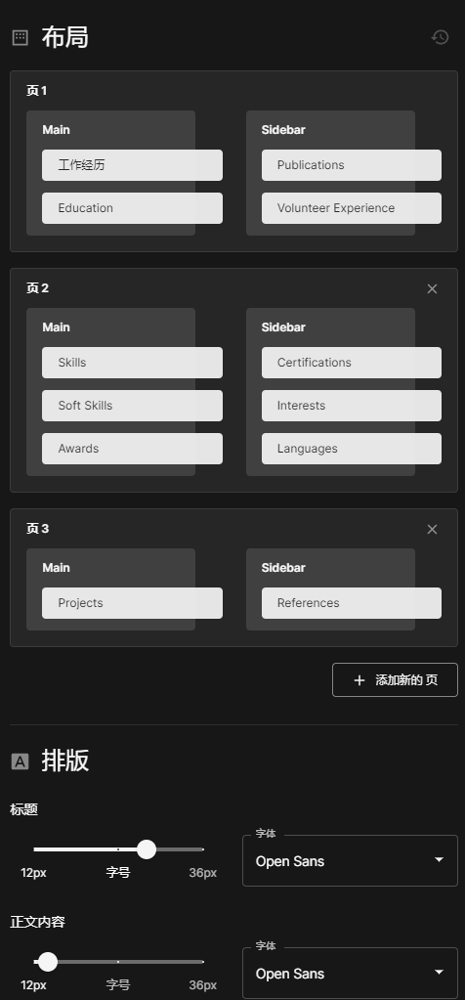

- Keine Werbung, keine Benutzer-Tracking, um die Integrität und Privatsphäre Ihrer Daten in größtmöglichem Umfang zu gewährleisten.

## 2. Reactive-Resume: Ihr personalisierter Lebenslauf-Generator

Reactive-Resume ist ein Open-Source-Online-Lebenslauf-Generator mit folgenden Hauptfunktionen:

- **Kostenlos**: Reactive-Resume ist immer kostenlos, ohne Werbung oder Benutzer-Tracking.
- **Echtzeit-Synchronisierung**: Sie können Ihre Daten auf verschiedenen Geräten synchronisieren, ohne sich um Datenverlust sorgen zu müssen.
- **Datenimport**: Sie können Daten von LinkedIn oder JSON-Lebensläufen importieren, was den Prozess der Lebenslauf-Erstellung erheblich vereinfacht.
- **Lebenslauf-Verwaltung**: Mit nur einem Konto können Sie mehrere Lebensläufe verwalten.
- **Lebensläufe teilen**: Sie können Ihren Lebenslauf über einen eindeutigen Link teilen oder als PDF exportieren.
- **Lebensläufe anpassen**: Sie können jede Schriftart von Google Fonts auswählen und verschiedene Vorlagen und Farben, einschließlich Dark Mode, auswählen.

Reactive-Resume ist ein leistungsstolles und benutzerfreundliches Tool, das die Erstellung, Aktualisierung und Freigabe von Lebensläufen einfach und unkompliziert macht.

---

Nun gehen wir zu den Schritten über, um es aufzubauen:

## 1. Schlüsselpunkt

`Folgen Sie kostenlos`, um nicht den Überblick zu verlieren.

## 2. Portainer installieren

Anleitung: [30-Sekunden-Installation von Portainer, einem unverzichtbaren Tool für NAS](/how-to-install-portainer-in-nas/)

## 3. File Station

Öffnen Sie die File Station und erstellen Sie einen Ordner `resume_data` im Docker-Ordner.

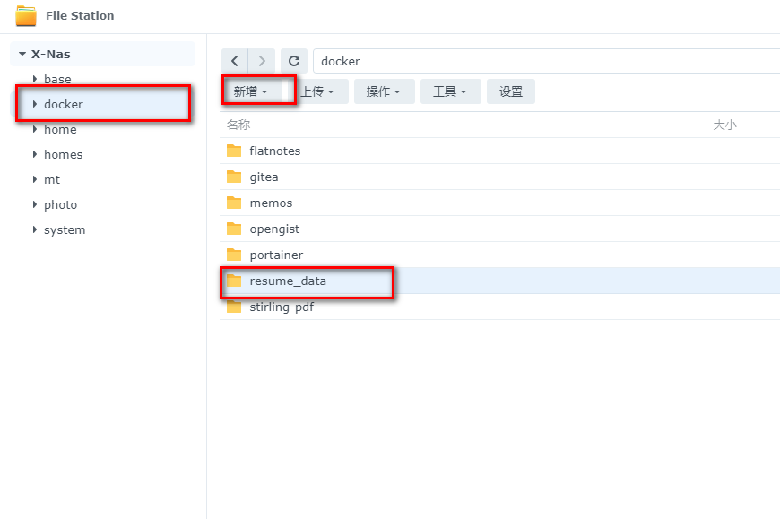

## 4. Stack erstellen


## 5. Bereitstellung

```yaml
version: "3.8"

services:
  postgres:
    image: postgres:alpine
    container_name: resume_db
    restart: always
    volumes:
      - /volume1/docker/resume_data:/var/lib/postgresql/data  # Lebensläufe und wichtige Servicedaten speichern
    healthcheck:
      test: ["CMD-SHELL", "pg_isready -U postgres"]
      start_period: 15s
      interval: 30s
      timeout: 30s
      retries: 3
    environment:
      - POSTGRES_DB=postgres
      - POSTGRES_USER=postgres
      - POSTGRES_PASSWORD=postgres
```

```markdown
  server:
    image: amruthpillai/reactive-resume:server-latest
    container_name: resume_server
    restart: always
    ports:
      - 3100:3100
    depends_on:
      - postgres
    environment:
      - PUBLIC_URL=http://172.16.23.106:13000  # Ersetzen Sie dies durch Ihre IP-Adresse oder Domain, wenn öffentlich zugänglich
      - PUBLIC_SERVER_URL=http://172.16.23.106:3100  # Ersetzen Sie dies durch Ihre IP-Adresse oder Domain, wenn öffentlich zugänglich
      - POSTGRES_DB=postgres
      - POSTGRES_USER=postgres
      - POSTGRES_PASSWORD=postgres
      - SECRET_KEY=change-me-to-something-secure
      - POSTGRES_HOST=postgres
      - POSTGRES_PORT=5432
      - JWT_SECRET=change-me-to-something-secure
      - JWT_EXPIRY_TIME=604800
      
  client:
    image: amruthpillai/reactive-resume:client-latest
    container_name: resume_client
    restart: always
    ports:
      - 13000:3000
    depends_on:
      - server
    environment:
      - PUBLIC_URL=http://172.16.23.106:13000  # Ersetzen Sie dies durch Ihre IP-Adresse oder Domain, wenn öffentlich zugänglich
      - PUBLIC_SERVER_URL=http://172.16.23.106:3100  # Ersetzen Sie dies durch Ihre IP-Adresse oder Domain, wenn öffentlich zugänglich
```

1. Stack auswählen
2. Geben Sie "reactive-resume" im Namensfeld ein
3. Geben Sie den obigen Code im Editor ein
4. Klicken Sie auf Bereitstellen

> Hinweis: Ersetzen Sie PUBLIC_URL und PUBLIC_SERVER_URL durch Ihre interne IP-Adresse, z.B. 192.168.1.32:13000, oder Domain-Namen (öffentlich)

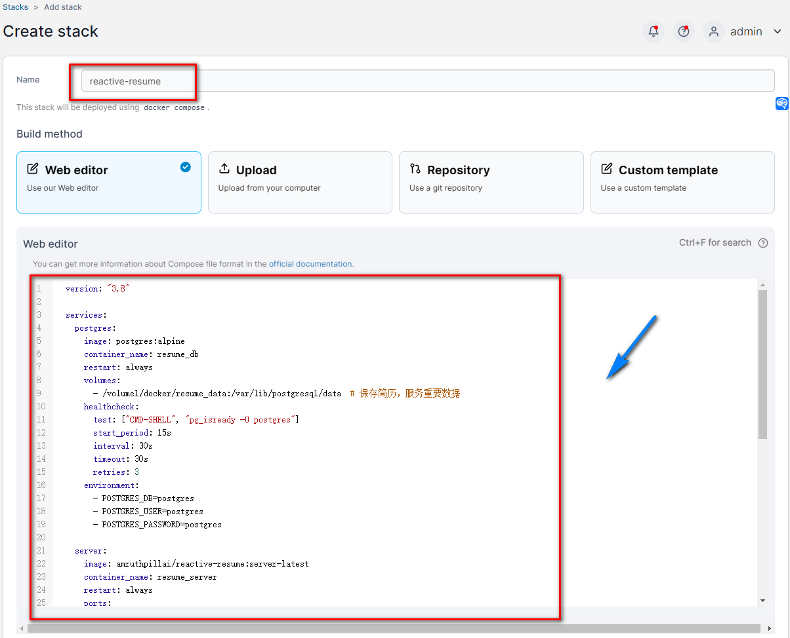

## 6. Erfolg

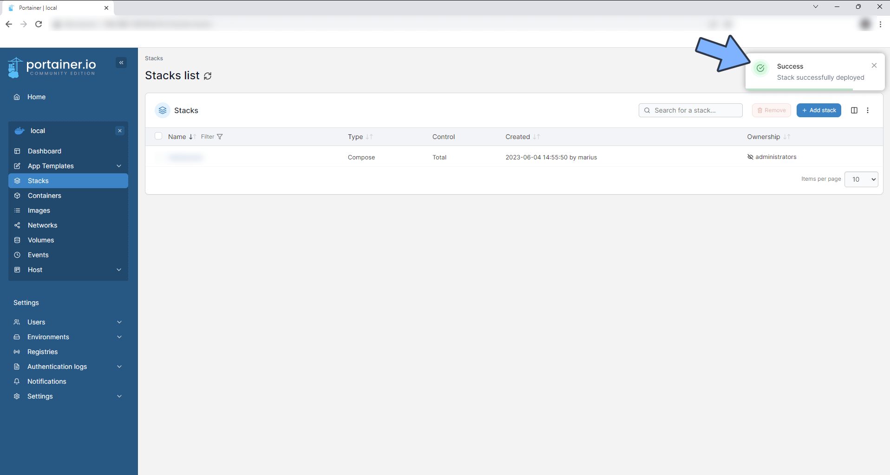

## 7. Verwendung

Öffnen Sie das Programm in Ihrem Browser: [IP]:[Port]

> Ersetzen Sie "IP" durch die IP-Adresse Ihres NAS (in diesem Fall ist meine 172.16.23.106) und "Port" durch den in der Konfigurationsdatei definierten Port (wenn Sie meiner Anleitung gefolgt sind, wäre es 13000)

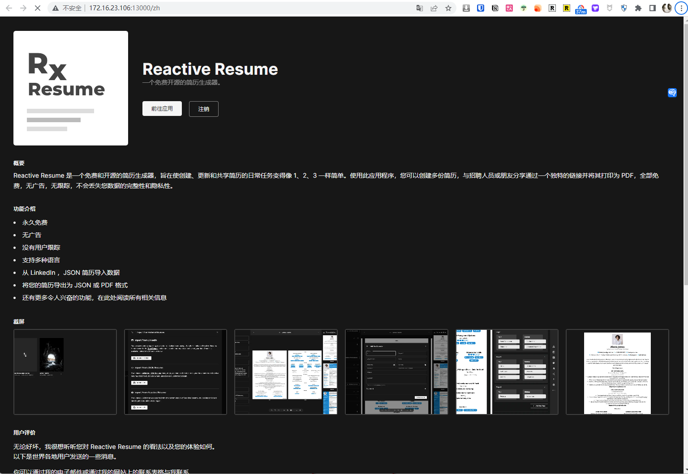

## 8. Registrierung

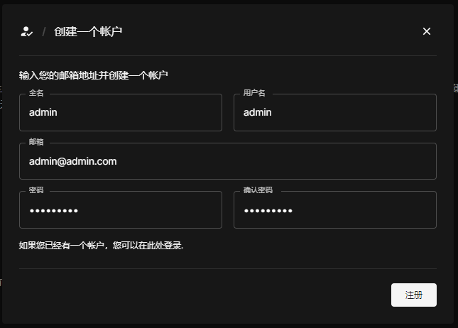

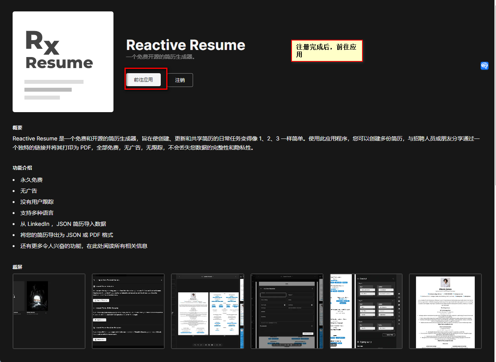

## 9. Lebenslauf erstellen

Zwei Möglichkeiten:

1. Importieren aus JSON
2. Neu erstellen

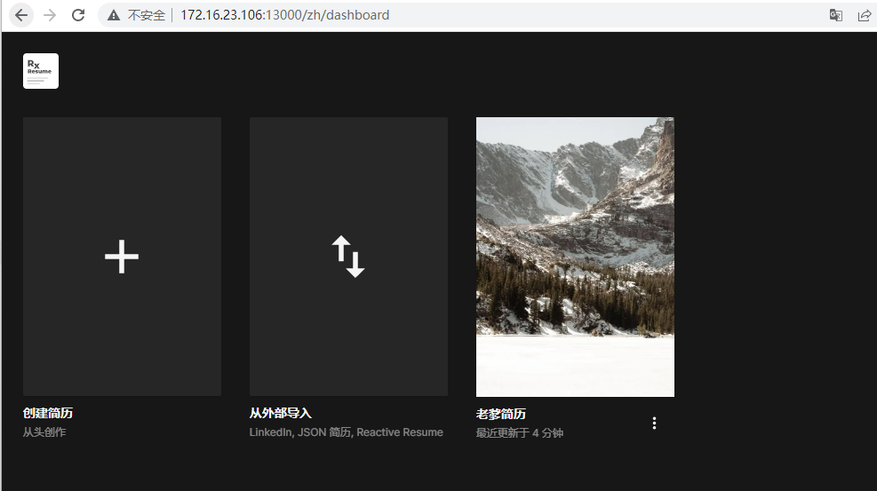

## 10. Lebenslauf bearbeiten

### Frei bearbeiten, Modulnamen ändern:

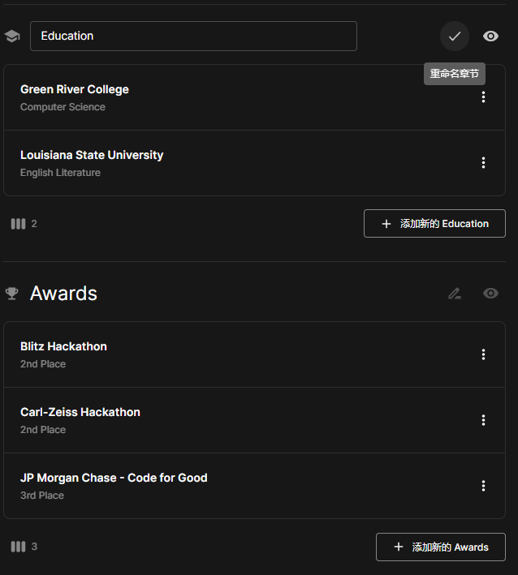

### Exportieren und teilen

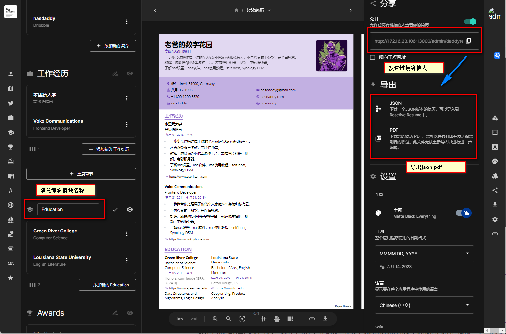

### Layout ändern und individuell anpassen

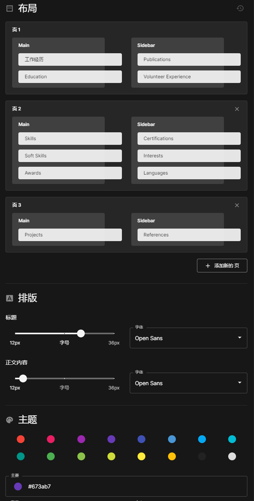

### Auswahl aus mehreren Vorlagen

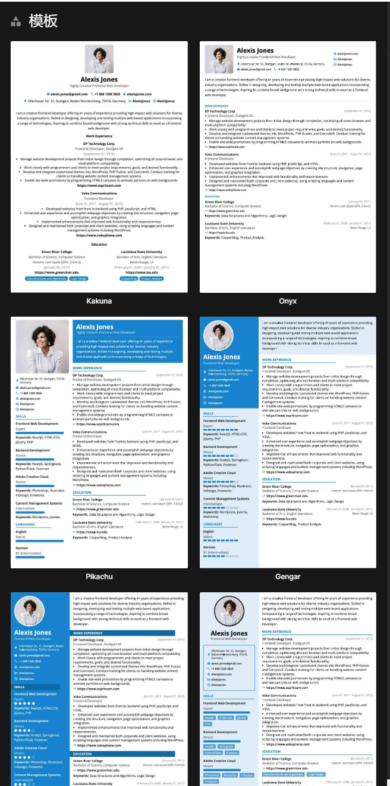

## Schließlich

Reactive-Resume wird Ihr hilfreicher Assistent sein und Ihnen helfen, sich unter vielen Bewerbern hervorzuheben.

Sie können es mit Ihrer Familie teilen, sogar mit Ihrer Frau. Ich glaube, dieses Mal wird Ihre Frau zustimmen, dass Sie sich dieses NAS kaufen dürfen, auf das Sie schon so lange gewartet haben 😂

Wenn Ihnen dieser Artikel gefällt, denken Sie bitte daran, "Dad's Digital Garden" zu liken, zu bookmarken und zu folgen. Wir werden Ihnen weiterhin praktische Anleitungen für selbst gehostete Anwendungen bringen. Gemeinsam nehmen wir unsere eigenen Daten in die Hand und erschaffen unsere eigene digitale Welt!

Wenn Sie während des Einrichtungsprozesses auf Probleme stoßen oder Anregungen haben, können Sie gerne einen Kommentar hinterlassen, um darüber zu diskutieren und zu lernen.