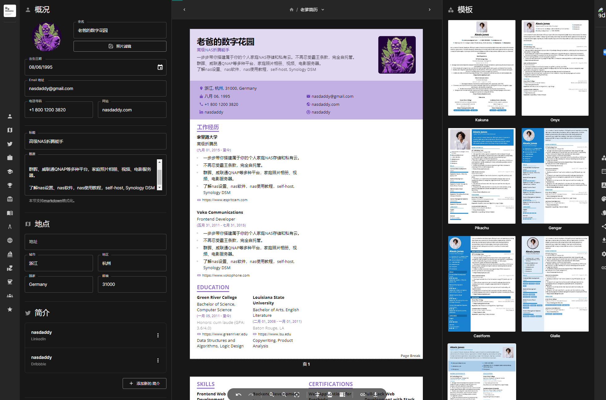
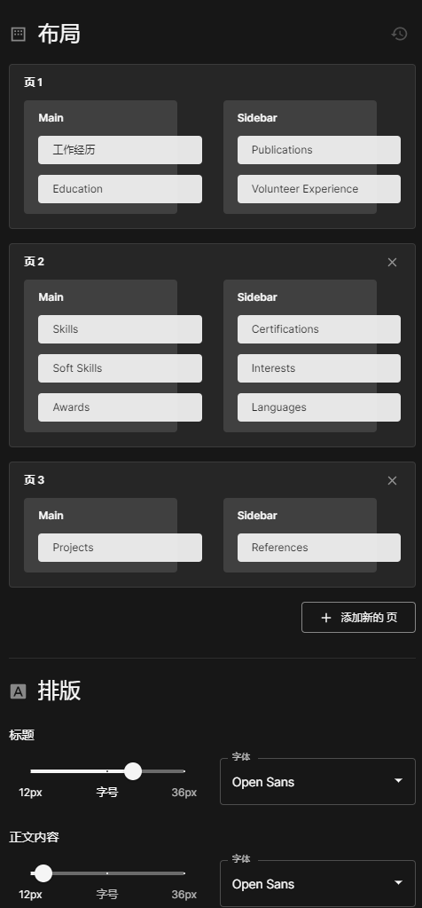
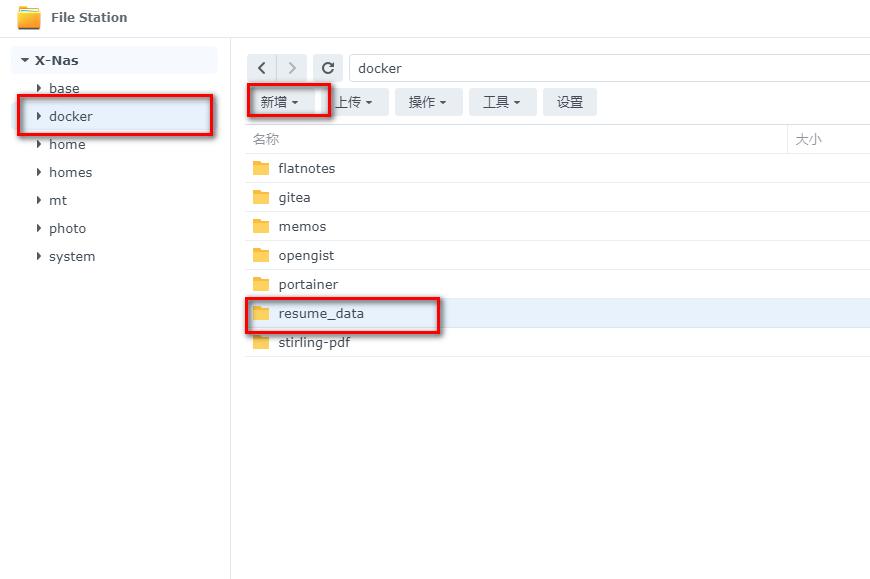
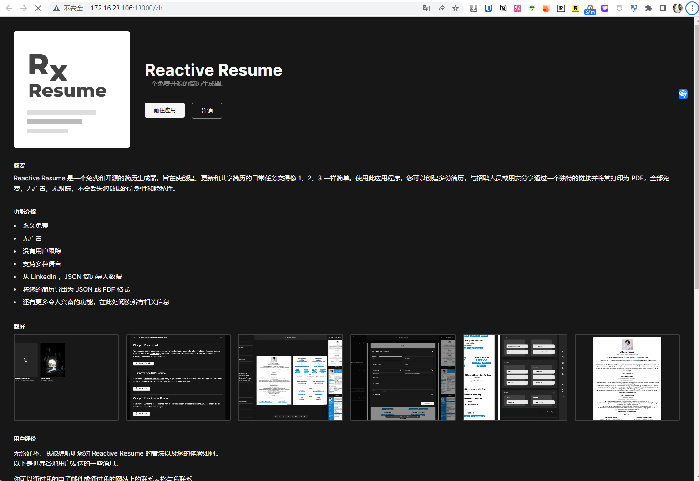
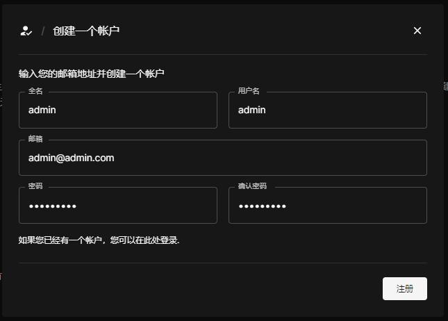
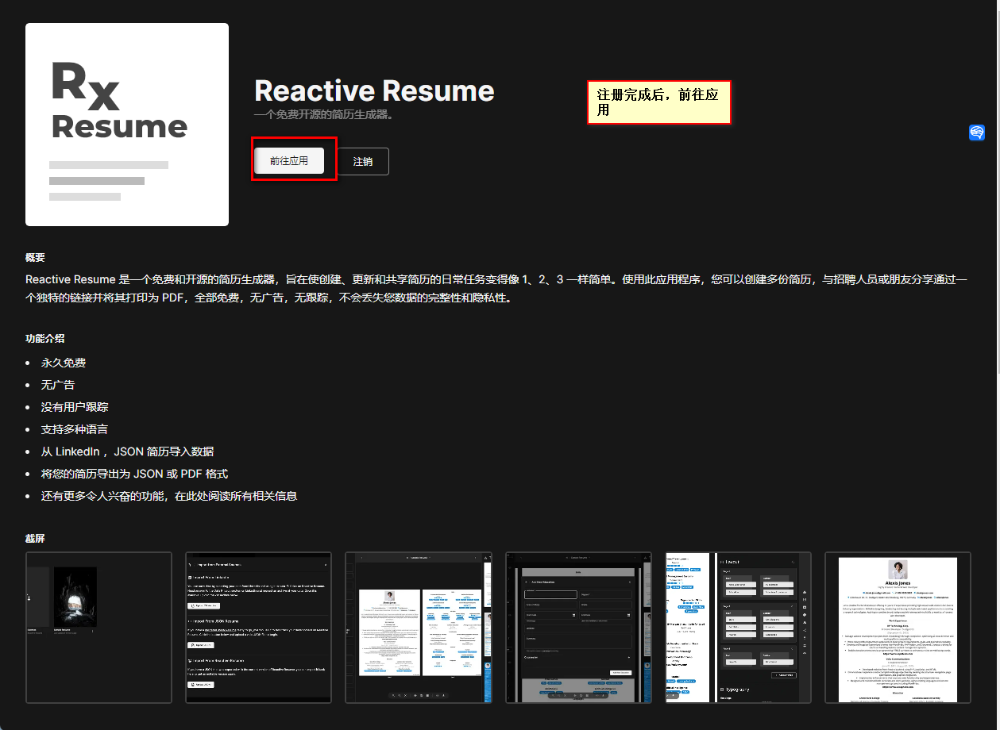
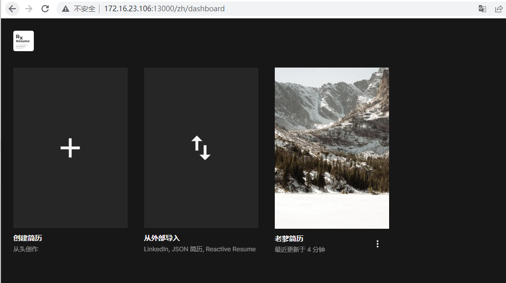
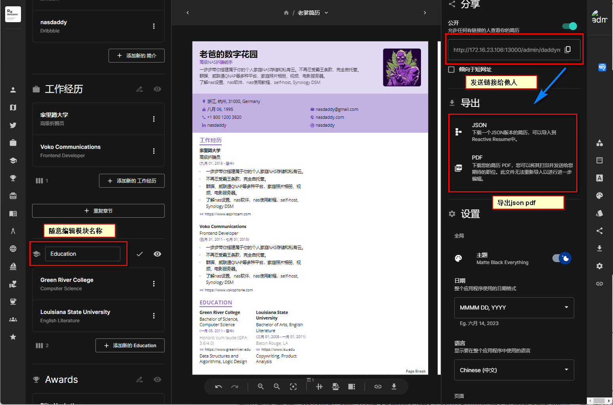
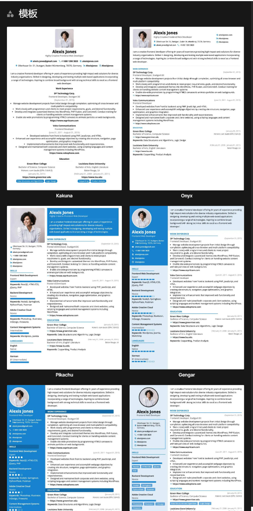

## 1. 前言

简历对于寻找工作、申请学校或展示个人能力有着至关重要的作用。

相信许多打工人都有这样的经历，辛辛苦苦写完简历，却因为排版格式或者模板问题，被HR直接PASS


那么如何创建一份专业且吸引人的简历呢？

今天这个教程，我就来帮你搭建一个属于你自己，帮助你轻松创建、更新和分享简历的服务：Reactive-Resume



为什么我们需要自己搭建一个简历生成器呢？有两个主要原因：

- 它可以满足你对个性化简历的需求，你可以随心所欲地调整布局，选择颜色和模板，甚至可以创建暗黑模式的简历；



- 没有广告，不进行用户跟踪，最大程度地保证了你的数据的完整性和隐私

## 2. Reactive-Resume：你的专属简历生成

Reactive-Resume 是一个开源的在线简历生成器，主要特性如下：

- **免费**：Reactive-Resume永远免费，无广告，无用户跟踪。
- **实时同步**：你可以在不同的设备上同步你的数据，无需担心数据丢失的问题。
- **数据导入**：你可以从 LinkedIn 或者 JSON 简历中导入数据，极大的简化了简历制作的过程。
- **简历管理**：只需要一个账户，你就可以管理多份简历。
- **分享简历**：你可以通过一个唯一的链接来分享你的简历给他人，也可以将简历导出为 PDF 格式。
- **自定义简历**：你可以选择 Google Fonts 中的任意字体，还可以选择多种模板和颜色，包括暗黑模式。

Reactive-Resume是一个十分强大且用户友好的工具，让创建、更新和分享简历变得简单易行。

---

接下来进入正餐搭建步骤：

## 1. 重点

`点个免费关注`，不迷路

## 2. 安装Portainer

教程参考：
[30秒安装Nas必备神器 Portainer](/how-to-install-portainer-in-nas/)

##  3. File Station

File Station 打开docker 文件夹，创建`resume_data`文件夹



## 4. 创建stack


## 5.  部署

```yaml
version: "3.8"

services:
  postgres:
    image: postgres:alpine
    container_name: resume_db
    restart: always
    volumes:
      - /volume1/docker/resume_data:/var/lib/postgresql/data  # 保存简历，服务重要数据
    healthcheck:
      test: ["CMD-SHELL", "pg_isready -U postgres"]
      start_period: 15s
      interval: 30s
      timeout: 30s
      retries: 3
    environment:
      - POSTGRES_DB=postgres
      - POSTGRES_USER=postgres
      - POSTGRES_PASSWORD=postgres

  server:
    image: amruthpillai/reactive-resume:server-latest
    container_name: resume_server
    restart: always
    ports:
      - 3100:3100
    depends_on:
      - postgres
    environment:
      - PUBLIC_URL=http://172.16.23.106:13000  # 替换成你的ip，如果公网映射，替换为域名
      - PUBLIC_SERVER_URL=http://172.16.23.106:3100  # 替换成你的ip，如果公网映射，替换为域名
      - POSTGRES_DB=postgres
      - POSTGRES_USER=postgres
      - POSTGRES_PASSWORD=postgres
      - SECRET_KEY=change-me-to-something-secure
      - POSTGRES_HOST=postgres
      - POSTGRES_PORT=5432
      - JWT_SECRET=change-me-to-something-secure
      - JWT_EXPIRY_TIME=604800
      
  client:
    image: amruthpillai/reactive-resume:client-latest
    container_name: resume_client
    restart: always
    ports:
      - 13000:3000
    depends_on:
      - server
    environment:
      - PUBLIC_URL=http://172.16.23.106:13000  # 替换成你的ip，如果公网映射，替换为域名
      - PUBLIC_SERVER_URL=http://172.16.23.106:3100  # 替换成你的ip，如果公网映射，替换为域名
```

1. 选择stack
2. name栏输入reactive-resume
3. edditor输入：上面代码
4. 点击deploy

> 注意PUBLIC_URL PUBLIC_SERVER_URL 需要换成你的内网地址如：192.168.1.32:13000，或者域名（公网）


## 6. 成功


## 7. 使用

浏览器进入程序：[ip]:[端口]

> ip为你nas所在ip（这里我的是172.16.23.106），端口为上面配置文件定义，如果你按照我的教程，则是13000



## 8. 注册






## 9. 创建简历

两种方式：

1. 从json导入
2. 新建




## 10. 编辑简历

### 随意编辑，更改模块名称：


### 导出与分享




### 更改布局，与diy


#### 

###  多种模板可选




## 最后

Reactive-Resume 将会成为你的得力助手，帮助你在众多的应聘者中脱颖而出。

可以分享给你的家人，甚至是你的老婆。相信这次，你的老婆会同意你买那个你心仪已久的NAS了😂

如果你喜欢这篇文章，请记得点赞，收藏，并关注【老爸的数字花园】，我们将会持续带来更多实用的自搭建应用指南。一起，让我们掌握自己的数据，创建自己的数字世界！

如果你在搭建过程中遇到任何问题，或者有任何建议，也欢迎在下方留言，一起探讨和学习。