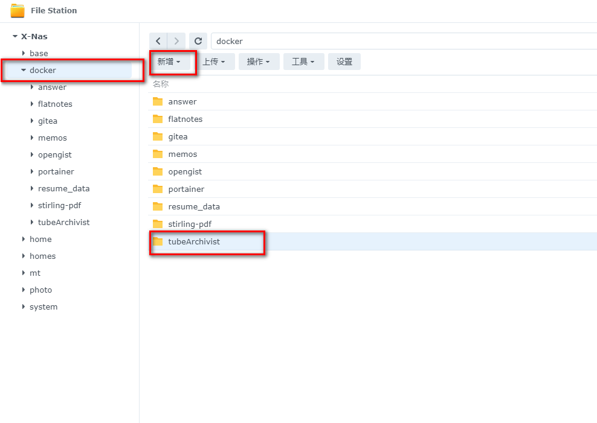
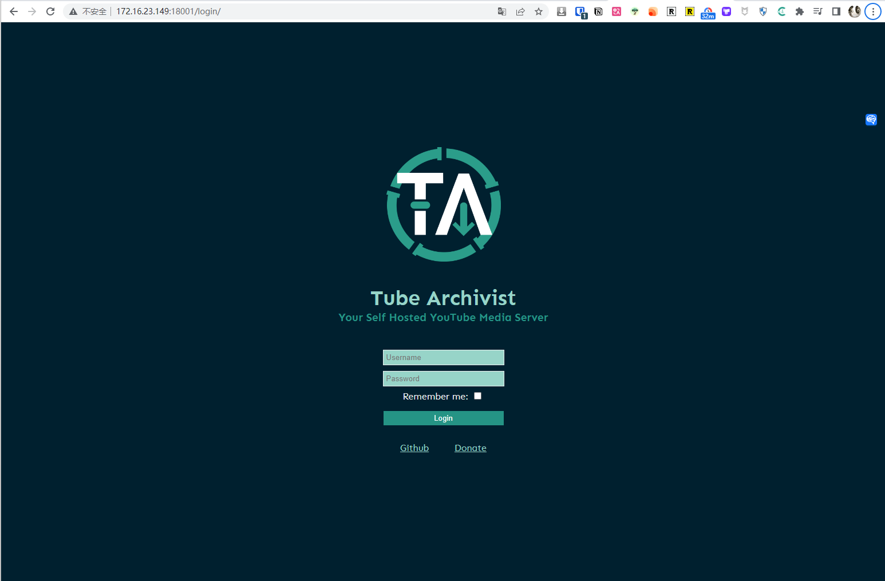
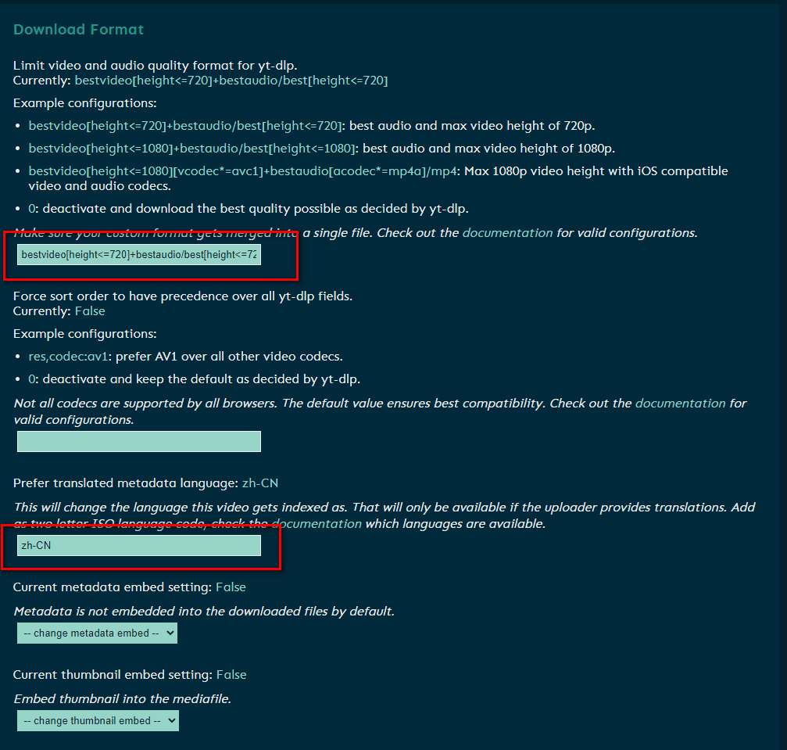
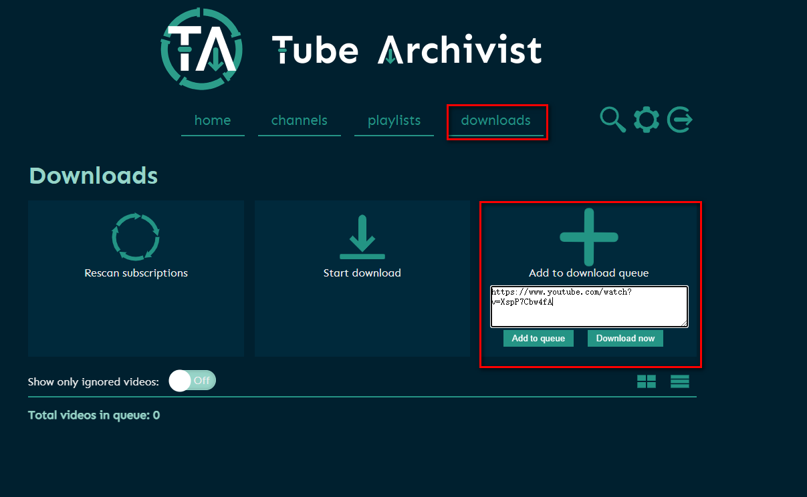
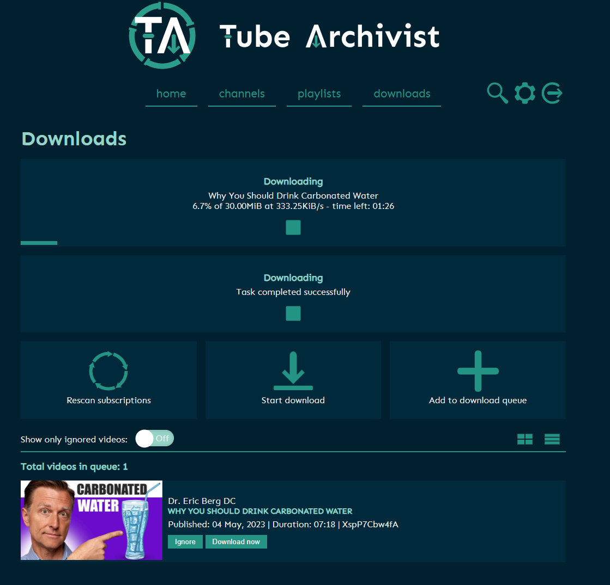

## 1. Einführung

Vielleicht suchen Sie wie ich oft nach verschiedenen interessanten und lehrreichen Videos auf YouTube, aber

- **Unordentliche Lesezeichen**: Zu viel Wissen, `ständiges Lesezeichen setzen, aber nie anschauen`
- **Nicht herunterladen können**: Möchte `herunterladen, aber immer umständlich`
- **Schwierig, Videos zu finden**: Mit zunehmender Anzahl von Lesezeichen wird es sehr schwierig, bestimmte Videos zu finden
- **Videoarchivierung**: Wenn der Autor ein Video löscht, können Sie diese wunderbaren Videos möglicherweise nie wieder sehen

Heute werde ich Ihnen zeigen, wie Sie mit NAS TubeArchivist verwenden können, um Ihre YouTube-Videos offline zu organisieren, zu suchen und anzuschauen.


> Für dieses Tutorial ist es erforderlich, eine Lernumgebung in einem ausländischen Unternehmen zu haben oder im Ausland zu sein. Dieser Teil des Inhalts ist nicht betroffen.

---

## Einführung in TubeArchivist

TubeArchivist ist eine Software, mit der Sie Ihre Lieblings-YouTube-Kanäle abonnieren, Videos herunterladen und indizieren können, sodass sie durchsuchbar sind. Sie kann auch Videos abspielen und Ihre angesehenen und nicht angesehenen Videos verfolgen.

Hier sind die Hauptfunktionen von TubeArchivist:

- **Abonnieren Sie Ihre Lieblings-YouTube-Kanäle (automatische Downloads)**: Geben Sie einfach die URL des Kanals ein, und TubeArchivist abonniert automatisch den Kanal und beginnt mit dem Herunterladen seiner Videos.


- **Videos herunterladen**: TubeArchivist kann Ihnen helfen, Videos von den von Ihnen abonnierten Kanälen herunterzuladen, sodass Sie sie offline ansehen können.
- **Leistungsstarke Suchfunktion**: TubeArchivist indiziert Ihre Videosammlung mithilfe der Metadaten von YouTube, sodass Sie sie einfach über die Web-Schnittstelle durchsuchen und organisieren können.

**Nach Titel suchen**


**Inhalt innerhalb des Videos durchsuchen!**


- **Videos abspielen**: TubeArchivist ist nicht nur ein Videoverwaltungstool, sondern auch ein Videoplayer, mit dem Sie Ihre Lieblingsvideos direkt abspielen können.
- **Verfolgen Sie angesehene und nicht angesehene Videos**: TubeArchivist kann die Videos, die Sie angesehen haben, und diejenigen, die Sie noch nicht angesehen haben, verfolgen und Ihnen bei der besseren Verwaltung Ihrer Sammlung helfen.


**Automatischer Download von chinesischen Untertiteln**: TubeArchivist lädt automatisch chinesische Untertitel herunter und beseitigt Sprachbarrieren in Ihrem Lernerlebnis.


**Sie können sogar mit Emby Jellyfin integrieren**: TubeArchivist lädt automatisch chinesische Untertitel herunter und beseitigt Sprachbarrieren in Ihrem Lernerlebnis.


TubeArchivist ist ein leistungsstarkes Werkzeug, mit dem Sie Ihre YouTube-Videosammlung besser verwalten und genießen können.

Hier finden Sie eine Anleitung zum Erstellen von TubeArchivist:

## 1. Schlüsselpunkte

`Kostenlos folgen`, nicht verloren gehen

## 2. Portainer installieren

Anleitung zur Referenz:
[30-Sekunden-Installation von Portainer, ein Muss für NAS](/how-to-install-portainer-in-nas/)

##  3. File Station

Öffnen Sie den Ordner "docker" in der File Station und erstellen Sie einen Ordner mit dem Namen "TubeArchivist".



## 4. Stack erstellen


## 5. Code bereitstellen

```yaml
version: '3.3'

services:
  tubearchivist:
    container_name: tubearchivist
    restart: unless-stopped
    image: bbilly1/tubearchivist
    ports:
      - 18001:8000
    volumes:
      - /volume1/docker/tubeArchivist/media_data:/youtube
      - /volume1/docker/tubeArchivist/cache_data:/cache
    environment:
      - ES_URL=http://archivist-es:9200     # needs protocol e.g. http and port
      - REDIS_HOST=archivist-redis          # don't add protocol
      - HOST_UID=0
      - HOST_GID=0
      - TA_HOST=http://172.16.23.149:18001         # set your nas ip, if it is a domain, set the domain
      - TA_USERNAME=tubearchivist           # web account
      - TA_PASSWORD=verysecret              # web password
      - ELASTIC_PASSWORD=verysecret         # set password for Elasticsearch
      - TZ=Asia/Shanghai                 # set your time zone
      - http_proxy=http://v2ray:11809   # set proxy address
      - no_proxy=archivist-es, archivist-redis  # do not proxy internal es, redis containers
    depends_on:
      - archivist-es
      - archivist-redis

  archivist-redis:
    image: redis/redis-stack-server
    container_name: archivist-redis
    restart: unless-stopped
    expose:
      - "6379"
    volumes:
      - /volume1/docker/tubeArchivist/redis_data:/data
    depends_on:
      - archivist-es
  archivist-es:
    image: bbilly1/tubearchivist-es         # only for amd64, or use official es 8.7.0
    container_name: archivist-es
    restart: unless-stopped
    environment:
      - "ELASTIC_PASSWORD=verysecret"       # matching Elasticsearch password
      - "ES_JAVA_OPTS=-Xms512m -Xmx512m"
      - "xpack.security.enabled=true"
      - "discovery.type=single-node"
      - "path.repo=/usr/share/elasticsearch/data/snapshot"
    ulimits:
      memlock:
        soft: -1
        hard: -1
    volumes:
      - /volume1/docker/tubeArchivist/es_data:/usr/share/elasticsearch/data    # check for permission error when using bind mount, see readme
    expose:
      - "9200"
 # This tutorial does not elaborate on external tools

```

1. Wählen Sie den Stack aus.
2. Geben Sie "tubearchivist" im Namensfeld ein.
3. Geben Sie den obigen Code in den Editor ein.
4. Klicken Sie auf Bereitstellen.

## 6. Erfolg


## 7. Verwendung

Greifen Sie auf das Programm in Ihrem Browser zu: [IP]:[Port]

> Die IP ist die IP Ihres NAS (meine ist 172.16.23.149) und der Port ist in der obigen Konfigurationsdatei definiert. Wenn Sie meiner Anleitung gefolgt sind, ist es 18001.



Der Benutzername und das Passwort sind in der Compose-Datei festgelegt.

Wenn Sie keine Änderungen vorgenommen haben, lauten sie:

Benutzername: tubearchivist

Passwort: verysecret

## 8. Download-Qualität einstellen

**Download-Größe festlegen**



Ich habe eine relativ geringe Qualität festgelegt:

```
bestvideo[height<=720]+bestaudio/best[height<=720]
```

Metasprache (einige Videos können internationalisiert sein, wenn Chinesisch vorhanden ist, stellen Sie es auf Chinesisch ein)

```
zh-CN
```

## 9. Untertitel einstellen (wichtig)

Die meisten YouTube-Videos sind hochwertige fremdsprachige Ressourcen, und YouTube bietet auch Voiceover- und Übersetzungsfunktionen für Untertitel an. Dieser Schritt dient dazu, diesen Prozess einzurichten.


Einstellung für den Untertitel-Download: Untertitelsprache festlegen

```
zh-Hans
```

Einstellungen für die Untertitelquelle: Festlegen, ob Untertitel automatisch generiert werden sollen (viele Videos enthalten keine eingebetteten chinesischen Untertitel, daher wählen Sie den YouTube-Untertitelübersetzungsdienst)

```
also download auto generated
```

Indizieren und Untertitel durchsuchbar machen: Diese Funktion ist sehr leistungsstark, da Sie direkt nach Untertiteln suchen und Videos finden können, wie zum Beispiel:

```
enable
```


## 10. Verwendung

Downloads herunterladen:



Mit dem Herunterladen beginnen:



Download abgeschlossen:


Online abspielen:


> Da der Online-Player keine Untertitel unterstützt, können Sie zum Anzeigen von Untertiteln andere Player verwenden. Wenn Sie Emby, Jellyfin oder Plex haben, können sie automatisch verknüpft werden.


## Browser-Erweiterung (optional)

Suchen Sie im Google Chrome Web Store:

```
TubeArchivist Companion
```

**Holen Sie sich den Schlüssel**


**Konfigurieren Sie die Erweiterung**


**Verwenden Sie die Erweiterung**


## Abschließend

Zusammenfassend:

`Bildung ist der Schlüssel zur Beseitigung von Armut`

`Wissen sollte effizienter verbreitet werden`

Ich hoffe, dieses Tutorial ermöglicht es Wissen, `geografische und sprachliche Grenzen zu überwinden`, damit jeder von den Vorteilen des Wissens, unterschiedlichen Kulturen und verschiedenen Perspektiven profitieren kann.

Wenn Ihnen dieser Artikel gefällt, denken Sie bitte daran, ihn zu liken, zu bookmarken und `Unique ID across the Internet: [Dad's Digital Garden]` zu folgen. Wir werden weiterhin praktische Anleitungen zur Selbstinstallation von Anwendungen bereitstellen. Gemeinsam nehmen wir unsere Daten in die Hand und schaffen unsere eigene digitale Welt!

Wenn Sie während des Einrichtungsprozesses auf Probleme stoßen oder Vorschläge haben, hinterlassen Sie bitte einen Kommentar unten. Lassen Sie uns gemeinsam erkunden und lernen.