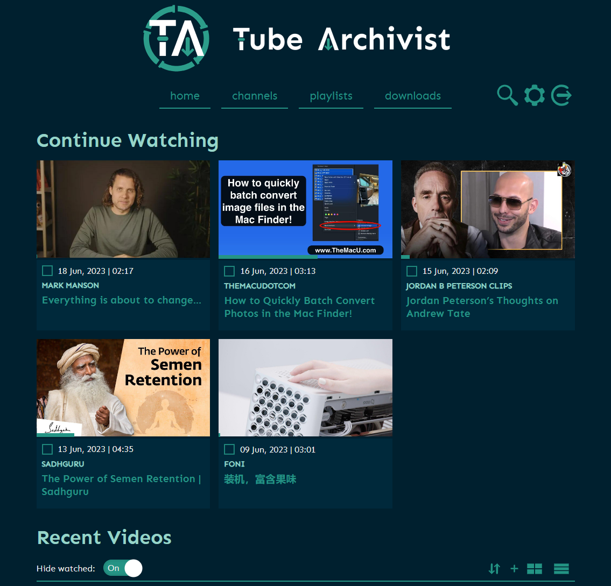
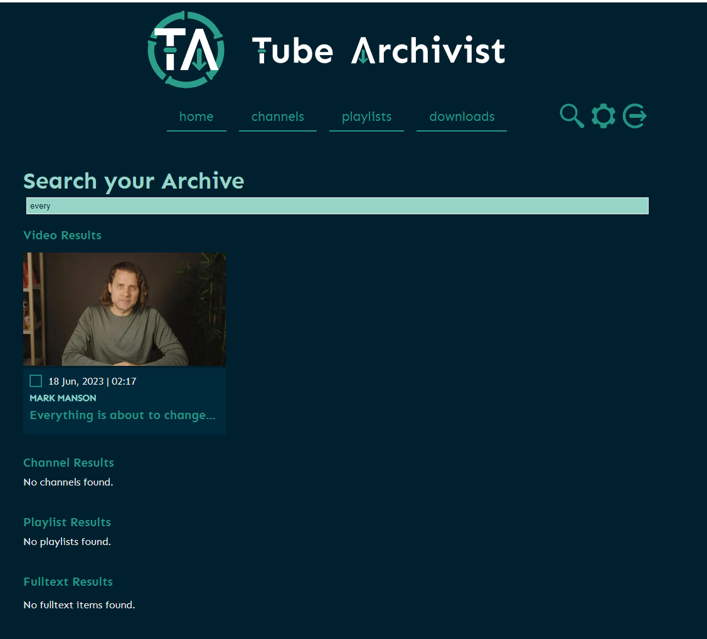
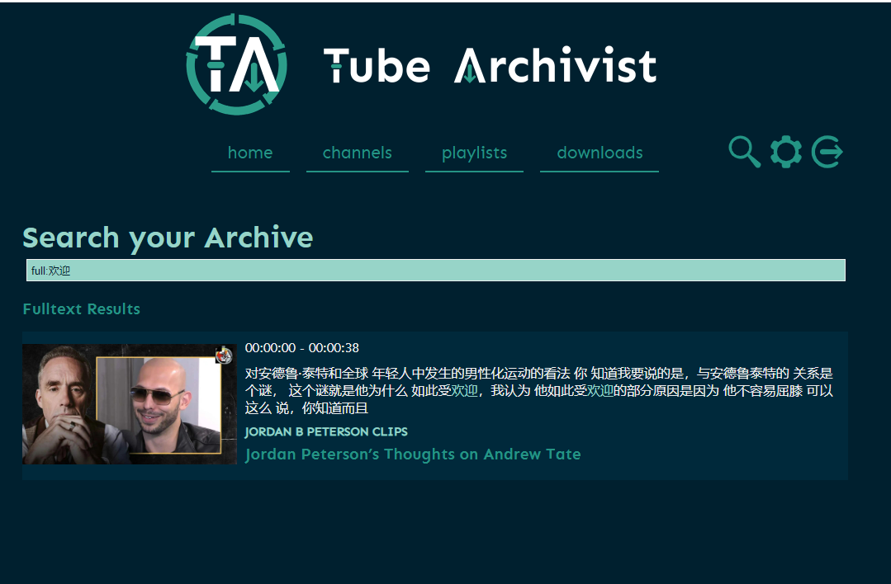
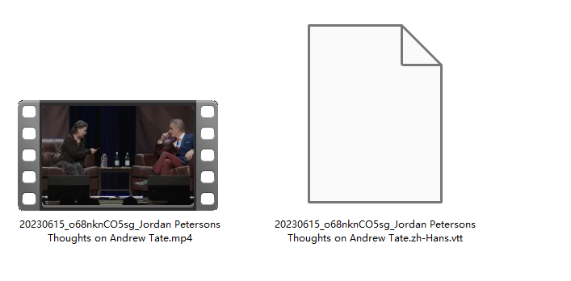
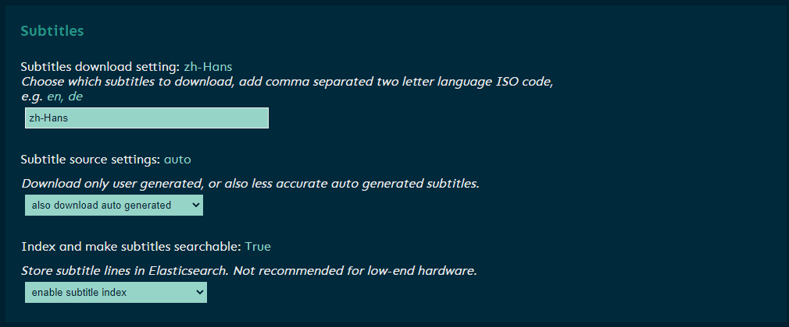
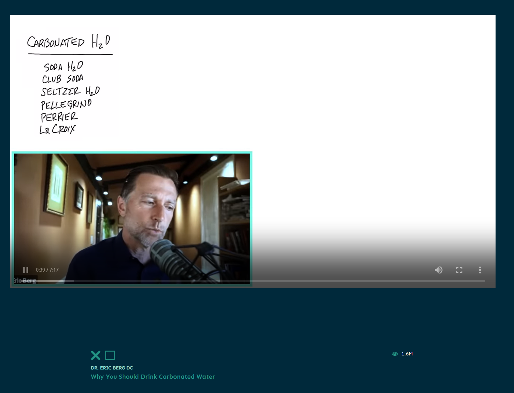
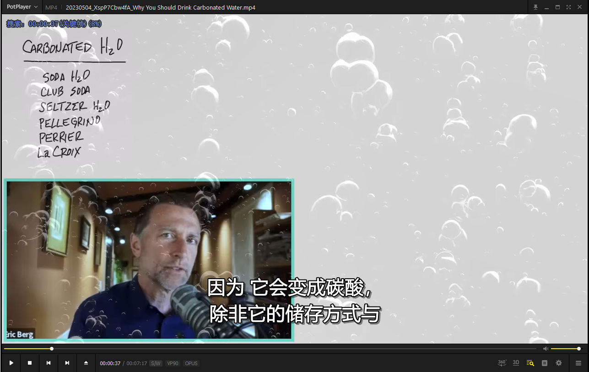
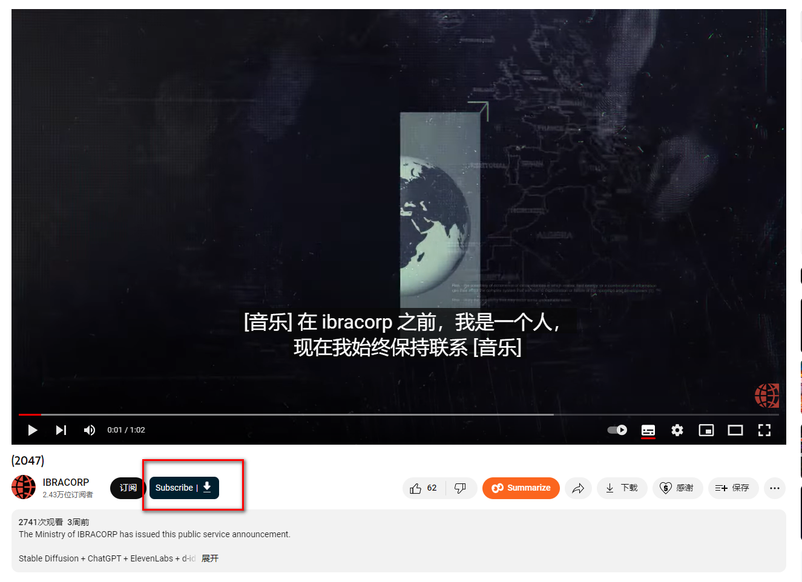

## 1. Introduction

Perhaps like me, you often search for various interesting and educational videos on YouTube, but

- **Messy bookmarks**: Too much knowledge, `constantly bookmarking but never watching`
- **Unable to download**: Want to `download, but always troublesome`
- **Difficult to find videos**: As the number of bookmarks increases, it becomes very difficult to find specific videos
- **Video preservation**: If the author deletes a video, you may never be able to see these wonderful videos again

Today, I will introduce how to use NAS to build TubeArchivist, helping you organize, search, and watch your YouTube videos offline.




> This tutorial requires having a learning environment in a foreign company or being abroad. It does not involve this part of the content.

---

## Introduction to TubeArchivist

TubeArchivist is a software that allows you to subscribe to your favorite YouTube channels, download and index videos, making them searchable. It can also play videos and keep track of your watched and unwatched videos.

Here are the main features of TubeArchivist:

- **Subscribe to your favorite YouTube channels (automatic downloads)**: Simply enter the URL of the channel, and TubeArchivist will automatically subscribe to the channel and start downloading its videos.


- **Download videos**: TubeArchivist can help you download videos from the channels you subscribe to, so you can watch them offline.
- **Powerful search function**: TubeArchivist indexes your video collection using YouTube's metadata, allowing you to easily search and organize them through the web interface.

**Search by title**



**Search within video content!**



- **Play videos**: TubeArchivist is not just a video management tool, it is also a video player that can directly play your favorite videos.
- **Track watched and unwatched videos**: TubeArchivist can keep track of the videos you have watched and the ones you haven't, helping you better manage your collection.


**Automatic download of Chinese subtitles**: TubeArchivist automatically downloads Chinese subtitles, removing language barriers from your learning experience.




**You can even integrate with Emby Jellyfin**: TubeArchivist automatically downloads Chinese subtitles, removing language barriers from your learning experience.


TubeArchivist is a powerful tool that allows you to better manage and enjoy your YouTube video collection.

Here is a tutorial on how to build TubeArchivist:

## 1. Key Points

`Follow for free`, don't get lost

## 2. Install Portainer

Tutorial reference:
[30-Second Installation of Portainer, a Must-Have Tool for NAS](/how-to-install-portainer-in-nas/)

##  3. File Station

Open the "docker" folder in File Station and create a folder named "TubeArchivist".


## 4. Create stack


## 5. Deploy the code

```yaml
version: '3.3'

services:
  tubearchivist:
    container_name: tubearchivist
    restart: unless-stopped
    image: bbilly1/tubearchivist
    ports:
      - 18001:8000
    volumes:
      - /volume1/docker/tubeArchivist/media_data:/youtube
      - /volume1/docker/tubeArchivist/cache_data:/cache
    environment:
      - ES_URL=http://archivist-es:9200     # needs protocol e.g. http and port
      - REDIS_HOST=archivist-redis          # don't add protocol
      - HOST_UID=0
      - HOST_GID=0
      - TA_HOST=http://172.16.23.149:18001         # set your nas ip, if it is a domain, set the domain
      - TA_USERNAME=tubearchivist           # web account
      - TA_PASSWORD=verysecret              # web password
      - ELASTIC_PASSWORD=verysecret         # set password for Elasticsearch
      - TZ=Asia/Shanghai                 # set your time zone
      - http_proxy=http://v2ray:11809   # set proxy address
      - no_proxy=archivist-es, archivist-redis  # do not proxy internal es, redis containers
    depends_on:
      - archivist-es
      - archivist-redis

  archivist-redis:
    image: redis/redis-stack-server
    container_name: archivist-redis
    restart: unless-stopped
    expose:
      - "6379"
    volumes:
      - /volume1/docker/tubeArchivist/redis_data:/data
    depends_on:
      - archivist-es
  archivist-es:
    image: bbilly1/tubearchivist-es         # only for amd64, or use official es 8.7.0
    container_name: archivist-es
    restart: unless-stopped
    environment:
      - "ELASTIC_PASSWORD=verysecret"       # matching Elasticsearch password
      - "ES_JAVA_OPTS=-Xms512m -Xmx512m"
      - "xpack.security.enabled=true"
      - "discovery.type=single-node"
      - "path.repo=/usr/share/elasticsearch/data/snapshot"
    ulimits:
      memlock:
        soft: -1
        hard: -1
    volumes:
      - /volume1/docker/tubeArchivist/es_data:/usr/share/elasticsearch/data    # check for permission error when using bind mount, see readme
    expose:
      - "9200"
 # This tutorial does not elaborate on external tools

```

1. Select stack.
2. Enter "tubearchivist" in the name field.
3. Enter the above code in the editor.
4. Click on deploy.

## 6. Success


## 7. Usage

Access the program in your browser: [ip]:[port]

> The IP is the IP of your NAS (mine is 172.16.23.149), and the port is defined in the configuration file above. If you follow my tutorial, it is 18001.


The account and password are set in the compose file.

If you haven't made any changes, they are:

Account: tubearchivist

Password: verysecret

## 8. Set download quality

**Set download size**


I set a relatively small quality:

```
bestvideo[height<=720]+bestaudio/best[height<=720]
```

Meta language (some videos may have internationalization, if there is Chinese, set it to Chinese)

```
zh-CN
```

## 9. Set subtitles (important)

Most YouTube videos are high-quality foreign language resources, and YouTube also provides voiceover and translation subtitle functions. This step is to set up this process.



Subtitles download setting: Set the subtitle language

```
zh-Hans
```

Subtitle source settings: Set whether to generate subtitles automatically (many videos do not have embedded Chinese subtitles, so choose to use YouTube's subtitle translation service)

```
also download auto generated
```

Index and make subtitles searchable: This feature is very powerful as it allows you to search for subtitles directly and find videos, like this:

```
enable
```


## 10. Usage

downloads 下载：


Start downloading:


Download complete:


Play online:




> Since the online player does not support subtitles, if you want to view subtitles, you can use other players. If you have Emby, Jellyfin, or Plex, they can be automatically linked.



## Browser Extension (optional)

Search in the Google Chrome Web Store:

```
TubeArchivist Companion
```


**Get the key** 


**Configure the extension**


**Use the extension**




## Finally

In conclusion:

`Education is the key to eliminating poverty`

`Knowledge should be spread more efficiently`

I hope this tutorial can allow knowledge to `break through geographical and language limitations`, so that everyone can enjoy the benefits of knowledge, different cultures, and different perspectives.


If you like this article, please remember to like, bookmark, and follow `Unique ID across the Internet: [Dad's Digital Garden]`. We will continue to bring more practical self-built application guides. Together, let's take control of our own data and create our own digital world!

If you encounter any problems during the setup process or have any suggestions, please feel free to leave a comment below. Let's explore and learn together.