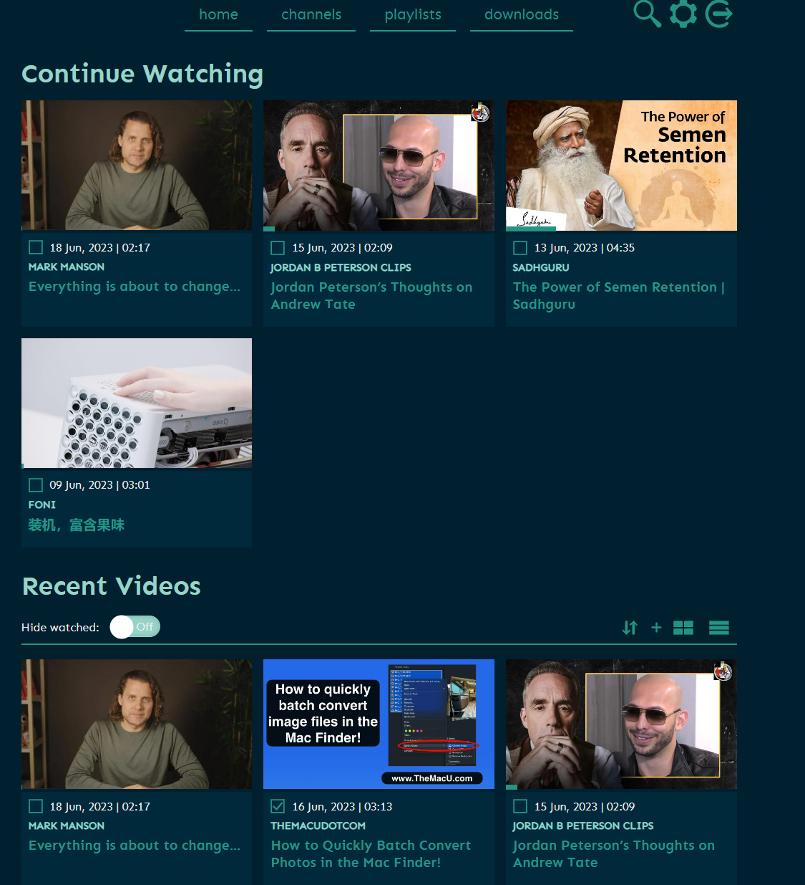

## 1. 前言

也许你和我一样，经常会在油管上寻找各种有趣、知识性的视频，但是

- **收藏太乱**知识太多，`不停在收藏，却从来没看过`
- **不会下载**想要`下载，总是很麻烦`
- **找视频困难** 随着收藏越来越多，想要找到特定的视频，非常困难
- **视频留档**如果作者删除了这个视频，那么你可能永远无法再看到这些精彩的视频了

今天，我就来介绍用Nas来自建TubeArchivist，帮助你，整理、搜索，离线观看你的油管视频


> 此教程需要，拥有外企学习环境或者人在国外，该教程不涉及该部分内容

---

## 介绍TubeArchivist

TubeArchivist 是一款能够让你订阅你最喜欢的YouTube频道，下载并对视频进行`索引`，使得它们变得可搜索的软件。它还可以播放视频，记录你观看和未观看的视频。

下面是TubeArchivist的主要功能：

- **订阅你最喜欢的YouTube频道（自动下载）**：只需输入频道的URL，TubeArchivist就会自动订阅这个频道并开始下载其视频。


- **下载视频**：TubeArchivist可以帮你下载你订阅的频道里的视频，这样你就可以离线观看了。
- **强大的搜索功能**：TubeArchivist会将你的视频收藏使用YouTube的元数据进行索引，这样你就可以方便地通过web界面进行搜索和整理。

**搜索标题**


**视频内容搜索！**


- **播放视频**：TubeArchivist不仅仅是一个视频管理工具，它还是一个视频播放器，可以直接播放你的收藏视频。
- **跟踪观看和未观看的视频**：TubeArchivist可以记录你观看过的视频和未观看的视频，帮助你更好地管理你的收藏。



**自动下载中文字幕**：TubeArchivist自动下载中文字幕，让你的学习不再受到语言的限制


**你甚至可以与emby jellyfin 联动**：TubeArchivist自动下载中文字幕，让你的学习不再受到语言的限制


TubeArchivist是一个强大的工具，可以让你更好地管理和享受你的YouTube视频收藏。


以下是一个关于如何搭建TubeArchivist的教程：

## 1. 重点

`点个免费关注`，不迷路

## 2. 安装Portainer

教程参考：
[30秒安装Nas必备神器 Portainer](/how-to-install-portainer-in-nas/)

##  3. File Station

File Station 打开docker 文件夹，创建`TubeArchivist`文件夹


## 4. 创建stack


## 5.  部署代码

```yaml
version: '3.3'

services:
  tubearchivist:
    container_name: tubearchivist
    restart: unless-stopped
    image: bbilly1/tubearchivist
    ports:
      - 18001:8000
    volumes:
      - /volume1/docker/tubeArchivist/media_data:/youtube
      - /volume1/docker/tubeArchivist/cache_data:/cache
    environment:
      - ES_URL=http://archivist-es:9200     # needs protocol e.g. http and port
      - REDIS_HOST=archivist-redis          # don't add protocol
      - HOST_UID=0
      - HOST_GID=0
      - TA_HOST=http://172.16.23.149:18001         # 设置你的nas ip，如果是域名，则设置域名
      - TA_USERNAME=tubearchivist           # web端账号
      - TA_PASSWORD=verysecret              # web端密码
      - ELASTIC_PASSWORD=verysecret         # set password for Elasticsearch
      - TZ=Asia/Shanghai                 # set your time zone
      - http_proxy=http://v2ray:11809   # 设置代理地址
      - no_proxy=archivist-es, archivist-redis  # 选择不代理内部es，redis容器
    depends_on:
      - archivist-es
      - archivist-redis

  archivist-redis:
    image: redis/redis-stack-server
    container_name: archivist-redis
    restart: unless-stopped
    expose:
      - "6379"
    volumes:
      - /volume1/docker/tubeArchivist/redis_data:/data
    depends_on:
      - archivist-es
  archivist-es:
    image: bbilly1/tubearchivist-es         # only for amd64, or use official es 8.7.0
    container_name: archivist-es
    restart: unless-stopped
    environment:
      - "ELASTIC_PASSWORD=verysecret"       # matching Elasticsearch password
      - "ES_JAVA_OPTS=-Xms512m -Xmx512m"
      - "xpack.security.enabled=true"
      - "discovery.type=single-node"
      - "path.repo=/usr/share/elasticsearch/data/snapshot"
    ulimits:
      memlock:
        soft: -1
        hard: -1
    volumes:
      - /volume1/docker/tubeArchivist/es_data:/usr/share/elasticsearch/data    # check for permission error when using bind mount, see readme
    expose:
      - "9200"
 # 涉及外部工具部分，此教程不赘述

```

1. 选择stack
2. name栏输入tubearchivist
3. edditor输入：上面代码
4. 点击deploy

## 6. 成功


## 7. 使用

浏览器进入程序：[ip]:[端口]

> ip为你nas所在ip（这里我的是172.16.23.149），端口为上面配置文件定义，如果你按照我的教程，则是18001


账号密码为compose文件设置

如果你没有修改，那么则是

账号：tubearchivist

密码：verysecret

## 8. 设置下载品质

**设置下载大小**


我这里设置的是比较小的品质：

```
bestvideo[height<=720]+bestaudio/best[height<=720]
```

meta语言(某些视频会设置国际化，如果有中文，则设置中文)

```
zh-CN
```

## 9. 设置字幕（重要）

油管大多为优质的外语资源，油管也贴心的做了，声译，和翻译字幕的功能，这一步则是设置这个过程


Subtitles download setting：设置字幕语言

```
zh-Hans
```

Subtitle source settings: 设置是否自动生成字幕（许多视频并没有内嵌中文字幕，这时候选择使用油管服务转译字幕

```
also download auto generated
```

Index and make subtitles searchable: 设置是否全文搜索到字幕，这个功能很强大，可以直接搜字幕内容，找视频，像这样：

```
enable
```


## 10. 使用

downloads 下载：


开始下载：


下载完成：


在线播放：


> 由于在线播放器并不支持字幕，如果想要看字幕，可以通过其他播放器，如果你有emby，jellyfin，plex可以自动联动


## 浏览器插件（可选）

google 插件市场搜索：

```
TubeArchivist Companion
```


**获取key** 


**配置插件**


**使用插件**


## 最后

最后想说：

`教育是真正消灭贫穷的关键`

`知识本该被更加高效的传播`

希望这个教程能让知识可以`突破地域和语言的限制`，人人都能享受到前言的知识，不同的文化，不一样的观念


如果你喜欢这篇文章，请记得点赞，收藏，并关注`全网唯一id：【老爸的数字花园】`，我们将会持续带来更多实用的自搭建应用指南。一起，让我们掌握自己的数据，创建自己的数字世界！

如果你在搭建过程中遇到任何问题，或者有任何建议，也欢迎在下方留言，一起探讨和学习。