Möchten Sie ein All-in-One-Familienleseerlebnis erreichen? Dieser Artikel zeigt Ihnen detailliert, wie Sie einen Audiobookshelf-Server auf Ihrem NAS bereitstellen können, um unbegrenzte eBooks, Hörbücher und Podcasts zu verwalten, den Fortschritt zu synchronisieren, auf verschiedenen Geräten zu hören und zu lesen - ein ultimatives Erlebnis, Schritt-für-Schritt-Anleitung, leicht verständlich!
<!--more-->

## Einführung

Möchten Sie ein All-in-One-Familienleseerlebnis erreichen? Dieser Artikel zeigt Ihnen detailliert, wie Sie einen Audiobookshelf-Server auf Ihrem NAS bereitstellen können, um unbegrenzte eBooks, Hörbücher und Podcasts zu verwalten, den Fortschritt zu synchronisieren, auf verschiedenen Geräten zu hören und zu lesen - ein ultimatives Erlebnis, Schritt-für-Schritt-Anleitung, leicht verständlich!

In dieser Ära, in der 3-minütige Videos als lang angesehen werden, um Informationsüberlastung zu vermeiden und innere Ruhe zu bewahren, sind Hörbücher und Podcasts für mich wichtige Kanäle, um Wissen und Unterhaltung zu erhalten.

Ich höre oft Hörbücher oder Podcasts während meines Arbeitswegs, beim Sport und sogar beim Zubereiten des Abendessens.

Der heutige Protagonist ist nicht nur ein leistungsstarkes privates Hörbuch- und Podcast-System, sondern kann auch alle Ihre Leseaufgaben übernehmen.

Heute zeige ich Ihnen, wie Sie alle Ihre Hörbücher und Podcasts an einem Ort zentralisieren und sie jederzeit auf jedem Gerät kostenlos anhören können.

Das ist Audiobookshelf, ein selbstgebauter Hörbuch- und Podcast-Server.


Und es gibt auch iOS- und Android-Telefonclients ~


---

## Vorstellung Audiobookshelf
Audiobookshelf ist nicht nur eine Hörbuch-Bibliothek, sondern bietet auch beeindruckende Funktionen.

- **Open Source**: Einschließlich Android- und iOS-Apps (derzeit in der Testphase), was bedeutet, dass Sie es frei anpassen können, um Ihren Bedürfnissen besser gerecht zu werden.
- **Vollständige Formatunterstützung**: Egal in welchem Audioformat, Audiobookshelf kann es reibungslos abspielen.
- **Podcast-Suche und -Download**: Sie können Podcasts suchen und hinzufügen, es werden automatisch aktualisierte Episoden heruntergeladen.
- **Unterstützung für mehrere Benutzer**: Mehrere Benutzer können es verwenden, jeder Benutzer hat seine eigenen Berechtigungseinstellungen, sodass Sie Ihre Bibliothek mit Ihrer Familie oder Freunden teilen können.
- **Fortschrittssynchronisierung**: Sie können an einem anderen Gerät dort weiterhören, wo Sie aufgehört haben, ohne sich die letzte Position merken zu müssen.
- **Echtzeitaktualisierungen**: Sobald Sie neue Hörbücher oder Podcasts hinzufügen, erkennt und aktualisiert Audiobookshelf die Bibliothek automatisch.
- **Massenupload**: Sie können einen gesamten Ordner auf einmal hochladen, sehr praktisch.
- **Datensicherung**: Keine Sorge um Datenverlust, Audiobookshelf führt täglich automatische Backups durch.
- **PWA-Unterstützung**: Sie können Audiobookshelf als Web-App auf Ihrem Telefon verwenden oder auf Chromecast übertragen.
- **Metadaten- und Coverbildabfrage**: Ruft automatisch Metadaten und Coverbilder von verschiedenen Quellen ab.
- **Leistungsstarke Navigationsfunktionen**: Suchen Sie Kapitel über die Audnexus API und bearbeiten Sie auch selbst Kapitelinformationen.
- **Zusammenführen von Audiodateien**: Sie können mehrere Audiodateien zu einer m4b-Datei zusammenführen, um sie einfach zu verwalten und anzuhören.
- **Grundlegende eBook-Unterstützung und Leser**: Sie können eBooks darauf lesen, aber natürlich sind die Hauptfunktionen immer noch Hörbücher und Podcasts.

Das sind alle Funktionen von Audiobookshelf, als nächstes werden wir mit dem Aufbau beginnen.


---

Hier ist mein Versuch einer fließenden Übersetzung ins Deutsche:

Einrichtungsschritte:

## 1. Schlüsselpunkte   

"Folgen Sie kostenlos", um nicht den Überblick zu verlieren.

## 2. Portainer installieren  

Siehe Anleitung:   
[30 Sekunden Installation des unverzichtbaren NAS-Tools Portainer](/how-to-install-portainer-in-nas/)

## 3. File Station

Öffnen Sie in der File Station den Docker-Ordner und erstellen Sie einen Ordner namens "audiobookshelf".

### Erstellen Sie die Verzeichnisse in der folgenden Reihenfolge:

1. Erstellen Sie einen Ordner namens "audiobookshelf" im Docker-Ordner.

2. Erstellen Sie im neu erstellten "audiobookshelf"-Ordner die folgenden Unterverzeichnisse:

   - audiobooks  
   - podcasts
   - config
   - metadata

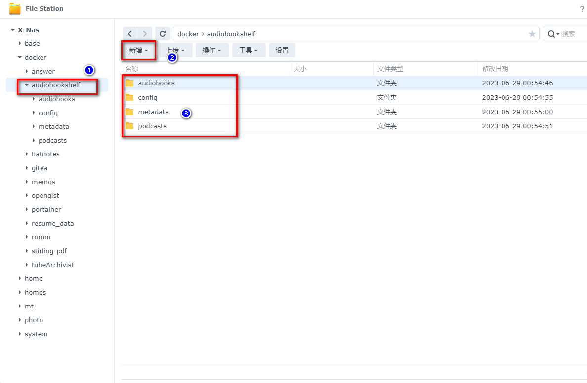


## 4. Stack erstellen


## 5. Code bereitstellen

```yaml
version: "3.7"
services:
  audiobookshelf:
    image: ghcr.io/advplyr/audiobookshelf:latest
    container_name: audiobookshelf
    ports:
      - 13378:80
    volumes:
      - /volume1/docker/audiobookshelf/audiobooks:/audiobooks
      - /volume1/docker/audiobookshelf/podcasts:/podcasts
      - /volume1/docker/audiobookshelf/config:/config
      - /volume1/docker/audiobookshelf/metadata:/metadata
    restart: unless-stopped
```

1. Wählen Sie den Stack aus.
2. Geben Sie "audiobookshelf" in das Namensfeld ein.
3. Fügen Sie den Code in den Editor ein.
4. Klicken Sie auf "Bereitstellen".

## 6. Erfolg


## 7. Verwendung

Greifen Sie über den Browser auf die App zu: [IP]:[Port]

> Die IP ist die IP-Adresse Ihres NAS (in meinem Fall 192.168.2.22) und der Port ist der in der obigen Konfigurationsdatei definierte Port. Wenn Sie meiner Anleitung gefolgt sind, wäre es 13378.

Legen Sie ein Passwort fest


## 8. Hörbücher/eBooks


### Sprache auf Deutsch einstellen

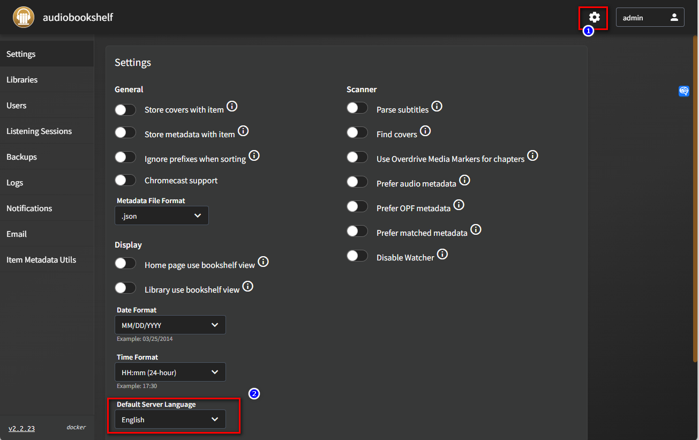

### Medienbibliothek einrichten


### Buch oder Hörbuch einrichten


### Podcast einrichten
1. Medientyp: Podcast   
2. Medienbibliothek (Benutzerdefiniert)
3. Ordner (audiobooks)


### Startseite schön gestalten (Holzbücherregal-Design)

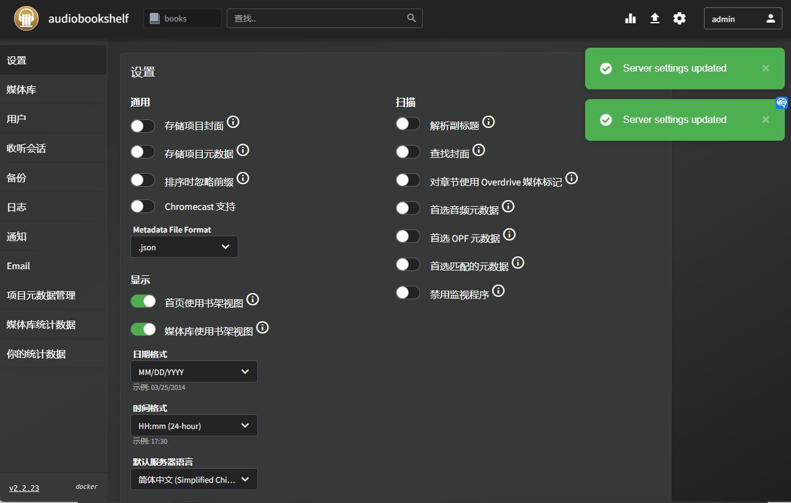


### Hochladen lokaler Ressourcen (Massenupload)

Kopieren Sie lokale Ressourcen in den Hörbuchordner


### Hochladen lokaler Ressourcen über die Web-Oberfläche (Einzelupload)

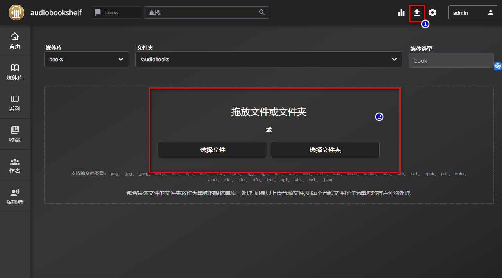

### Starten Sie den Scan

Lassen Sie das System zuerst die Regeln für die Bücher abgleichen


### Manueller Scan

Da die Benennung nicht standardisiert ist oder die entsprechenden Bücher nicht in Google Books aufgeführt sind, muss ich die Bücher manuell scannen.

1. Wählen Sie ein Buch, bearbeiten Sie es

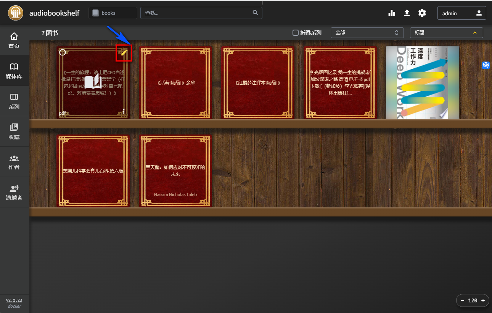

2. Im Übereinstimmungsfeld wird durch Korrektur des Titels die Buchinformation gefunden.

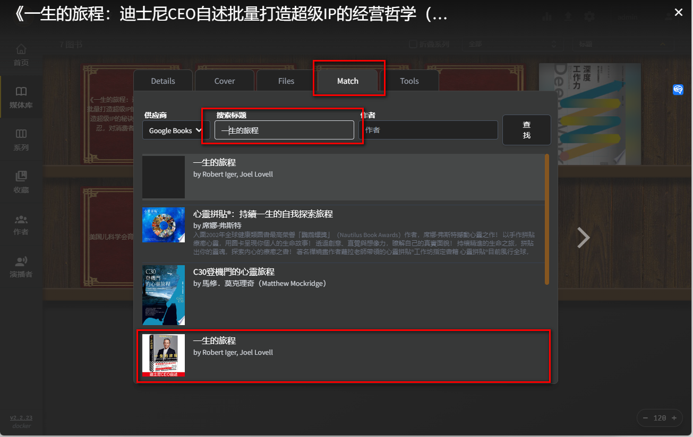

3. Nach Bestätigung aller korrekten Informationen absenden.


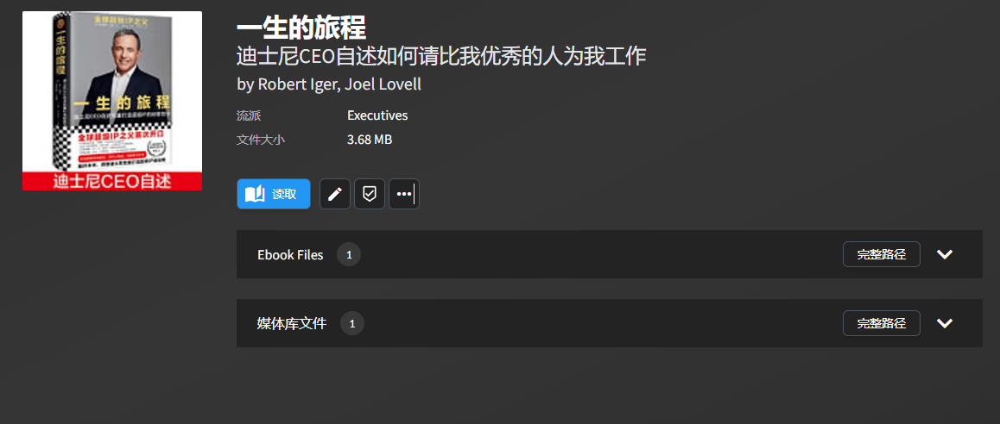


4. Noch nicht perfekt, da der Scanner, den wir verwenden, `Google Books` ist, der chinesische Verlagsbücher nicht vollständig unterstützt. Mein OCD-Level steigt! Verwenden Sie den englischen Namen zur Suche.

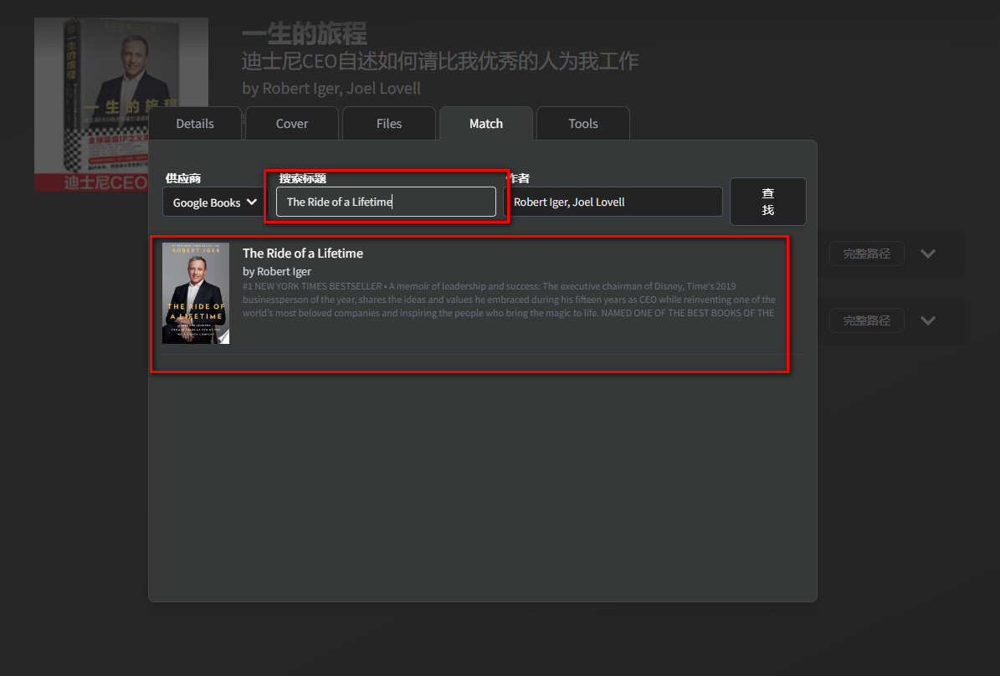

Tatsächlich sind die Zusammenfassungen verfügbar.

Das macht mich komfortabler.


Obwohl es wie Englisch aussieht, beeinflusst es mich nicht. Ich versuche immer, meine Umgebung auf Englisch einzustellen (um mein Englisch zu verbessern).


## 9. Podcast-Download (Mein Favorit)

Ich bin schon immer ein Podcast-Liebhaber und genieße die Realität und Tiefe von Podcasts.

Die Such-, automatische Abonnement- und Download-Funktionen von audiobooksshelf machen mich sehr glücklich. Mit ihr kann ich meinen ursprünglichen Podcast-Downloader podgrab ersetzen.


Ohne viel Aufhebens wechseln wir zuerst die Medienbibliothek und suchen nach Bloggern, die uns gefallen.


Absenden und wenn Sie möchten, dass die Episoden automatisch heruntergeladen werden, können Sie das Kästchen für den automatischen Download aktivieren.

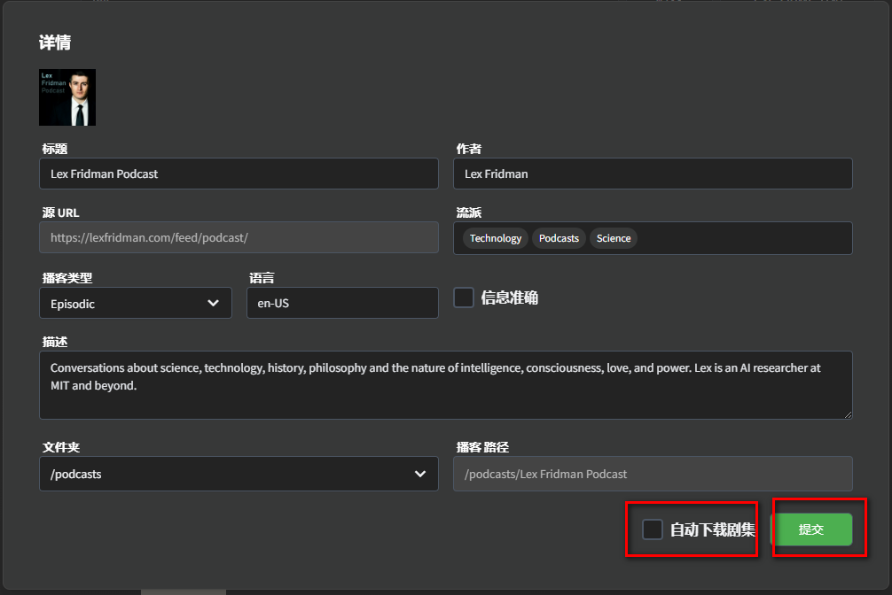

Suchen Sie nach den Episoden, die Sie hören möchten.

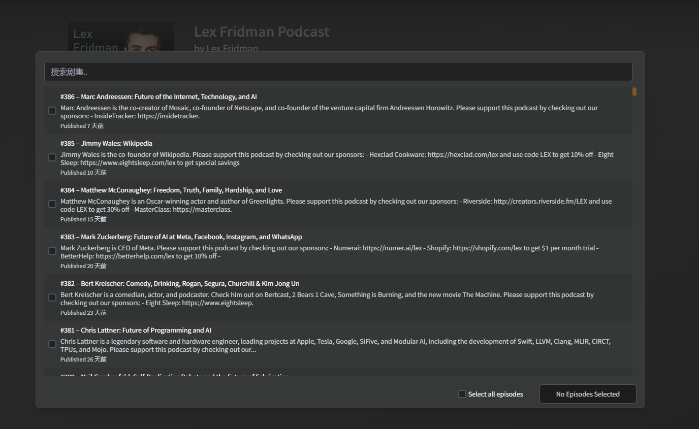


Beginnen Sie mit der Wiedergabe, nachdem der Download abgeschlossen ist.

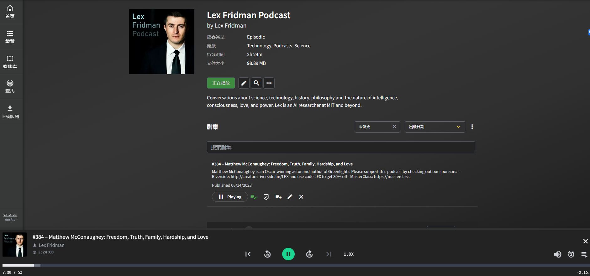


> Es kann zu Download-Fehlern aufgrund von Netzwerkproblemen kommen.

Da die Ressourcenbibliothek iTunes ist, gibt es auch viele hochwertige chinesische Podcasts zur Auswahl.


## 10. Mobile App

Die offiziellen Android- und iOS-Clients sind verfügbar (auf ihrer eigenen Website), für iOS ist eine Teilnahme an TestFlight erforderlich.

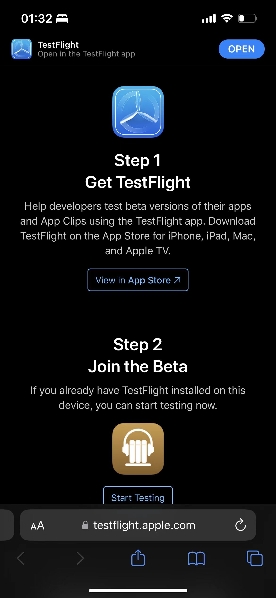


Geben Sie das Passwort und den Benutzernamen ein, wenn Sie herunterladen, verbinden Sie sich mit Ihrer IP des NAS-Servers.

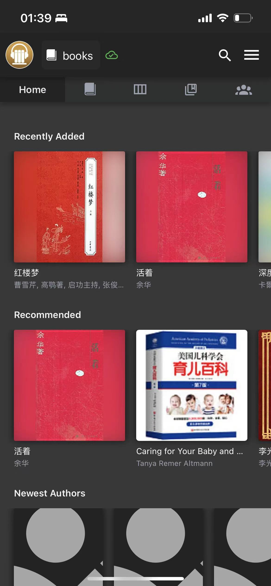


PodCast

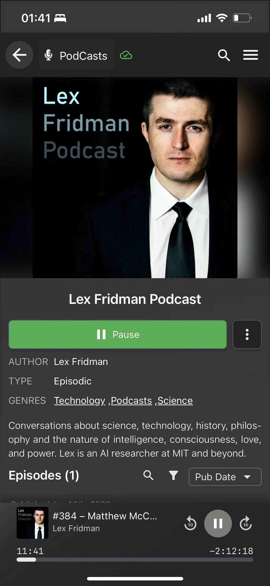


## 11. Achtung

Wenn Sie Ihren Lesefortschritt verfolgen möchten, sollten die von Ihnen importierten Bücher nicht im mobi- oder awz3-Format (Amazon-Format) sein.


## Schließlich

In diesem Zeitalter der Informationsüberflutung und des Lärms sind Hörbücher und Podcasts gute Möglichkeiten, um innere Ruhe zu finden, und ich hoffe, Ihnen haben die heutigen kleinen Spielzeuge gefallen.

Zuletzt möchte ich die von mir verwendeten Geräte vorstellen: 1 Synology 918, 1 QNAP, 1 PVE-Server. Ich empfehle Anfängern wie mir nicht, mit so vielen Geräten herumzuspielen. Ich empfehle Anfängern, entweder Synology oder QNAP zu wählen.

Synology 923 + (neuestes Modell): Synology hat mit seinem benutzerfreundlichen System und minimalem Aufwand ein unersetzliches Bild in den Köpfen vieler Benutzer geschaffen.
Dieses Modell ist ziemlich leistungsstark und für die meisten Benutzer ausreichend. Mit einem Intel J4125 4-Kern-4-Thread-Prozessor kann es mehrere Aufgaben ohne Verlangsamung bewältigen. Die maximalen 9 SATA-Laufwerksschächte bieten ausreichend Speicherplatz. Sie können einen Schacht für eine SATA-SSD zur Installation des Systems und von Apps verwenden und zwei Schächte für Caching-SSDs zur erheblichen Verbesserung der I/O-Leistung verwenden.

QNAP TS-464C: Nach Synology kann auch QNAP erwähnt werden. Es ist ebenfalls ein Hersteller mit langer Tradition, fast 10 Jahre alt.
Dies ist das neueste 4-Bay-Flaggschiff-NAS von QNAP mit 4 3,5-Zoll-Schächten und 2 NVMe-SSD-Schächten. Der Prozessor verwendet Intel Celeron N5095, der die Leistung um 30% gegenüber dem vorherigen J4125-Prozessor verbessert. Die Grafikleistung steigt um bis zu 300%. Es unterstützt den Intel OpenVINO AI-Engine und verbessert die AI-Erkennungsleistung um 41,7%. Darüber hinaus unterstützt es die Installation von Google EDGE TPU-KI-Modulen, um die AI-Berechnungsleistung vollständig zu verbessern. Es ist erwähnenswert, dass QNAP-SSDs als Speicher-Pools und -Volumes verwendet werden können und für PT- und 24/7-Anwendungsfälle besser geeignet sind.

Ich hoffe, Ihnen hat dieser Artikel gefallen. Bitte geben Sie ihm ein Like, speichern Sie ihn und folgen Sie【NasDaddy】, um weitere nützliche DIY-App-Anleitungen zu erhalten. Gemeinsam nehmen wir unsere Daten in die Hand und schaffen unsere eigenen digitalen Welten!

Wenn Sie während des Einrichtungsprozesses Fragen oder Vorschläge haben, können Sie gerne einen Kommentar hinterlassen, um gemeinsam zu diskutieren und voneinander zu lernen.