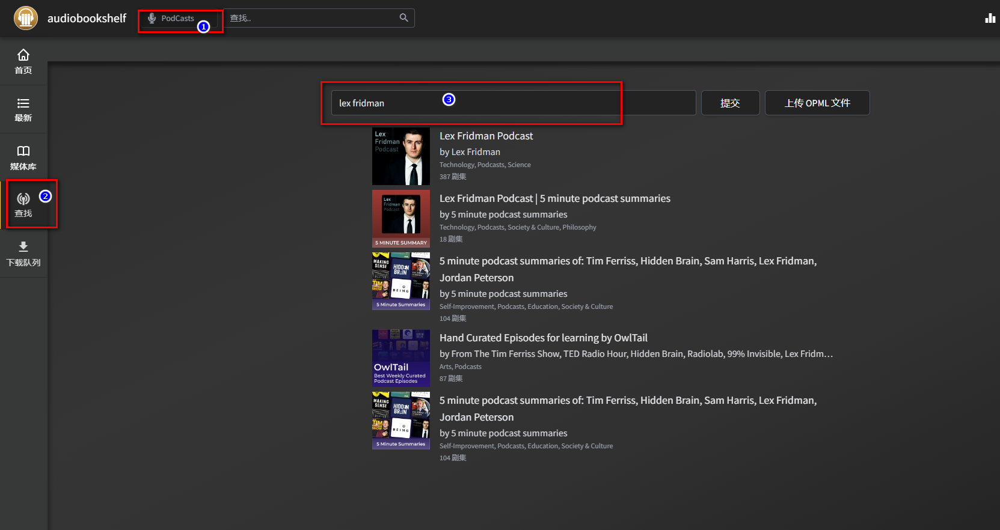

想实现家庭一站式阅读体验?本文详细教你在NAS上部署AudioBookshelf 服务器,管理无限电子书、有声书和播客,同步进度,跨设备随听随读,极致体验,手把手教学,简单易懂!
<!--more-->

## 前言

在这个3分钟视频都嫌弃长的时代下，为了避免信息过载，保持内心的平静，有声书籍和播客成为了我知识和娱乐的重要途径。

我常常在通勤、健身、甚至在准备晚饭的时候都喜欢听有声书或播客。

而今天的主角，不仅仅是一个强大的私有有声书和播客的系统，同时它还可以承担你所有的阅读任务

今天我就来教大家如何将所有的有声书和播客，电子书集中在一个地方，并且可以在任何设备上随时收听，而且是完全免费的

这就是Audiobookshelf，一个自我搭建的有声书和播客服务器


而且，还有ios和安卓手机端哦~


---

## 介绍audiobookshelf

Audiobookshelf不仅仅是一个有声书库，它还充满了一系列令人印象深刻的功能。

- **开放源代码**：包括 Android 和 iOS 应用（目前在测试阶段），这意味着你可以自由修改它，使其更符合你的需求。
- **全格式支持**：无论你的音频格式是什么，Audiobookshelf都能流畅地播放。
- **播客搜索和下载**：你可以搜索并添加播客，它将自动下载更新的剧集。
- **多用户支持**：可以有多个用户使用，每个用户都有自己的权限设置，因此你可以和你的家人或朋友分享你的书库。
- **进度同步**：你在一个设备上听到哪里，换个设备接着听，不需要记住上次的进度。
- **实时更新**：只要你添加新的有声书或播客，Audiobookshelf会自动检测并更新库。
- **批量上传**：你可以一次性上传一整个文件夹，非常方便。
- **数据备份**：不用担心丢失数据，Audiobookshelf会自动进行每日备份。
- **PWA支持**：你可以把Audiobookshelf作为一个web应用在手机上使用，或者投屏到Chromecast上。
- **元数据和封面获取**：自动从多个来源获取元数据和封面图片。
- **强大搜刮功能**：通过Audnexus API进行章节查找，你也可以自己编辑章节信息。
- **合并音频文件**：你可以把多个音频文件合并成一个m4b文件，方便管理和收听。
- **基础电子书支持和阅读器**：你可以在上面阅读电子书，当然，主要功能还是有声书和播客。

这就是Audiobookshelf的全部功能，接下来我们要开始动手搭建了。


---

搭建步骤：

## 1. 重点

`点个免费关注`，不迷路

## 2. 安装Portainer

教程参考：[30秒安装Nas必备神器 Portainer](/how-to-install-portainer-in-nas/)

##  3. File Station

File Station 打开docker 文件夹，创建`audiobookshelf`文件夹

### 依次新建目录

1. docker目录下创建audiobooksshelf
2. audiobooksshelf目录（新建好的）依次创建：
   - audiobooks
   - podcasts
   - config
   - metadata


## 4. 创建stack


## 5.  部署代码

```yaml
version: "3.7"
services:
  audiobookshelf:
    image: ghcr.io/advplyr/audiobookshelf:latest
    container_name: audiobookshelf
    ports:
      - 13378:80
    volumes:
      - /volume1/docker/audiobookshelf/audiobooks:/audiobooks
      - /volume1/docker/audiobookshelf/podcasts:/podcasts
      - /volume1/docker/audiobookshelf/config:/config
      - /volume1/docker/audiobookshelf/metadata:/metadata
    restart: unless-stopped
```

1. 选择stack
2. name栏输入audiobookshelf
3. edditor输入：上面代码
4. 点击deploy

## 6. 成功


## 7. 使用

浏览器进入程序：[ip]:[端口]

> ip为你nas所在ip（这里我的是192.168.2.22），端口为上面配置文件定义，如果你按照我的教程，则是13378

设置密码


## 8. 有声/无声书籍

### 设置中文


### 设置媒体库


### 设置图书或者有声读物


### 设置博客

1. 媒体类型：博客
2. 媒体库（自定义）
3. 文件夹选择（audiobooks）


### 让首页好看一点先（设置木纹书架）


### 上传本地资源（批量上传）

将本地资源拷贝至audiobooks


### 网页端上传本地资源（单独上传）


### 开始搜刮

先让系统匹配一下规则的图书


### 手动搜刮

因为命名不规范或者google图书中并没有相关图书，这时候强迫症就需要手动搜刮了

1. 选择图书，编辑


2. 在match中，将标题修正一下就找到了图书的信息


3. 确认无误提交


4. 还是不太完美，因为我们用的搜刮是`google book`，对中文出版书籍，支持的并不全，都`没有摘要`。强迫症升级！用英文名搜


果然，摘要都有

这样就舒服了


虽然看起来是英文，但是并不影响，我一直在试图让自己的环境变成英文（提升英语水平）


## 9. PodCast下载（我的最爱）

我一直是podcast的爱好者，喜欢podcast的真实，有深度。

audiobooksshelf的搜索，自动订阅下载功能，让我非常喜欢，有了它，我可以替换掉原来我用于下载podcast的podgrab了


废话不多说，首先我们先切换媒体库，搜索自己喜欢的博主



提交，如果你想自动下载，可以勾选自动下载剧集


搜索你想要听的episodes


下载完成，开始播放


> 下载过程可能存在失败，可能与网络有关

因为资源库是itunes，所以也有许多中文优质的podcast可以选择


## 10. 手机端

官方提供了专属的Android 和 IOS 客户端（自行官网）， ios需要加入testflight


下载好后，连接自己的nas服务器地址，输入账号密码


播客页面


## 11. 注意事项

最后如果你想要追踪读书的进度，你导入的图书，不能是mobi和awz3（亚马逊的格式）


## 最后

最后，在这个信息过载，喧嚣的时代里，无论是有声书还是播客，都是很好的方式，让我们的内心更加平静，希望大家能喜欢今天的小玩具

最后介绍一下我的设备，1白裙，1威联通，1蜗牛，1pve服务器，不建议小白和我一样折腾，比较推荐新手玩家，选择白裙或者威联通


1. 群晖923+（最新）：群晖以系统的易用性，少折腾，在众多玩家心中留下了不可撼动的形象

   这款性能比较强悍，足够绝大多数用户使用，Intel J4125 4核心4线程，即使同时应对多个任务也不会显得乏力，最大9个SATA硬盘位使得储存空间非常宽裕，完全可以腾出来一个硬盘位放SATA SSD用于安装系统及套件，两个用于加速缓存的M.2 SSD让系统的I/O性能大幅提升

   

2. 威联通TS-464C：除了群晖，那就数得上威联通了，也是老牌nas厂商，是一家将近10年的老牌厂商

   这款威联通全新4盘位旗舰NAS，有4个3.5英寸盘位和2个NVMe SSD盘位，处理器采用Intel 赛扬N5095，比上代J4125处理器性能提升30%左右，显卡性能提升至300%，支持Intel OpenVINO AI引擎，AI识别性能提升41.7%。此外还支持安装Google EDGE TPU人工智能模块，全方位提升AI算力。值得一提的是，威联通SSD可以作为存储池、存储卷使用，更适合PT、挂机等玩法。


好了，如果你喜欢这篇文章，请记得点赞，收藏，并关注【老爸的数字花园】，我们将会持续带来更多实用的自搭建应用指南。一起，让我们掌握自己的数据，创建自己的数字世界！

如果你在搭建过程中遇到任何问题，或者有任何建议，也欢迎在下方留言，一起探讨和学习。

