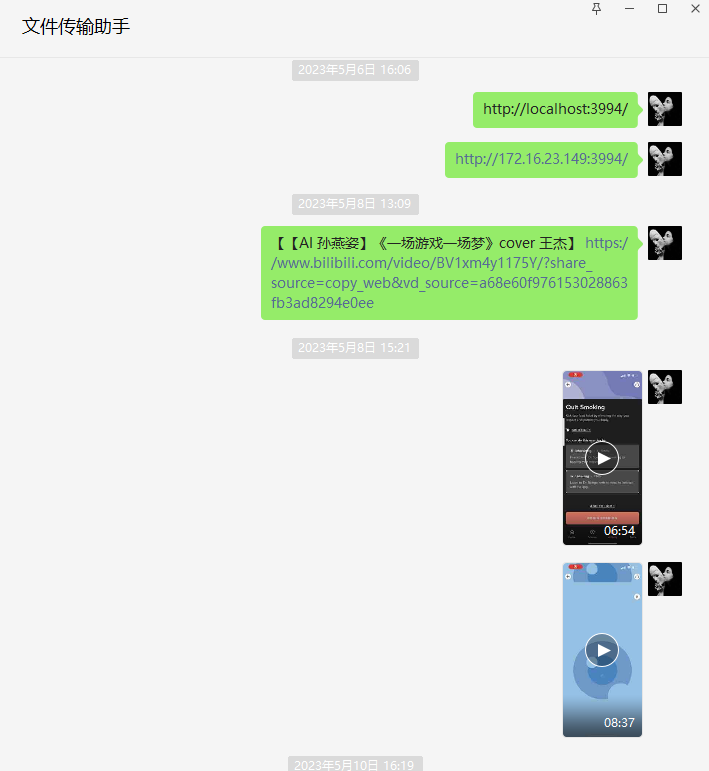
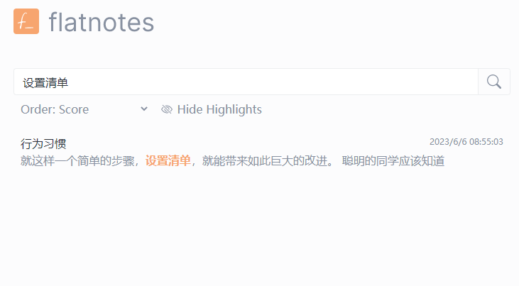
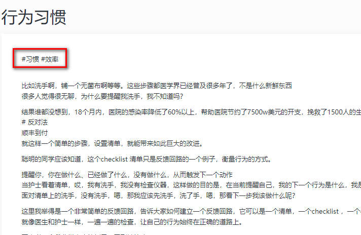
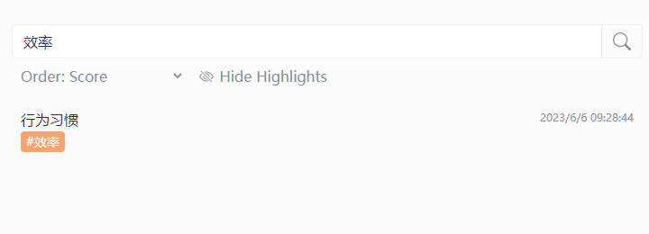
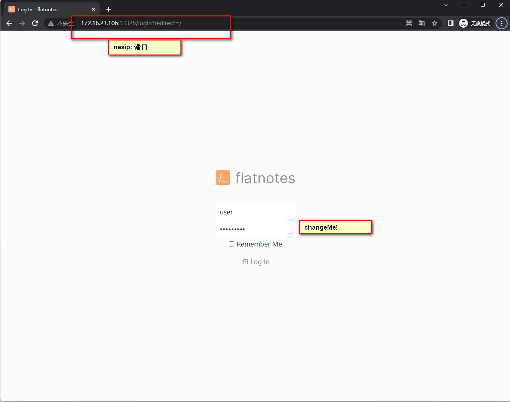
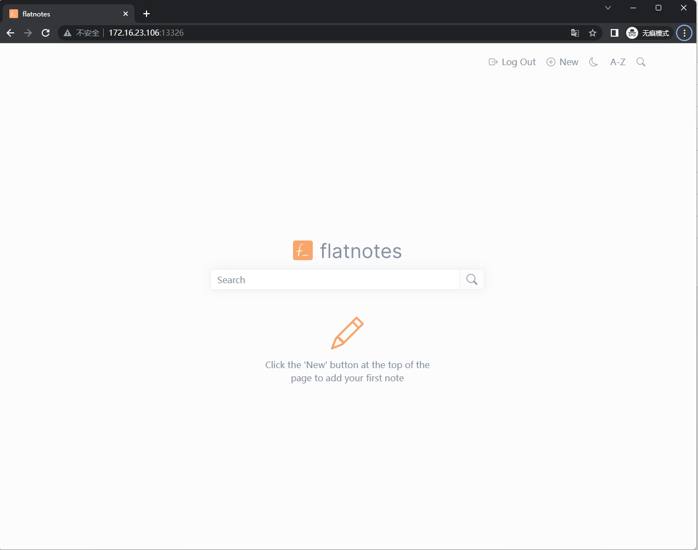

## 1. Einführung

Es gibt unzählige Notiz-Apps, wie Apple Notes, Evernote, Obsidian, Notion... sogar WeChats Dateiübertragungsassistent.



Sie alle haben ihre eigenen Vor- und Nachteile:

- Langsame Geschwindigkeit und erfordert eine Internetverbindung (Notion)
- Integrierte Notiz-App auf Smartphones (unterstützt kein Markdown, nicht geeignet für lange Texte)
- Klobig und Daten werden in der Cloud gespeichert (Notion, Evernote)
- Nicht in der Lage, Notizen jederzeit aufzuzeichnen (Evernote)

Der heutige Protagonist ist `Flatnotes`, eine einfache, fokussierte, privat gehostete App mit Dual-Editoren für Markdown und Rich Text sowie Volltextsuche.

---

- ## Einführung in Flatnotes

  Flatnotes ist eine leistungsstarke und einfache, fokussierte Notiz-App.

  ### 1. Markdown/Rich Text `Dual Editor`

  Es bietet sowohl den Modus für die Bearbeitung von Roh-Markdown als auch den WYSIWYG (What You See Is What You Get)-Markdown-Bearbeitungsmodus.

  


  ### 2. Erweiterte Suche

  Mit der `erweiterten Suchfunktion` von Flatnotes können Sie Ihre Notizen leicht finden, ohne manuell durch eine große Anzahl von Notizen suchen zu müssen.

  

  ### 3. Benutzerdefinierte Tags

  Mit der Tagging-Funktion können Sie Ihre Notizen besser organisieren und kategorisieren. Fügen Sie einfach einen oder mehrere `Tags` hinzu, um bestimmte Notizen leicht zu finden.

  

  

  ### 4. Helle/Dunkle Themes

  Flatnotes bietet sowohl `helle als auch dunkle Themes`, um Ihren Vorlieben gerecht zu werden und Ihre Augen auch nach langfristiger Nutzung zu schonen.

  

---

Lassen Sie uns Schritt für Schritt einrichten:

## 1. Schlüsselpunkte

`Folgen Sie kostenlos`, um auf dem Laufenden zu bleiben

## 2. Portainer installieren

Tutorial-Referenz:
[30-Sekunden-Installation von Portainer, einem unverzichtbaren Tool für NAS](/how-to-install-portainer-in-nas/)

##  3. File Station

Öffnen Sie die File Station und erstellen Sie einen Ordner `flatnotes` im Docker-Ordner.


## 3. Stack erstellen


## 4. Stack erstellen

```yaml
version: "3"

services:
  flatnotes:
    container_name: flatnotes
    image: dullage/flatnotes:latest
    environment:
      FLATNOTES_AUTH_TYPE: "password" # Passwortmodus (optional: None für kein Passwort, TOTP)
      FLATNOTES_USERNAME: "Benutzer"
      FLATNOTES_PASSWORD: "changeMe!" # Passwort kann geändert werden
      FLATNOTES_SECRET_KEY: "eineLangeZufälligeZeichenfolge"
    volumes:
      - "/volume1/docker/flatnotes:/app/data"
      # - "./index:/app/data/.flatnotes"  
      # Optional: vorhandenes Notizverzeichnis angeben
    ports:
      - "13326:8080" # Benutzerdefinierter Port, verwenden Sie einen anderen Port als andere
    restart: unless-stopped
```

1. Stack auswählen
2. "flatnotes" im Namensfeld eingeben
3. Den obigen Code in den Editor eingeben
4. Auf "Bereitstellen" klicken

## 5. Erfolg


## 6. Verwendung

1. Öffnen Sie das Programm in Ihrem Browser: [IP]:[Port]

> Die IP-Adresse für Ihr NAS ist die IP-Adresse, an der sich Ihr NAS befindet (in diesem Fall ist meine 172.16.23.106), und der Port wird in der obigen Konfigurationsdatei definiert. Wenn Sie meinem Tutorial gefolgt sind, wäre es 13326.



## 7. Viel Spaß



## Abschließend

Wenn Ihnen dieser Artikel gefallen hat, denken Sie bitte daran, ihn zu liken, zu bookmarken und [Dad's Digital Garden](https://nasdaddy.com) zu folgen. Wir werden Ihnen weiterhin praktische Anleitungen zur Selbstinstallation von Anwendungen bieten. Gemeinsam nehmen wir unsere Daten in die Hand und erschaffen unsere eigene digitale Welt!

Wenn Sie während des Einrichtungsprozesses auf Probleme stoßen oder Vorschläge haben, hinterlassen Sie bitte einen Kommentar. Lassen Sie uns gemeinsam erkunden und lernen.