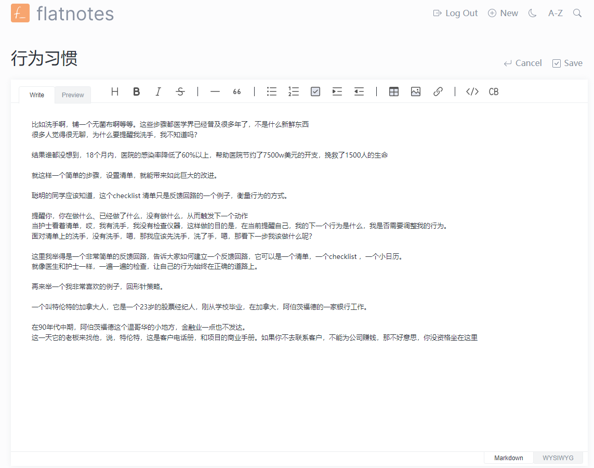
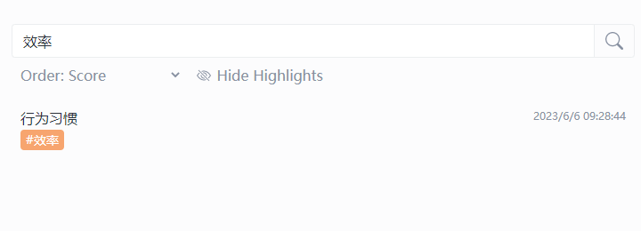
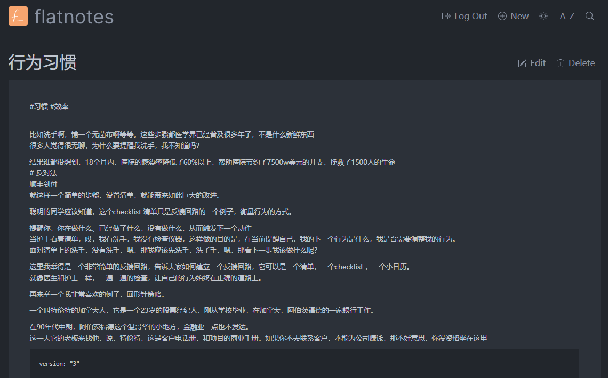
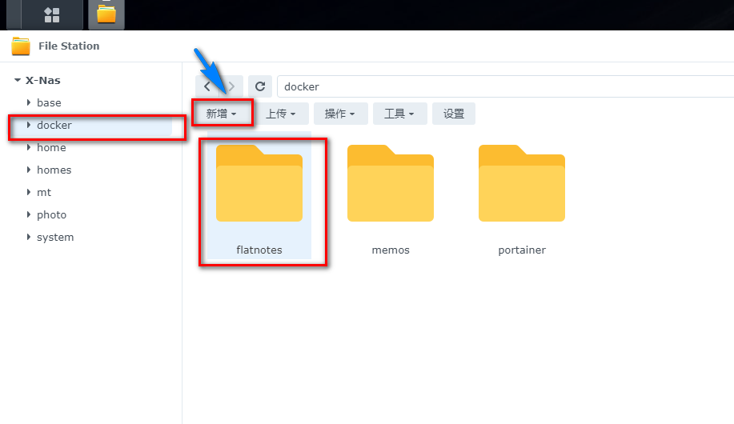
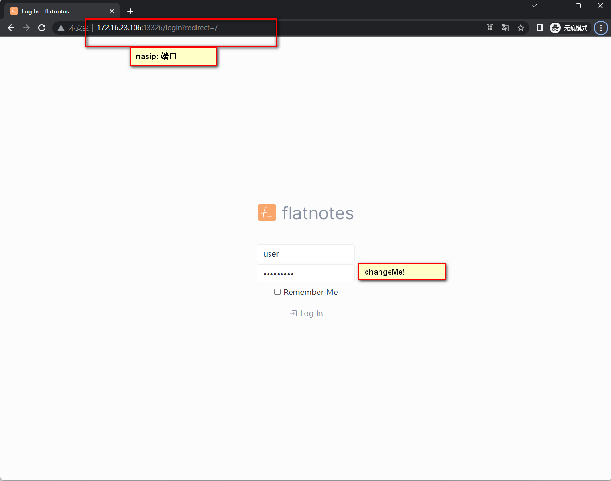
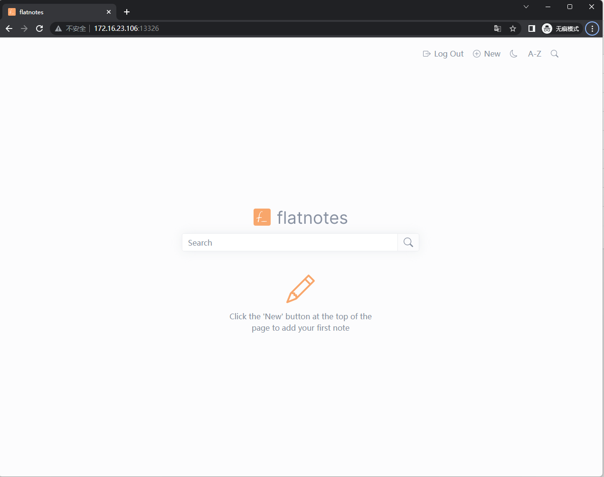

## 1. 前言

笔记软件千千万，apple note, 印象笔记，obsidian，notion...甚至微信的文件传输助手


他们或多或少都有很多缺点，要不需要

- 速度慢需要联网（notion）
- 手机自带note（不支持markdown，长文不适合）
- 臃肿，数据在云端（notion，印象笔记）
- 无法随时记录（印象笔记）

今天的主角`Flatnotes`，简洁，专注，私有部署，markdown以及富文本双编辑器，全文搜索

---

- ## 介绍Flatnotes

  Flatnotes是一款强大且简洁，专注的笔记应用。

  ### 1. markdown/富文本`双编辑器`

  它提供了原始Markdown编辑模式和所见即所得（WYSIWYG）的Markdown编辑模式。

  


  ### 2. 高级搜索

  通过Flatnotes的`高级搜索`功能，你可以轻松找到你的笔记，不再需要在大量的笔记中手动寻找。

  

  ### 3. 自定义tag

  通过标签功能，你可以更好地组织和分类你的笔记。只需添加一个或多个`标签`，就可以轻松找到特定的笔记。

  

  

  ### 4. Light/dark 主题

  根据你的喜好，Flatnotes提供了`亮色和暗色主题`，让你的眼睛在长时间使用后也能保持舒适。

  

---

让我们一步步搭建吧：

## 1. 重点

`点个免费关注`，不迷路

## 2. 安装Portainer

教程参考：
[30秒安装Nas必备神器 Portainer](/how-to-install-portainer-in-nas/)

##  3. File Station

File Station 打开docker 文件夹，创建`flatnotes`文件夹



## 3. 创建stack


## 4. 创建stack

```yaml
version: "3"

services:
  flatnotes:
    container_name: flatnotes
    image: dullage/flatnotes:latest
    environment:
      FLATNOTES_AUTH_TYPE: "password" # 密码模式 可选（None无密码，TOTP）
      FLATNOTES_USERNAME: "user"
      FLATNOTES_PASSWORD: "changeMe!" # 密码可自行修改
      FLATNOTES_SECRET_KEY: "aLongRandomSeriesOfCharacters"
    volumes:
      - "/volume1/docker/flatnotes:/app/data"
      # - "./index:/app/data/.flatnotes"  
      # 可选项，可指定原有的笔记目录
    ports:
      - "13326:8080" # 自定义端口，使用有别于其他的端口
    restart: unless-stopped
```

1. 选择stack
2. name栏输入flatnotes
3. edditor输入：上面代码
4. 点击deploy

## 5. 成功


## 6. 使用

1. 浏览器进入程序：[ip]:[端口]

> ip为你nas所在ip（这里我的是172.16.23.106），端口为上面配置文件定义，如果你按照我的教程，则是13326



## 7. Enjoy



## 最后

如果你喜欢这篇文章，请记得点赞，收藏，并关注【老爸的数字花园】，我们将会持续带来更多实用的自搭建应用指南。一起，让我们掌握自己的数据，创建自己的数字世界！

如果你在搭建过程中遇到任何问题，或者有任何建议，也欢迎在下方留言，一起探讨和学习。