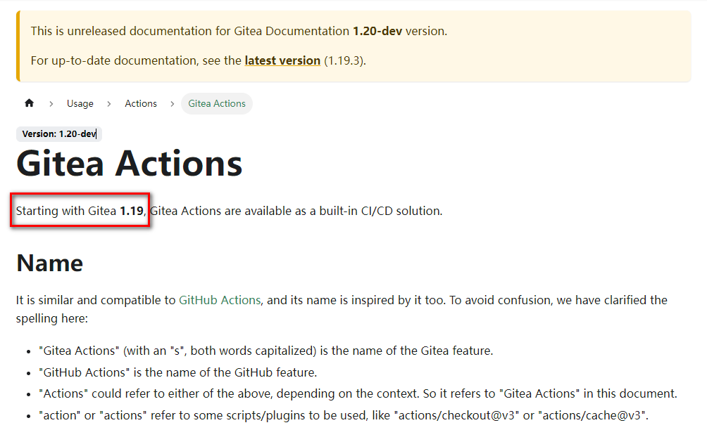
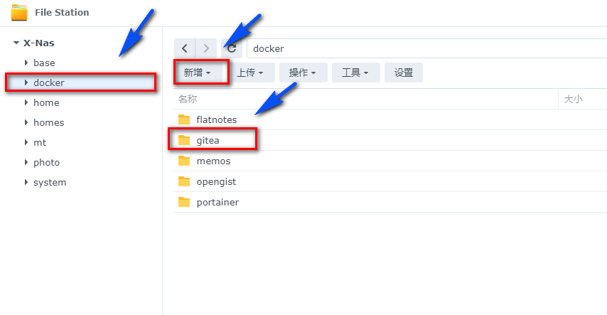
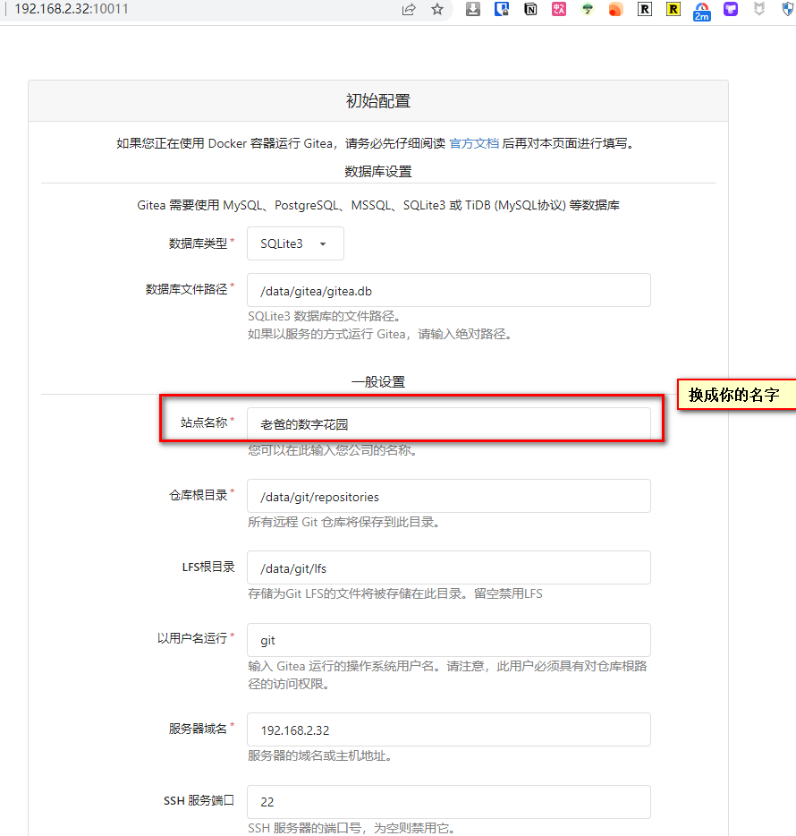
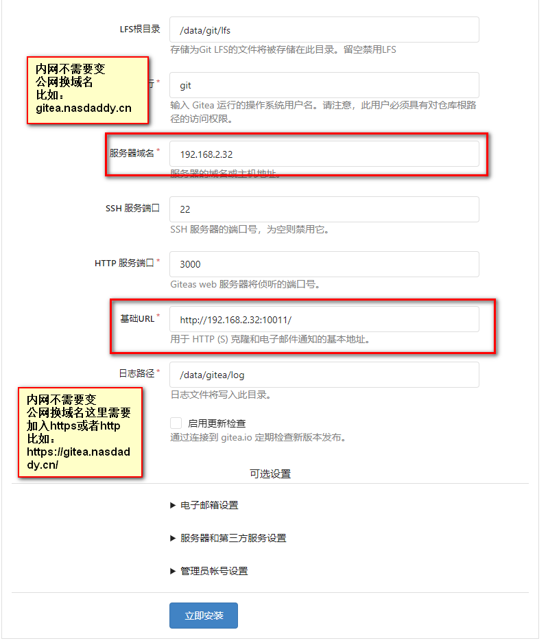
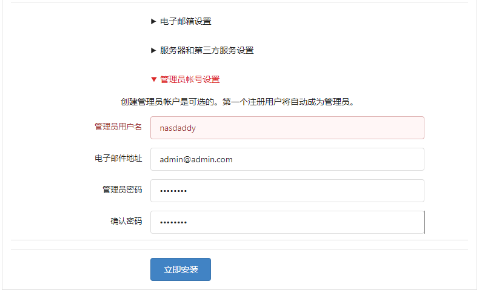
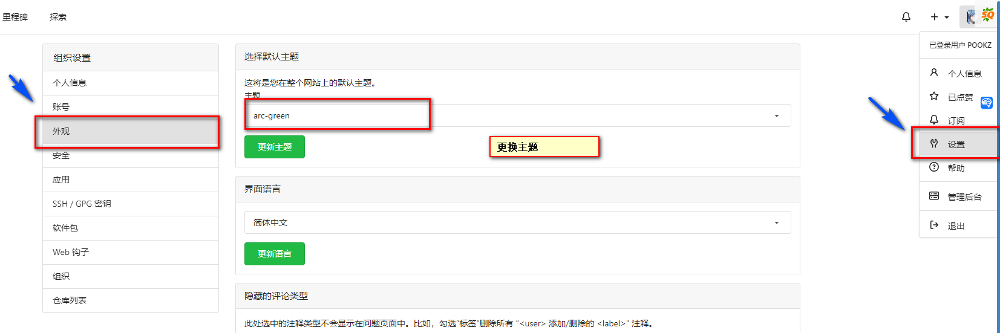
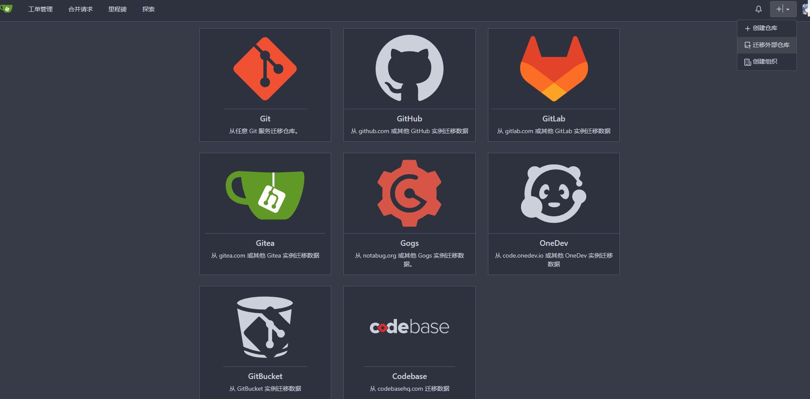

## 1. Introduction

If you are a Python developer who is passionate about various projects or an individual who loves to share creations, you may need a platform that allows you to track versions and collaborate easily. In such cases, you might use public cloud services like GitHub (the unpredictable power), Gitee, or GitLab. However, you may be concerned about data security and prefer to have everything under your control. So, how can you meet all these requirements? The answer is `Gitea`, a powerful, lightweight, and self-hosted Git service.

---

## Introducing Gitea

Gitea is an open-source Git service that can be understood as a self-hosted GitHub. Gitea supports self-hosting, which means you can deploy and run Gitea on your own server. It provides a clean and user-friendly interface that allows users to create, clone, and manage their repositories. In particular, Gitea is designed to be simple and lightweight, enabling it to run on various platforms and environments.


Compared to similar software, Gitea has the following features:

- **Lightweight**: Gitea is a very lightweight application that requires minimal system resources to run. This makes it ideal for personal or small team use. With 3 years of running and 251 projects, its resource consumption is so low that even a snail can handle it.


- **Self-hosted**: Gitea can be run on your own server, giving you full control over your data and services. You don't have to worry about issues with third-party services, such as data loss or service shutdown.
- **User-friendly**: Gitea provides a user-friendly interface that allows you to easily manage your code. Whether you are a programmer or a non-programmer, Gitea can help you efficiently complete your work.
- **Open-source**: Gitea is an open-source project, which means you can view its source code and even modify it according to your own needs.

Starting from version 1.91, Gitea supports the Action feature. This is a powerful feature that automates your development workflow, such as automatic building, testing, and deploying of your code.



---

Next, let's go through the specific setup steps:

## 1. Key Point

"Follow for free" to avoid getting lost.

## 2. Install Portainer

Tutorial reference: [30-second Installation of Portainer, a Must-have Tool for NAS](/how-to-install-portainer-in-nas/)

## 3. File Station

Open File Station and create a `Gitea` folder in the Docker folder.



## 4. Create Stack


## 5. Deploy Code

```markdown
```yaml
version: '2'
services:
  gitea:
    image: gitea/gitea:latest
    container_name: gitea
    volumes:
      - /volume1/docker/gitea:/data
      - /etc/localtime:/etc/localtime:ro
    ports:
      - "10011:3000" # http port
      - "2200:22" # ssh port
    restart: always
```

1. Select stack.
2. Enter "gitea" in the name field.
3. Enter the above code in the editor.
4. Click on deploy.

## 6. Success


## 6. Usage

Access the program in your browser: [ip]:[port]

> Replace "ip" with the IP address of your NAS (e.g. 192.168.2.32) and "port" with the port defined in the configuration file (e.g. 10011 if you followed my tutorial).


## 7. Initial Configuration

- Use SQLite

SQLite is sufficient for lightweight usage and does not require a large database like MySQL or PostgreSQL.



- Server Domain

If you only need internal access, you don't need to change anything. If you need external access, replace the server domain with your public IP address.

Server Domain: No need to change for internal access, replace with domain for external access (e.g. gitea.nasdaddy.cn).

Base URL: No need to change for internal access, replace with domain for external access (must be http or https, e.g. https://gitea.nasdaddy.cn).



- Others

You don't need to configure the email, use your own.


Configure the administrator account.



- Completion


## 8. Change Theme



## 9. My Favorite Feature (Mirror Clone)

With Gitea's one-click migration, you can easily migrate repositories (including commits, branches, and tags) from GitHub and other projects I have participated in.



For example, for the popular project gpt4free, the author may close the repository at any time due to pressure. So I mirrored the repository in my private cloud!


## Finally

If you like this article, please remember to like, bookmark, and follow "Dad's Digital Garden". We will continue to bring you more practical self-hosted application guides. Let's take control of our own data and create our own digital world!

If you encounter any problems or have any suggestions during the setup process, feel free to leave a comment below for discussion and learning.
```