## 1. 前言

如果是你一个热衷于各类项目的🐍开发者或者，你是一个热爱分享创作的个体

也许你需要一个可以`跟踪版本，方便协作`的平台

这时候，也许你会使用 这些`公有云服务`：GitHub（未知力量的抽风，哈哈）、gitee，码云...

也许你可能担心`数据安全`，特别希望一切在自己的控制之下。

那么有什么办法可以同时满足这些需求呢？

答案就是 `Gitea`，一个强大，轻量级且可以自我托管的 Git 服务。

---

## 介绍Gitea

Gitea 是一个开源的 Git 服务，你可以将其理解为自建的 GitHub。Gitea 支持自我托管，即你可以在你自己的服务器上部署和运行 Gitea。它提供了一个简洁，友好的界面，让用户能够创建，复制，管理他们的仓库。特别是，Gitea 的设计目标是保持简单和轻量，这使得它可以在许多不同的平台和环境中运行。

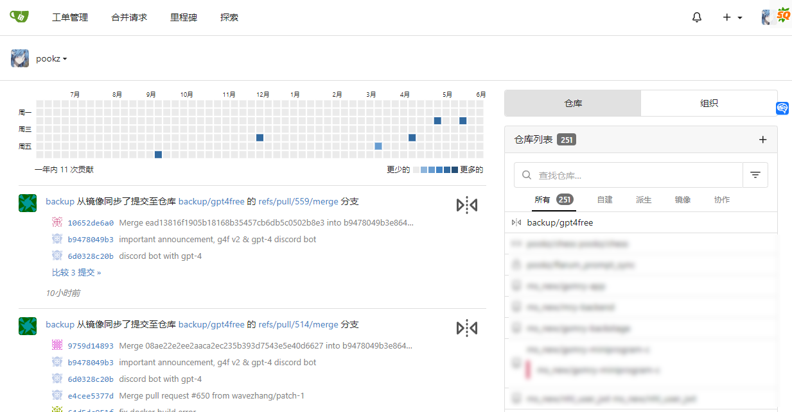

相较于其它类似的软件，Gitea 有以下特点：

- **轻量化**：Gitea 是一个十分轻量的应用，它只需要一个相对小的系统资源就可以运行。这使得它非常适合个人使用或者小团队使用。

运行了3年，251个项目，它的占用如此之低，蜗牛都能轻松驾驭

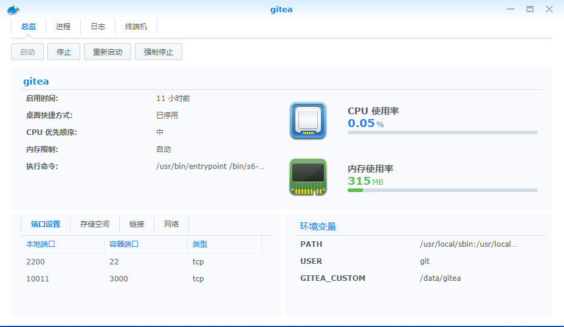

- **自我托管**：Gitea 可以在你自己的服务器上运行。这意味着你完全控制自己的数据和服务。你无需担心第三方服务的问题（例如：数据丢失，服务停止等）。
- **易于使用**：Gitea 提供了一个用户友好的界面，让你可以轻松的管理你的代码。不论你是程序员还是非程序员，Gitea 都可以帮助你高效地完成工作。

- **开源**：Gitea 是一个开源的项目，这意味着你可以查看它的源代码，甚至可以根据你自己的需求来修改它。

从1.91版本开始，Gitea 开始支持 Action 功能。这是一个非常强大的功能，它可以自动化你的开发工作流程，比如自动构建，测试，部署你的代码。

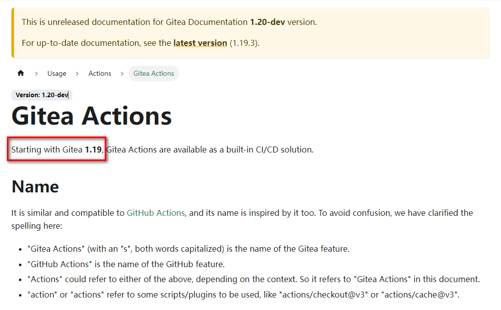


---

接下来是具体搭建步骤：

## 1. 重点

`点个免费关注`，不迷路

## 2. 安装Portainer

教程参考：
[30秒安装Nas必备神器 Portainer](/how-to-install-portainer-in-nas/)

##  3. File Station

File Station 打开docker 文件夹，创建`Gitea `文件夹

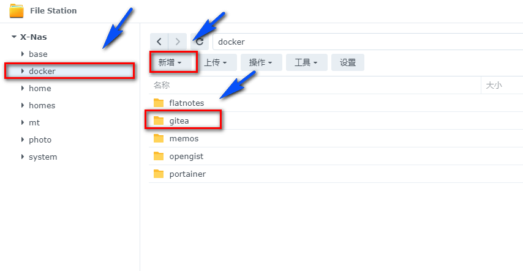

## 4. 创建stack

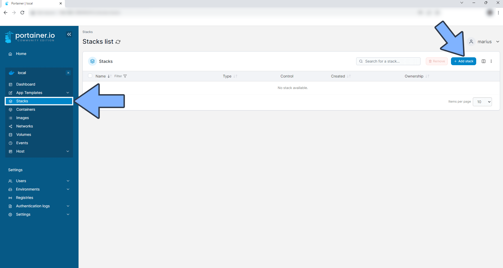

## 5.  部署代码

```yaml
version: '2'
services:
  gitea:
    image: gitea/gitea:latest
    container_name: gitea
    volumes:
      - /volume1/docker/gitea:/data
      - /etc/localtime:/etc/localtime:ro
    ports:
      - "10011:3000" # http端口
      - "2200:22" # 用于ssh端口
    restart: always
```

1. 选择stack
2. name栏输入gitea
3. edditor输入：上面代码
4. 点击deploy

## 6. 成功


## 6. 使用

浏览器进入程序：[ip]:[端口]

> ip为你nas所在ip（这里我的是192.168.2.32），端口为上面配置文件定义，如果你按照我的教程，则是10011

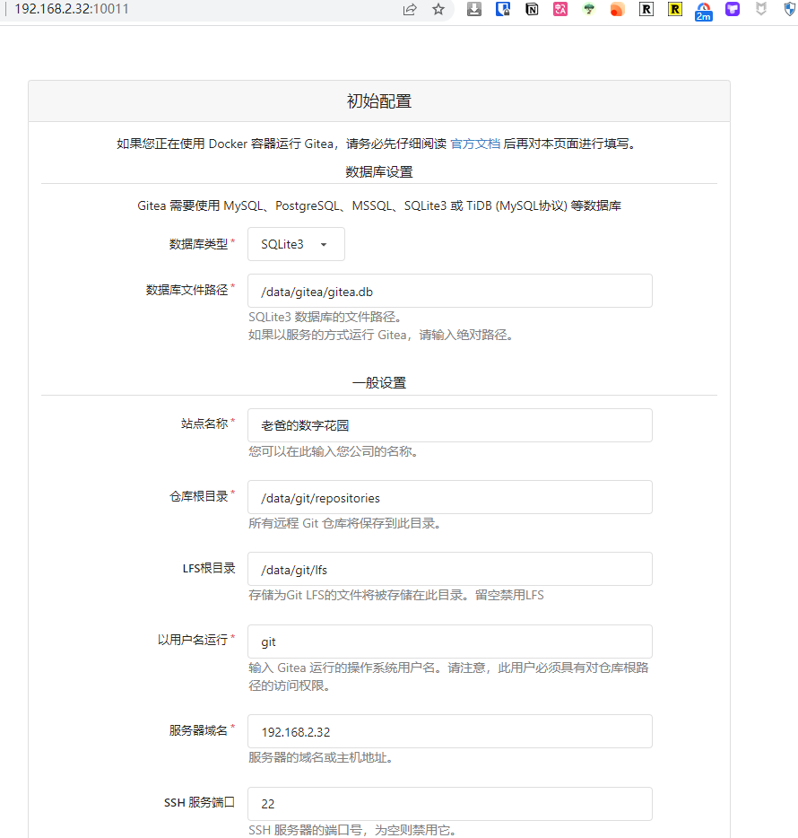

## 7. 初始配置

- 使用sqlite

目的是轻量化，`sqlite`足矣（我跑了3年200多个项目），不需要上mysql、postgres这样的大型数据库

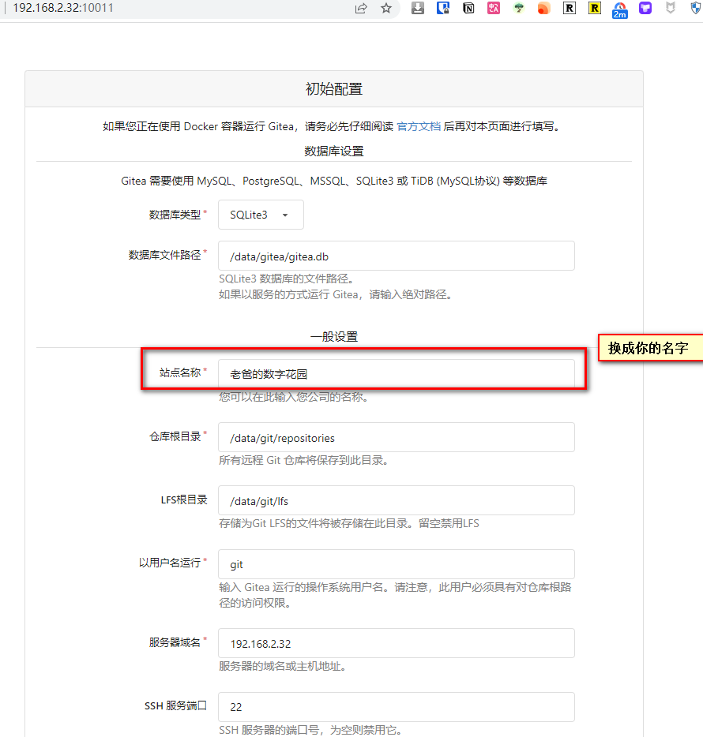


- 服务器域名

如果你只是内网访问，则不需要变，如果你是公网访问，将服务器域名换成你的公网地址

服务器域名：内网不需要变，公网换域名。比如：gitea.nasdaddy.cn

基础url：内网不需要变，公网换域名（需http或https）。比如：https://gitea.nasdaddy.cn/


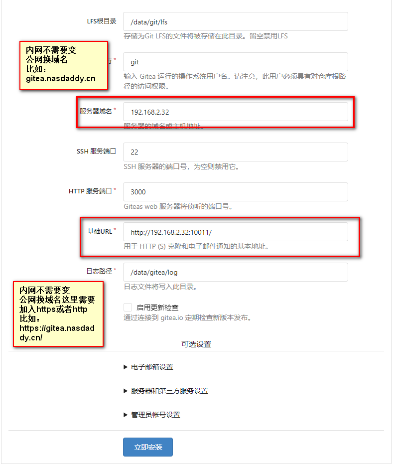

- 其他

邮箱不需要配置，自己使用

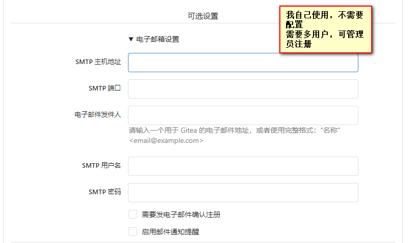

配置管理员账户


- 完成

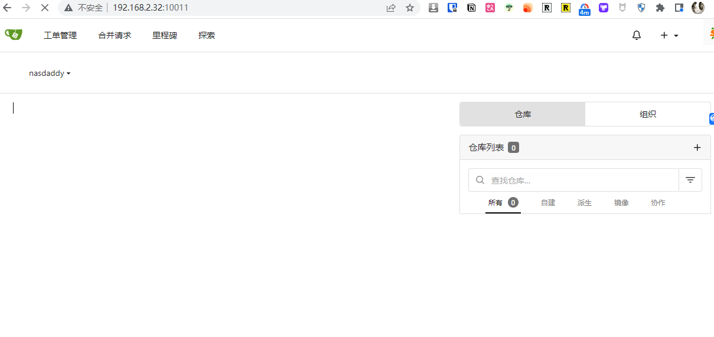

## 8. 更换主题

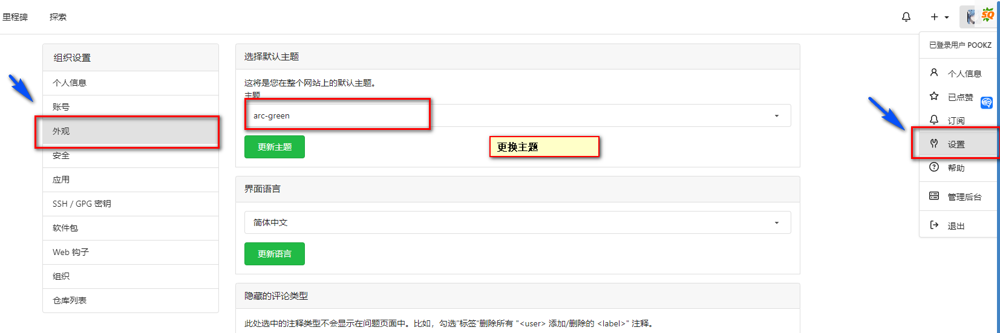


## 9. 我最喜欢的部分（mirror克隆）

github上，以及我之前参与的项目，用gitea的一键迁移，可以轻松的将仓库整个（包括commit，branch，tag）全部迁移过来

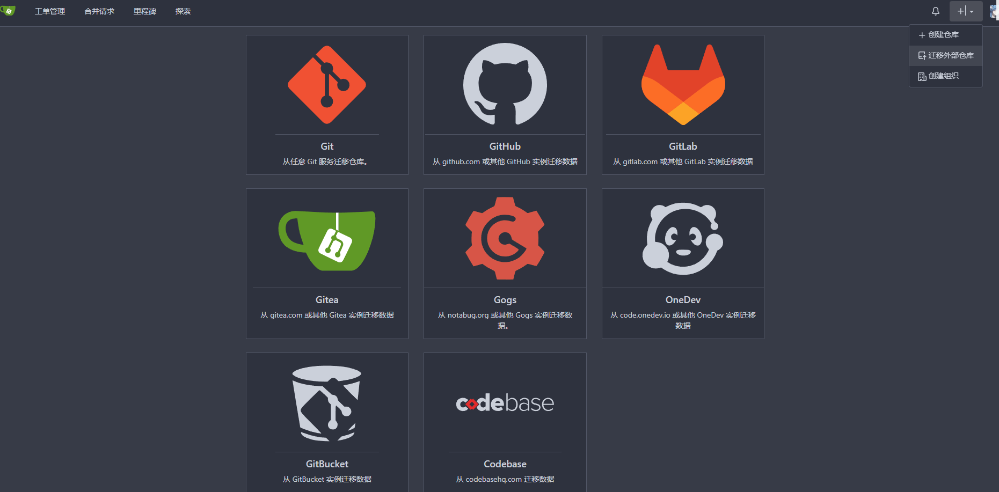


比如之前大火的gpt4free，作者受到压力太大，随时可能关闭仓库，于是我镜像了它的仓库在自己的私有云！

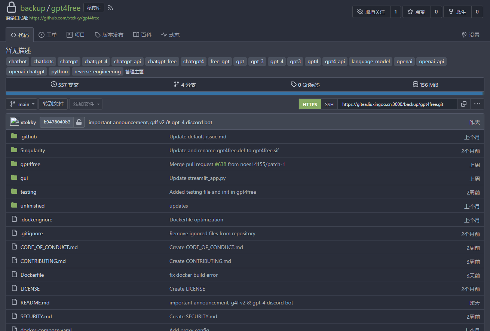


## 最后

如果你喜欢这篇文章，请记得点赞，收藏，并关注【老爸的数字花园】，我们将会持续带来更多实用的自搭建应用指南。一起，让我们掌握自己的数据，创建自己的数字世界！

如果你在搭建过程中遇到任何问题，或者有任何建议，也欢迎在下方留言，一起探讨和学习。