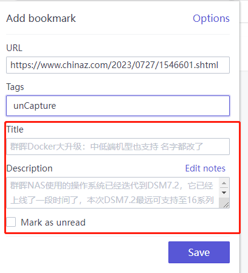
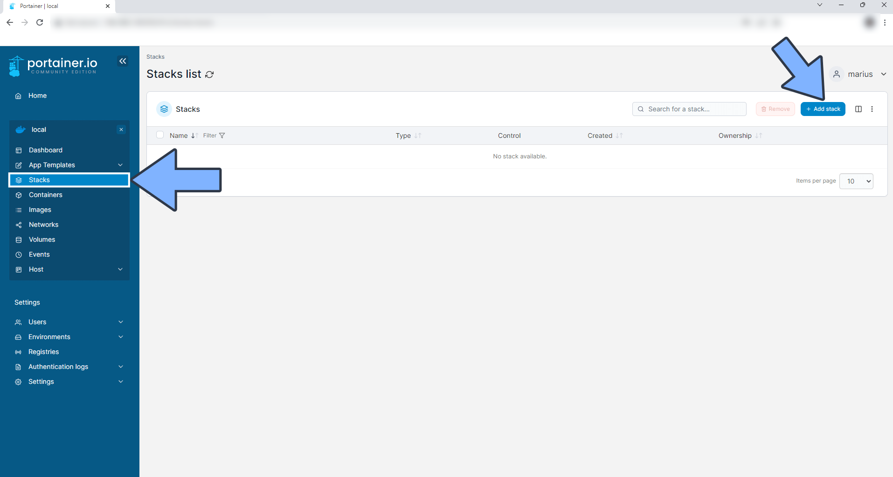
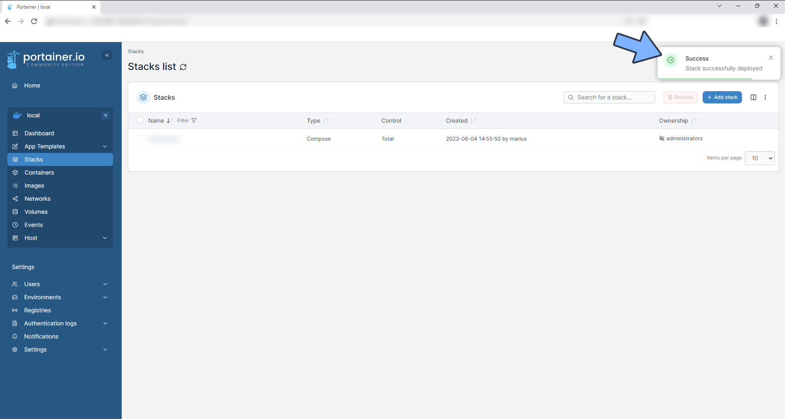
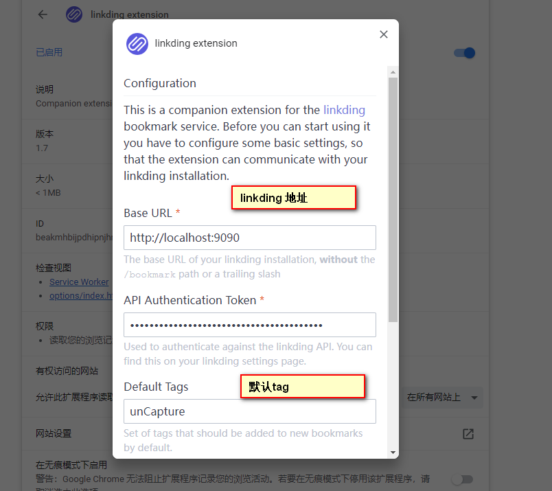
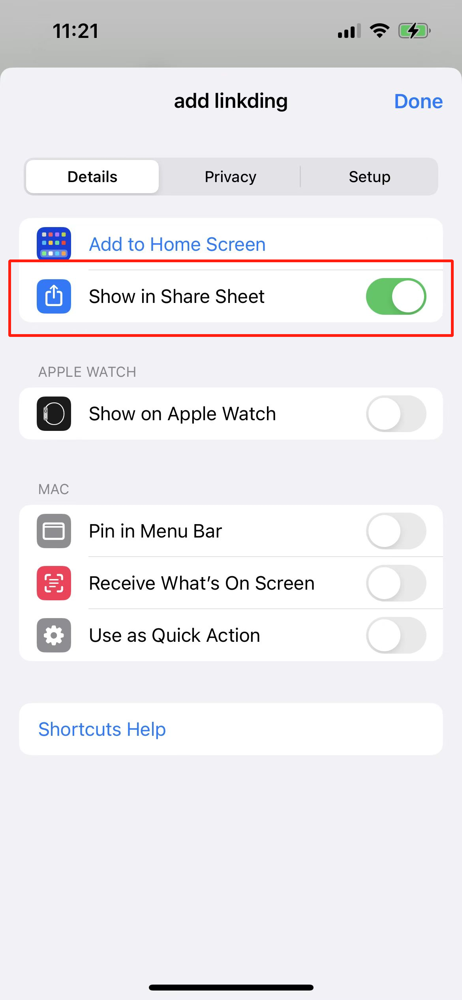
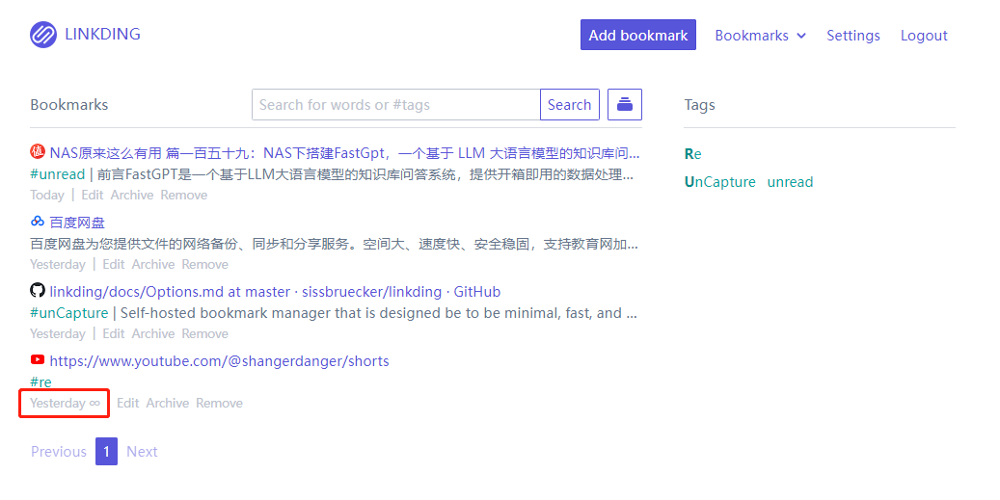
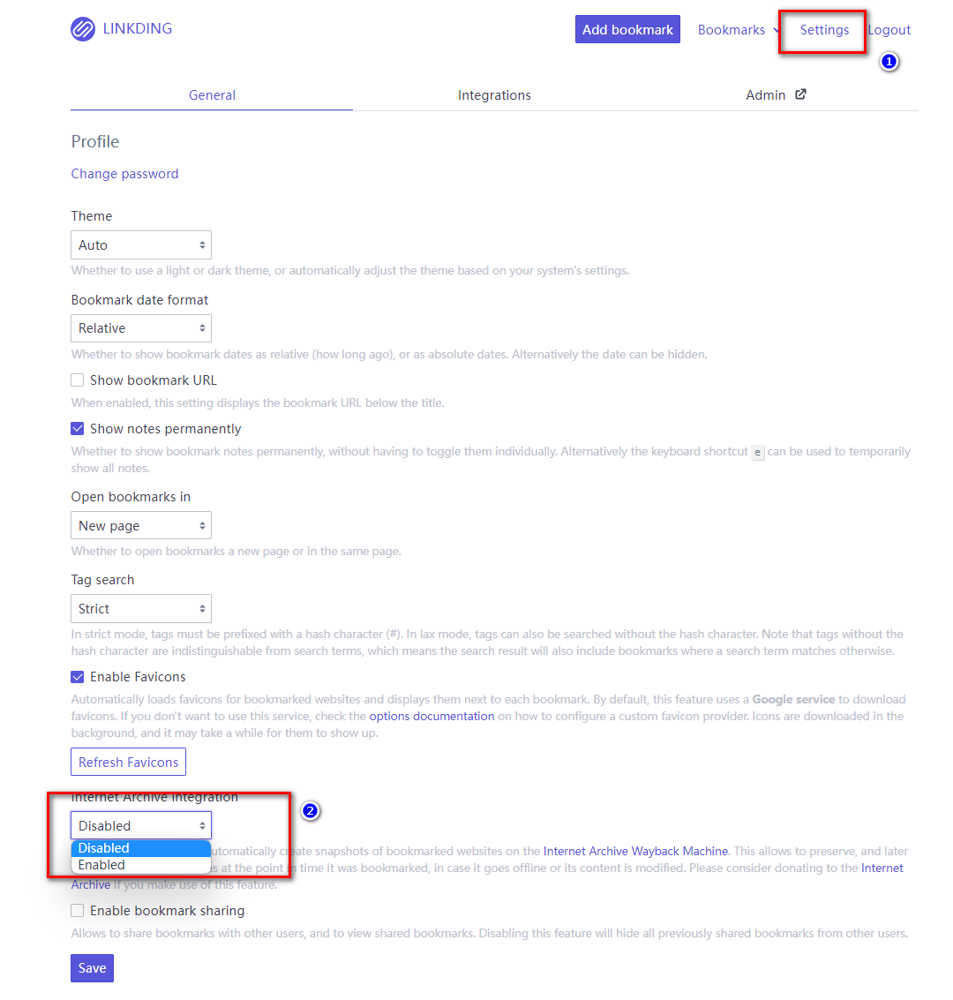
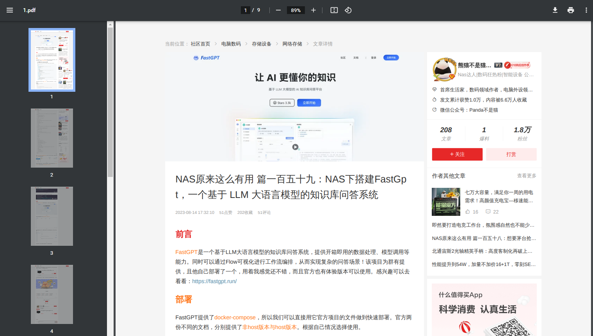

Ein leistungsstarkes, einfaches und vor allem von Ihnen kontrolliertes Lesezeichen-Verwaltungstool.
<!--more-->


## 1. Einführung
Haben Sie jemals dieses Dilemma erlebt? Ihre Browser-Lesezeichen häufen sich wie ein Berg, was es schwierig macht, dasjenige zu finden, das Sie benötigen.

Oder möchten Sie Ihre Lesezeichen auf mehreren Geräten synchronisieren, aber aus irgendeinem Grund hindert Sie etwas daran? Haben Sie jemals daran gedacht, ein Tool zu haben, das nicht nur einfach und leistungsstark ist, sondern vor allem von Ihnen kontrolliert wird?

Dann sollten Sie den heutigen Protagonisten **linkding** kennenlernen.


Und es gibt zwei `leistungsstarke Begleit-Plugins`, die das Hinzufügen von Lesezeichen schnell ermöglichen, den Inhalt der Website lesen und auch das `Hinzufügen von Lesezeichen auf mobilen Geräten` unterstützen.




---

## Vorstellung von Linkding

**linkding** ist ein Lesezeichen-Manager, den Sie selbst hosten können. Er ist darauf ausgelegt, einfach, schnell und mit Docker leicht einzurichten zu sein. Der Name ist auch interessant: `link` wird häufig verwendet, um URLs und Lesezeichen darzustellen, und `Ding` bedeutet "Ding" auf Deutsch. Also ist dies ein "Ding" zur Verwaltung Ihrer Links.

**Funktionen im Überblick:**

- **Übersichtliche Benutzeroberfläche**: Optimiert für Lesbarkeit
- **Organisation von Lesezeichen nach Tags**: Machen Sie Ihre Lesezeichen besser organisiert


- **Hinzufügen von Kommentaren mit Markdown**: Fügen Sie Ihren Lesezeichen weitere Informationen hinzu
- **Später lesen-Funktion**: Speichern Sie Webseiten für zukünftiges Lesen
- **Freigabefunktion**: Teilen Sie Ihre Lesezeichen mit anderen Benutzern
- **Massenbearbeitung**: Bearbeiten Sie mehrere Lesezeichen auf einmal
- **Automatische Bereitstellung von Lesezeichen-Titeln, -Beschreibungen und -Symbolen**
- **Automatisches Erstellen von Snapshots von Lesezeichen auf der Internet Archive Wayback Machine**
- **Importieren und Exportieren von Lesezeichen**: Unterstützt das Netscape HTML-Format
- **Browser-Erweiterungen**: Unterstützt Firefox und Chrome sowie ein Lesezeichen-Widget
- **Themenwahl**: Helle und dunkle Themen
- **REST-API**: Unterstützt die Entwicklung von Drittanbieteranwendungen
- **Verwaltungspanel**: Benutzer-Self-Service und Zugriff auf Rohdaten
- **Einfache Einrichtung**: Verwendet Docker und SQLite-Datenbank, optional auch PostgreSQL

---

Einrichtungsschritte:

## 1. Wichtiger Punkt

`Folgen Sie kostenlos`, um nicht den Überblick zu verlieren

## 2. Grafisches Docker-Verwaltungstool

#### Synology DSM Version 7.2 oder höher kann direkt *Container Manager* verwenden


#### QNAP ContainerStation 


#### Portainer selbst installieren

Tutorial-Referenz:
[30-Sekunden-Installation von Portainer, einem unverzichtbaren Tool für NAS](/how-to-install-portainer-in-nas/)


Nehmen Sie als nächstes Portainer als Beispiel

##  3. File Station

Öffnen Sie die File Station und erstellen Sie einen Ordner `linkding` im Docker-Ordner


## 4. Stack erstellen



## 5. Code bereitstellen

```yaml
version: '3'
services:
  linkding:
    container_name: "linkding"
    image: sissbruecker/linkding:latest
    ports:
      - "9090:9090"  # Ändern Sie auf einen unbenutzten Port
    volumes:
      - /volume1/docker/linkding/data:/etc/linkding/data
    environment:
      - LD_SUPERUSER_NAME=admin  # Anmeldeinformationen für das Administrator-Konto
      - LD_SUPERUSER_PASSWORD=admin
    restart: unless-stopped
```

1. Stack auswählen
2. "linkding" im Namensfeld eingeben
3. Den obigen Code in den Editor eingeben
4. Auf "Bereitstellen" klicken

## 6. Erfolg




## 7. Verwendung

Greifen Sie über Ihren Browser auf das Programm zu: [IP]:[Port]

> Ersetzen Sie "IP" durch die IP-Adresse Ihres NAS (bei mir ist es 172.16.23.106) und ersetzen Sie "Port" durch den in der Konfigurationsdatei definierten Port (wenn Sie meinem Tutorial gefolgt sind, wäre es 9090).


## 8. Besondere Funktionen präsentieren


### Plugin 1 installieren: linkding Browser-Erweiterung

> Mit diesem Plugin können wir Websites schnell als Lesezeichen hinzufügen und ihre `Schlüsselinformationen` lesen.


Suchen Sie im Plugin-Marktplatz nach "linkding-Erweiterung".


#### linkding Browser-Erweiterung konfigurieren



- linkding: Wenn Sie eine öffentliche IP-Adresse haben, setzen Sie diese als linkding-Adresse für das beste Erlebnis (Sie können sich auf andere Tutorials beziehen oder einen Kommentar hinterlassen, um mir Ihre Anforderungen mitzuteilen).

- Standard-Tags: Standard-Tag für Links. Hier habe ich es als "ungelesen" festgelegt. Ich räume diese Tags regelmäßig auf und verschiebe sie in die entsprechenden Tags.

- API-Token: In der linkding-Backend setzen.

  


### Plugin 2 installieren: linkding Suchmaschinen-Erweiterung

> Mit diesem Plugin können wir unsere gespeicherten Lesezeichen schnell finden, wenn wir nach verwandten Inhalten im Browser suchen.


Suchen Sie im Plugin-Marktplatz nach "linkding-Injektor".


#### linkding Browser-Such-Erweiterung konfigurieren

Wie oben.


#### iOS-Shortcut für Mobilgeräte hinzufügen (hinzugefügt am 18. August 2023)
1. Laden Sie die Shortcut-App herunter.
2. Fügen Sie einen neuen Shortcut hinzu.

3. Aktivieren Sie die Freigabe.

4. Fügen Sie eine Aktion hinzu (Webansicht anzeigen) und geben Sie Ihre linkding-Adresse im URL-Feld ein. Sie müssen die URL nicht manuell eingeben; fügen Sie hier die Variable "Shortcut-Eingabe" hinzu. Die Einrichtung ist nun abgeschlossen.

5. Öffnen Sie die Website, die Sie als Lesezeichen hinzufügen möchten, klicken Sie auf "Teilen" und wählen Sie Ihren Shortcut aus, um ihn hinzuzufügen.


## Weitere wichtige Einstellungen

#### Automatisches Hinzufügen zum Archiv (Aufzeichnung der Website-Historie)

Oft stoßen wir auf eine Website mit großartigem Inhalt und setzen ein Lesezeichen darauf. Aber nach einiger Zeit kann die Website geschlossen werden oder der Inhalt gelöscht werden. In solchen Fällen benötigen wir eine Funktion namens "Webseitenarchivierung".

linkding unterstützt das automatische Importieren Ihrer Lesezeichen in archive.org, um das Erscheinungsbild der Website zu diesem Zeitpunkt festzuhalten.


Dieses `Symbol` zeigt an, dass es mit archive.org synchronisiert wurde.




Um diese Funktion zu aktivieren:

Gehen Sie zu Einstellungen -> Internet Archive Integration.




> Ich möchte erwähnen, dass archive.org eine gemeinnützige Website ist. Wenn Sie diese Website intensiv nutzen, erwägen Sie bitte eine Spende, um sie zu unterstützen.

Wenn Sie Kommentare oder Vorschläge haben, lassen Sie es mich bitte wissen. In Zukunft kann ich Ihnen ein weiteres Lesezeichen-Tool vorstellen. Der Unterschied besteht darin, dass dieses Tool automatisch Bildschirmfotos des Lesezeicheninhalts erstellt und sie als PDF exportiert.




## Abschließend

Wenn Ihnen dieser Artikel gefällt, denken Sie bitte daran, [Dad's Digital Garden](https://example.com) zu liken, zu bookmarken und zu folgen. Wir werden Ihnen weiterhin praktische Anleitungen zur Erstellung eigener Anwendungen bieten. Lassen Sie uns die Kontrolle über unsere eigenen Daten übernehmen und unsere eigene digitale Welt schaffen!

Wenn Sie während des Einrichtungsprozesses auf Probleme stoßen oder Vorschläge haben, hinterlassen Sie bitte einen Kommentar unten. Lassen Sie uns gemeinsam erkunden und lernen.