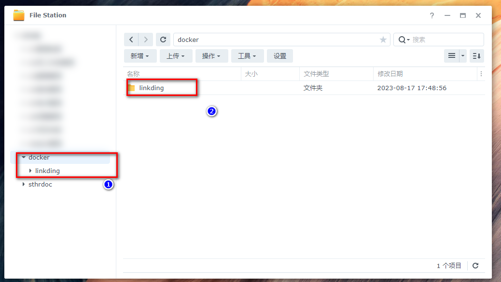
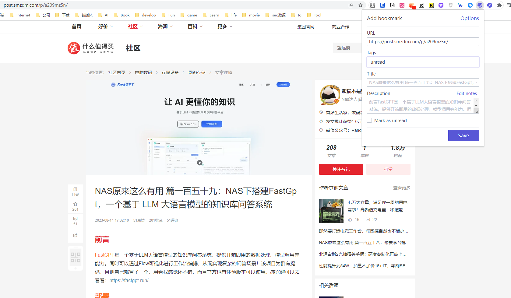
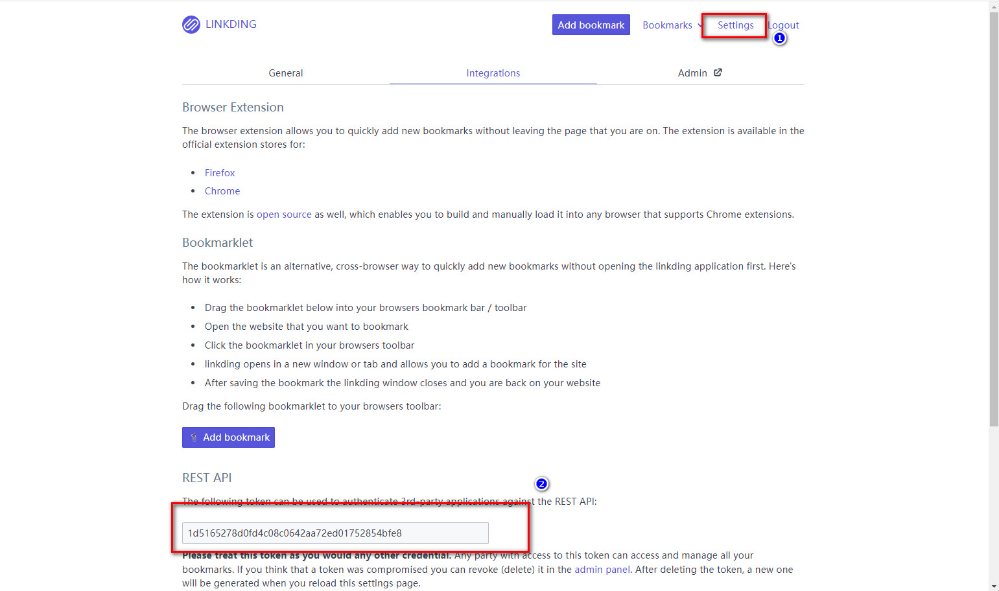
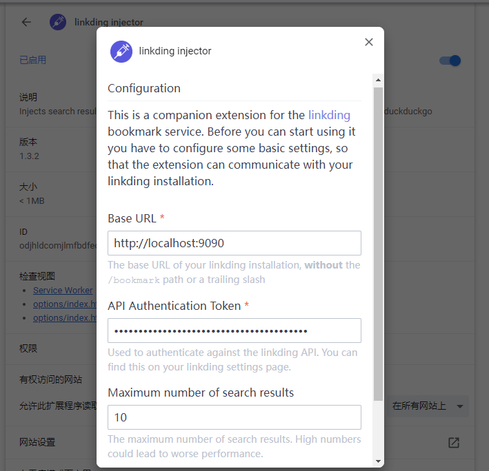
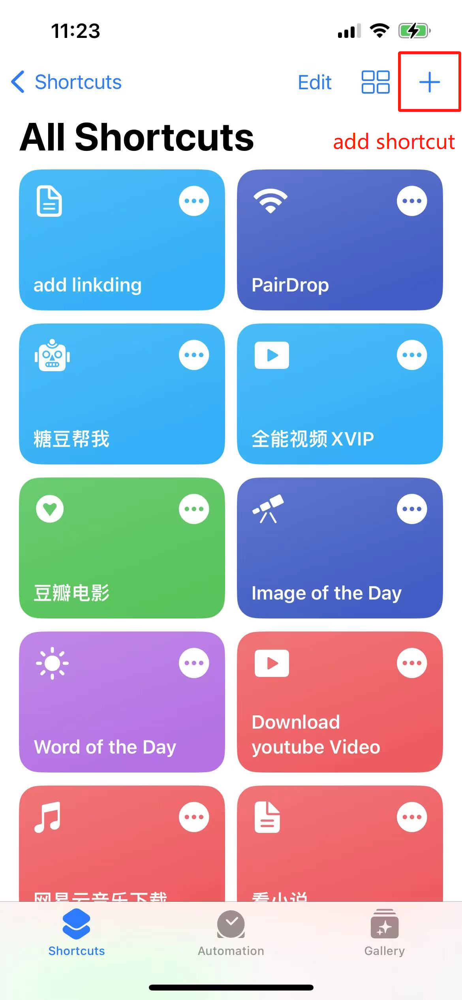
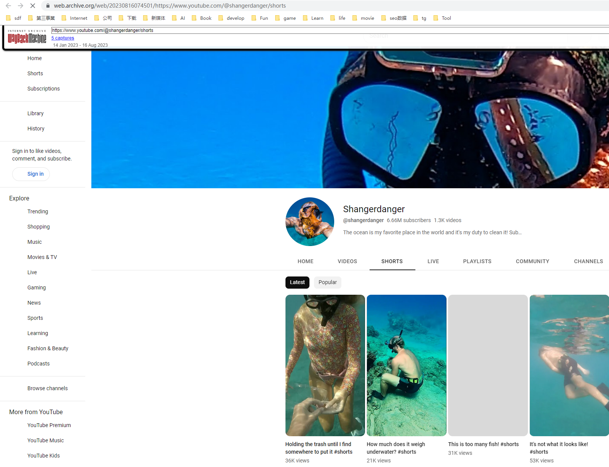
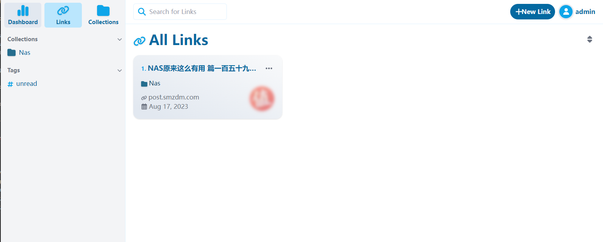
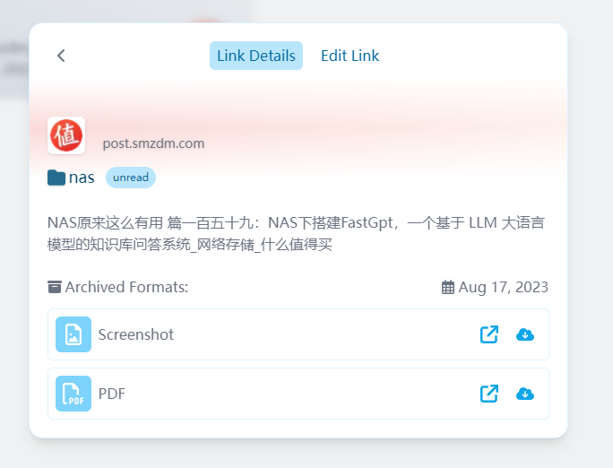

A powerful, simple, and most importantly, bookmark management tool that you control.
<!--more-->


## 1. Introduction
Have you ever encountered this dilemma? Your browser bookmarks are piled up like a mountain, making it difficult to quickly find the one you need.

Or do you want to sync your bookmarks across multiple devices, but you are hindered for some reason? Have you ever thought of having a tool that is not only simple and powerful, but most importantly, controlled by you?

Then, you need to know about today's protagonist **linkding**.


And there are two `powerful accompanying plugins` that make it easy to add bookmarks quickly, read the content of the website, and also support `adding bookmarks on mobile devices`.


---

## Introducing Linkding

**linkding** is a bookmark manager that you can host yourself. It is designed to be simple, fast, and can be easily set up using Docker. The name is also interesting: `link` is commonly used to represent URLs and bookmarks, and `Ding` means "thing" in German. So, this is a "thing" for managing your links.

**Features at a glance:**

- **Clean user interface**: Optimized for readability
- **Tag-based bookmark organization**: Make your bookmarks more organized


- **Add comments using Markdown**: Add more information to your bookmarks
- **Read later feature**: Save web pages for future reading
- **Sharing feature**: Share your bookmarks with other users
- **Batch editing**: Edit multiple bookmarks at once
- **Automatically provide bookmark titles, descriptions, and icons**
- **Automatically create snapshots of bookmarks on the Internet Archive Wayback Machine**
- **Import and export bookmarks**: Supports Netscape HTML format
- **Browser extensions**: Supports Firefox and Chrome, as well as a bookmark widget
- **Theme selection**: Light and dark themes
- **REST API**: Supports third-party application development
- **Management panel**: User self-service and access to raw data
- **Easy to set up**: Uses Docker and SQLite database, with optional PostgreSQL

---

Setup steps:

## 1. Key Point

`Follow for free` to avoid getting lost

## 2. Docker management graphical tool

#### Synology DSM version 7.2 or above can directly use *Container Manager*


#### QNAP ContainerStation 


#### Install Portainer on your own

Tutorial reference:
[30-second installation of Portainer, a must-have tool for NAS](/how-to-install-portainer-in-nas/)


Next, take Portainer as an example

##  3. File Station

Open File Station and create a `linkding` folder in the docker folder




## 4. Create stack


## 5. Deploy the code

```yaml
version: '3'
services:
  linkding:
    container_name: "linkding"
    image: sissbruecker/linkding:latest
    ports:
      - "9090:9090"  # Change to an unused port
    volumes:
      - /volume1/docker/linkding/data:/etc/linkding/data
    environment:
      - LD_SUPERUSER_NAME=admin  # Admin account credentials
      - LD_SUPERUSER_PASSWORD=admin
    restart: unless-stopped
```

1. Select stack
2. Enter "linkding" in the name field
3. Enter the above code in the editor
4. Click deploy

## 6. Success


## 7. Usage

Access the program in your browser: [ip]:[port]

> Replace "ip" with the IP address of your NAS (mine is 172.16.23.106), and replace "port" with the port defined in the configuration file (if you followed my tutorial, it would be 9090).


## 8. Special Features Showcase


### Install Plugin 1: linkding Browser Extension

> This plugin allows us to quickly bookmark websites and read their `key information`.




Search for "linkding extension" in the plugin marketplace.


#### Configure linkding Browser Extension


- linkding: If you have a public IP address, set it as the linkding address for the best experience (you can refer to other tutorials or leave a comment to let me know your requirements).

- default tags: Default tag for links. Here, I set it as "unread". I regularly clean up these tags and move them to the appropriate tags.

- api token: Set it in the linkding backend.

  


### Install Plugin 2: linkding Search Engine Extension

> This plugin helps us quickly find our bookmarked links when searching for related content in the browser.


Search for "linkding injector" in the plugin marketplace.


#### Configure linkding Browser Search Extension

Same as above.




#### Add iOS Shortcut for Mobile (added on August 18, 2023)
1. Download the Shortcut app.
2. Add a new shortcut.

3. Enable sharing.

4. Add an action (show web view at), and enter your linkding address in the URL field. You don't need to manually enter the URL; add the "Shortcut Input" variable here. The setup is now complete.

5. Open the website you want to bookmark, click on share, and select your shortcut to add it.


## Other Important Settings

#### Automatically Add to Archive (Record Website History)

Often, we come across a website with great content and bookmark it. But after some time, the website may shut down or the content may be deleted. In such cases, we need a feature called "web page archiving".

linkding supports automatically importing your bookmarks to archive.org to record the appearance of the website at that time.


This `icon` indicates that it has been synchronized with archive.org.





To enable this feature:

Go to settings -> Internet archive integration.


> I would like to mention that archive.org is a non-profit website. If you use this website extensively, consider donating to support them.

If you have any comments or suggestions, please let me know. In the future, I can introduce another bookmarking tool to you. The difference is that this tool automatically takes screenshots of bookmark content and exports them as PDF.






## Finally

If you like this article, please remember to like, bookmark, and follow [Dad's Digital Garden](https://example.com). We will continue to bring you more practical self-built application guides. Let's take control of our own data and create our own digital world!

If you encounter any problems or have any suggestions during the setup process, feel free to leave a comment below. Let's explore and learn together.