一个强大、简洁、最重要的是一切由你掌控的书签管理工具。
<!--more-->


## 1. 前言
你是否曾遇到过这样的困境？在浏览器的收藏夹中堆积如山的书签，然而却难以快速找到需要的那一个。

或者在多个设备之间想同步你的书签，但却因为某种原因受阻？有没有想过能有一个工具，既简洁，又强大，最重要的是——由你自己掌控？

那么，你需要了解下今天的主角**linkding**。


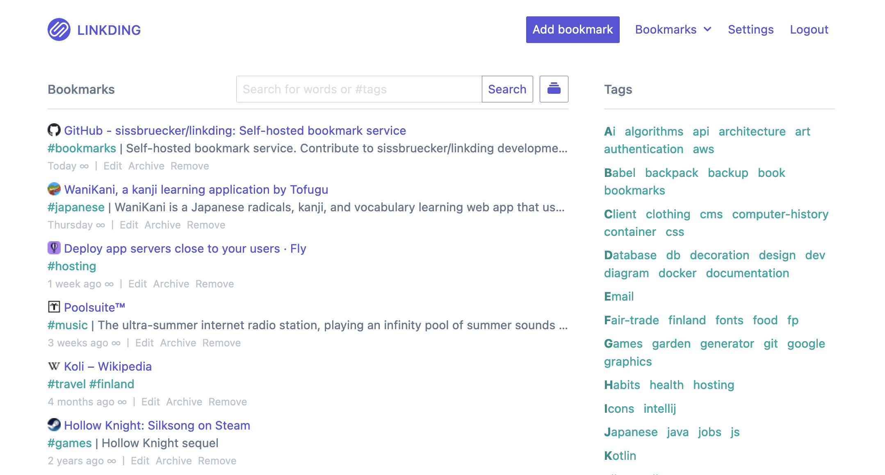


而且还有两款`强大的配套的插件`，方便快速添加书签，并读取该网站内容，同时也支持`手机端加入书签`

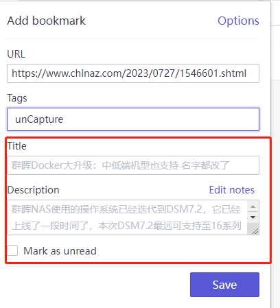


---

## 介绍Linkding

**linkding**是一个你可以自己托管的书签管理器，它设计得简洁、高速，并且可以使用Docker轻松设置。名字的由来也充满趣味：`link`常用于表示URL和书签，而`Ding`在德语中是“东西”的意思，所以，这是一个用于管理你的链接的"东西"。

**功能一览：**

- **简洁的用户界面**：优化了的可读性
- **标签化组织书签**：让你的书签更加有序

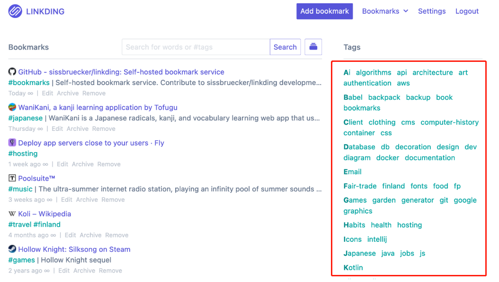

- **使用Markdown添加注释**：为你的书签添加更多信息
- **稍后阅读功能**：将网页存为未来阅读
- **分享功能**：与其他用户共享你的书签
- **批量编辑**：一次编辑多个书签
- **自动提供书签的标题、描述和图标**
- **自动在Internet Archive Wayback Machine上创建书签的快照**
- **书签的导入和导出**：支持Netscape HTML格式
- **浏览器扩展**：支持Firefox和Chrome，还有一个书签小工具
- **主题选择**：亮色和暗色主题
- **REST API**：支持第三方应用开发
- **管理面板**：用户自助服务和原始数据访问
- **易于设置**：使用Docker和SQLite数据库，还可选PostgreSQL

---

搭建步骤：

## 1. 重点

`点个免费关注`，不迷路

## 2. docker管理图形工具

#### 群晖 DSM 7.2版本以上可以直接使用 *Container Manager*


#### 威联通 ContainerStation 

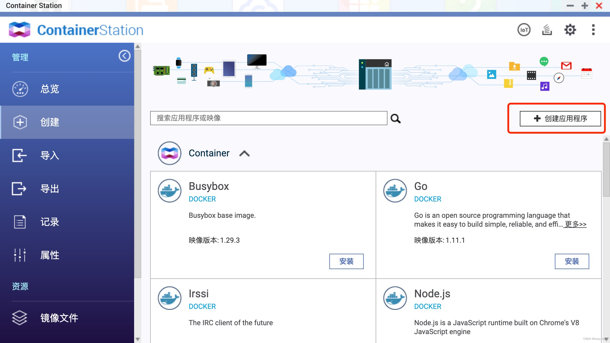


#### 自行安装Portainer

教程参考：
[30秒安装Nas必备神器 Portainer](/how-to-install-portainer-in-nas/)


接下来以Portainer 为例

##  3. File Station

File Station 打开docker 文件夹，创建`linkding`文件夹

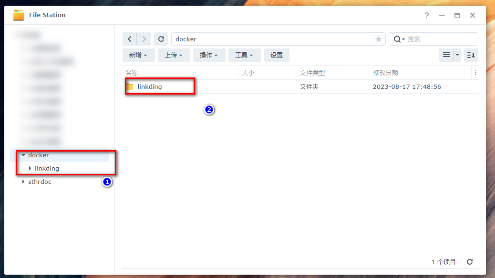


## 4. 创建stack


## 5.  部署代码

```yaml
version: '3'

services:
  linkding:
    container_name: "linkding"
    image: sissbruecker/linkding:latest
    ports:
      - "9090:9090"  # 更换为未使用的port
    volumes:
      - /volume1/docker/linkding/data:/etc/linkding/data
    environment:
      - LD_SUPERUSER_NAME=admin  # 管理员账号密码
      - LD_SUPERUSER_PASSWORD=admin
    restart: unless-stopped
```

1. 选择stack
2. name栏输入linkding
3. edditor输入：上面代码
4. 点击deploy

## 6. 成功


## 7. 使用

浏览器进入程序：[ip]:[端口]

> ip为你nas所在ip（这里我的是172.16.23.106），端口为上面配置文件定义，如果你按照我的教程，则是9090

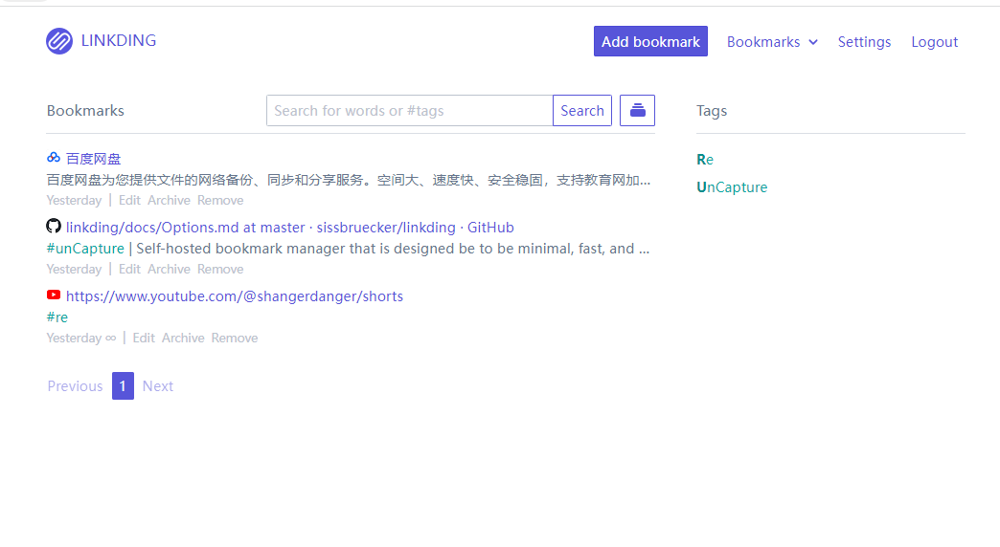

## 8. 特殊功能展示


### 安装插件1：linkding 浏览器插件

> 这款插件可以帮助我们快速将网站加入书签，并且读取该网站`关键信息`

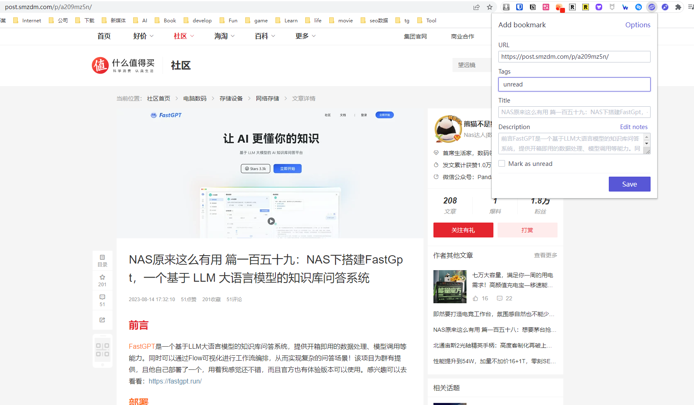


插件市场搜索 `linkding extension`

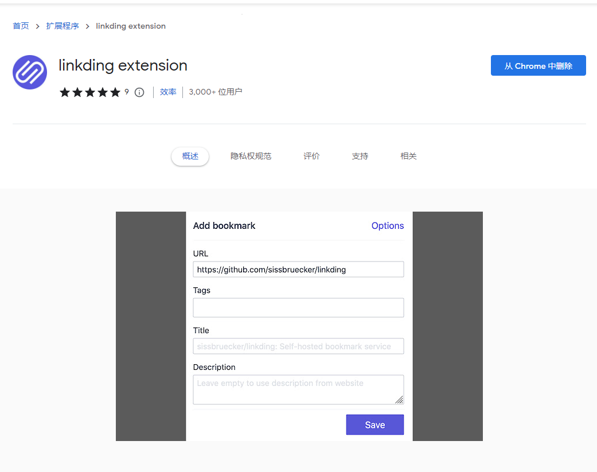


#### 配置linkding 浏览器扩展插件

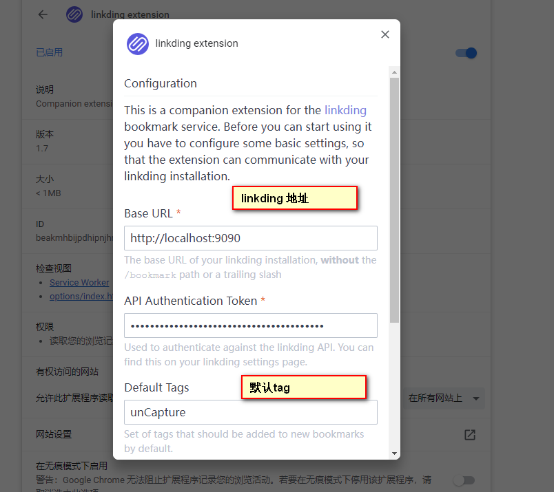

- linkding  如果你是公网地址，那么设置公网地址，体验最佳（可参考其他教程或者留言告知我你的需求）

- default tags  链接默认tag  这里我设置成了unread，定期我会清理这些标签，好移动到相应的tag中

- api token 在linkding 后台设置

  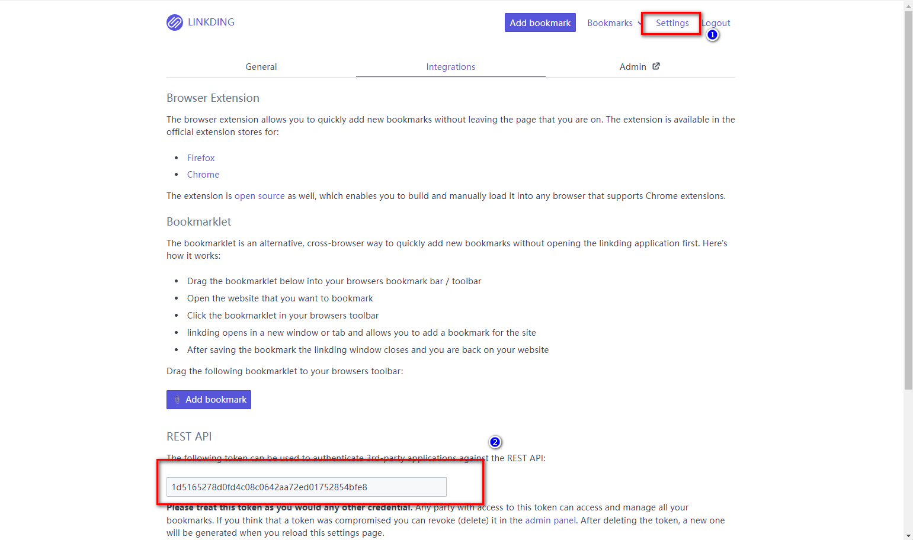


### 安装插件2：linkding 搜索引擎扩展插件

> 这款插件可以迅速帮助我们在浏览器搜索相关内容的时候，优先找到我们已收藏的书签

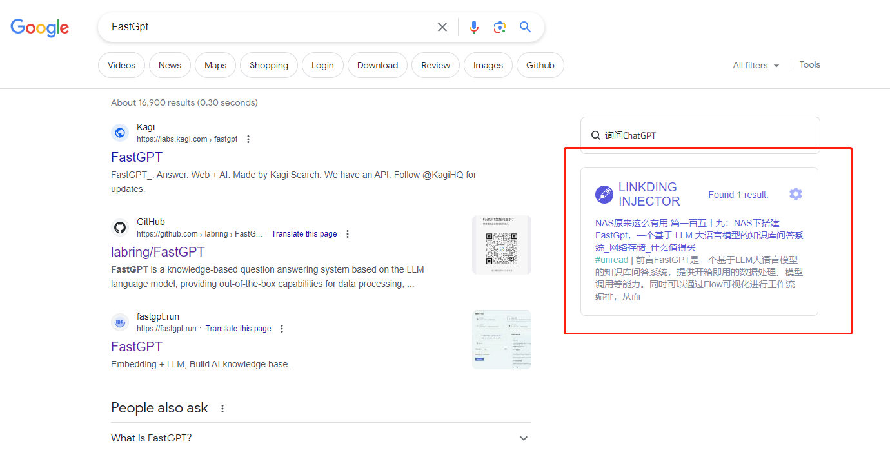


插件市场搜索 `linkding injector`

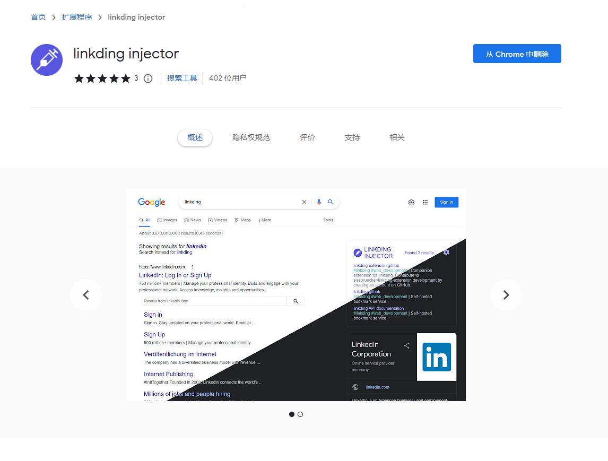

#### 配置linkding 浏览器搜索扩展

同上

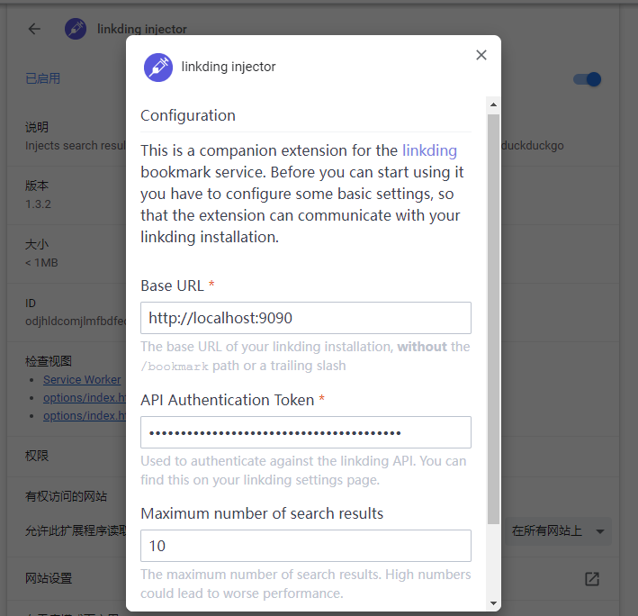


## 其他重要设置

#### 自动加入archive （记录网站历史）

我们常常看到一个网站，东西不错，加入了收藏夹，但是过阵子这个网站关掉了，或者内容被删了，这时候我们就需要一个功能【网页存档】

linkding 支持将你的书签自动 导入到archive.org 存档，让其记录网站当时的样子


这个`标志`意味着，已经同步archive.org 存档

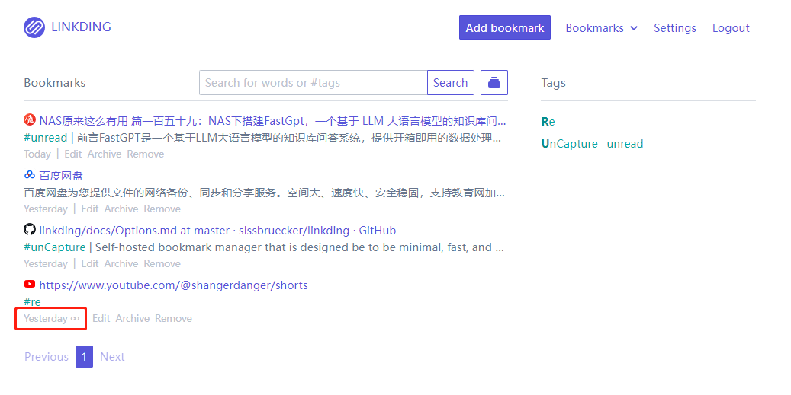

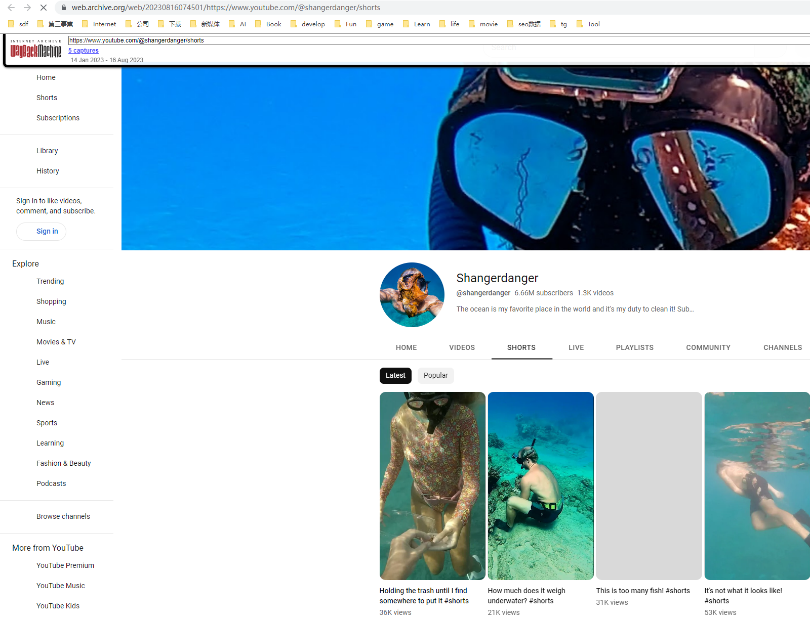


开启方法如下：

settings-> Internet archive integration


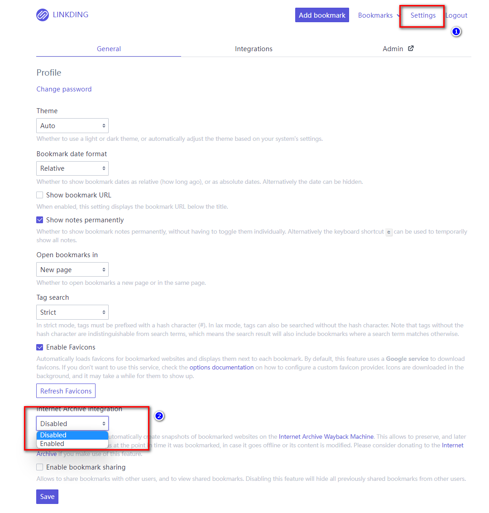

> 这里想多说一句，archive 是一个公益网站，如果你深度使用这个网站，可以考虑，`捐助支持他们`

同时如果大家有需要`留言告诉我`，未来我可以和大家介绍另一款书签工具，不同的是这个

自动对书签内容截图，并导出pdf

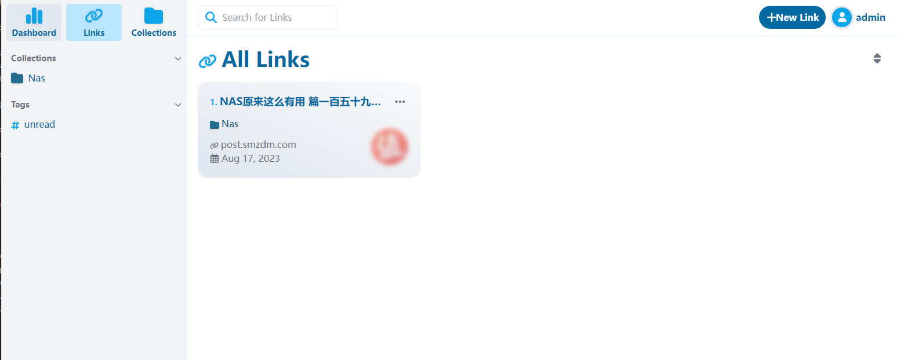

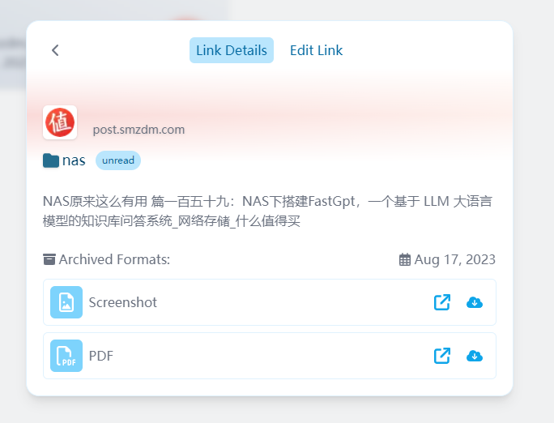

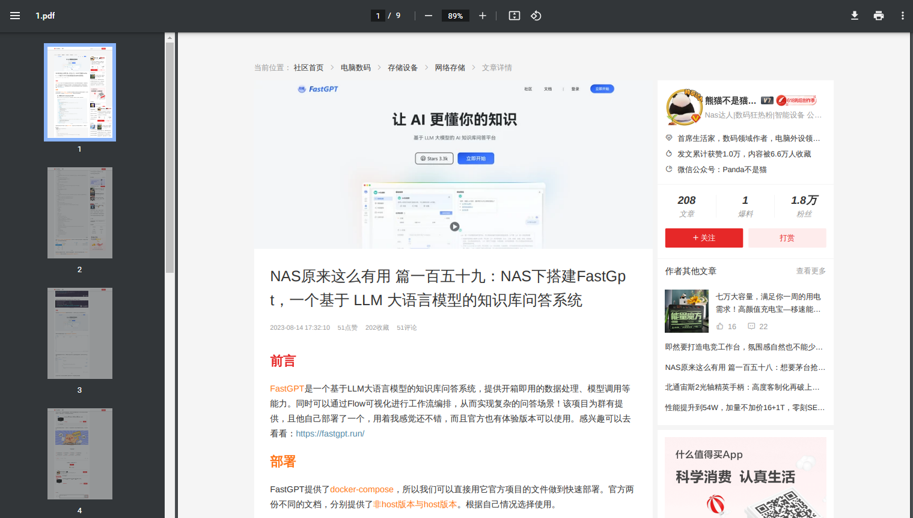


## 最后

如果你喜欢这篇文章，请记得点赞，收藏，并关注【老爸的数字花园】，我们将会持续带来更多实用的自搭建应用指南。一起，让我们掌握自己的数据，创建自己的数字世界！

如果你在搭建过程中遇到任何问题，或者有任何建议，也欢迎在下方留言，一起探讨和学习。