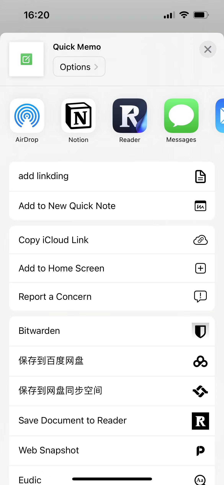

## 1. Einleitung

Ich weiß, dass die meisten Menschen, die meine Artikel lesen und sich für NAS interessieren, Männer mittleren Alters wie ich sind. In den Augen anderer sind wir mittelalte Onkel mit faltigen Gesichtern, und manche mögen sogar ein wenig schmierig wirken. Doch vor unseren Familien, insbesondere unseren Kindern, sind wir die Stützen!

Wir tragen die Lasten des Lebens, der Familie, der Bildung und der Finanzen.

![Ein Banner-Bild, das das Thema einer Midlife-Crisis zeigt. Das Bild zeigt eine mittelalte Person, die an einem Schreibtisch sitzt und von Symbolen einer Karriere und des Familienlebens umgeben ist, wie einem Laptop, Familienfotos und einer Uhr, die die Zeit vergehen lässt. Die Person wirkt nachdenklich, mit einem leicht besorgten Ausdruck, der über ihre Lebensentscheidungen und ihre Zukunft nachdenkt. Der Hintergrund ist ein Home-Office mit Bücherregalen, einem Fenster, das eine Vorstadtkulisse zeigt, und weichem, atmosphärischem Licht. Die Szene vermittelt eine Mischung aus Erfolg und Unsicherheit, typisch für eine Midlife-Crisis.](file-yO0tRGpTBWZnPhnTDyl9yCgq)

Besonders in dieser Ära,

- Selbst Hochschulabsolventen sehen sich nach dem Abschluss unweigerlich mit Arbeitslosigkeit konfrontiert, und der Spruch "mit 35 aussortiert werden" kursiert seit vielen Jahren.
- Selbst bei Ungerechtigkeiten am Arbeitsplatz wagen wir es nicht, unsere Jobs ohne Backup-Plan zu kündigen.
- Unser Status auf dem Verbrauchermarkt ist weit unter dem eines Hundes.
- Die angenehmsten Momente unseres Tages sind: der Moment vor dem Nachhausegehen, das Sitzen im Auto und die kurzen Augenblicke der Einsamkeit, nachdem unsere Frauen und Kinder eingeschlafen sind.

- ...

Dies ist die Gruppe von Menschen, die zu viele Emotionen angesammelt haben und so viel zu sagen haben, aber keinen Ort haben, um es zu sagen:

- Mit unserer Familie sprechen? Es scheint ein Zeichen von Schwäche zu sein und wird nur ihre Sorgen erhöhen.
- Mit Freunden sprechen? Wie viele Freunde kann ein mittelalter Mensch haben?
- Auf sozialen Medien posten? Das letzte Mal, dass ich meinen Status aktualisiert habe, war vor 2 Jahren.

![Ein bewegendes Bild eines mittelalten Mannes, der Einsamkeit erlebt und allein in einem schwach beleuchteten Raum sitzt. Der Mann sitzt auf einem einfachen Stuhl, den Kopf in einer Hand ruhend, mit einem nachdenklichen, melancholischen Ausdruck nach unten schauend. Der Raum ist spärlich eingerichtet, mit minimalen Dekorationen, was das Gefühl der Einsamkeit betont. Ein einzelnes Fenster im Hintergrund zeigt einen Nachthimmel und verstärkt die Atmosphäre der Isolation und der Selbstreflexion. Das Bild erfasst die Essenz der Einsamkeit und der unausgesprochenen Emotionen eines mittelalten Mannes, der niemandem seine Sorgen anvertrauen kann.](file-BDdrdTcN2fByoJLtNItdxFVf)

Aber noch wichtiger:

In der Psychologie gilt die langfristige Unterdrückung von Emotionen und Sorgen als potentielles Risiko für die psychische Gesundheit. Unterdrückte Emotionen und unausgesprochene Sorgen können zu verschiedenen negativen Auswirkungen führen, einschließlich Angst, Depressionen und sogar körperlichen Symptomen wie Schlaflosigkeit und Kopfschmerzen. Diese unterdrückten Emotionen können unbewusst das tägliche Verhalten und die zwischenmenschlichen Beziehungen einer Person beeinflussen und möglicherweise zu impulsivem Verhalten, emotionalen Ausbrüchen oder sozialer Vermeidung führen.

Im Gegensatz dazu hilft das Ausdrücken von Emotionen, zum Beispiel durch das Schreiben in einem Tagebuch, psychische Belastungen zu lindern, das Selbstbewusstsein zu stärken, psychischen Stress zu reduzieren und die psychische Gesundheit zu verbessern. Kurz gesagt, regelmäßiges Ausdrücken von Emotionen ist ein effektiver Weg, um das psychische Wohlbefinden aufrechtzuerhalten.

Und das bringt uns zum heutigen Protagonisten, Memos, dem perfekten Produkt, das uns hilft:

- Unsere Emotionen auszudrücken
- Unsere Stimmungen festzuhalten
- Jede Freude im Leben zu dokumentieren
- Die kreativen Ideen in unseren Köpfen festzuhalten
- Absolute Privatsphäre und volle Kontrolle über unsere Daten zu gewährleisten

Memos ist ein einfaches, aber datenschutzorientiertes Notiz-Tool, mit dem Sie Ihre Gedanken einfach festhalten können. Das ist es, was wir heute vorstellen werden: **Memos**.


### Warum sollten Sie sich für den Aufbau Ihrer eigenen Memos entscheiden?

- **Privatsphäre**: In der digitalen Ära ist der Schutz der persönlichen Privatsphäre wichtiger denn je.
- **Freiheit**: Befreien Sie sich von den Einschränkungen von Drittanbieter-Diensten und haben Sie die volle Kontrolle über Ihre Daten.
- **Einfachheit**: Konzentrieren Sie sich auf den Inhalt und nicht auf die Formatierung, indem Sie einfachen Text verwenden.

## Funktionen und Funktionen von Memos

⭐ Unendliche Kreativität, Open Source und dauerhaft kostenlos
Memos folgt dem Geist der Open Source und wird für immer kostenlos bleiben. Sie können Inspiration ohne Einschränkungen einfangen.

⭐ Verwenden Sie Docker für einfaches Self-Hosting
Mit der Flexibilität und Benutzerfreundlichkeit von Docker wird die Einrichtung und Erweiterung von Memos außergewöhnlich einfach. Sie haben die vollständige Kontrolle über Ihre Daten und Privatsphäre, ohne sich um externe Einflüsse sorgen zu müssen.

⭐ Reiner Text und Markdown-Unterstützung
Verabschieden Sie sich von komplexer Formatierung und nutzen Sie die Unterstützung von Markdown in Memos. Dadurch können Sie sich auf den Inhalt selbst konzentrieren und die Effizienz beim Schreiben und Notieren verbessern.

⭐ Einfache Anpassung und Freigabe
Memos bietet eine intuitive Freigabefunktion, mit der Sie persönliche Notizen einfach teilen oder mit Teams zusammenarbeiten können.

⭐ Unterstützung für RESTful API
Mit der Unterstützung für RESTful API kann Memos problemlos mit Drittanbieter-Diensten integriert werden und eröffnet endlose Möglichkeiten.

## Einrichtungsschritte

## 1. Schlüsselpunkte

`Folgen Sie kostenlos`, um auf Kurs zu bleiben

## 2. Docker-Verwaltungstools mit grafischer Benutzeroberfläche

#### Synology DSM 7.2 oder höher kann direkt *Container Manager* verwenden


#### QNAP ContainerStation


#### Installieren Sie Portainer selbst

Tutorial-Referenz:

[30-Sekunden-Installation von Portainer, einem unverzichtbaren Tool für NAS](/how-to-install-portainer-in-nas/)

Als nächstes verwenden wir Portainer als Beispiel.

## 3. File Station

Öffnen Sie die File Station und erstellen Sie einen Ordner `memos` im Docker-Ordner.


## 4. Stack erstellen


## 5. Code bereitstellen

```yaml
version: "3.0"
services:
  memos:
    image: neosmemo/memos:latest
    container_name: memos
    volumes:
      - /volume1/docker/memos_data:/var/opt/memos
    environment:
      - metric=False
    ports:
      - 13388:5230
```

1. Wählen Sie den Stack aus.
2. Geben Sie "memos" in das Namensfeld ein.
3. Geben Sie den obigen Code in den Editor ein.
4. Klicken Sie auf Bereitstellen.

## 6. Erfolg


## 7. Verwendung

Greifen Sie über Ihren Browser auf das Programm zu: [ip]:[port]

> Ersetzen Sie "ip" durch die IP-Adresse Ihres NAS (in diesem Beispiel ist es 172.16

### iOS Integration

> Dieser Artikel behandelt keine Probleme mit öffentlichen IP-Adressen oder der Durchdringung des internen Netzwerks.

1. Generieren Sie zuerst einen Token in Memos.


2. Fügen Sie eine Verknüpfung hinzu:

https://www.icloud.com/shortcuts/1eaef307112843ed9f91d256f5ee7ad9

3. Konfiguration

Konfigurieren Sie Ihre öffentliche IP-Adresse:


Zum Startbildschirm hinzufügen:



Testen:


## Abschließend

Memos ist unter meinen vielen Spielzeugen nicht nur ein einfaches Notizwerkzeug. Es ist ein sicherer Hafen für die emotionale Welt der Männer mittleren Alters. Hier können Sie frei die Banalitäten des Lebens, nächtliche Betrachtungen und sogar Gedanken, die noch nie jemandem offenbart wurden, aufzeichnen.

Wenn Ihnen dieser Artikel gefällt, denken Sie bitte daran, [Dad's Digital Garden](link) zu liken, zu bookmarken und zu folgen, da wir weiterhin praktische Anleitungen zur Erstellung eigener Anwendungen bereitstellen werden. Gemeinsam nehmen wir unsere Daten in die Hand und erschaffen unsere eigene digitale Welt!

Wenn Sie während des Einrichtungsprozesses auf Probleme stoßen oder Vorschläge haben, hinterlassen Sie bitte einen Kommentar unten. Lassen Sie uns gemeinsam erkunden und lernen.