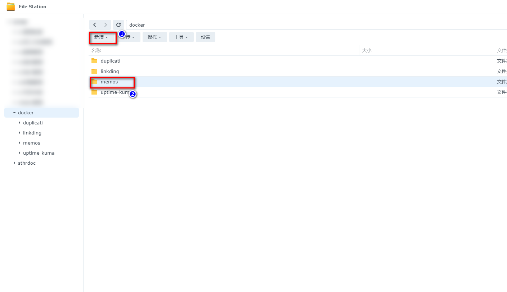
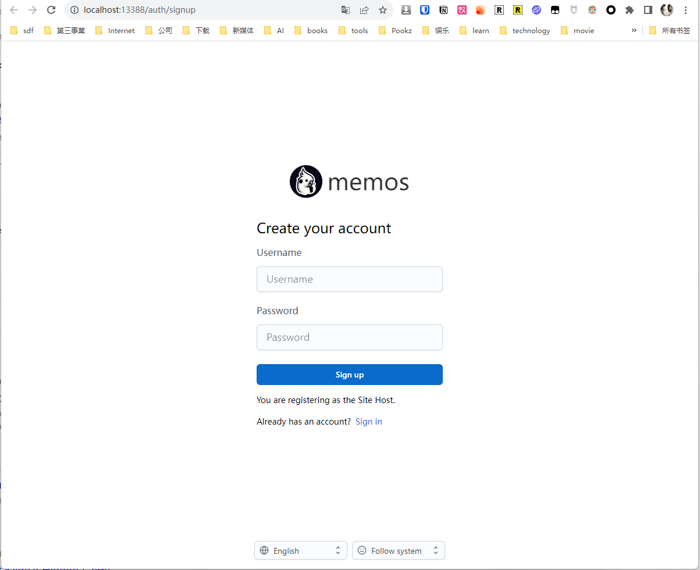
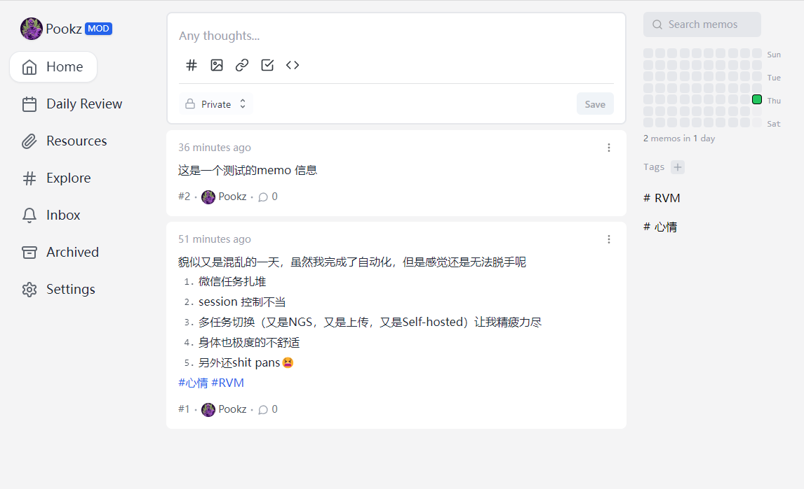
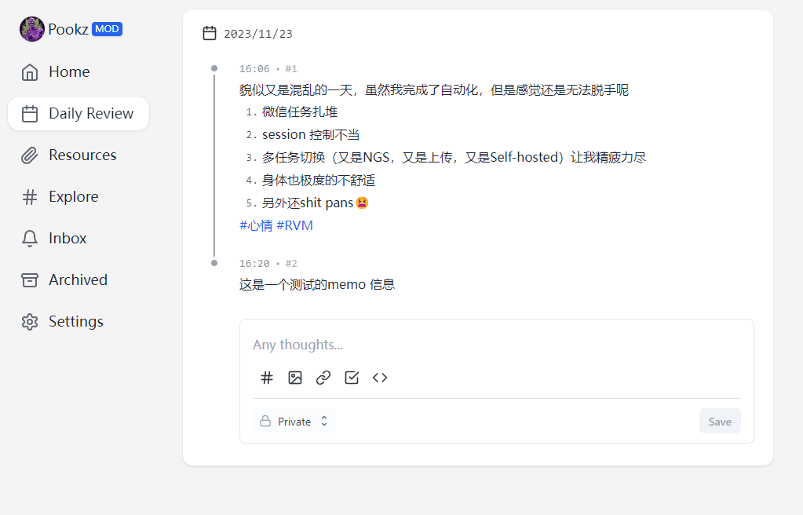
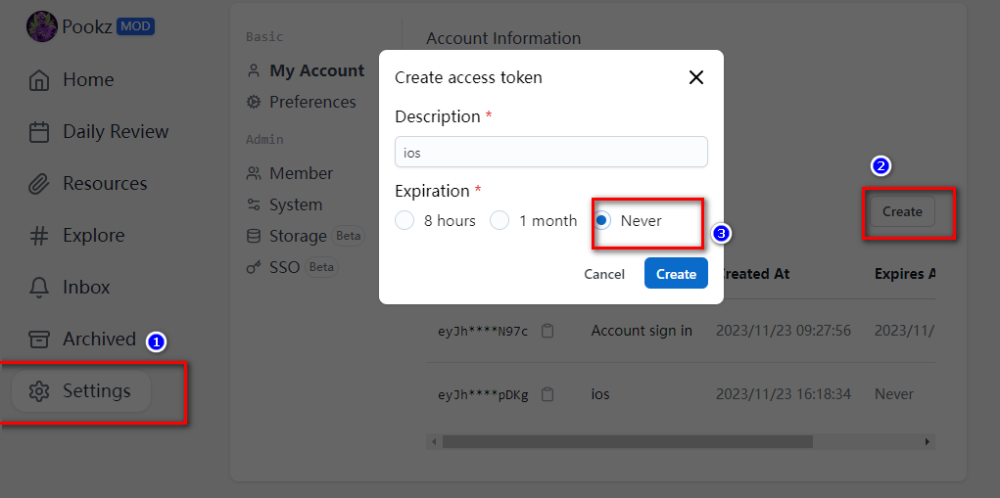
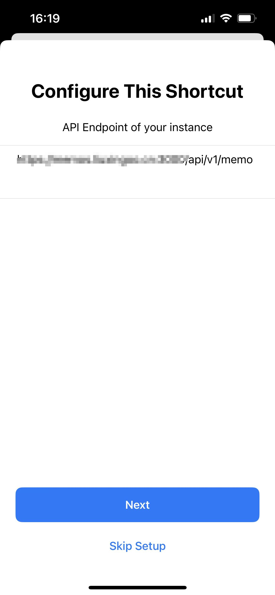
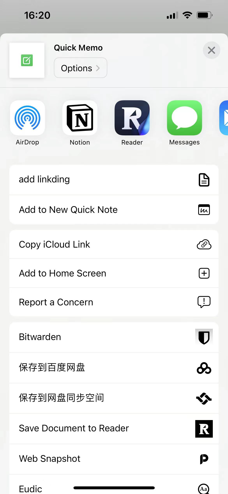
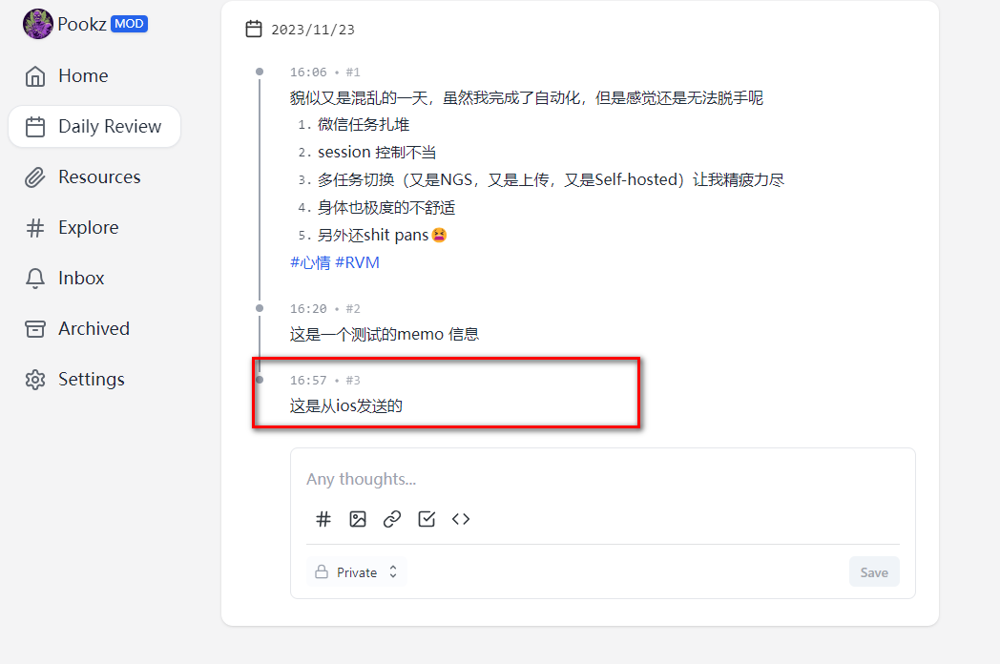

## 1. Introduction

I know that most of the people who read my articles and are interested in NAS are middle-aged men like me. In the eyes of others, we are middle-aged uncles with wrinkled faces, and some may even appear a bit greasy. However, in front of our families, especially our children, we are the pillars of support!

We bear the pressures of life, family, education, and finances.

![A banner image depicting the theme of a midlife crisis. The image shows a middle-aged person sitting at a desk, surrounded by symbols of a career and family life, such as a laptop, family photos, and a clock showing the passage of time. The person appears contemplative, with a slightly worried expression, reflecting on their life choices and future. The background is a home office setting with bookshelves, a window showing a suburban landscape, and soft, ambient lighting. The scene conveys a mix of achievement and uncertainty, typical of a midlife crisis.](file-yO0tRGpTBWZnPhnTDyl9yCgq)

Especially in this era,

- Even college graduates are inevitably faced with unemployment after graduation, and the saying "being eliminated at the age of 35" has been circulating for many years.
- Even in the face of workplace injustice, we dare not quit our jobs without a backup plan.
- Our status in the consumer market is far inferior to that of a dog.
- The most enjoyable moments of our day are: the moment before going home, sitting in the car, and the brief moments of solitude after our wives and children have fallen asleep.

- ...

This is the group of people who have accumulated too much emotion and have so much to say, but nowhere to say it:

- Talk to our families? It seems like a sign of weakness and will only increase their worries.
- Talk to friends? How many friends can a middle-aged person have?
- Post on social media? The last time I updated my status was 2 years ago.

![A poignant image of a middle-aged man experiencing loneliness, sitting alone in a dimly lit room. The man is depicted sitting on a simple chair, his head resting in one hand, looking down with a reflective, melancholic expression. The room is sparsely furnished, with minimal decorations, emphasizing the sense of solitude. A single window in the background shows a night sky, adding to the atmosphere of isolation and introspection. The image captures the essence of solitude and the unspoken emotions of a middle-aged man with no one to confide in.](file-BDdrdTcN2fByoJLtNItdxFVf)

But more importantly:

In the field of psychology, long-term suppression of emotions and concerns is considered a potential risk to mental health. Emotions that are pent up and worries that are left unexpressed can lead to various negative effects, including anxiety, depression, and even physical symptoms such as insomnia and headaches. These suppressed emotions can unconsciously affect a person's daily behavior and interpersonal relationships, potentially leading to impulsive behavior, emotional outbursts, or social avoidance.

In contrast, expressing emotions, such as through writing in a diary, helps alleviate psychological burdens, enhance self-awareness, reduce psychological stress, and improve mental health. In short, regularly expressing emotions is an effective way to maintain psychological well-being.

And this brings us to the protagonist of today, Memos, the perfect product that helps us:

- Vent our emotions
- Record our moods
- Document every joy in life
- Capture the creative ideas in our minds
- Ensure absolute privacy and full control of our data

Memos is a simple yet privacy-focused note-taking tool that allows you to easily record your thoughts. That's what we are going to introduce today: **Memos**.


### Why choose to build your own Memos?

- **Privacy**: In the digital age, protecting personal privacy is more important than ever.
- **Freedom**: Break free from the limitations of third-party services and have full control over your data.
- **Simplicity**: Focus on content rather than formatting by using plain text.

## Features and Functions of Memos

⭐ Infinite creativity, open source and permanently free
Memos adheres to the spirit of open source and will remain free forever. You can capture inspiration without any limitations.

⭐ Use Docker for easy self-hosting
With the flexibility and ease of use of Docker, setting up and expanding Memos becomes exceptionally simple. You can have complete control over your data and privacy without worrying about external interference.

⭐ Pure text and Markdown support
Say goodbye to complex formatting and embrace plain text with Markdown support in Memos. This allows you to focus on the content itself and improve efficiency in writing and note-taking.

⭐ Easy customization and sharing
Memos provides an intuitive sharing function, making it easy to share personal notes or collaborate with teams.

⭐ RESTful API support
With RESTful API support, Memos can easily integrate with third-party services, opening up endless possibilities.

## Setup Steps

## 1. Key Points

`Follow for free` to stay on track

## 2. Docker Management GUI Tools

#### Synology DSM 7.2 or above can directly use *Container Manager*


#### QNAP ContainerStation


#### Install Portainer on your own

Tutorial reference:

[30-second installation of Portainer, a must-have tool for NAS](/how-to-install-portainer-in-nas/)

Next, we will use Portainer as an example.

## 3. File Station

Open File Station and create a `memos` folder in the Docker folder.



## 4. Create Stack


## 5. Deploy the Code

```yaml
version: "3.0"
services:
  memos:
    image: neosmemo/memos:latest
    container_name: memos
    volumes:
      - /volume1/docker/memos_data:/var/opt/memos
    environment:
      - metric=False
    ports:
      - 13388:5230
```

1. Select the stack.
2. Enter "memos" in the name field.
3. Enter the above code in the editor.
4. Click on deploy.

## 6. Success


## 7. Usage

Access the program in your browser: [ip]:[port]

> Replace "ip" with the IP address of your NAS (in this example, it is 172.16.23.106), and replace "port" with the port defined in the configuration file (if you followed the tutorial, it is 13388).



After setting up your account and password:



You can easily see in the future what kind of mood you had at that time, whether the problems you had back then are still problems today.



## 8. Special Feature Showcase

### iOS Integration

> This article does not cover public IP or internal network penetration issues.

1. Generate a token in Memos first.



2. Add a shortcut:

https://www.icloud.com/shortcuts/1eaef307112843ed9f91d256f5ee7ad9

3. Configuration

Configure your public IP address:



Add to the home screen:



Test:




## Finally

Memos, among my many toys, is not just a simple note-taking tool. It is a safe harbor for the emotional world of middle-aged men. Here, you can freely record the trivialities of life, late-night contemplations, and even the thoughts that have never been revealed to anyone.

If you like this article, please remember to like, bookmark, and follow [Dad's Digital Garden](link), as we will continue to bring more practical self-built application guides. Together, let's take control of our own data and create our own digital world!

If you encounter any problems during the setup process or have any suggestions, please feel free to leave a comment below. Let's explore and learn together.