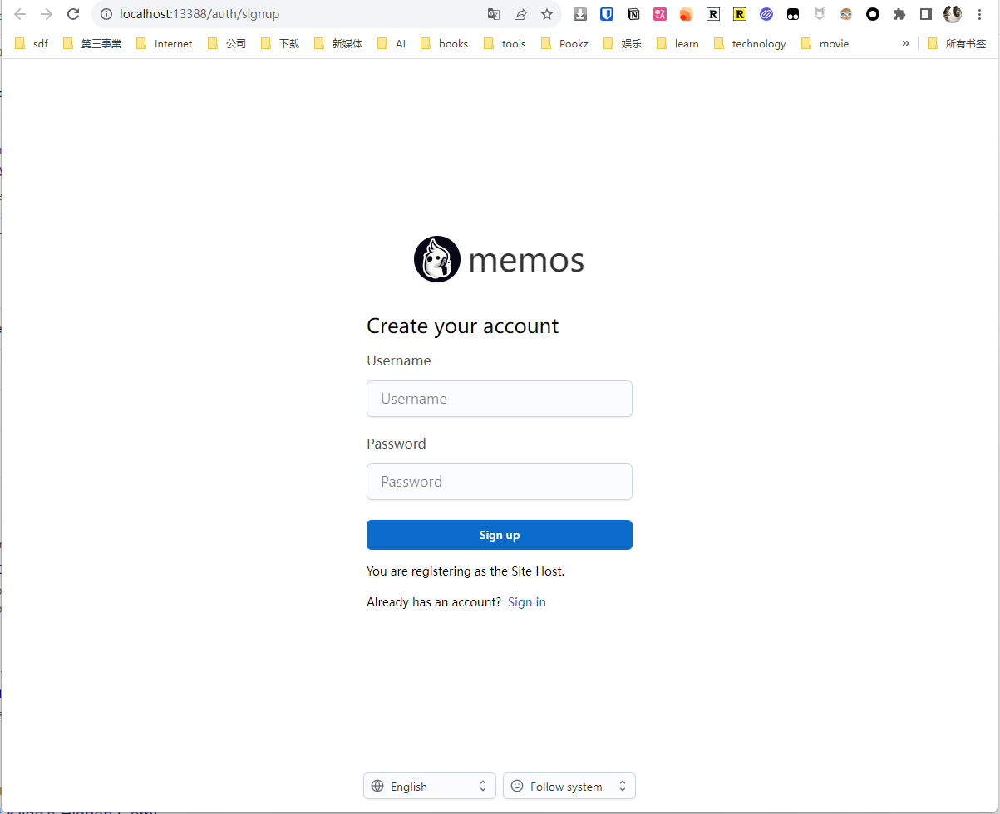
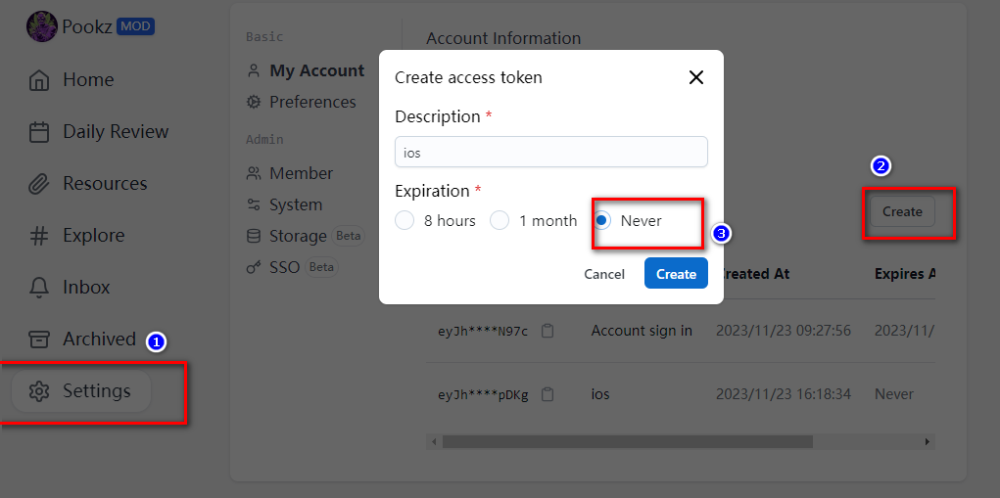

## 1. 前言

我知道，看我文章，喜欢nas的人，大多数都是和我一样的中年男人。这些人在外人面前，是一个满脸皱纹，甚至有些油腻的中年大叔。而在家人面前，在孩子面前，是一个顶梁柱的存在！

我们承担着生活、家庭、教育、经济的压力

![A banner image depicting the theme of a midlife crisis. The image shows a middle-aged person sitting at a desk, surrounded by symbols of a career and family life, such as a laptop, family photos, and a clock showing the passage of time. The person appears contemplative, with a slightly worried expression, reflecting on their life choices and future. The background is a home office setting with bookshelves, a window showing a suburban landscape, and soft, ambient lighting. The scene conveys a mix of achievement and uncertainty, typical of a midlife crisis.](file-yO0tRGpTBWZnPhnTDyl9yCgq)

尤其是在这么一个时代下

- 连大学生都不可避免的毕业即失业，`35岁被淘汰`早已流传多年
- 即便职场上的再多不公，也不敢断然`裸辞`
- 消费市场上的地位，远`不如一条狗`
- 每天最享受的时刻莫过于：回家前，`坐在车里`的时刻、`老婆孩子睡去后`，那短暂的独处时光

- ...

就是这样一个群体，积攒了太多的情绪，有太多的话想要和别人倾诉，可是没有地方可说：

- 和家人说？似乎那是懦弱的体现，徒增家人的担忧
- 和朋友说？中年人能有几个朋友
- 发朋友圈？我最后一次更新是2年前了

![A poignant image of a middle-aged man experiencing loneliness, sitting alone in a dimly lit room. The man is depicted sitting on a simple chair, his head resting in one hand, looking down with a reflective, melancholic expression. The room is sparsely furnished, with minimal decorations, emphasizing the sense of solitude. A single window in the background shows a night sky, adding to the atmosphere of isolation and introspection. The image captures the essence of solitude and the unspoken emotions of a middle-aged man with no one to confide in.](file-BDdrdTcN2fByoJLtNItdxFVf)

而更重要的是：

在心理学领域，长期抑制情绪和心事被视为一种潜在的心理健康风险。积压在心中的情绪和未表达的忧虑，可以导致各种负面影响，包括焦虑、抑郁、甚至是身体上的症状，如失眠和头痛。这些压抑的情绪会在不经意间影响一个人的日常行为和人际关系，可能导致冲动行为、情绪爆发或者社交回避。

相比之下，表达情感，如通过写日记，有助于减轻心理负担，提升自我认识，减少心理压力，并改善心理健康。简而言之，定期抒发情绪是维护心理健康的有效方式。

而这就引出来，我们今天的主角，memos，这个完美的产品，帮助我们

- 发泄情绪
- 记录心情
- 记录每一个生活的快乐
- 捕捉你脑海中的创意想法
- 绝对的隐私，完全自主的控制数据


这是一款既简洁又能够保障个人隐私的笔记工具，它能够让你轻松记录想法，这就是我们今天要介绍的 **Memos** 


### 为什么选择自建Memos?

- **隐私**：在数字化时代，保护个人隐私比以往任何时候都重要。
- **自由**：摆脱第三方服务的限制，自主控制数据。
- **简洁**：回归纯文本，专注于内容而非格式。

## Memos的特点和功能

⭐ 无限创造，开源永久免费
Memos坚持开源精神，不仅是今天，未来也将永久免费。你可以无限制地捕捉灵感，没有任何界限。

⭐ 使用Docker，秒速自托管
借助Docker的灵活性和易用性，Memos的搭建和扩展都变得异常简单。你可以完全掌控数据和隐私，无需担心外部因素的干扰。

⭐ 纯文本与Markdown支持
告别繁复的格式设置，Memos采用纯文本方式，支持Markdown，让你专注于内容本身，提升写作和记录的效率。

⭐ 定制与分享轻而易举
Memos提供直观的分享功能，不论是个人笔记还是团队协作，都能轻松应对。

⭐ 支持RESTful API
通过RESTful API，Memos能够轻松集成至第三方服务，打开无限可能。


## 搭建步骤


## 1. 重点

`点个免费关注`，不迷路

## 2. docker管理图形工具

#### 群晖 DSM 7.2版本以上可以直接使用 *Container Manager*


#### 威联通 ContainerStation 


#### 自行安装Portainer

教程参考：

[30秒安装Nas必备神器 Portainer](/how-to-install-portainer-in-nas/)

接下来以Portainer 为例

##  3. File Station

File Station 打开docker 文件夹，创建`memos`文件夹


## 4. 创建stack


## 5.  部署代码

```yaml
version: "3.0"
services:
  memos:
    image: neosmemo/memos:latest
    container_name: memos
    volumes:
      - /volume1/docker/memos_data:/var/opt/memos
    environment:
      - metric=False
    ports:
      - 13388:5230
```

1. 选择stack
2. name栏输入memos
3. edditor输入：上面代码
4. 点击deploy

## 6. 成功


## 7. 使用

浏览器进入程序：[ip]:[端口]

> ip为你nas所在ip（这里我的是172.16.23.106），端口为上面配置文件定义，如果你按照我的教程，则是13388




设置账号密码后：


我们可以轻松在未来看到，当时的自己有着什么样的心情，曾经那些问题，到今天还是问题吗？


## 8. 特殊功能展示

### ios联动

>  本文不涉及公网ip以及内网渗透等问题

1. 先在memos生成token



2. 添加快捷指令：

https://www.icloud.com/shortcuts/1eaef307112843ed9f91d256f5ee7ad9

3. 配置

配置你的公网地址：


添加到桌面：


测试


最后，android以及其他的客户端，大家可以自行查找或者在下面留言

## 最后

Memos在我众多玩具中，并不仅仅是一个简单的笔记工具，它是中年男士情感世界的安全港湾。在这里，你可以无忧地记录生活琐事、深夜思考，甚至是那些未曾对人吐露的心声。


如果你喜欢这篇文章，请记得点赞，收藏，并关注【老爸的数字花园】，我们将会持续带来更多实用的自搭建应用指南。一起，让我们掌握自己的数据，创建自己的数字世界！

如果你在搭建过程中遇到任何问题，或者有任何建议，也欢迎在下方留言，一起探讨和学习。