## 1. Einführung

Diejenigen, die mich kennen, wissen, dass ich keine Artikel schreibe, nur um welche zu schreiben, und auch keinen Trends folge. Ich teile nur Dinge, die ich nützlich finde und die auch für Sie nützlich sein können.

Das heutige Spielzeug bildet da keine Ausnahme. Neko ist ein virtueller Browser, der in Docker läuft...

> 


Er ist nicht nur ein wesentlicher Bestandteil meines Nas-Dienstes, sondern auch eine Verbindung zwischen mir, meinen Freunden und meiner Familie. Lassen Sie mich erklären...

Für mein Nas nutze ich es, um:

1. `Virtueller Browser`

Allein dieser Grund erklärt schon viel.

Sie sehen, viele Menschen entscheiden sich für den Kauf eines Nas wegen des integrierten Browsers 😄, Synology hat immer noch keinen...

Aber jetzt können Sie einen virtuellen Browser auf jedem Gerät haben.

2. `Sicherer Zugriff`

Oft gibt es viele Dienste im Heimnetzwerk, aber ich möchte nicht, dass alle dem öffentlichen Netzwerk ausgesetzt sind. Je mehr Dienste dem öffentlichen Netzwerk ausgesetzt sind, desto mehr potenzielle Risiken gibt es.

Mit Neko, der im internen Netzwerk eingerichtet ist, kann ich interne Dienste einfach verwalten und darauf zugreifen.

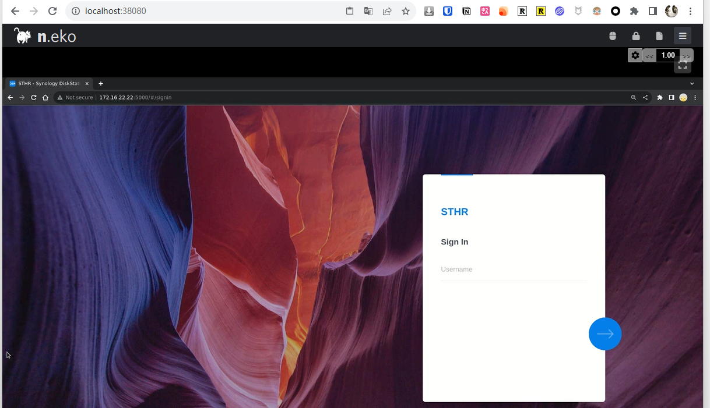

3. `Privatsphäre + Nie aufhören`

Ich denke, das bedarf keiner weiteren Erklärung. Ein privater, immer verfügbarer Browser kann viel bewirken.

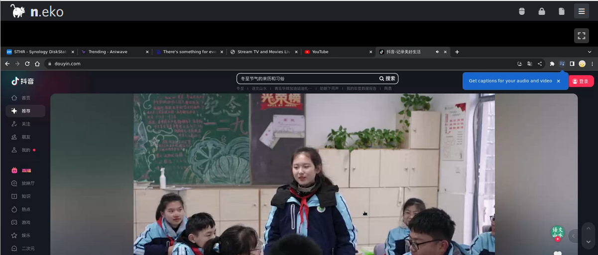

4. `Glück in der Gruppe`

Interessanterweise ist Neko nicht nur auf einen virtuellen Browser beschränkt. Es kann sogar eine multifunktionale soziale Kollaborationsplattform sein.

Sie können es verwenden, um:

- Mit Familie und Freunden zu chatten und TV-Shows oder Anime anzuschauen
- Mit Kollegen und Freunden zu diskutieren und Meetings abzuhalten
- Sie können es sogar für Schulungen und Bildungszwecke nutzen

Das Werkzeug ist `nur so gut, wie Sie es nutzen`...

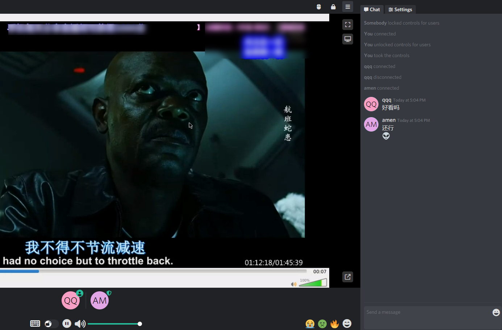

5. `Doppeltes Glück`: Mehr als nur ein Browser

Neko ist nicht nur ein Browser. Mit Hilfe von Tools wie VLC kann er Ihr Heimfernseher werden.


Nun gut, kommen wir zum Hauptgang.

Aufgrund begrenzten Platzes behandelt dieser Artikel nicht:

- Zugriff auf das öffentliche Netzwerk
- Spezielle Netzwerke
- Komplexe Heimnetzwerke usw.

Er ist auf die Einrichtung im internen Netzwerk beschränkt.

Wenn Sie auf solche Probleme stoßen, können Sie einen Kommentar hinterlassen oder in der Community um Hilfe bitten.

---

## Einführung in Neko

Neko ist nicht nur ein einfacher privater Browser. Seine Einzigartigkeit liegt in:

1. **Mehrbenutzererfahrung**: Unterstützt mehrere Benutzer gleichzeitig online, sodass Familienmitglieder und Kollegen dieselbe Plattform teilen und zusammenarbeiten können.
2. **Unterstützung für verschiedene Anwendungen**: Neben Browsern können auch verschiedene Linux-Anwendungen wie VLC ausgeführt werden, um Unterhaltungs- und Arbeitsbedürfnisse zu erfüllen.
3. **Sozial und interaktiv**: Bietet Echtzeitkommunikation und Kollaborationsfunktionen und schafft eine neue Art von Online-Sozialerfahrung.
4. **Privatsphäre und Sicherheit**: Alle Operationen werden in einem sicheren Container durchgeführt, um Ihre Daten und Privatsphäre zu schützen.
5. **Persönliche Anpassung**: Benutzer können Neko nach ihren persönlichen Bedürfnissen anpassen, geeignet für verschiedene Szenarien wie persönliche Unterhaltung, Teamarbeit oder Bildung und Schulung.

6. **Dateiübertragung**: Sie können Dateien übertragen, während Sie mit Freunden und Familie interagieren.

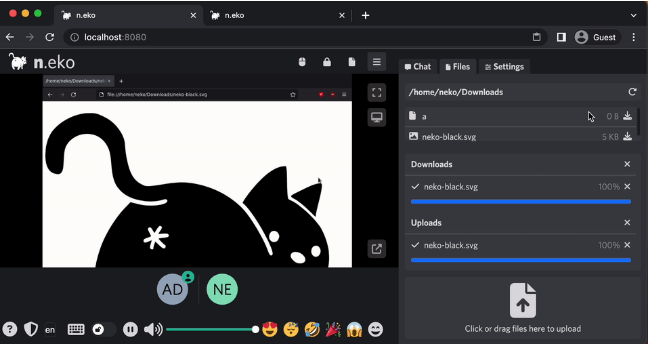

Unterstützte Browser (sowohl bekannte als auch unbekannte):


---

Einrichtungsschritte:

## 1. Schlüsselpunkte

`Folgen Sie kostenlos`, um nicht den Überblick zu verlieren.

## 2. Docker-Verwaltungstool

#### Synology DSM 7.2 oder höher kann direkt den *Container Manager* verwenden


#### QNAP ContainerStation


#### Installieren Sie Portainer selbst

Anleitung als Referenz:

[30-Sekunden-Installation von Portainer, einem unverzichtbaren Tool für NAS](/how-to-install-portainer-in-nas/)

Als nächstes nehmen wir Synology als Beispiel.

## 3. File Station

Öffnen Sie die File Station und erstellen Sie einen Ordner `neko` im Docker-Ordner.

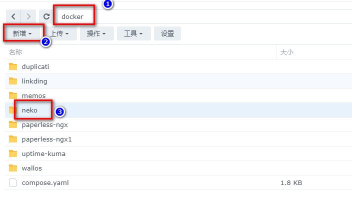

## 4. Container Manager

Für diese Einrichtung verwende ich Synologys Container Manager. Portainer ist ähnlich wie QNAP:

### Konfiguration hochladen

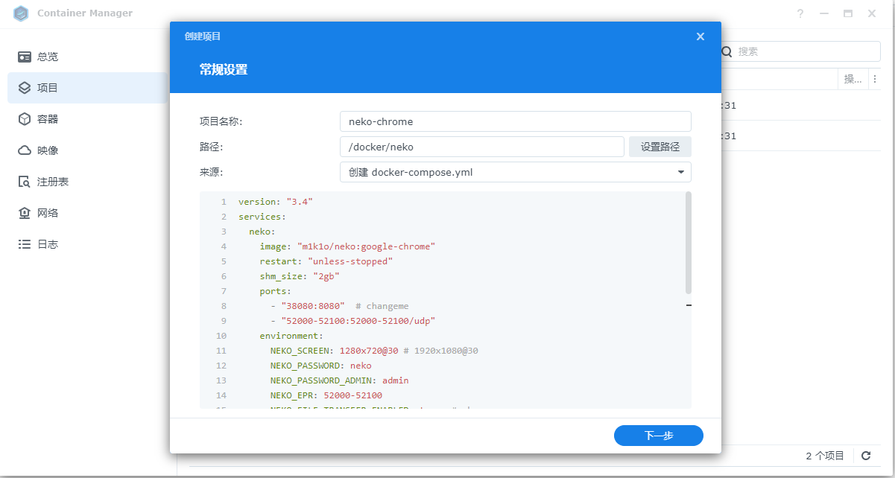

```yaml
version: "3.4"
services:
  neko:
    image: "m1k1o/neko:google-chrome"
    restart: "unless-stopped"
    shm_size: "2gb"
    ports:
      - "38080:8080"  # ändern Sie dies
      - "52000-52100:52000-52100/udp"
    environment:
      NEKO_SCREEN: 1920x1080@30 # 1280x720@30
      NEKO_PASSWORD: neko  # ändern Sie dies
      NEKO_PASSWORD_ADMIN: admin  # ändern Sie dies
      NEKO_EPR: 52000-52100
      NEKO_FILE_TRANSFER_ENABLED: true  # ändern Sie dies
      NEKO_ICELITE: 1
      NEKO_NAT1TO1: 172.16.22.22  # ändern Sie dies
```

Konfigurationserklärung (anpassbar):

> Ich habe die Teile in der obigen Datei markiert, die meiner Meinung nach mit `# changeit` geändert werden können. Für den Rest wird Anfängern nicht empfohlen, sie zu ändern.

- Abschnitt Webserver-Port: Sie können ihn auf eine andere Portnummer ändern, z.B. "`38080:8080`", `ändern Sie nicht die 8080 am Ende`.
- NEKO_SCREEN: Konfigurieren Sie die Auflösung von Neko, `höhere Auflösung erfordert bessere Konfiguration`.
- NEKO_PASSWORD: Passwort für den Besucher-Login.
- NEKO_PASSWORD_ADMIN: Passwort für den Administrator-Login.
- NEKO_FILE_TRANSFER_ENABLED: Ob die Dateiübertragung aktiviert werden soll.
- NEKO_NAT1TO1: Konfigurieren Sie es auf Ihre aktuelle interne IP.

### Warten

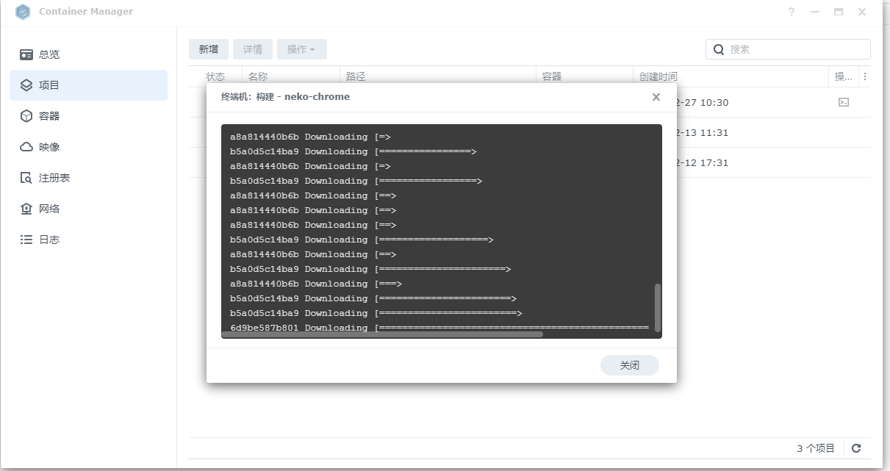

### Erfolg

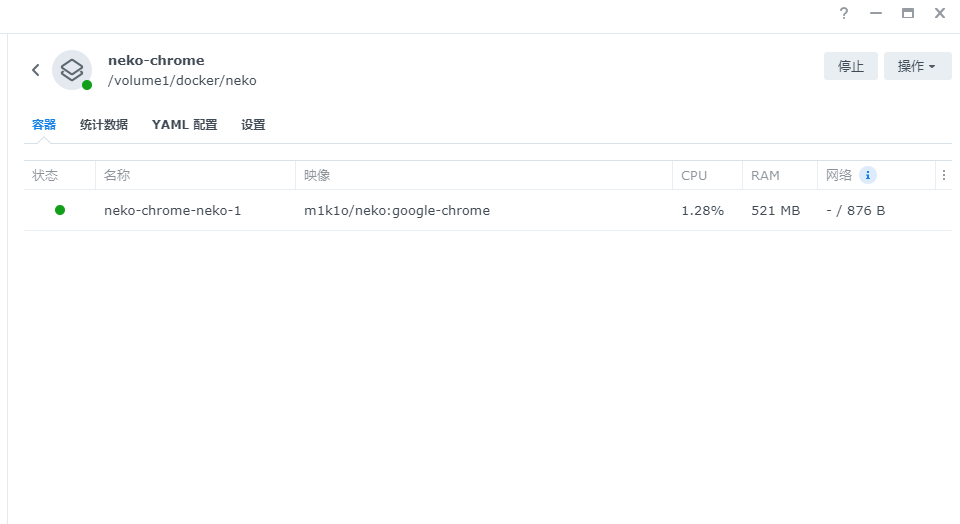

## 5. Verwendung

Geben Sie das Programm im Browser ein: [IP]:[Port]

> Die IP ist die IP Ihres NAS (meine ist 172.16.22.22) und der Port ist in der obigen Konfigurationsdatei definiert. Wenn Sie meiner Anleitung gefolgt sind, ist es 38080.
>
> Geben Sie einen beliebigen Benutzernamen ein und das Passwort ist das in der Kompositionsdatei konfigurierte.

### Zugriff

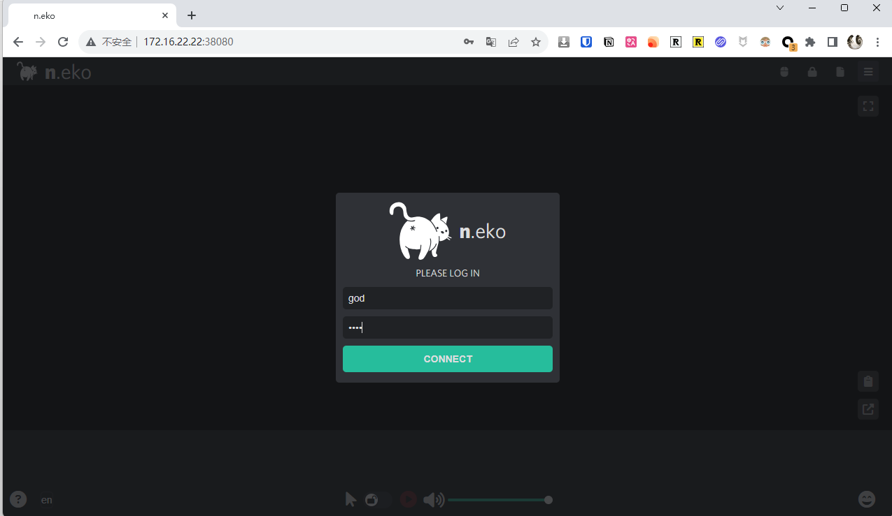

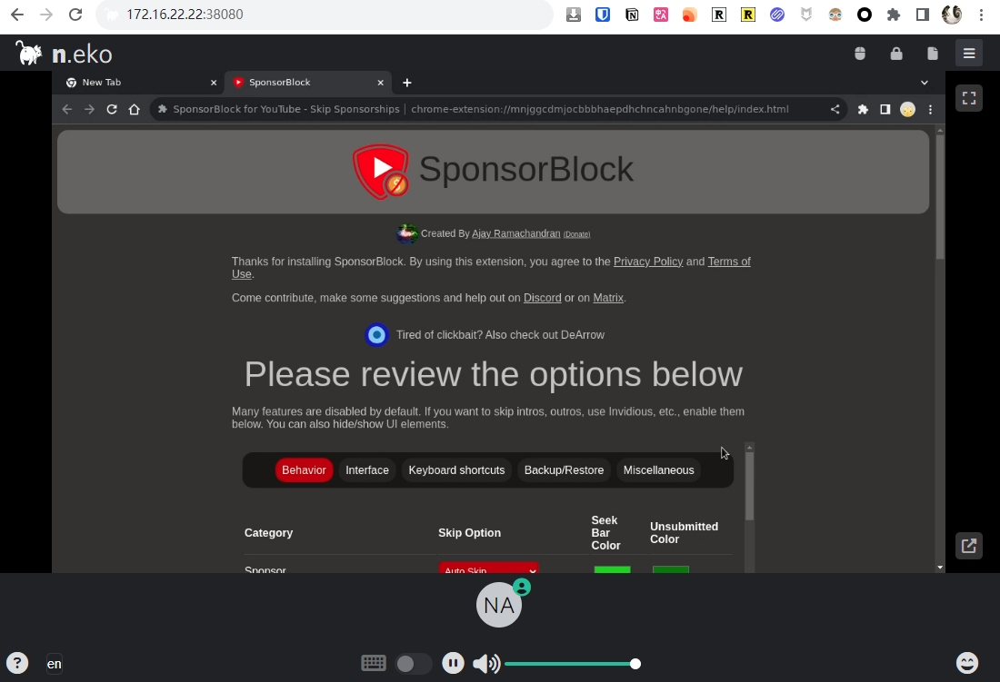

## 6. Showcase besonderer Funktionen

Lassen Sie uns gemeinsam einen Blick auf "Enter the Giant" werfen.

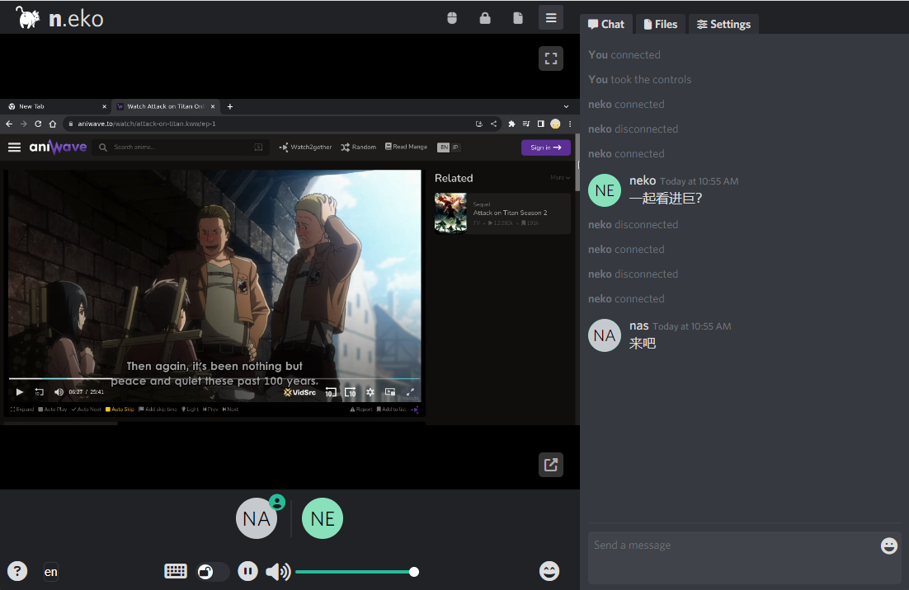

Mobile Display:

Portrait-Modus

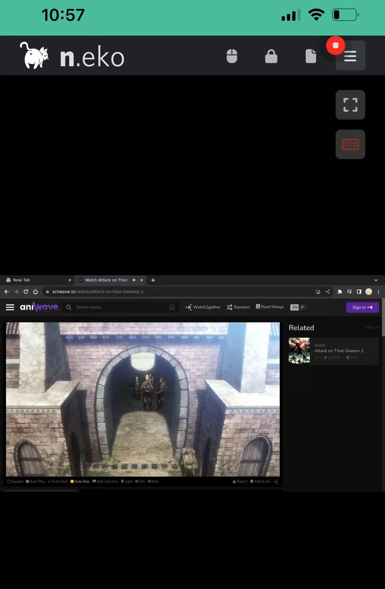

Landscape-Modus:


Schwebender Bildschirm:

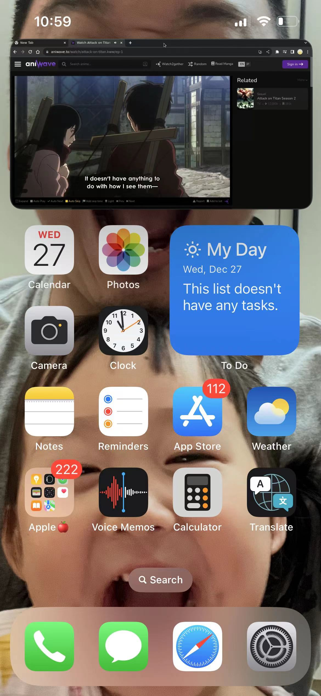

## Schließlich

Was den IPTV-Teil betrifft,


habe ich keine Zeit, daran zu arbeiten, und ich bin mir nicht sicher, ob alle daran interessiert sind.

Ich denke, dieser "mehrbenutzerfreundliche Browser" reicht für alle, um eine Weile damit zu spielen. Wenn Sie Bedarf an IPTV haben,

geben Sie ihm ein "Gefällt mir, Kommentar und Speichern", und ich werde später relevante Anleitungen bereitstellen.

Wenn Ihnen dieser Artikel gefällt, denken Sie bitte daran, "Dad's Digital Garden" zu mögen, zu speichern und zu folgen. Wir werden weiterhin praktische Anleitungen für selbstgebaute Anwendungen bringen. Gemeinsam nehmen wir unsere Daten in die Hand und schaffen unsere eigene digitale Welt!

Wenn Sie während des Einrichtungsprozesses auf Probleme stoßen oder Vorschläge haben, können Sie gerne einen Kommentar hinterlassen, um zu diskutieren und zu lernen.