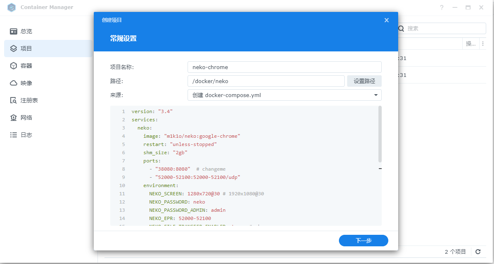
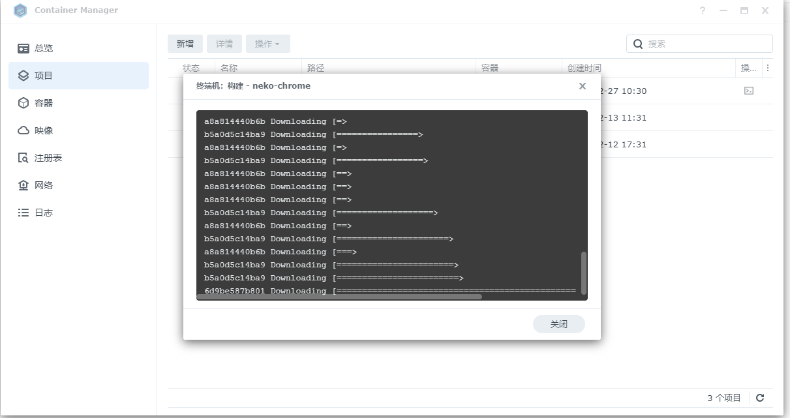
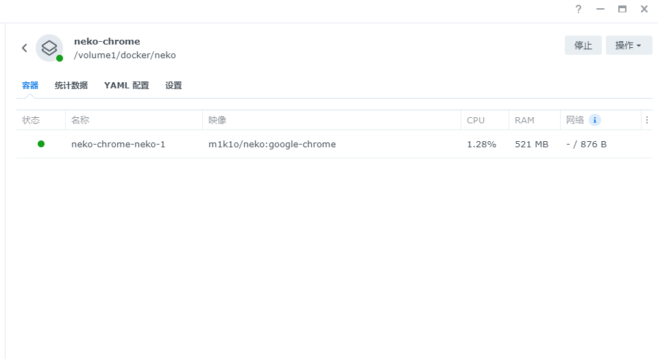
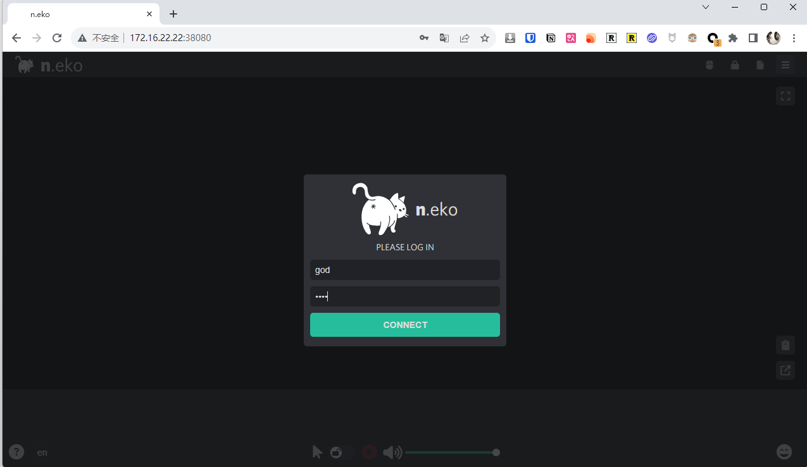
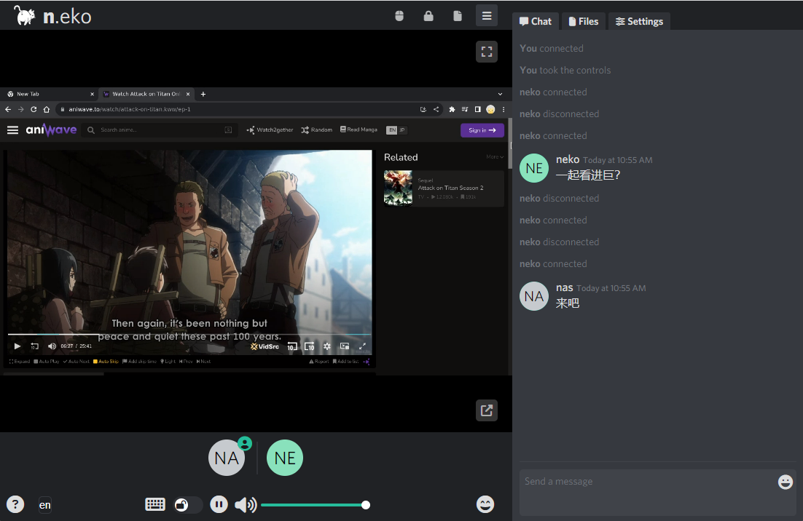

## 1. Introduction

Those who are familiar with me know that I do not write articles for the sake of it, nor do I follow trends. I only share things that I find useful and that may be useful to you.

Today's toy is no exception. Neko is a virtual browser that runs in Docker...

> 


It is not only an essential part of my Nas service, but also a bond between me, my friends, and my family. Let me explain...

For my Nas, I use it to:

1. `Virtual Browser`

This reason alone explains a lot.

You see, many people choose to buy a Nas because of its built-in browser 😄, Synology still doesn't have one...

But now you can have a virtual browser on any device.

2. `Secure Access`

Many times, there are many services within the home network, but I don't want all of them to be exposed to the public network. The more services exposed to the public network, the more potential risks there are.

With Neko set up on the internal network, I can easily manage and access internal services through it.


3. `Privacy + Never Stops`

I think this doesn't need much explanation. A private, always-on browser can do a lot.


4. `Happiness in a Group`

Interestingly, Neko is not limited to just a virtual browser. It can even be a multi-functional social collaboration platform.

You can use it to:

- Chat and watch TV shows or anime with family and friends
- Discuss and hold meetings with colleagues and friends
- You can even use it for training and education

The tool is `only as good as how you use it`...


5. `Double the Happiness`: More than just a browser

Neko is not just a browser. With the help of tools like VLC, it can become your home TV.


Alright, let's get to the main course.

Due to limited space, this article does not cover:

- Public network access
- Special networks
- Complex home networks, etc.

It is limited to setting up on the internal network.

If you encounter such problems, you can leave a comment or seek help in the community.

---

## Introduction to Neko

Neko is not just a simple private browser. Its uniqueness lies in:

1. **Multi-user experience**: Supports multiple users online at the same time, allowing family members and colleagues to share and collaborate on the same platform.
2. **Rich application support**: In addition to browsers, various Linux applications such as VLC can also be run to meet entertainment and work needs.
3. **Social and interactive**: Provides real-time communication and collaboration functions, creating a new type of online social experience.
4. **Privacy and security**: All operations are completed in a secure container to protect your data and privacy.
5. **Personalized customization**: Users can customize Neko according to their personal needs, suitable for various scenarios such as personal entertainment, team collaboration, or education and training.

6. **File transfer**: You can transfer files while interacting with friends and family.


Supported browsers (both familiar and unfamiliar):


---

Setup steps:

## 1. Key Points

`Follow for free` to avoid getting lost.

## 2. Docker management graphical tool

#### Synology DSM 7.2 or above can directly use *Container Manager*


#### QNAP ContainerStation


#### Install Portainer by yourself

Tutorial reference:

[30-second installation of Portainer, a must-have tool for NAS](/how-to-install-portainer-in-nas/)

Next, let's take Synology as an example.

## 3. File Station

Open File Station and create a `neko` folder in the docker folder.


## 4. Container Manager

I am using Synology's Container Manager for this setup. Portainer is similar to QNAP:

### Upload Configuration



```yaml
version: "3.4"
services:
  neko:
    image: "m1k1o/neko:google-chrome"
    restart: "unless-stopped"
    shm_size: "2gb"
    ports:
      - "38080:8080"  # changeme
      - "52000-52100:52000-52100/udp"
    environment:
      NEKO_SCREEN: 1920x1080@30 # 1280x720@30
      NEKO_PASSWORD: neko  # changeme
      NEKO_PASSWORD_ADMIN: admin  # changeme
      NEKO_EPR: 52000-52100
      NEKO_FILE_TRANSFER_ENABLED: true  # changeme
      NEKO_ICELITE: 1
      NEKO_NAT1TO1: 172.16.22.22  # changeme
```

Configuration explanation (customizable):

> I have marked the parts in the above file that I think can be modified with `# changeit`. For the rest, it is not recommended for beginners to modify.

- Web server port section: You can change it to another port number, such as "`38080:8080`", `do not modify the 8080 at the end`.
- NEKO_SCREEN: Configure the resolution of Neko, `higher resolution requires better configuration`.
- NEKO_PASSWORD: Visitor login password.
- NEKO_PASSWORD_ADMIN: Administrator login password.
- NEKO_FILE_TRANSFER_ENABLED: Whether to enable file transfer.
- NEKO_NAT1TO1: Configure it to your current internal IP.

### Wait



### Success



## 5. Usage

Enter the program in the browser: [ip]:[port]

> The IP is the IP of your NAS (mine is 172.16.22.22), and the port is defined in the configuration file above. If you follow my tutorial, it is 38080.
>
> Enter any username and the password is the one configured in the compose file.

### Access




## 6. Special Features Showcase

Let's take a look at "Enter the Giant" together.



Mobile Display:

Portrait Mode


Landscape Mode:


Floating Screen:


## Finally

As for the IPTV part,


I don't have time to work on it, and I'm not sure if everyone is interested.

I think this "multi-user shared browser" is enough for everyone to play with for a while. If you have a need for IPTV,

give it a "like, comment, and save," and I will provide relevant tutorials later.

If you like this article, please remember to like, save, and follow "Dad's Digital Garden." We will continue to bring more practical self-built application guides. Together, let's take control of our own data and create our own digital world!

If you encounter any problems or have any suggestions during the setup process, feel free to leave a comment below for discussion and learning.