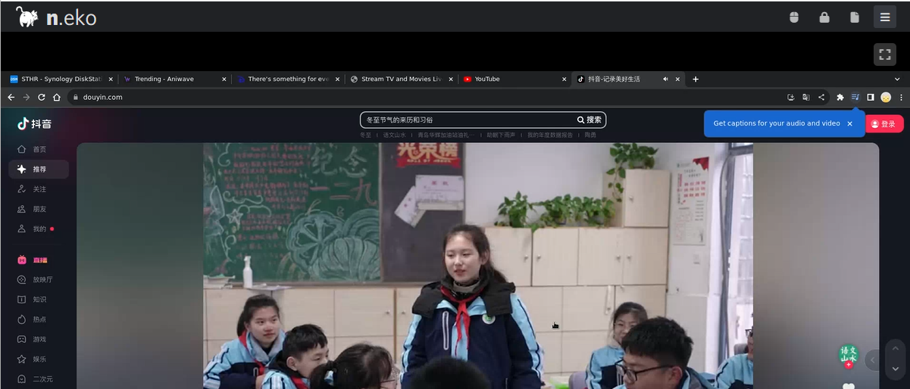
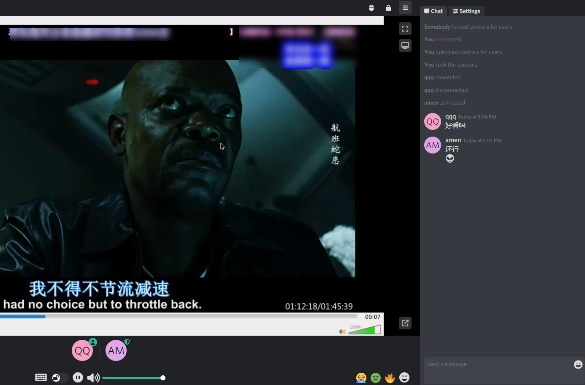
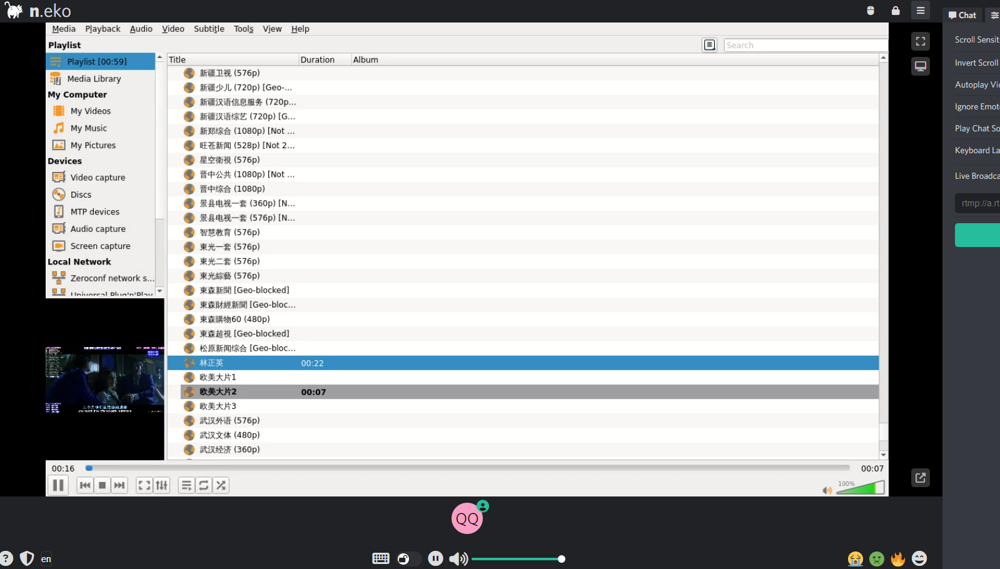
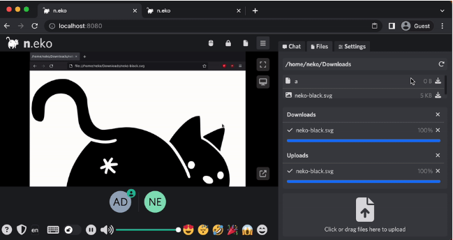
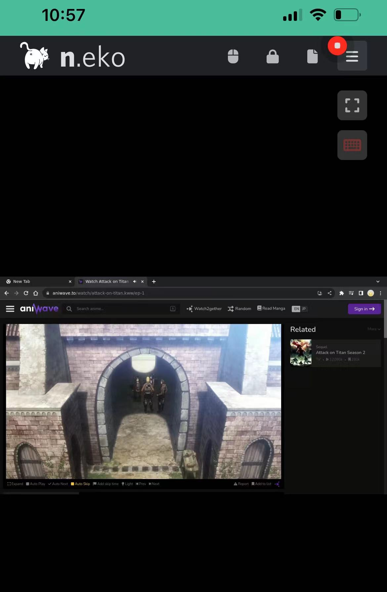

## 1. 前言

熟悉我的都知道，我，`不水文`，`不跟风`，仅仅分享我认为对我有用，并且可能对你`有用的东西`。

今天这个玩具也不例外，n.eko 一款运行在docker 中的虚拟浏览器...

> 


它不仅仅是我nas服务中的必不可少的一员，同时也是我和朋友、家人之间情感的纽带，且听我慢慢道来...

对nas 来说，我用它来：

1. `虚拟浏览器`

单单这个理由，就已经说明太多了。

要知道多少人，因为威联通的内置浏览器而选择买它😄，群晖至今没有...

而现在你能在任意设备上拥有虚拟浏览器

2. `安全的访问`

许多时候，家庭内网中有诸多服务，但是我并不希望他们都公开在公网，每多一个服务公开在公网，就多一分潜在的风险

这时候neko架设在内网，通过它，我可以轻松管理和访问内部的服务


3. `隐私+永不停机`

这个我觉得不需要解释什么，一个私密、永远不停机的浏览器，能做的事情很多



4. `快乐`一窝人

有趣的是，neko不局限于一个虚拟浏览器，它甚至是一个多功能社交协作平台

你可以用它来:

- 与家人朋友一起边聊天，边刷剧，看番
- 与同事朋友一起讨论、开会
- 你甚至可以以此来培训教育

工具，`取决于你如何使用它`...





5. `快乐翻倍`: 不止于浏览器

neko不仅仅是一个浏览器，它可以 借助vlc等工具，成为你的家庭电视机




好了，我们`开始正餐`

因篇幅有限，本文同样不涉及

- 公网访问
- 特殊网络
- 复杂家庭网络等问题

仅限于内网搭建

如遇此类问题，可以留言、在社群寻求帮助

---

## 介绍n.eko

Neko不只是一个简单的私密浏览器，它的独特之处在于：

1. **多用户体验**：支持多人同时在线，无论是家人还是同事，都可以在同一平台上共享和协作。
2. **丰富应用支持**：除了浏览器，还可以运行如VLC等多种Linux应用，满足娱乐和工作的需求。
3. **社交和互动**：提供实时交流和协作功能，创造了一种新型的线上社交体验。
4. **隐私和安全**：所有操作都在安全的容器内完成，保护你的数据和隐私。
5. **个性化定制**：用户可以根据个人需要定制Neko，适用于个人娱乐、团队协作或教育培训等多种场景。

6. **文件传输**: 你可以在和好友家人互动的同时，实现文件互传




支持的浏览器（见没见过的都有）


---

搭建步骤：

## 1. 重点

`点个免费关注`，不迷路

## 2. docker管理图形工具

#### 群晖 DSM 7.2版本以上可以直接使用 *Container Manager*


#### 威联通 ContainerStation 


#### 自行安装Portainer

教程参考：

[30秒安装Nas必备神器 Portainer](/how-to-install-portainer-in-nas/)


接下来以群晖为例

##  3. File Station

File Station 打开docker 文件夹，创建`neko`文件夹


 ## 4. Container Manager 

本次我使用的是群晖的Container Manager来搭建 ，Portainer与威联通基本类似：

###  上传配置


```yaml
version: "3.4"
services:
  neko:
    image: "m1k1o/neko:google-chrome"
    restart: "unless-stopped"
    shm_size: "2gb"
    ports:
      - "38080:8080"  # changeme
      - "52000-52100:52000-52100/udp"
    environment:
      NEKO_SCREEN: 1920x1080@30 # 1280x720@30
      NEKO_PASSWORD: neko  # changeme
      NEKO_PASSWORD_ADMIN: admin  # changeme
      NEKO_EPR: 52000-52100
      NEKO_FILE_TRANSFER_ENABLED: true  # changeme
      NEKO_ICELITE: 1
      NEKO_NAT1TO1: 172.16.22.22  # changeme
```


配置讲解（自定义）：

> 我在上述文件中标注了，我认为可以修改的部分  # changeit。其余部分，初学者，不建议修改

- webserver 的port 部分： 可以改为其他端口号  如"`38080:8080`" ，`不要修改后面`的8080
- NEKO_SCREEN： 配置neko的分辨率，`更高则要更好的配置`
- NEKO_PASSWORD： 访客登录密码
- NEKO_PASSWORD_ADMIN： 管理员登录密码
- NEKO_FILE_TRANSFER_ENABLED：是否开启文件传输
- NEKO_NAT1TO1： 配置为你当前内网ip

### 等待


### 成功


## 5. 使用

浏览器进入程序：[ip]:[端口]

> ip为你nas所在ip（这里我的是172.16.22.22），端口为上面配置文件定义，如果你按照我的教程，则是38080
>
> 用户名随便输入，密码是compose中的配置

### 访问


## 6. 特殊功能展示


一起来看《进巨》吧


手机端展示：

竖屏



横屏：


悬浮屏：


## 最后

至于iptv 这部分


没时间弄，也不确定大家是否感兴趣。

我觉得这个`多人共享的浏览器`够大家玩一阵子了，如果对iptv有需求的

献上你们`点赞留言收藏`，我会在后面出相关的教程


如果你喜欢这篇文章，请记得点赞，收藏，并关注【老爸的数字花园】，我们将会持续带来更多实用的自搭建应用指南。一起，让我们掌握自己的数据，创建自己的数字世界！

如果你在搭建过程中遇到任何问题，或者有任何建议，也欢迎在下方留言，一起探讨和学习。