## 1. Einführung

Nach all dem Basteln habe ich festgestellt, dass `90% der NAS-Anwendungen nutzlos sind`.

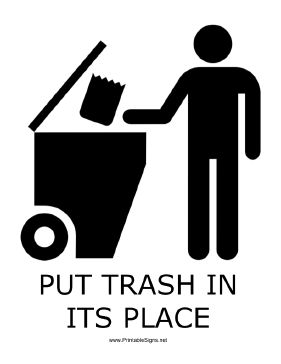

Nur `3 oder 2` von ihnen sind tatsächlich nützlich.

Die meiste Zeit lassen wir sie nach dem Einrichten nach verschiedenen Anleitungen und Tutorials einfach `unberührt`.

Von der ersten NAS, die ich hatte, der Star Snail, bis heute, nach 8 Jahren, habe ich unzählige selbst gehostete Anwendungen erforscht.

Der Protagonist, den ich heute vorstelle, gehört zu den verbleibenden 10%, die tatsächlich nützlich sind.

Genauer gesagt kann er als die Top 1% unter diesen 10% der Nützlichkeit betrachtet werden.

Die Vorteile, die er mir bringt, betreffen nicht nur das Leben und die Arbeit, sondern auch eine bessere `Dokumentenverwaltung und Dateisuche`.

Dank ihm habe ich mindestens `500 Stunden` gespart.

---

Bevor ich ihn offiziell vorstelle, möchte ich über ein anderes Thema sprechen: Warum ich immer `nicht in der Lage war, das Apple-Ökosystem zu verlassen`.

Das Apple-Ökosystem hat mir nicht nur `bequeme Systeme`, `Sicherheit` und `reibungslose Integration aller Geräte` gebracht, sondern auch einen der größten Gründe: Die leistungsstarke `Foto-OCR-Funktion` von Apple.

Wenn ich zum Beispiel einen `Chat-Screenshot` aus einem Gespräch finden möchte, das ich vor einiger Zeit mit einem Verkäufer hatte, um Beweise vorzulegen,

Im Vergleich zur vorherigen Methode, jedes Bild einzeln durchzusuchen, kann ich jetzt einfach nach dem Schlüsselwort `Schraubenzieher` suchen. Apple Fotos findet direkt das Bild, das einen `Schraubenzieher` enthält.

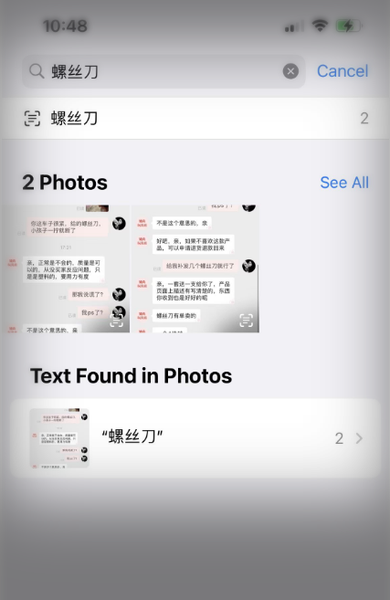


Wenn Sie mit dieser Funktion noch nicht vertraut sind, versuchen Sie es nicht sofort selbst.

Das Spielzeug, das ich Ihnen heute vorstelle, kann Ihnen dasselbe bieten:

- Den gleichen Effekt wie die Apple-Funktion.
- Gehostet auf `Ihrem NAS`.
- Volle Kontrolle über Ihre Daten.

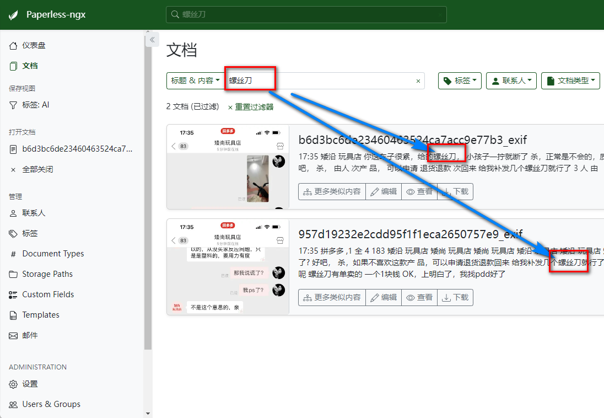

- Es unterstützt auch `Online-Vorschau`:

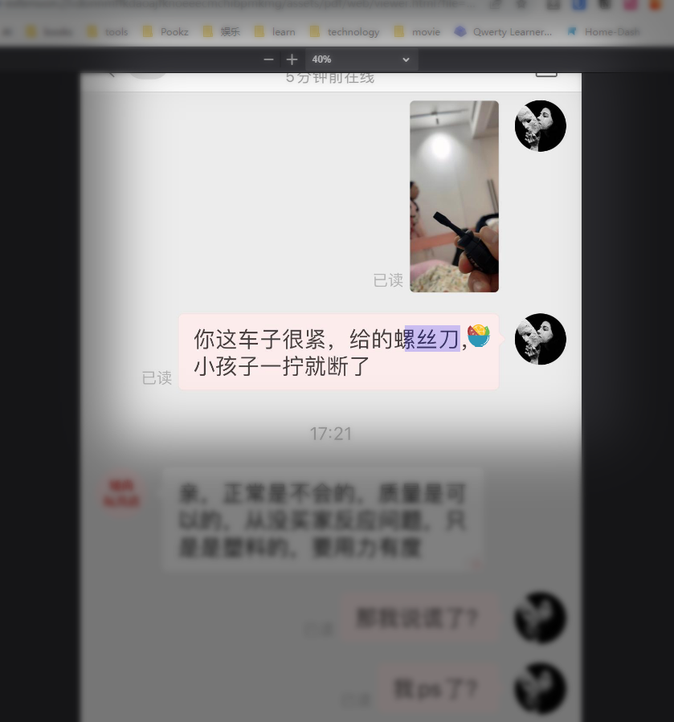

- Es unterstützt alle `digitalen Dokumente`: Nicht nur Bilder, sondern auch PDFs, Word-Dokumente, Excel-Tabellen und sogar Markdown-Dateien. Es ermöglicht wirklich die Digitalisierung von Dokumenten, deren einheitliche Verwaltung und effiziente Suche.

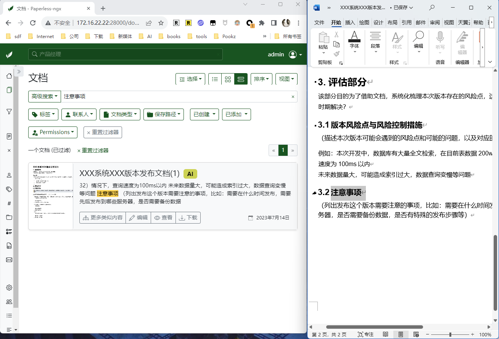

Das ist das neue Spielzeug, das ich Ihnen heute vorstelle, Paperless-ngx. Wie der Name schon sagt, geht es darum, papierlos zu werden.

Es kann Ihnen helfen, Ihre Verträge, `physischen Dokumente`, Rechnungen und mehr zu organisieren, während es auch digitale Dokumente (Word, Excel, PDF usw.) verwaltet.

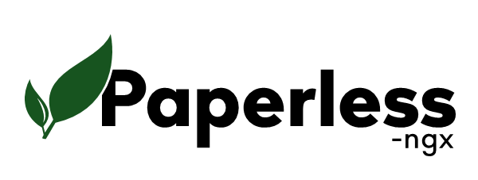

---

## Einführung in Paperless-ngx

Paperless-ngx ist nicht nur ein Dokumentenmanagementsystem. Es ist eine umfassende Lösung, die Ihre physischen Dateien in durchsuchbare Online-Archive umwandelt und den Papierverbrauch reduziert. Zu seinen Kernfunktionen gehören:

- **Dokumentenorganisation und Indexierung**: Organisieren Sie gescannte Dokumente mithilfe von Tags, Korrespondenten, Typen und mehr.
- **OCR-Texterkennung**: Führen Sie eine optische Zeichenerkennung auf Dokumenten durch, um eine Textsuche und -auswahl zu ermöglichen, auch für Dokumente mit Bildern.
- **Unterstützung mehrerer Sprachen**: Verwenden Sie die Open-Source-Engine Tesseract, um über 100 Sprachen zu unterstützen.
- **Langzeit-Speicherformat**: Speichern Sie Dokumente im PDF/A-Format, das für die Langzeitarchivierung entwickelt wurde.
- **Intelligente Tagging und Klassifizierung**: Fügen Sie automatisch Tags, Korrespondenten und Dokumententypen mithilfe von maschinellem Lernen hinzu.
- **Breite Dateiunterstützung**: Unterstützung für PDF-Dokumente, Bilder, einfache Textdateien, Office-Dokumente und mehr.
- **Anpassbare Dateiverwaltung**: Paperless-ngx verwaltet Dateinamen und Ordner und unterstützt verschiedene Konfigurationen.
- **Moderne Webanwendung**: Anpassbares Dashboard, Filter, Stapelbearbeitung, Drag & Drop-Upload, benutzerdefinierte Ansichten, freigegebene Links und mehr.
- **Volltextsuche**: Autovervollständigung, Relevanzbewertung und Hervorhebung der übereinstimmenden Suchbegriffe.
- **E-Mail-Verarbeitung**: Importieren Sie Dokumente aus E-Mail-Konten und konfigurieren Sie mehrere Konten und Regeln.
- **Berechtigungssystem für mehrere Benutzer**: Integriertes robustes Berechtigungssystem für mehrere Benutzer.
- **Optimierung für Mehrkernsysteme**: Parallele Verarbeitung mehrerer Dokumente.

---

Einrichtungsschritte:

## 1. Schlüsselpunkte

`Folgen Sie kostenlos`, um auf dem Laufenden zu bleiben.

## 2. Docker-Verwaltungstools mit grafischer Benutzeroberfläche

#### Synology DSM 7.2 oder höher kann direkt den *Container Manager* verwenden


#### QNAP ContainerStation


#### Installieren Sie Portainer selbst

Tutorial-Referenz:

[Installieren Sie Portainer in NAS in 30 Sekunden](/how-to-install-portainer-in-nas/)

## 3. File Station

- Öffnen Sie die File Station und erstellen Sie einen Ordner `paperless-ngx` im Docker-Ordner.

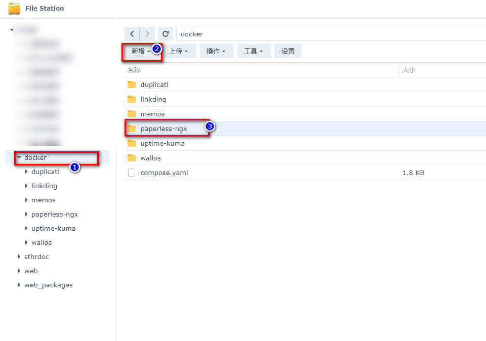

- Erstellen Sie die folgenden Verzeichnisse innerhalb des Ordners `paperless-ngx`:
  - consume
  - data
  - export
  - media
  - pgdata
  - redisdata

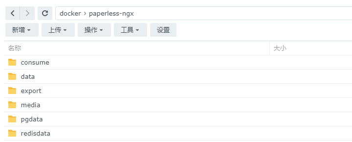

## 4. Container Manager

Ich verwende den Container Manager von Synology für diese Einrichtung, aber Portainer und QNAP sind ähnlich:

### Konfiguration hochladen

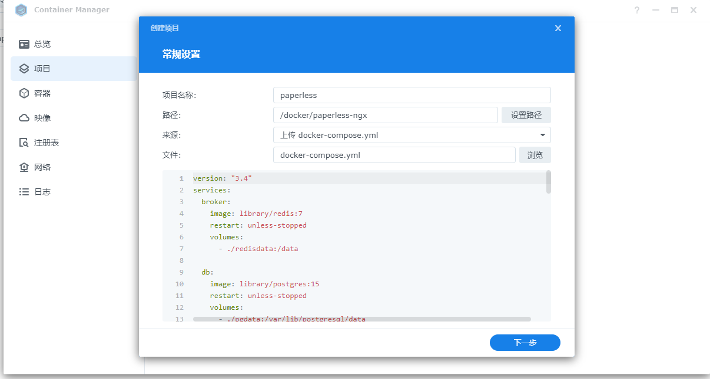

Kopieren Sie die folgende Konfiguration:

```yaml
version: "3.4"
services:
  broker:
    image: library/redis:7
    restart: unless-stopped
    volumes:
      - /volume1/docker/paperless-ngx/redisdata:/data

  db:
    image: library/postgres:15
    restart: unless-stopped
    volumes:
      - /volume1/docker/paperless-ngx/pgdata:/var/lib/postgresql/data
    environment:
      POSTGRES_DB: paperless
      POSTGRES_USER: paperless
      POSTGRES_PASSWORD: paperless
```


```markdown
webserver:
  image: paperlessngx/paperless-ngx:latest
  restart: unless-stopped
  depends_on:
    - db
    - broker
    - gotenberg
    - tika
  ports:
    - "28000:8000"  # ändere es, wenn du möchtest
  healthcheck:
    test: ["CMD", "curl", "-fs", "-S", "--max-time", "2", "http://localhost:8000"]
    interval: 30s
    timeout: 10s
    retries: 5
  volumes:
    - /volume1/docker/paperless-ngx/data:/usr/src/paperless/data
    - /volume1/docker/paperless-ngx/media:/usr/src/paperless/media
    - /volume1/docker/paperless-ngx/export:/usr/src/paperless/export
    - /volume1/docker/paperless-ngx/consume:/usr/src/paperless/consume
  environment:
    PAPERLESS_REDIS: redis://broker:6379
    PAPERLESS_DBHOST: db
    PAPERLESS_TIKA_ENABLED: 1
    PAPERLESS_TIKA_GOTENBERG_ENDPOINT: http://tika:3009
    PAPERLESS_TIKA_ENDPOINT: http://gotenberg:9998
    PAPERLESS_OCR_LANGUAGES: chi-sim chi-tra  # ändere es, wenn du möchtest
    PAPERLESS_OCR_LANGUAGE: eng+chi_sim  # ändere es, wenn du möchtest
    USERMAP_UID: 0
    USERMAP_GID: 0
    PAPERLESS_TIME_ZONE: Asia/Shanghai  # ändere es, wenn du möchtest
  dns:
    - 8.8.8.8
    - 8.8.4.4

gotenberg:
  image: gotenberg/gotenberg:7.10
  restart: unless-stopped
  command:
    - "gotenberg"
    - "--chromium-disable-javascript=true"
    - "--chromium-allow-list=file:///tmp/.*"

tika:
  image: apache/tika:latest
  restart: unless-stopped
```

Erklärung der Konfiguration (anpassbar):

> Ich habe die Teile in der obigen Datei markiert, die meiner Meinung nach mit "# ändere es, wenn du möchtest" geändert werden können. Für den Rest wird Anfängern nicht empfohlen, sie zu ändern.

- Abschnitt "ports" des Webservers: Du kannst ihn auf einen anderen Port wie "`38000:8000`" ändern, `ändere nicht die 8000 am Ende`

- PAPERLESS_OCR_LANGUAGES: Setze die `unterstützten Sprachen` für Paperless, chi-sim chi-tra (Vereinfachtes Chinesisch, Traditionelles Chinesisch), du kannst die gewünschte Sprache hinzufügen, z.B. jpn

  Außerdem enthält das System bereits Englisch, Deutsch, Italienisch, usw.

- PAPERLESS_OCR_LANGUAGE: `Standard-Sprache für OCR`, ich habe sie hier auf Englisch und Vereinfachtes Chinesisch gesetzt

- PAPERLESS_TIME_ZONE: Setze deine Zeitzone

### Warten:

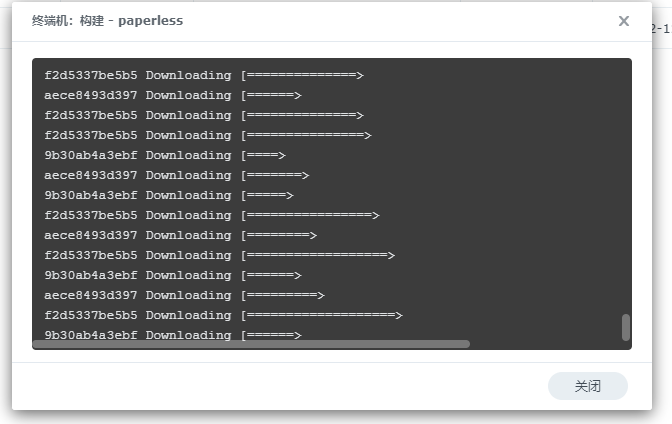

### Fertig:

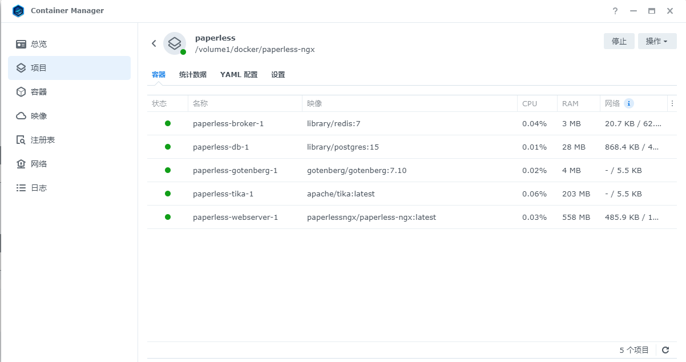

## 5. Verwendung

Greife über den Browser auf das Programm zu: [IP]:[Port]

> IP ist die IP-Adresse deines NAS (meine ist 172.16.22.22) und der Port ist in der obigen Konfigurationsdatei definiert. Wenn du meiner Anleitung gefolgt bist, ist es 28000.

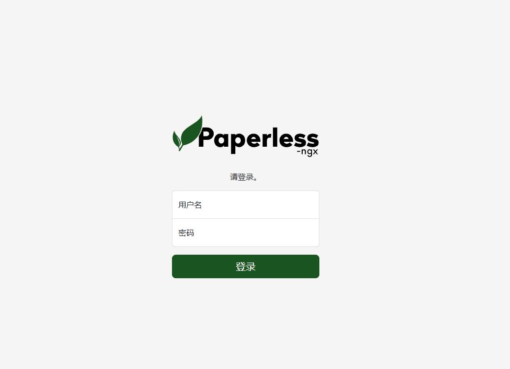

Aber anscheinend hast du noch keinen Benutzernamen und kein Passwort, also lass uns `einen Benutzer und ein Passwort erstellen`:

Wähle den Webserver-Container aus und öffne das Terminal:

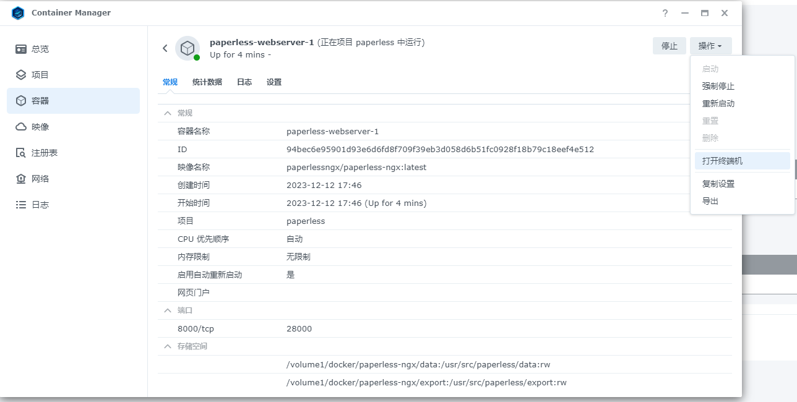

> python3 manage.py createsuperuser

Gib folgende Informationen ein:

- Benutzername
- E-Mail
- Passwort

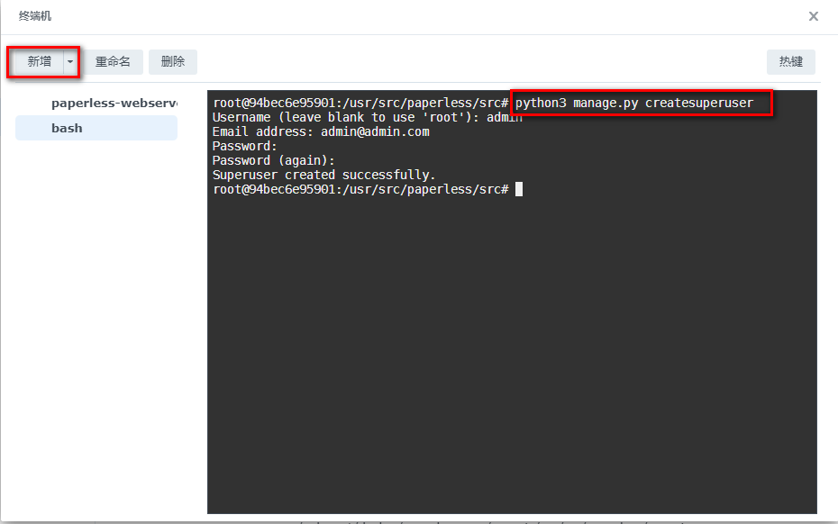

## 6. Showcase besonderer Funktionen

### Startseite:

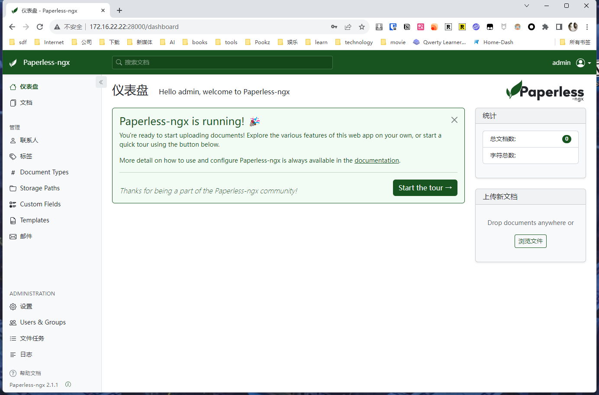

### Test-PDF-Datei:

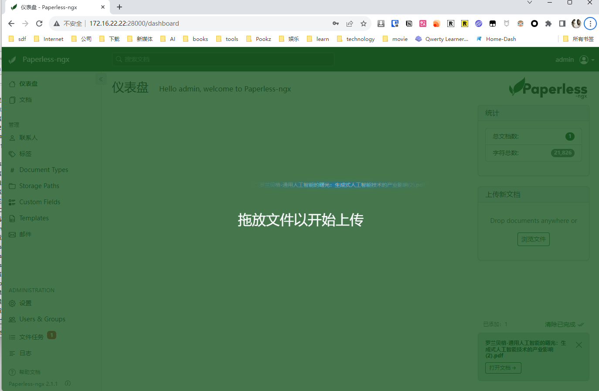

Der Text wurde extrahiert:

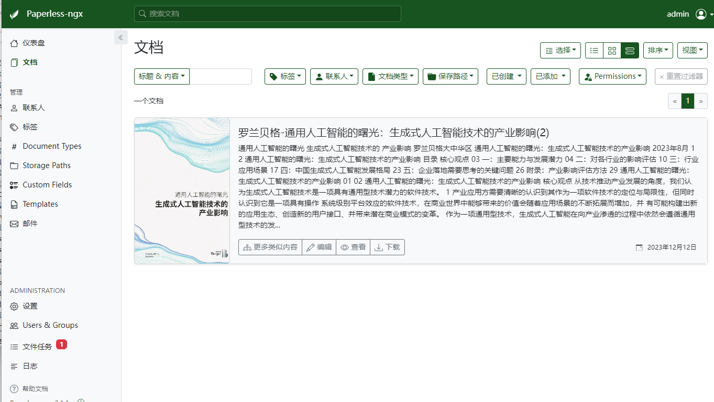

#### Online-Vorschau:

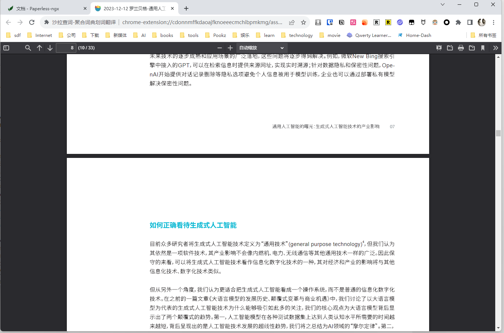

#### Suchfunktion:

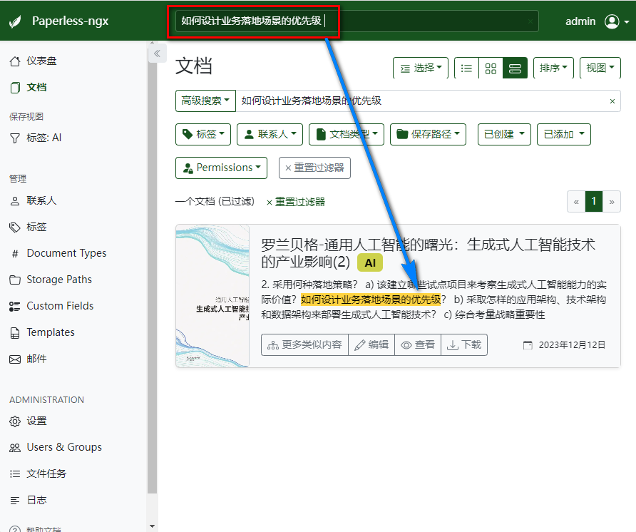

### Bilder:

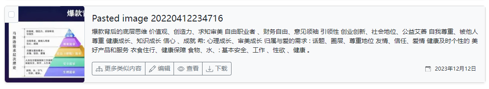

In der Bearbeitungsansicht kannst du das erkannte Ergebnis sehen und Änderungen vornehmen:

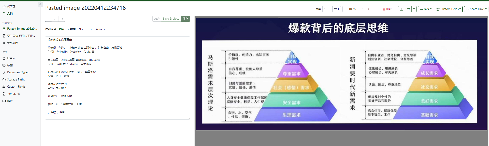

#### Suche:

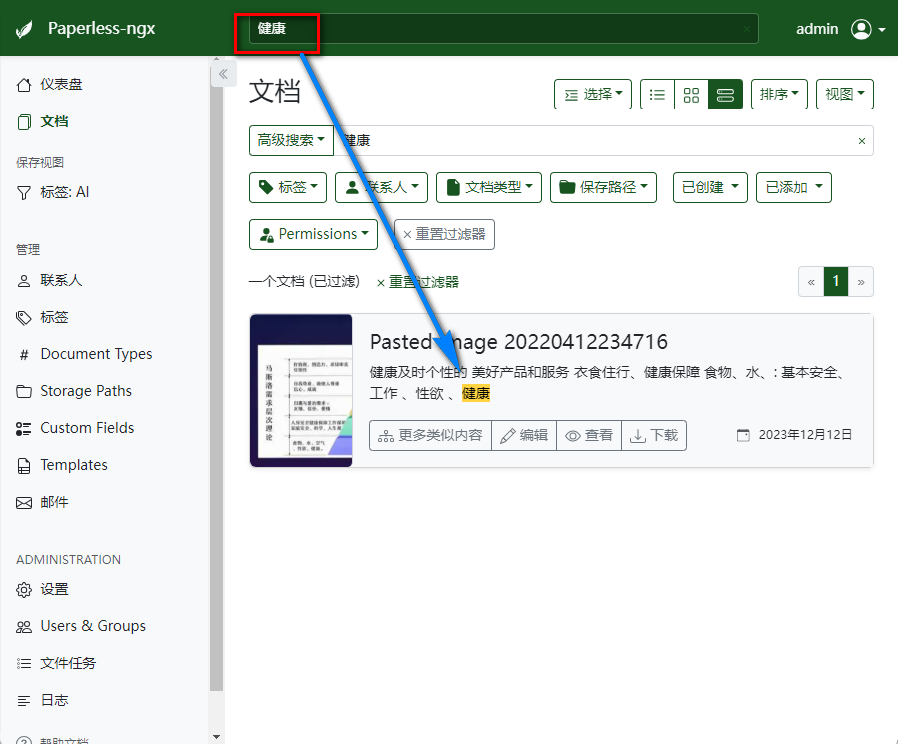

### Versuch mit Word-Dateien:

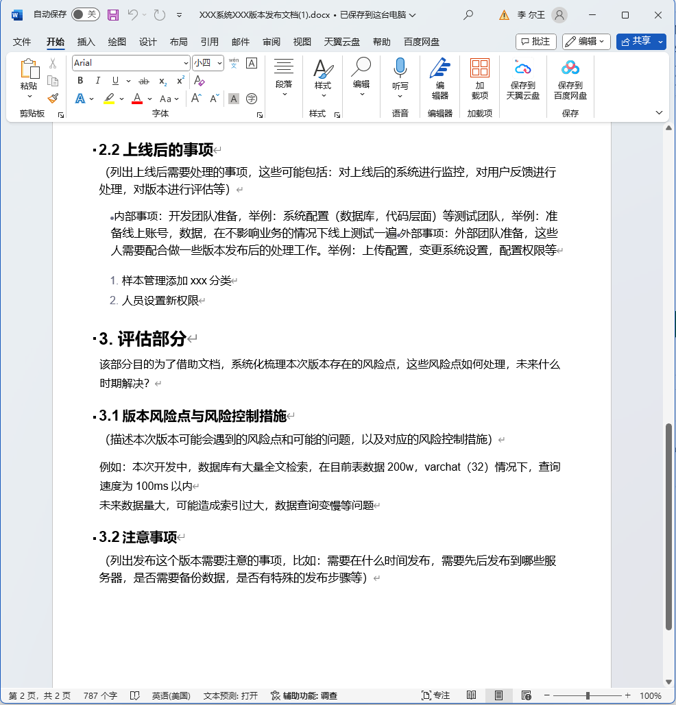

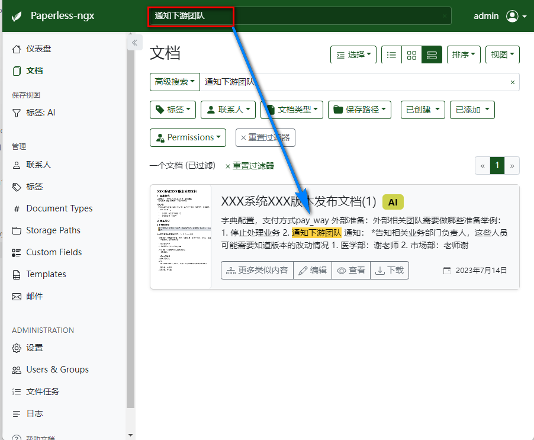

### Andere Apps / Unterstützung

Du kannst auch die Drittanbieter-App `paperless_app` herunterladen

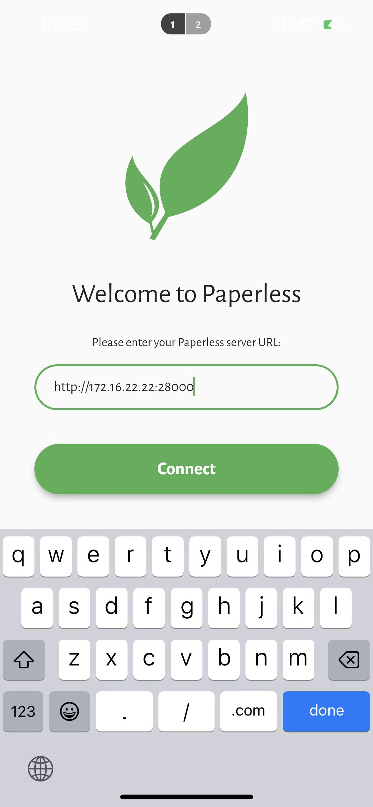

Du kannst auch andere Scan-Apps verwenden und sie dann in pp importieren (bessere Erkennung), wie z.B. die kostenlose Microsoft Lens


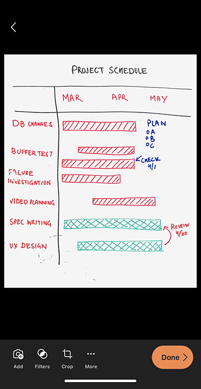

Du kannst auch deinen physischen Drucker anschließen und automatisch in Paperless hochladen:

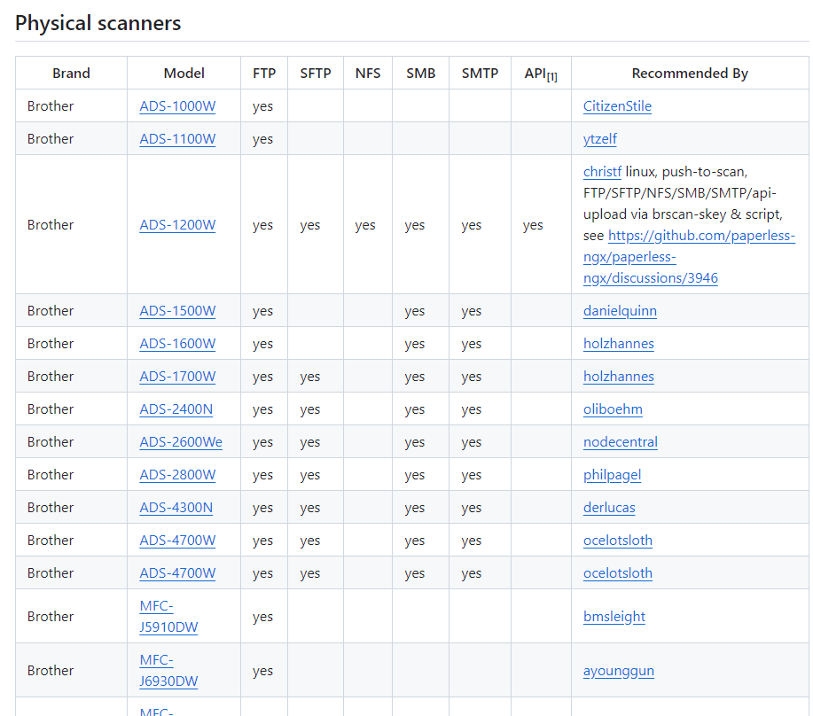

Wenn du weitere Ideen hast, teile sie gerne mit.

## Abschließend

Wenn dir dieser Artikel gefallen hat, denke bitte daran, ihn zu liken, zu bookmarken und [Dad's Digital Garden](https://example.com) zu folgen. Wir werden weiterhin praktische Anleitungen zur Selbst-Erstellung von Anwendungen bringen. Gemeinsam nehmen wir unsere Daten in die Hand und erschaffen unsere eigene digitale Welt!

Wenn du während des Einrichtungsprozesses auf Probleme stößt oder Vorschläge hast, hinterlasse bitte einen Kommentar für Diskussion und Lernen.