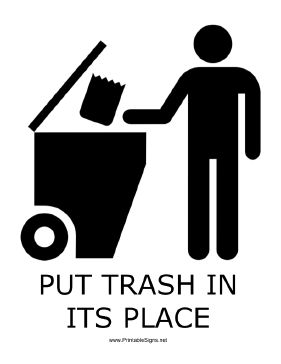
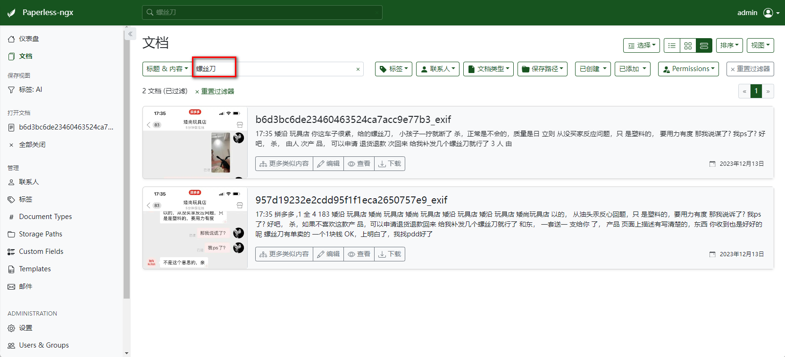
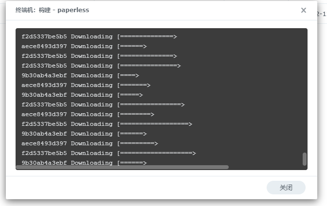
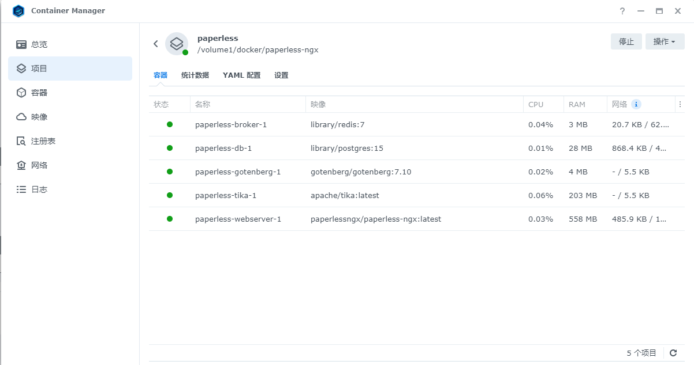
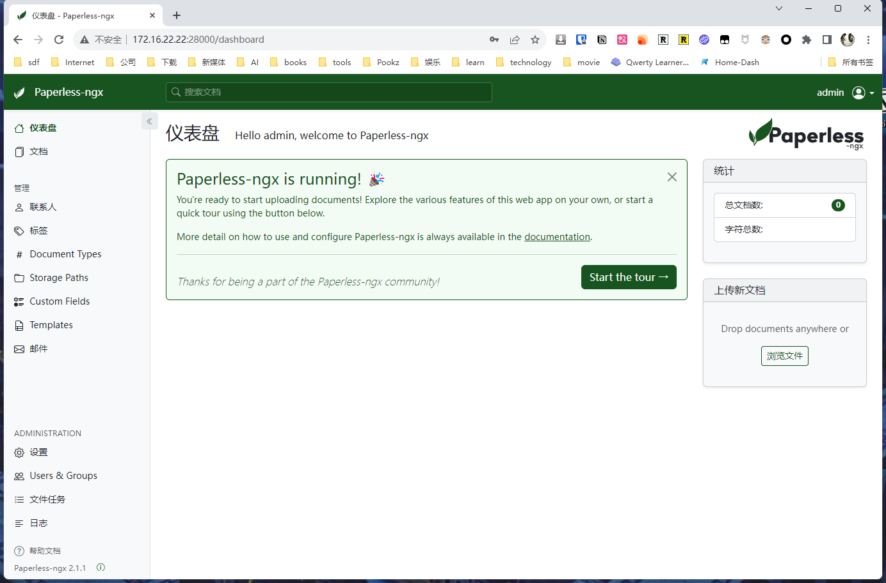
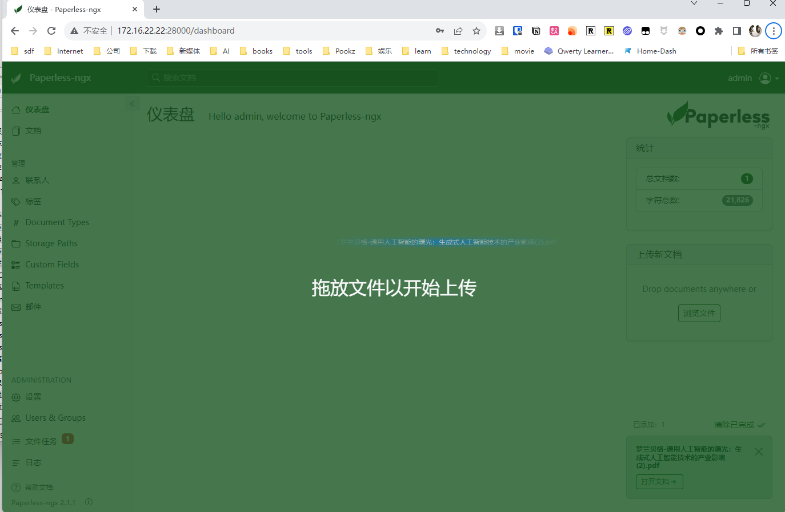
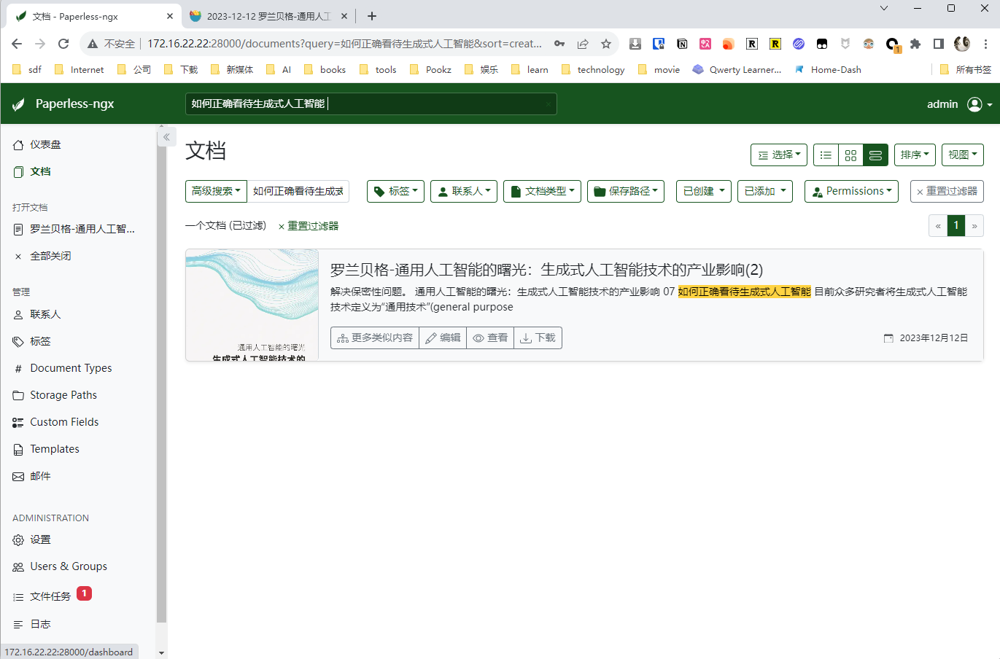
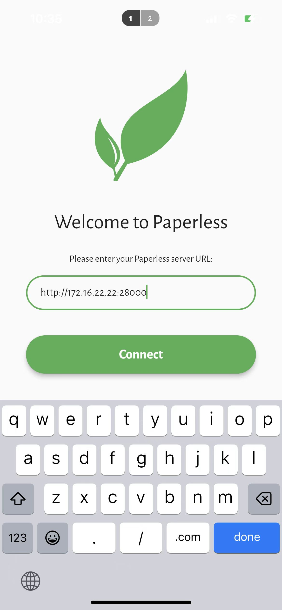
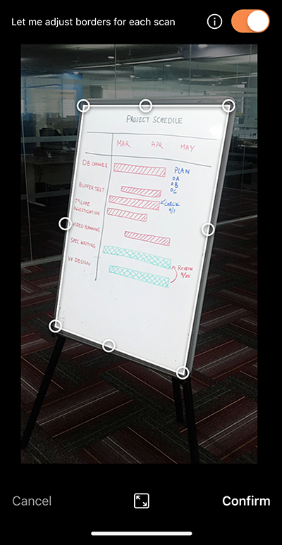

## 1. Introduction

After all the tinkering, I realized that `90% of NAS applications are useless`.



Only `2 or 3` of them are actually useful.

Most of the time, after following various guides and tutorials to set them up, we just `leave them there without using them`.

From the first NAS I had, the Star Snail, to now, after 8 years, I have researched countless self-hosted applications.

The protagonist I am introducing today belongs to the remaining 10% that are actually useful.

To be more precise, it can be considered as the top 1% within this 10% of usefulness.

The benefits it brings me are not only related to life and work, but also to its ability to help me `manage documents and find files` more efficiently.

Thanks to it, I have saved at least `500 hours`.

---

Before formally introducing it, I want to talk about another topic: why I have always been `unable to leave the Apple ecosystem`.

The Apple ecosystem has brought me not only `convenience of the system`, `security`, and `the smoothness of the entire suite`, but also one of the biggest reasons: Apple's powerful `photo-OCR function`.

For example, if I want to find a `screenshot of a chat record` I had with a seller recently, in order to use it as evidence.

Compared to the previous method of searching for images one by one, I can now simply search for the keyword `screwdriver`. Apple Photos will directly highlight the images that contain a `screwdriver`.


If you don't know about this feature yet, don't rush to try it yourself.

The toy I am introducing today can also bring you:

- The `same effect` as mentioned above.
- It is built on `your NAS`.
- You have `complete control` over the data.



- It also supports `online preview`:


- It supports all `digital documents`: Not only images, but also PDFs, Word documents, Excel spreadsheets, and even Markdown files. It truly achieves document digitization, unified management, and efficient searching.


This is the new toy I am bringing to you today, Paperless-ngx. As the name suggests, it is all about going paperless.

It can help you organize your contracts, `physical documents`, bills, and more, while also managing digital documents (Word, Excel, PDF, etc.).


---

## Introduction to Paperless-ngx

Paperless-ngx is not just a document management system, it is a complete solution that converts your physical files into searchable online archives, reducing the use of paper. Its core features include:

- **Document organization and indexing**: Organize scanned documents using tags, correspondents, types, and more.
- **OCR text recognition**: Perform optical character recognition on documents to enable text search and selection, even for documents with images.
- **Multi-language support**: Utilize the open-source Tesseract engine to support over 100 languages.
- **Long-term storage format**: Save documents in PDF/A format, designed for long-term storage.
- **Intelligent tagging and classification**: Automatically add tags, correspondents, and document types using machine learning.
- **Wide range of file support**: Support for PDF documents, images, plain text files, Office documents, and more.
- **Customizable file management**: Paperless-ngx manages file names and folders, supporting different configurations.
- **Modern web application**: Customizable dashboard, filters, batch editing, drag and drop upload, custom views, shared links, and more.
- **Full-text search**: Auto-complete, relevance ranking, and highlighting of matched query parts.
- **Email handling**: Import documents from email accounts and configure multiple accounts and rules.
- **Multi-user permission system**: Built-in robust multi-user permission system.
- **Multi-core system optimization**: Parallel processing of multiple documents.

---

Setup Steps:

## 1. Key Points

`Follow for free` to stay on track.

## 2. Docker Management GUI Tools

#### Synology DSM 7.2 or above can directly use *Container Manager*


#### QNAP ContainerStation


#### Install Portainer Yourself

Tutorial reference:

[Install Portainer in NAS in 30 seconds](/how-to-install-portainer-in-nas/)

## 3. File Station

- Open File Station and create a `paperless-ngx` folder in the docker folder.


- Create the following directories inside the `paperless-ngx` folder:
  - consume
  - data
  - export
  - media
  - pgdata
  - redisdata


## 4. Container Manager

In this case, I am using Synology's Container Manager to set up. Portainer and QNAP are similar:

### Upload Configuration


Copy the following configuration:

```yaml
version: "3.4"
services:
  broker:
    image: library/redis:7
    restart: unless-stopped
    volumes:
      - /volume1/docker/paperless-ngx/redisdata:/data

  db:
    image: library/postgres:15
    restart: unless-stopped
    volumes:
      - /volume1/docker/paperless-ngx/pgdata:/var/lib/postgresql/data
    environment:
      POSTGRES_DB: paperless
      POSTGRES_USER: paperless
      POSTGRES_PASSWORD: paperless
```

```markdown
webserver:
  image: paperlessngx/paperless-ngx:latest
  restart: unless-stopped
  depends_on:
    - db
    - broker
    - gotenberg
    - tika
  ports:
    - "28000:8000"  # change it if you like
  healthcheck:
    test: ["CMD", "curl", "-fs", "-S", "--max-time", "2", "http://localhost:8000"]
    interval: 30s
    timeout: 10s
    retries: 5
  volumes:
    - /volume1/docker/paperless-ngx/data:/usr/src/paperless/data
    - /volume1/docker/paperless-ngx/media:/usr/src/paperless/media
    - /volume1/docker/paperless-ngx/export:/usr/src/paperless/export
    - /volume1/docker/paperless-ngx/consume:/usr/src/paperless/consume
  environment:
    PAPERLESS_REDIS: redis://broker:6379
    PAPERLESS_DBHOST: db
    PAPERLESS_TIKA_ENABLED: 1
    PAPERLESS_TIKA_GOTENBERG_ENDPOINT: http://tika:3009
    PAPERLESS_TIKA_ENDPOINT: http://gotenberg:9998
    PAPERLESS_OCR_LANGUAGES: chi-sim chi-tra  # change it if you like
    PAPERLESS_OCR_LANGUAGE: eng+chi_sim  # change it if you like
    USERMAP_UID: 0
    USERMAP_GID: 0
    PAPERLESS_TIME_ZONE: Asia/Shanghai  # change it if you like
  dns:
    - 8.8.8.8
    - 8.8.4.4

gotenberg:
  image: gotenberg/gotenberg:7.10
  restart: unless-stopped
  command:
    - "gotenberg"
    - "--chromium-disable-javascript=true"
    - "--chromium-allow-list=file:///tmp/.*"

tika:
  image: apache/tika:latest
  restart: unless-stopped
```

Configuration Explanation (Custom):

> I have marked the parts in the above file that I think can be modified  # change it if you like. For the rest, as a beginner, I do not recommend making any changes.

- webserver's port section: you can change it to another port number such as "`38000:8000`", `do not modify the 8000 at the end`

- PAPERLESS_OCR_LANGUAGES: set the `supported languages` for paperless, chi-sim chi-tra (Simplified Chinese, Traditional Chinese), you can add the language you want, such as jpn

  In addition, the system already includes English, German, Italian, etc.

- PAPERLESS_OCR_LANGUAGE: `default OCR language`, I have set it to English and Simplified Chinese

- PAPERLESS_TIME_ZONE: set your time zone


### Wait:




### Done:




## 5. Usage

Access the program in the browser: [ip]:[port]

> ip is the IP address of your NAS (mine is 172.16.22.22), port is defined in the configuration file above, if you follow my tutorial, it is 28000


But it seems that you don't have a username and password yet, so let's `create an account and password`:

Select the webserver container and open the terminal:


> python3 manage.py createsuperuser

Enter the following in order:

- username
- email
- password


## 6. Special Features Showcase


### Home Page:



### Test PDF File:



The text has been extracted:


#### Online Preview:


#### Search Functionality:




### Images:


In the edit view, you can see the recognized result and make modifications


#### Search:


### Trying with Word Files:


### Other Apps / Support

You can also download third-party app `paperless_app`



You can also choose to use other scanning apps and then import them into pp (better recognition), such as the free Microsoft Lens




You can also choose to connect your physical printer and automatically upload to paperless:


If you have more ways to play, please share them.

## Finally

If you like this article, please remember to like, bookmark, and follow [Dad's Digital Garden](https://example.com). We will continue to bring more practical self-built application guides. Together, let's take control of our own data and create our own digital world!

If you encounter any problems or have any suggestions during the setup process, please feel free to leave a comment below for discussion and learning.