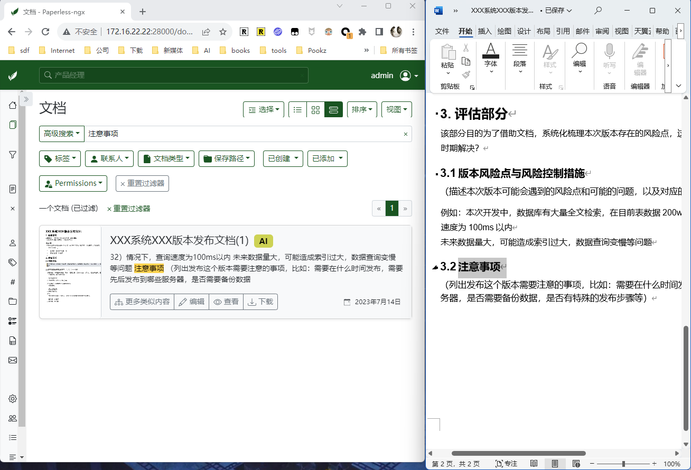
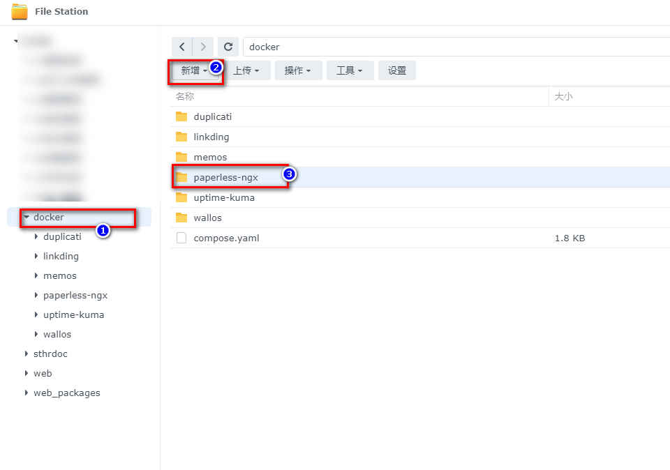
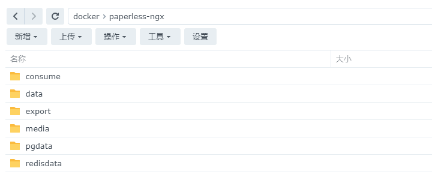
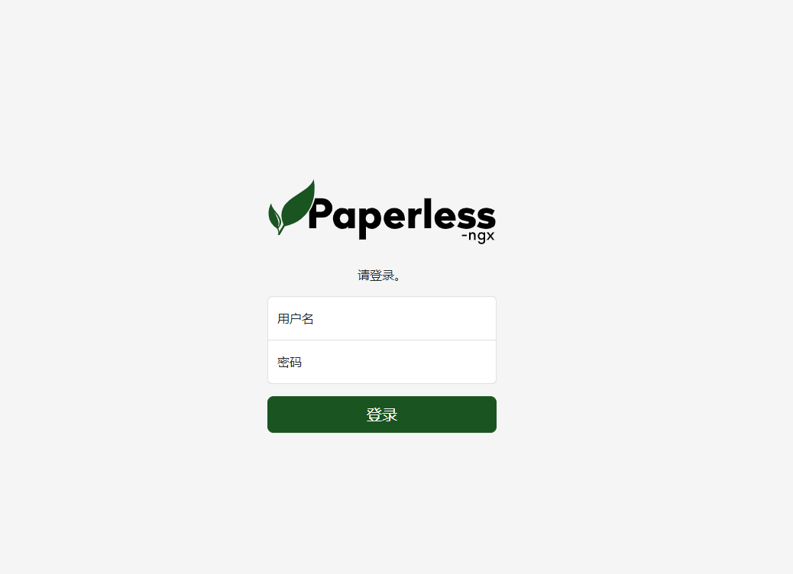
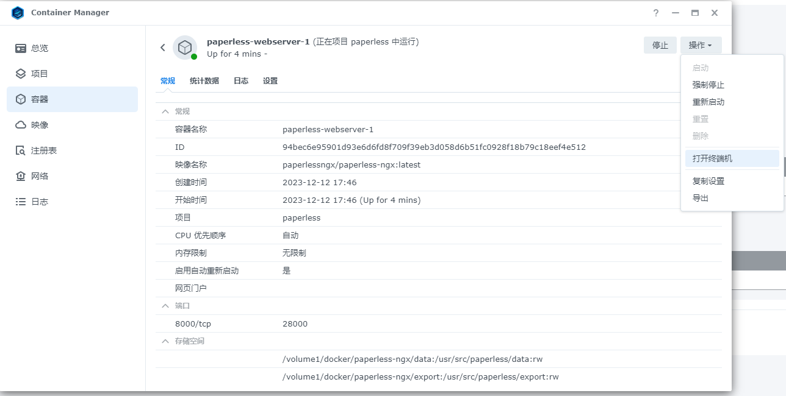
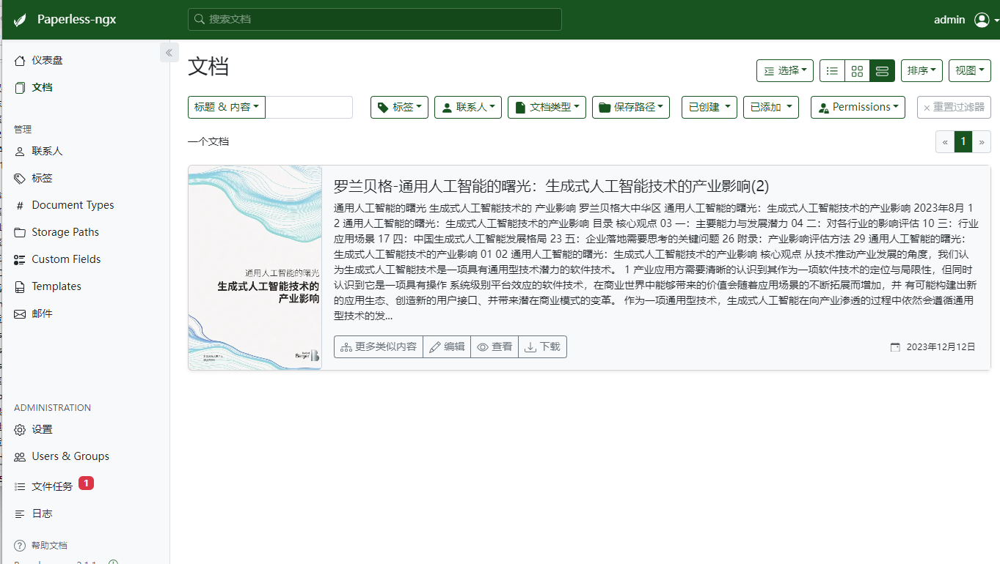
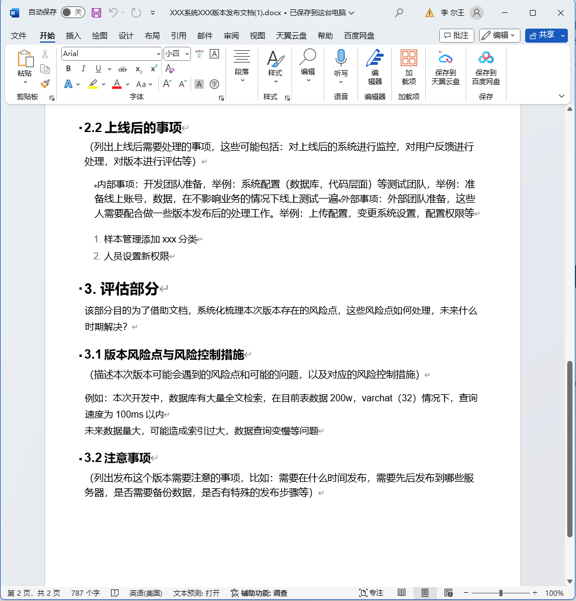

## 1. 前言

折腾来折腾去，我发现：`90%的Nas应用都没卵用`


真正`有用的只有那么3，2个`

绝大多数，我们看了各种攻略、教程，搭建好之后，就`放那里不动了`

从第一台星际蜗牛开始到现在，8年时间，我研究了无数的私有化应用

我今天介绍的主角，是属于剩下的10%有用的一员

再准确点说它可以说是，这10%有用中的top 1%的存在

它能带给我的好处，不仅仅来自于生活、工作，得益于它，让我更好的`管理文档、查找文件`

这，至少节约了我`500个小时`

---

在正式介绍它之前，我想要聊一个别的话题：为什么我一直以来都`离不开apple 生态`

apple 生态带给我的不仅仅是`系统便捷`、`安全性`、`全家桶的丝滑`，其中一个最大的原因则是：apple强大的`相册-OCR功能`

比如我想要找到前阵子和卖家沟通的`聊天记录截图`，好去举证

相比原来的方式，我一个个查找图片，我选择直接搜索关键词：`螺丝刀`。apple相册直接锁定到了出现`螺丝刀的图片`上


如果你还不知道这个功能，先不要着急自己去尝试

我今天给你介绍的玩具，同样能带给你：

- 和这个`一样的效果`
- 搭建在`你的nas`上
- 数据`完全控制`


- 还支持`在线预览`：


- `所有数字文档`均支持：不止是图片，连pdf, word，excel，markdown统统都支持。真正实现了，文档数字化，统一管理，高效搜索




这就是我今天带给大家的新玩具Paperless-ngx，顾名思义：无纸化

它能帮助你整理你生活中的合同、`纸质文档`、账单等等，同时还支持管理数字文档（word、excel、pdf等）


---

## 介绍Paperless-ngx

Paperless-ngx不仅仅是一个文档管理系统，它是一个完整的解决方案，将你的纸质文件转化为可搜索的在线存档，减少纸张的使用。其核心功能包括：

- **文档的组织与索引**：通过标签、对应者、类型等多种方式组织扫描文档。
- **OCR文本识别**：对文档进行光学字符识别，使包含图像的扫描文档也能搜索和选择文本。
- **多语言支持**：利用开源的Tesseract引擎，支持100多种语言。
- **长期存储格式**：文档以PDF/A格式保存，设计用于长期存储。
- **智能标签与分类**：使用机器学习自动添加标签、对应者和文档类型。
- **广泛的文件支持**：支持PDF文档、图像、纯文本文件、Office文档等。
- **定制化的文件管理**：Paperless-ngx管理文件名和文件夹，支持不同的配置。
- **现代化的网页应用**：定制仪表板、过滤器、批量编辑、拖放上传、自定义视图、共享链接等。
- **全文搜索**：自动完成、相关性排序、高亮显示匹配查询的部分。
- **电子邮件处理**：从电子邮件账户导入文档，配置多个账户和规则。
- **多用户权限系统**：内置健壮的多用户权限系统。
- **多核系统优化**：并行处理多个文档。

---

搭建步骤：

## 1. 重点

`点个免费关注`，不迷路

## 2. docker管理图形工具

#### 群晖 DSM 7.2版本以上可以直接使用 *Container Manager*


#### 威联通 ContainerStation 


#### 自行安装Portainer

教程参考：

[30秒安装Nas必备神器 Portainer](/how-to-install-portainer-in-nas/)


##  3. File Station

- File Station 打开docker 文件夹，创建`paperless-ngx`文件夹



- 依次创建如下目录：
  - consume
  - data
  - export
  - media
  - pgdata
  - redisdata



 ## 4. Container Manager 

本次我使用的是群晖的Container Manager来搭建 ，Portainer与威联通基本类似：

###  上传配置


复制下列配置：

```yaml
version: "3.4"
services:
  broker:
    image: library/redis:7
    restart: unless-stopped
    volumes:
      - /volume1/docker/paperless-ngx/redisdata:/data

  db:
    image: library/postgres:15
    restart: unless-stopped
    volumes:
      - /volume1/docker/paperless-ngx/pgdata:/var/lib/postgresql/data
    environment:
      POSTGRES_DB: paperless
      POSTGRES_USER: paperless
      POSTGRES_PASSWORD: paperless

  webserver:
    image: paperlessngx/paperless-ngx:latest
    restart: unless-stopped
    depends_on:
      - db
      - broker
      - gotenberg
      - tika
    ports:
      - "28000:8000"  # change it if you like
    healthcheck:
      test: ["CMD", "curl", "-fs", "-S", "--max-time", "2", "http://localhost:8000"]
      interval: 30s
      timeout: 10s
      retries: 5
    volumes:
      - /volume1/docker/paperless-ngx/data:/usr/src/paperless/data
      - /volume1/docker/paperless-ngx/media:/usr/src/paperless/media
      - /volume1/docker/paperless-ngx/export:/usr/src/paperless/export
      - /volume1/docker/paperless-ngx/consume:/usr/src/paperless/consume
    environment:
      PAPERLESS_REDIS: redis://broker:6379
      PAPERLESS_DBHOST: db
      PAPERLESS_TIKA_ENABLED: 1
      PAPERLESS_TIKA_GOTENBERG_ENDPOINT: http://tika:3009
      PAPERLESS_TIKA_ENDPOINT: http://gotenberg:9998
      PAPERLESS_OCR_LANGUAGES: chi-sim chi-tra  # change it if you like
      PAPERLESS_OCR_LANGUAGE: eng+chi_sim  # change it if you like
      USERMAP_UID: 0
      USERMAP_GID: 0
      PAPERLESS_TIME_ZONE: Asia/Shanghai  # change it if you like
    dns:
      - 8.8.8.8
      - 8.8.4.4

  gotenberg:
    image: gotenberg/gotenberg:7.10
    restart: unless-stopped
    command:
      - "gotenberg"
      - "--chromium-disable-javascript=true"
      - "--chromium-allow-list=file:///tmp/.*"

  tika:
    image: apache/tika:latest
    restart: unless-stopped
    

```


配置讲解（自定义）：

> 我在上述文件中标注了，我认为可以修改的部分  # change it if you like。其余部分，初学者，不建议修改

- webserver 的port 部分： 可以改为其他端口号  如"`38000:8000`" ，`不要修改后面`的8000

- PAPERLESS_OCR_LANGUAGES： 设置paperless `支持的语言`，chi-sim chi-tra （简体中文、繁体中文），你可以加入你想要的语言如：jpn

  另外系统已经内置：英语、德语、意大利语等

- PAPERLESS_OCR_LANGUAGE：`默认ocr的语言`，我这里设置的英文和中文简体

- PAPERLESS_TIME_ZONE： 设置你的时区


### 等待：


### 完成：


## 5. 使用

浏览器进入程序：[ip]:[端口]

> ip为你nas所在ip（这里我的是172.16.22.22），端口为上面配置文件定义，如果你按照我的教程，则是28000




但是似乎你并没有账号密码哎，接下来是`创建账号密码`：

选择webserver的容器，选择打开终端：




> python3 manage.py createsuperuser

依次输入：

- username
- email
- password


## 6. 特殊功能展示


### 首页：


### 测试pdf文件：


已经将文字提炼出来了：




#### 在线预览：


#### 搜索功能：


### 图片：


编辑可以看到识别后的结果，可以修改


#### 搜索：


### word 尝试：




### 其他app /支持

你也可以下载第三方的应用`paperless_app`


你也可以选择使用其他扫描应用，然后再导入pp中（更好的识别），比如免费的Microsoft Lens


你还可以选择连接你的物理打印机，自动上传到paperless：


如果你有更多玩法，也希望分享出来哈。

## 最后

如果你喜欢这篇文章，请记得点赞，收藏，并关注【老爸的数字花园】，我们将会持续带来更多实用的自搭建应用指南。一起，让我们掌握自己的数据，创建自己的数字世界！

如果你在搭建过程中遇到任何问题，或者有任何建议，也欢迎在下方留言，一起探讨和学习。