## Einführung

😒 Hast du jemals andere beneidet, weil sie so viele lustige Anwendungen erstellen können, während du dich mit "nicht wissen, wie man programmiert" herumschlägst?


Und ihre sogenannten "einfachen Tutorials" sehen so aus:

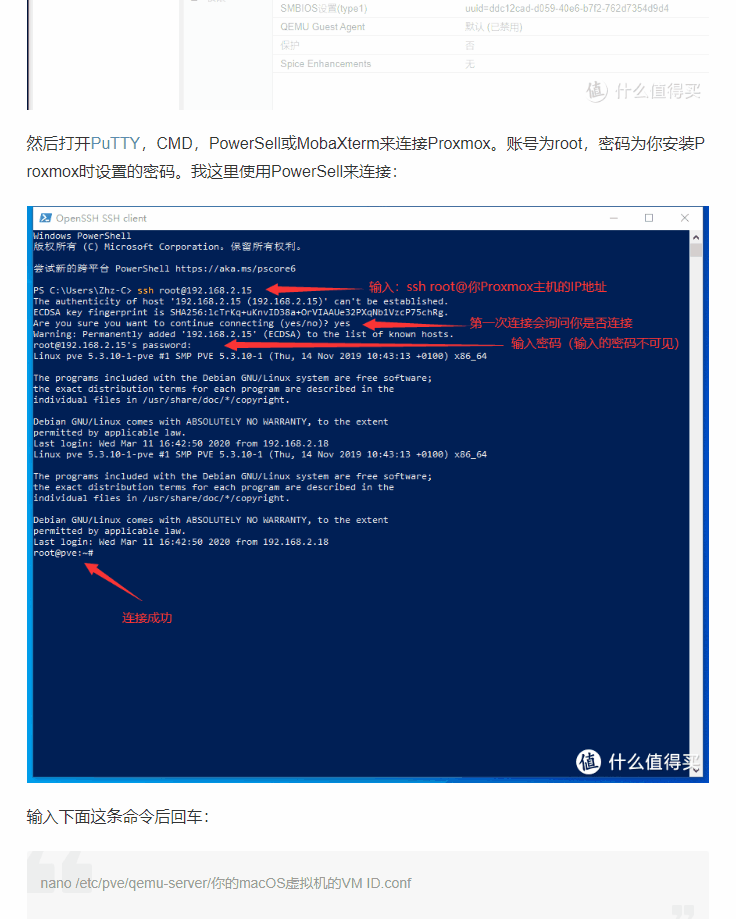

Hast du dich jemals von Tutorials eingeschüchtert gefühlt, die "zu kompliziert" sind?

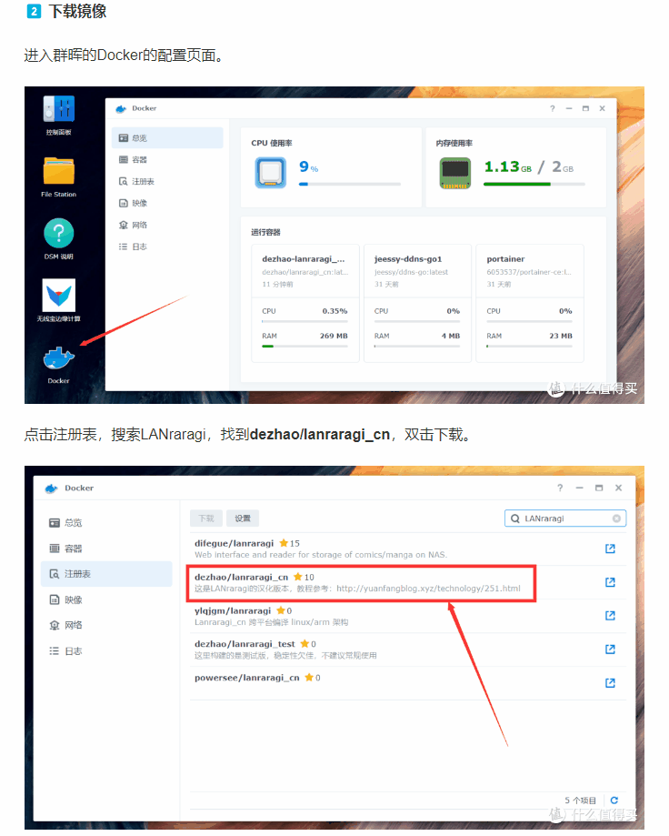

Wünschst du dir, dass alles "etwas einfacher" wäre?

Heute werde ich dir zeigen, wie du Portainer, ein unverzichtbares Tool für NAS, in nur 30 Sekunden installieren kannst.

## **Wie man sein eigenes Weibo erstellt**

1. Äußere deine Gedanken zufällig, ohne dich darum zu kümmern, dass andere sie sehen.
2. Speichere sie vollständig auf deinem NAS.
3. Lade deine guten Freunde ein, Spaß zu haben und lustige Bilder zu teilen.

Wie viel Aufwand denkst du, dass das wäre? Mit Portainer sind es nur 2 Schritte:

## Erstelle ein Verzeichnis

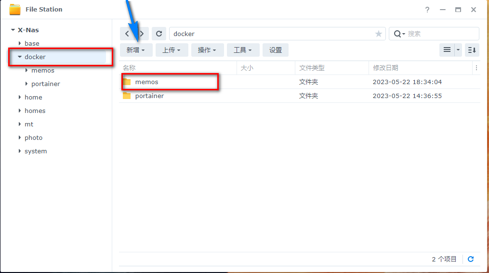

## Erstelle einen Stack

```yaml
version: "3.0"
services:
  memos:
    image: neosmemo/memos:latest
    container_name: memos
    volumes:
      - /volume1/docker/memos/:/var/opt/memos
    ports:
      - 5230:5230
```

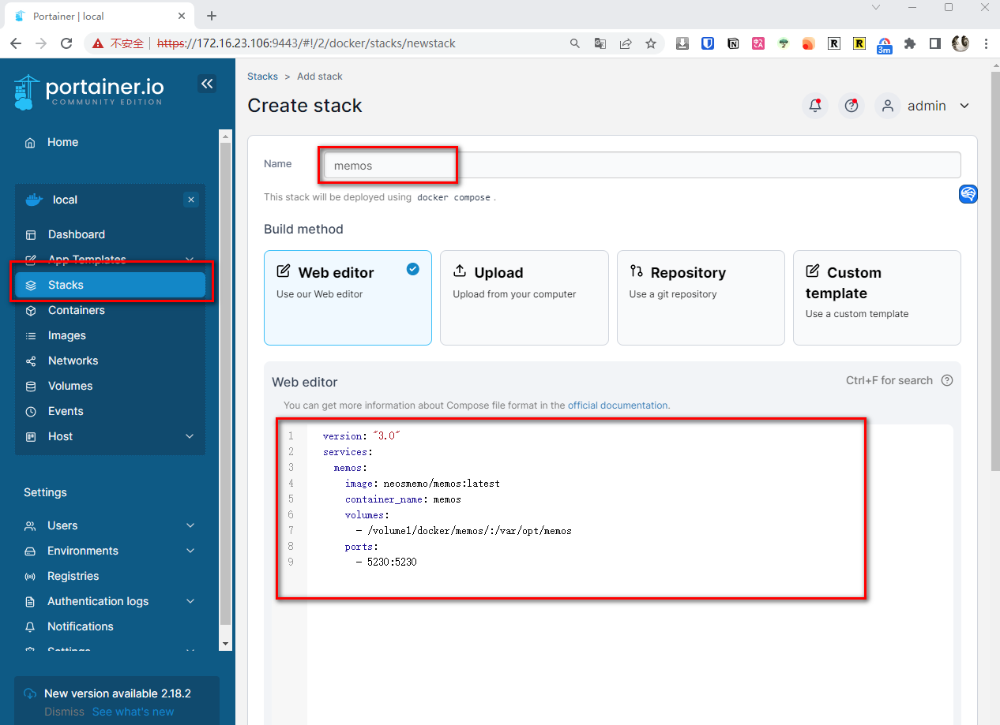

💕**Fertig!**

> In Zukunft wird dieser Kanal viele interessante und unterhaltsame private Dienste in NAS teilen, die alle einfach mit Portainer gelehrt werden.

Als nächstes kommen wir zum Punkt "wie man Portainer in Synology NAS aufbaut".

Der gesamte Prozess "erfordert keinen Code", verwende einfach Synologys ["Aufgabenplaner"](#task-scheduler).

## Einführung in Portainer
Portainer ist ein leichtgewichtiges Docker-Container-Verwaltungstool.

Seine Vorteile sind:

1. Benutzeroberfläche (einfache Bedienung)
2. Einfache Bereitstellung (weitere nützliche und unterhaltsame Dienste werden in Zukunft geteilt)
3. Unterstützung mehrerer Plattformen (Synology, QNAP, Linux, Windows)
4. Einfaches Management (Netzwerk, Images, Container)

Damit können wir problemlos verschiedene Dienste in NAS aufbauen. In Zukunft werde ich auch verschiedene Dienste, die ich in NAS aufgebaut habe, teilen, und Portainer ist hier unverzichtbar.

---

## 1. Schlüsselpunkt

Folge kostenlos, verlaufe dich nie.

## 2. Pakete installieren

Im Synology Package Center suche nach:

1. Docker (für Synology-Versionen unter 7.2)
2. Container Manager (für Synology-Versionen 7.2 und höher)

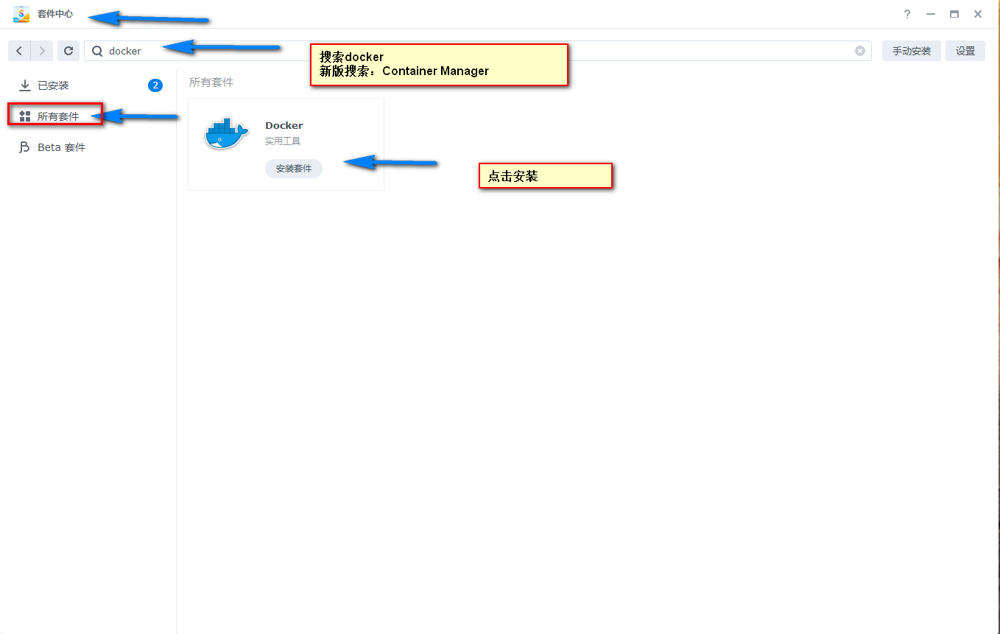

## 3. File Station

Öffne die File Station, gehe zum Ordner "docker" und erstelle einen Ordner namens "portainer".

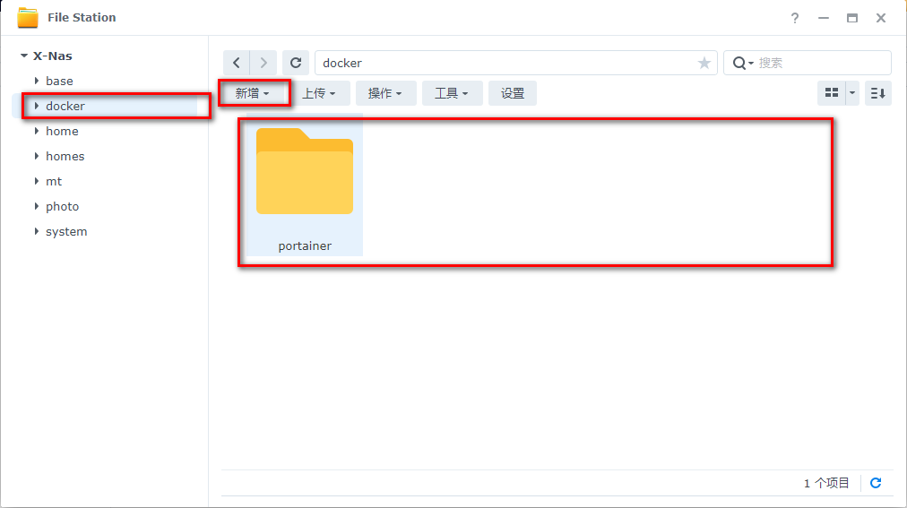

## 4. Aufgabenplaner

Im Synology "Control Panel" finde den "Aufgabenplaner" und klicke auf "Benutzerdefiniertes Skript" in "Geplante Aufgaben".

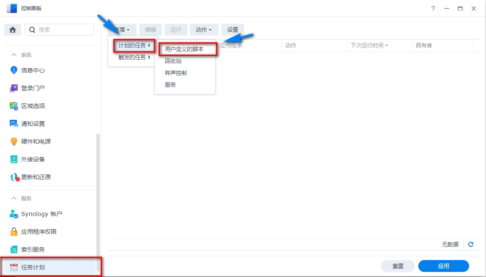

## 5. Installation

Konfiguriere zuerst die Einstellungen: Zeitplan-Einstellungen -> Aufgaben-Einstellungen

Füge den Code ein:

```yaml
docker run -d --name=portainer \
-p 8000:8000 \
-p 9000:9000 \
-v /var/run/docker.sock:/var/run/docker.sock \
-v /volume1/docker/portainer:/data \
--restart=always \
portainer/portainer-ce
```

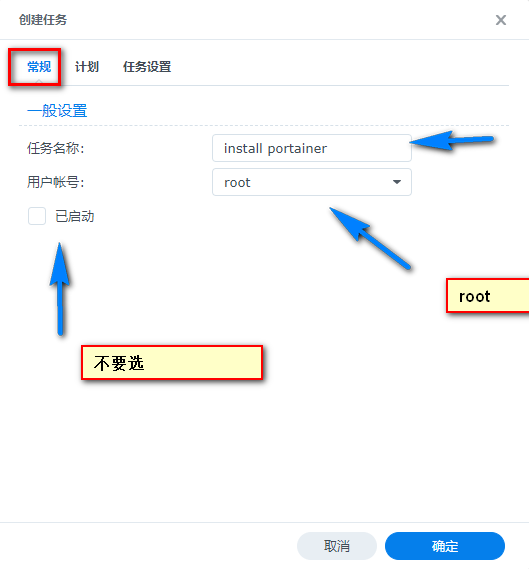

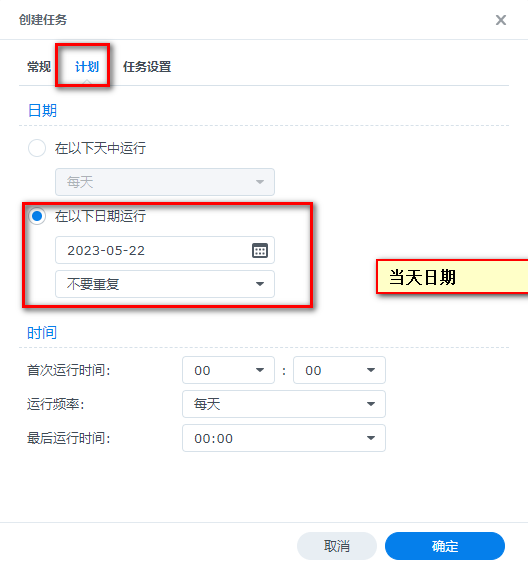

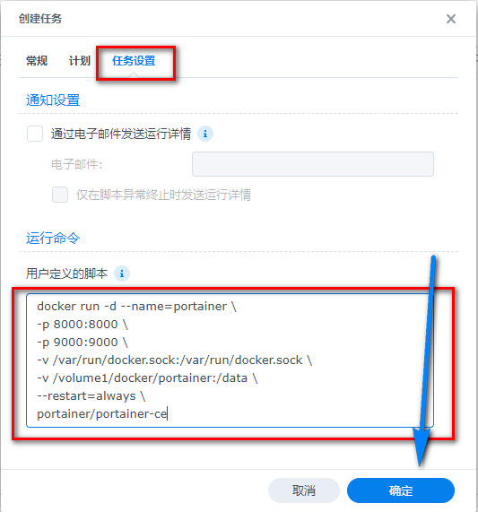

## 6. Skript ausführen

Klicke auf "Ausführen".


## 7. Überprüfen, ob es abgeschlossen ist (optionaler Schritt)

> Aufgrund von Problemen mit dem Inlandsnetzwerk kann es Situationen geben, in denen das Image nicht abgerufen werden kann. Daher ist eine Bestätigung erforderlich. Wenn es immer noch nicht funktioniert, kannst du eine "inländische Quelle einrichten".

Zwei Überprüfungsmethoden - wähle eine aus


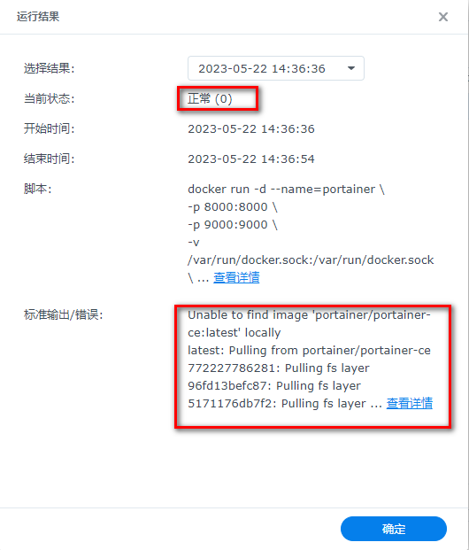

Du kannst auch überprüfen, ob Portainer erfolgreich in der `Docker Suite` abgerufen wurde

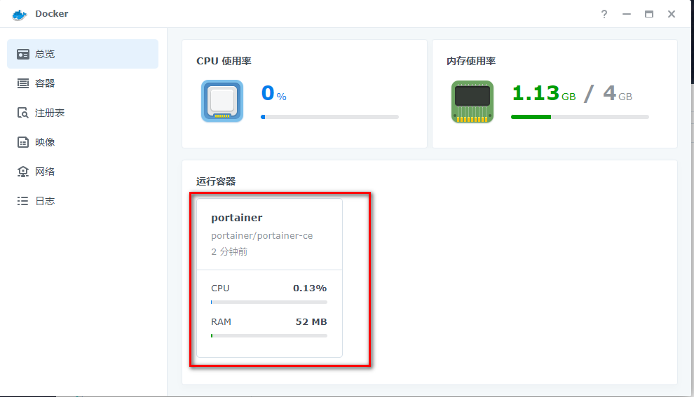


## 8. Portainer aufrufen

Setze ein Passwort

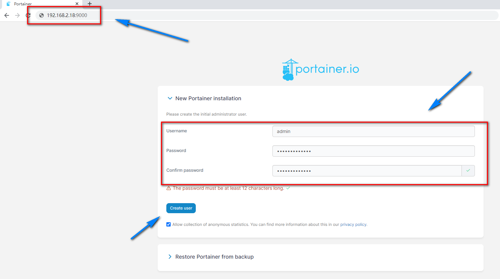


## 9. Einstellungen

1. Initialisiere Umgebungsvariablen
2. Setze die lokale IP-Adresse in den Umgebungsvariablen für einfachen Zugriff (die lokale IP-Adresse ist die IP-Adresse deines lokalen Synology NAS)

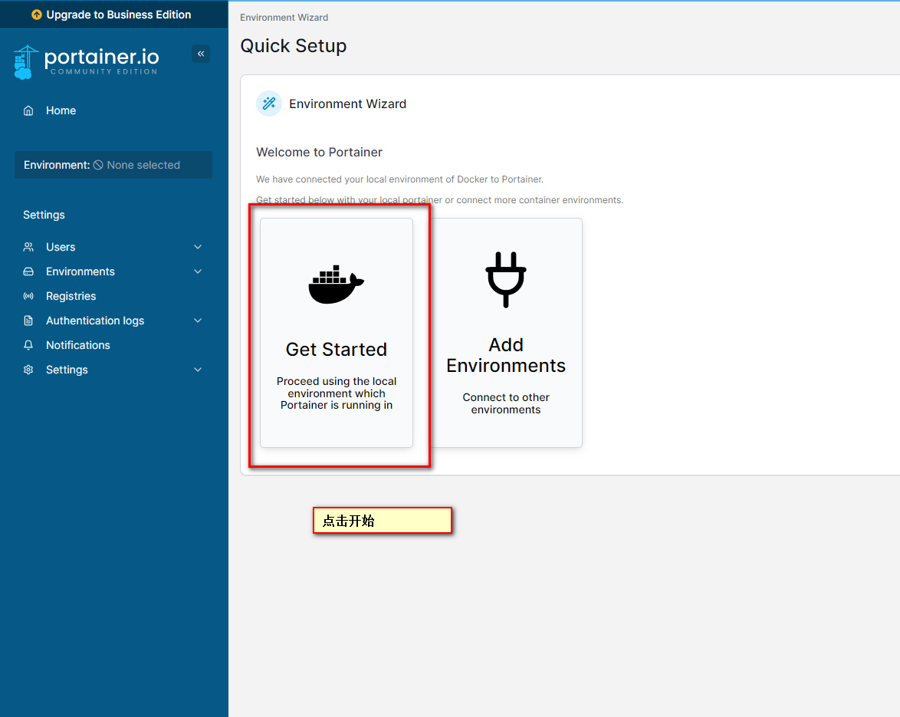

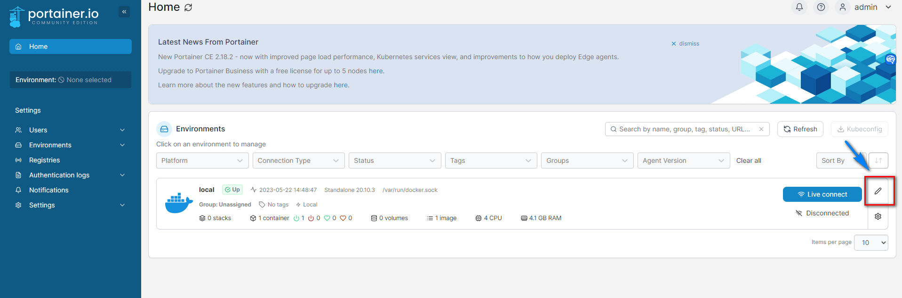

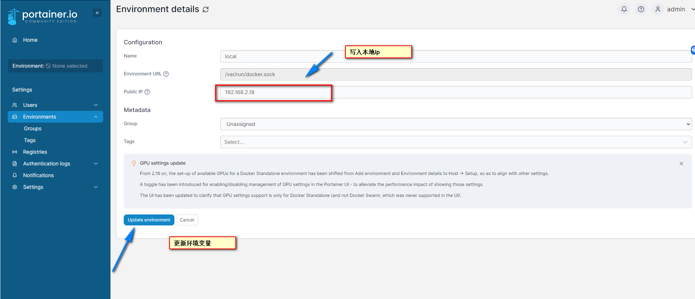

## 10. Werbung blockieren (optional)

Was tun mit nervigen Geschäfts-Upgrade-Erinnerungen in Portainer?

Verwende verschiedene Browser-Ad-Blocker, um sie zu blockieren

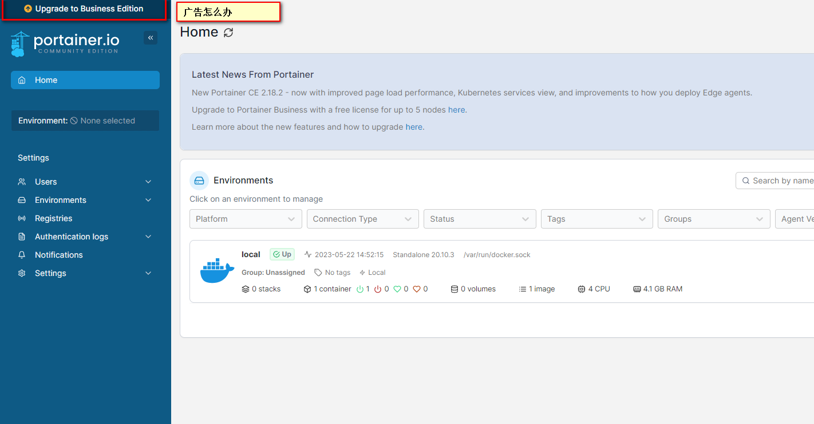

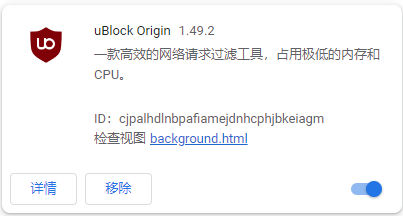

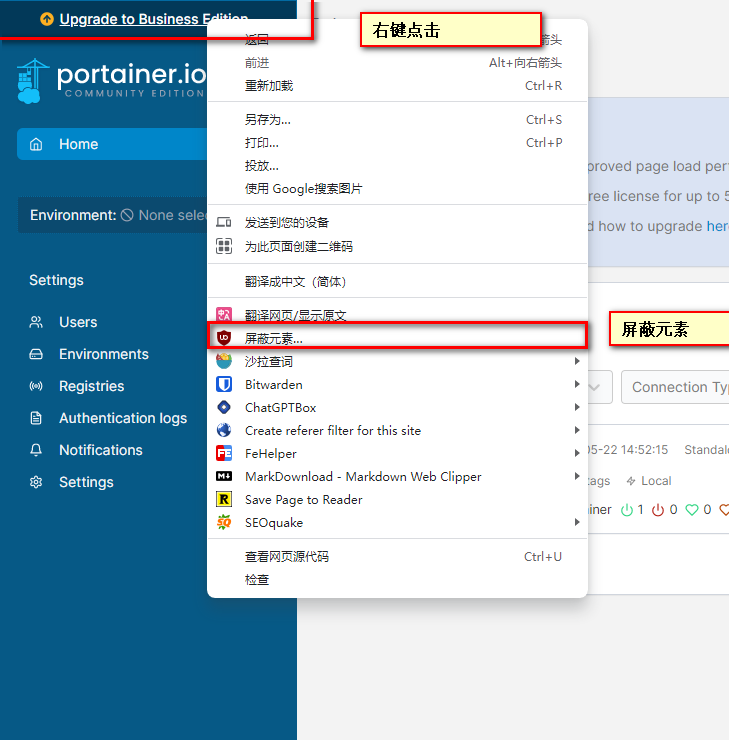

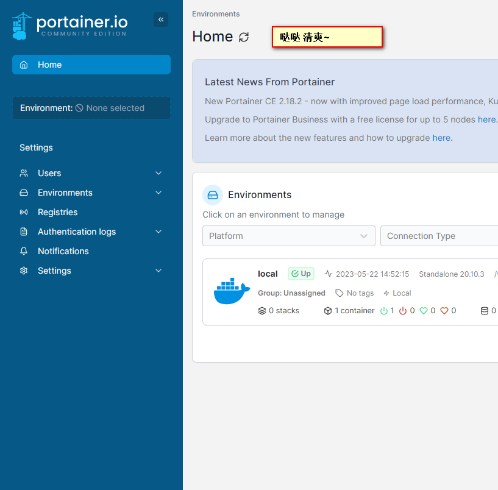

Herzlichen Glückwunsch, du bist in die brandneue NAS-Welt eingetreten

Folge [Daddy's Digital Garden](https://www.daddycoco.com/)

Teile interessante NAS-Spielzeuge und private Cloud-Bereitstellungen.