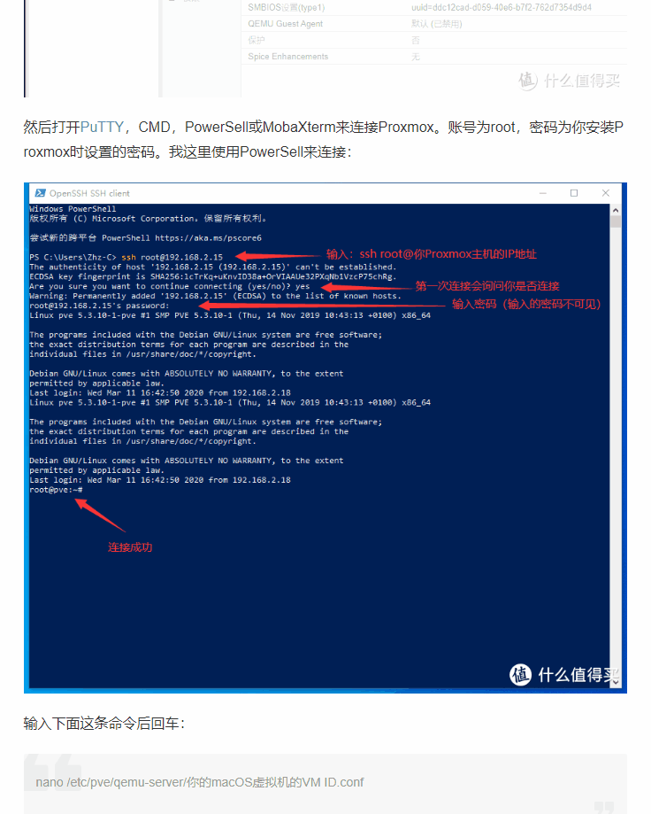
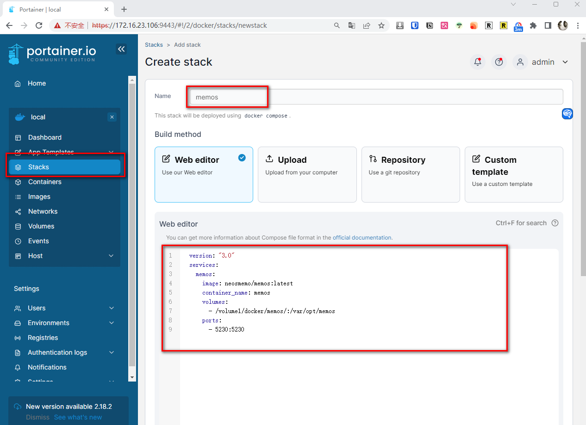
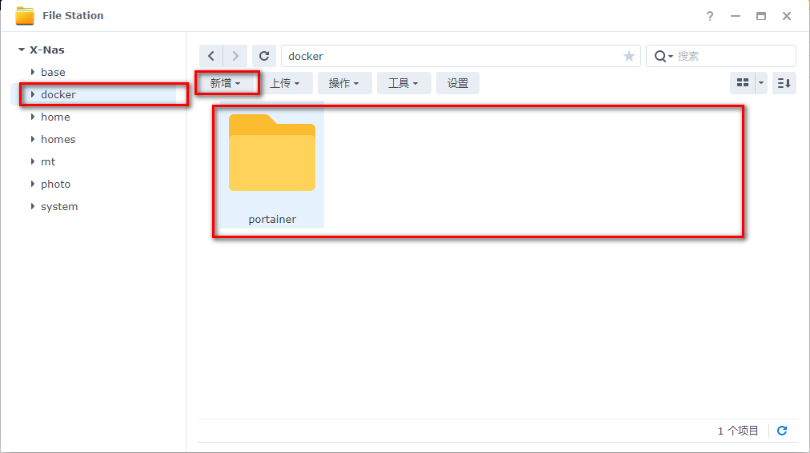
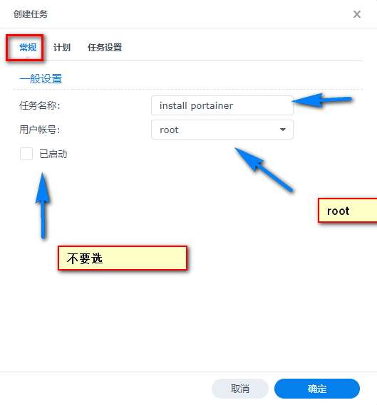
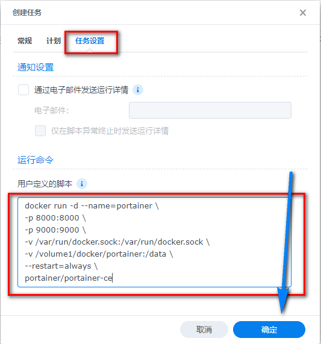
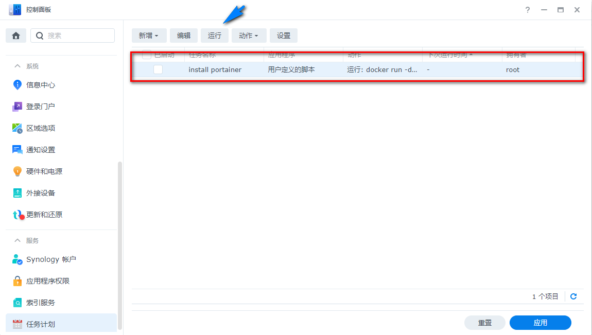
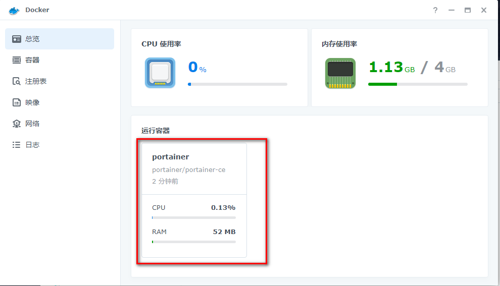
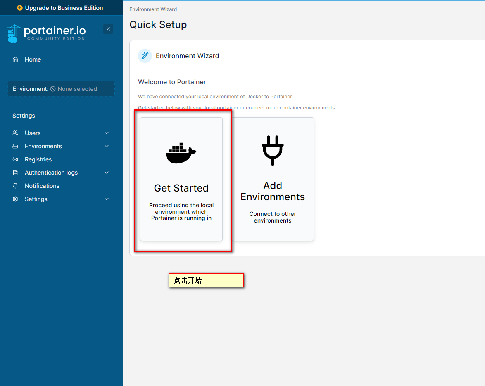
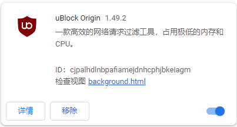

## 前言

😒你是否因为`不会代码`而羡慕别人可以搭建这么多好玩的应用？


而他们所谓的`简单教程`则是：




你是否因为别人的`教程太复杂`，而望而生畏


你是否希望让`一切都简单一点`

今天我来在30秒，手把手教大家如何在你的群晖，安装Nas 必备神器，容器管理神器-Portainer

## **如何搭建属于你的微博**

1. 随意碎碎念，不用担心别人会看到
2. 完全保存在你的nas中
3. 邀请好基友一起来摸鱼，分享搞笑图片

你认为需要多麻烦？有了Portainer，只需要2步：

## 创建目录


## stack 创建

```yaml
version: "3.0"
services:
  memos:
    image: neosmemo/memos:latest
    container_name: memos
    volumes:
      - /volume1/docker/memos/:/var/opt/memos
    ports:
      - 5230:5230
```



💕**完成！**


>  未来这个频道，会分享nas中诸多有趣好玩的私有服务，都是用portainer来简单教给大家

接下来是正题，`如何搭建portainer在群晖nas中`

整个过程`不需要任何代码`，只需要运用群晖的【`任务计划`】

## 介绍Portainer
Portainner 是一个轻量的docker 容器管理工具

它的优点：

1. ui界面（简单操作）
2. 轻松部署（未来会分享更多有用好玩的服务）
3. 多平台支持（群晖，威联通，linux，windows）
4. 轻松管理（网络，镜像，容器）

有了它，我们可以轻松的搭建各种服务在nas中，未来我也会分享我在nas中搭建的各种服务，这里都离不开Portainer

---

## 1. 重点

点个免费关注，不迷路

## 2. 安装套件

群晖套件中心，搜索

1. Docker （群晖`7.2版本`以下）
2. Container Manager（7.2以上版本）


## 3. File Station

File Station 打开docker 文件夹，创建portainer 文件夹



## 4. 计划任务

群晖`控制面板`，找到`任务计划`，点击`计划中的任务`-> `用户定义的脚本`


## 5. 安装

首先常规设置-> 计划设置-> 任务设置

贴入代码：

```yaml
docker run -d --name=portainer \
-p 8000:8000 \
-p 9000:9000 \
-v /var/run/docker.sock:/var/run/docker.sock \
-v /volume1/docker/portainer:/data \
--restart=always \
portainer/portainer-ce
```








## 6. 运行脚本

点击`运行`




## 7. 检查是否完成（非必要步骤）

> 由于国内网络的问题，可能存在无法拉取镜像的情况，所以需要确认一下，如反复不行，可以`设置国内源`

两种验证方式-二选一


也可以在`docker 套件`中确认portainer是否拉取成功




## 8 进入portainer

设置密码


## 9 设置

1. 初始化环境变量
2. 设置环境变量中的本地ip，方便直接点击（本地ip为你局域网群晖所在ip）




## 10 屏蔽广告（非必须）

portainer 有讨厌的Business 升级提醒怎么办？

用各路浏览器屏蔽助手来屏蔽





## 恭喜你，进入全新Nas世界

关注【老爹的数字花园】

分享好玩有趣的nas玩具 私有云部署
