Technologie befähigt das Leben: Bauen Sie Ryot selbst auf, um Ihre Lese-, Seh-, Spiel- und Fitnessgewohnheiten aufzuzeichnen.
<!--more-->


## 1. Einführung

Ich kann es kaum erwarten, Ihnen mein neues Nas-Spielzeug vorzustellen und Ihnen beizubringen, wie Sie Ihr eigenes "privates Douban" erstellen können.


Wenn Sie eine der folgenden Kriterien erfüllen:

- Sammler von elektronischen Medien
- Liebhaber von Literatur und Kunst
- Film- und Serienenthusiast
- Gaming-Enthusiast
- Manga- und Anime-Liebhaber
- Bücherliebhaber

Dann wird Sie dieses Spielzeug definitiv nicht enttäuschen.

Es ist eine Sammlung von "Suchen, Scrapen, Filmkritiken, Buchkritiken" in einem, das Ihr digitales Leben (Filme, Manga, Serien, Bücher, Spiele) umfassend verwaltet.

Darüber hinaus verfügt es über eine großartige Benutzeroberfläche. Wie man so schön sagt, ob man es benutzt oder nicht, liegt bei mir, aber "die Fotowand muss da sein".

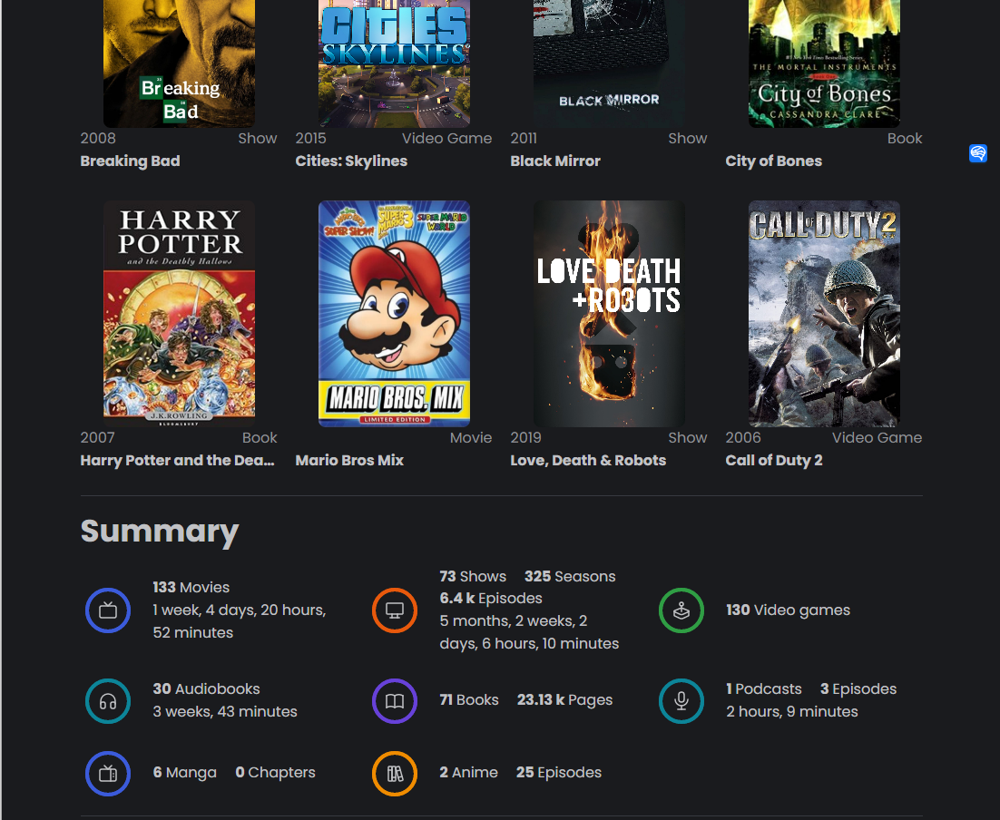

Hier muss ich meine Gedanken ausdrücken können, Filmkritiken, Buchkritiken und Spielkritiken schreiben.


---

## Einführung in Ryot

Ryot (Roll Your Own Tracker) hilft Ihnen, verschiedene Aspekte Ihres Lebens zu verfolgen, einschließlich der Bücher, die Sie lesen, der Filme, die Sie sehen, und der Spiele, die Sie spielen.

Ryot hat eine sehr benutzerfreundliche Benutzeroberfläche. Es bietet viele schöne Diagramme und Zusammenfassungen, um Ihnen zu helfen, Ihr Leben besser zu verstehen und zusammenzufassen.

Die Hauptfunktionen von Ryot sind wie folgt:

- Unterstützt die Aufzeichnung aller Ihrer digitalen Medien (Comics, Bücher, Podcasts, Filme, Serien, Spiele)
- Wie Douban verfügt es über Filmkritiken, Bewertungen, Fortschrittsverfolgung und vor allem meine Lieblingsspiele.

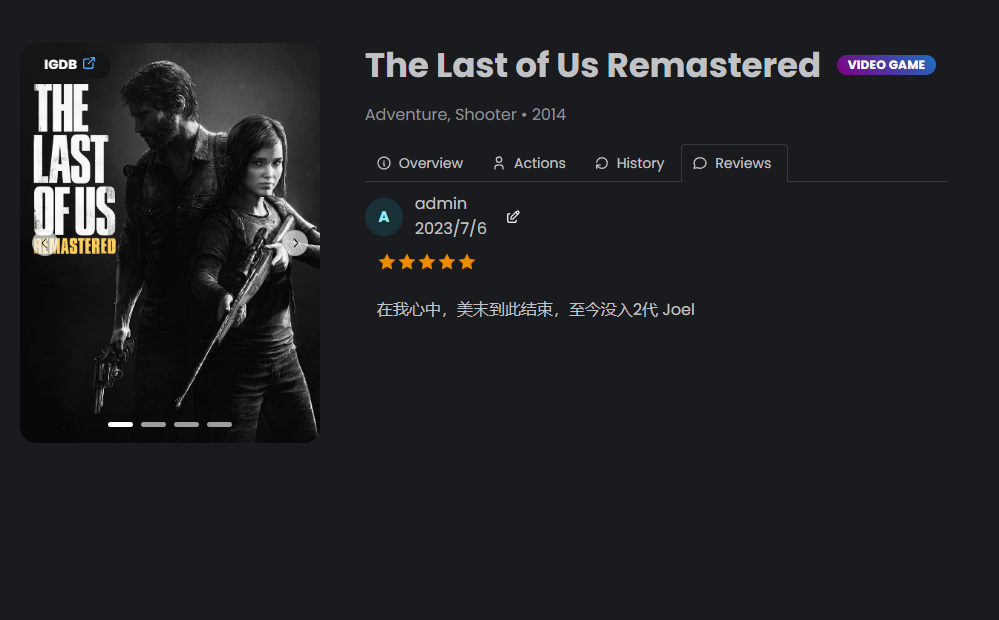


- Bereitstellung auf Nas für private Daten.
- Extrem schnell (Ryot ist in Rust geschrieben).
- Kostenlos und Open Source.
- Die Benutzeroberfläche ist auf Englisch, unterstützt aber die chinesische Suche (chinesische Unterstützung wird in Zukunft verfügbar sein).


---

Einrichtungsschritte:

## 1. Schlüsselpunkte

"Klicken Sie hier, um kostenlos zu folgen", damit Sie nicht den Überblick verlieren.

## 2. Portainer installieren

Anleitung zum Nachschlagen:
[30-Sekunden-Installation von Portainer, ein Muss für Nas](/how-to-install-portainer-in-nas/)

##  3. File Station

Öffnen Sie die File Station und erstellen Sie einen Ordner "Ryot" im Docker-Ordner.


## 4. Stack erstellen


## 5. Den Code bereitstellen

```yaml
version: '3.9'
services:
  ignisda:
    image: 'ghcr.io/ignisda/ryot:latest'
    volumes:
        - /volume1/docker/ryot/ryot-data:/data
    environment:
        - WEB_INSECURE_COOKIE=true
        - VIDEO_GAMES_TWITCH_CLIENT_ID=xxxx # Optional, Ihre Twitch-ID, wird unten detailliert erklärt
        - VIDEO_GAMES_TWITCH_CLIENT_SECRET=xxxx # Optional, Ihr Twitch-Secret, wird unten detailliert erklärt
        - MOVIES_TMDB_LOCALE=zh
        - SHOWS_TMDB_LOCALE=zh
        # - MOVIES_TMDB_ACCESS_TOKEN=XXX
        # - SHOWS_TMDB_ACCESS_TOKEN=XXX
        - ITUNES_LOCALE=en
        - USERS_ALLOW_REGISTRATION=true
    ports:
        - '18030:8000'
    pull_policy: always
    container_name: ryot
    restart: unless-stopped
```

1. Wählen Sie den Stack aus.
2. Geben Sie "Ryot" in das Namensfeld ein.
3. Geben Sie den obigen Code in den Editor ein.
4. Klicken Sie auf Bereitstellen.

### Parametererklärung

- WEB_INSECURE_COOKIE

Setzen Sie dies auf true, wenn Sie kein `https` verwenden.

- VIDEO_GAMES_TWITCH_CLIENT_ID   VIDEO_GAMES_TWITCH_CLIENT_SECRET

Diese beiden Parameter sind optional. Wenn sie nicht gesetzt sind, steht der Abschnitt "Spiele" nicht zur Verfügung. Sie können sich auf diesen Artikel beziehen, um diese Parameter einzurichten: [30-Sekunden-Installation von Portainer](/how-to-install-romm-on-your-nas/)

- MOVIES_TMDB_LOCALE SHOWS_TMDB_LOCALE 

Diese beiden Parameter dienen zur Auswahl der chinesischen Option in TMDB.

- MOVIES_TMDB_ACCESS_TOKEN  SHOWS_TMDB_ACCESS_TOKEN

Diese Parameter werden zur Einrichtung des TMDB-Tokens verwendet. Wenn sie leer gelassen werden, hat dies keinen Einfluss auf den Scraping-Prozess. Es wird jedoch empfohlen, Ihr eigenes Token einzutragen oder es später einzutragen, falls es ungültig wird.

- USERS_ALLOW_REGISTRATION

Setzen Sie dies beim ersten Mal auf true, um die Benutzerregistrierung zu ermöglichen. Wenn Sie keine mehreren Benutzer verwenden, können Sie es später auf false setzen.

## 6. Erfolg


## 7. Verwendung

Greifen Sie über Ihren Browser auf das Programm zu: [ip]:[port]

> Ersetzen Sie "ip" durch die IP-Adresse Ihres NAS (z. B. 172.16.23.106) und "port" durch den in der Konfigurationsdatei definierten Port (z. B. 18030, wenn Sie der Anleitung gefolgt sind).


## 8. Registrierung

Klicken Sie auf "Registrieren", um ein Konto zu erstellen.


## 9. Detaillierte Verwendung

Als nächstes werde ich die Funktionalität jedes Moduls demonstrieren.

### Büchersuche (mit Google Books)

Suchen Sie nach dem Bestseller "长安的荔枝" vom letzten Jahr.


Großartig, alle Informationen sind verfügbar.

Suchen Sie jetzt nach "始于极限" von 上野千鹤子 vom letzten Jahr. Leider gibt es kein Coverbild.

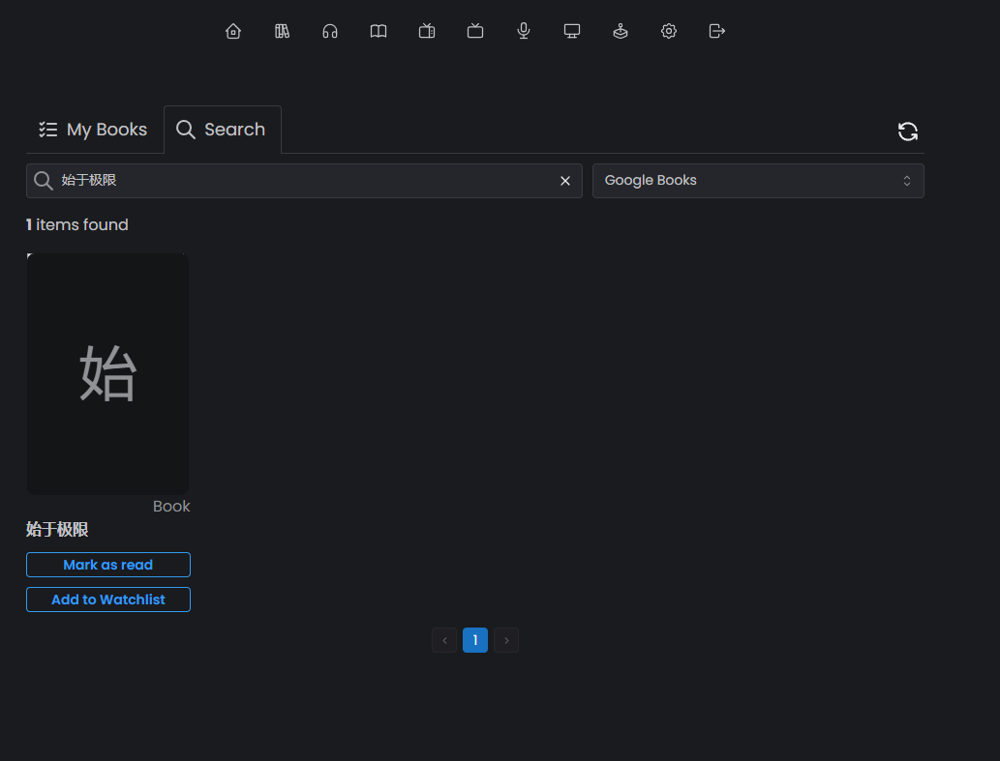

Glücklicherweise ist der Inhalt immer noch verfügbar. Fügen Sie einfach das Coverbild manuell ein.


### Comics

Es gibt zwei Arten von Comics: "Animes" und "Mangas". Lassen Sie mich den Unterschied zwischen den beiden erklären.

`Unterschied zwischen "Animes" und "Mangas"`

【Animes - Japanische Animation】

Format: Dynamisches visuelles Produkt, das über TV, Filme usw. abgespielt wird.

Produktion: Involviert Animatoren, Synchronsprecher usw., mit langen Produktionszyklen und hohen Budgets.

Merkmale: Starke visuelle Effekte und Soundeffekte, mit einer starken Handlung und Charakterentwicklung.

Repräsentative Werke: "Slam Dunk", "Ghost in the Shell", "Death Note", usw.

【Mangas - Japanische Comics】

Format: Statisches gedrucktes Material, das über Bücher, Zeitschriften usw. verbreitet wird.

Erstellung: Hauptsächlich von einem oder wenigen Manga-Künstlern erstellt, mit einem kurzen Produktionszyklus und geringen Kosten.

Eigenschaften: Statische Bilder, nicht so visuell und akustisch immersiv wie Animes, etwas schlechter in Handlung und Charakterdarstellung.

Repräsentative Werke: "Dragon Ball", "Detektiv Conan", "One Piece", "Naruto", usw.

### Manga-Funktionalität (Animes)

Suche auf Chinesisch: Death Note

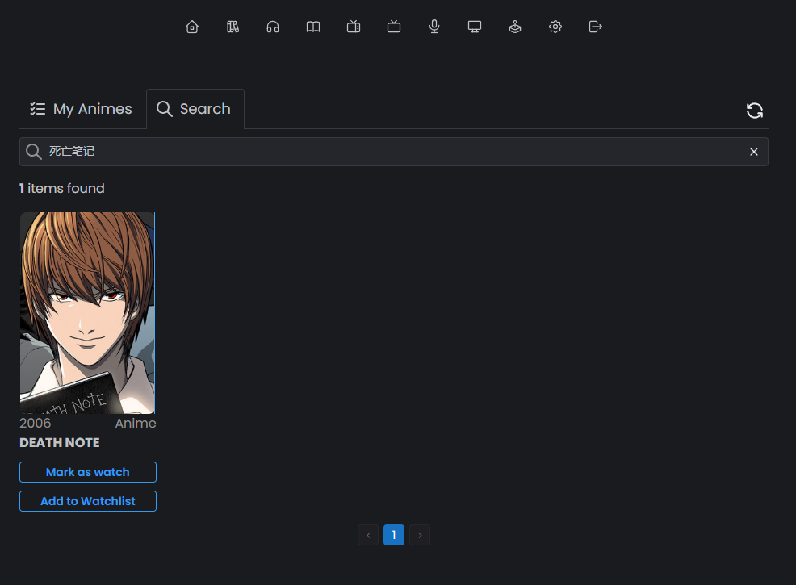

Nicht schlecht, schauen wir uns die Detailseite an


Obwohl es auf Englisch ist, passt es zu unserer Fotowand

Hier konzentrieren wir uns auf `Aktion`, was auch ein Hauptmerkmal von ryot ist, `verfolge alle deine Medien`, verfolge deinen Fortschritt


1. Ich schaue gerade
2. Zur beobachteten Liste hinzufügen
3. Eine Bewertung schreiben
4. Zur Sammlung hinzufügen
5. Die neuesten Metainformationen aktualisieren

Auf diese Weise können Sie klar erkennen, welche Sie noch nicht zu Ende geschaut haben und welche Sie bereits gesehen haben


Hier können Sie `eine Bewertung schreiben`, was auch der größte Grund ist, warum ich Douban nicht aufgeben kann. Es gibt kein gutes Werkzeug, um die Bewertung zu markieren und aufzuschreiben.

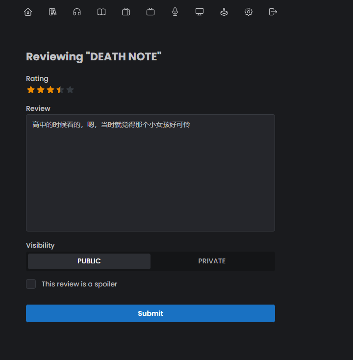

Unterstützung von `mehreren Bewertungen`, z.B. für eine bestimmte Episode


### Filme

Als nächstes kommt der Filmabschnitt, fangen wir mit einem Klassiker an: "Gone Girl"


tmdb-Ressourcen sind in der Tat reichhaltig

Schauen wir uns jetzt einen kürzlich erschienenen Film an, der ihm ähnlich ist, "Her"


Für "Her" gibt es mehr als zehn Poster, die auf einmal gescraped werden, genug, um anzugeben


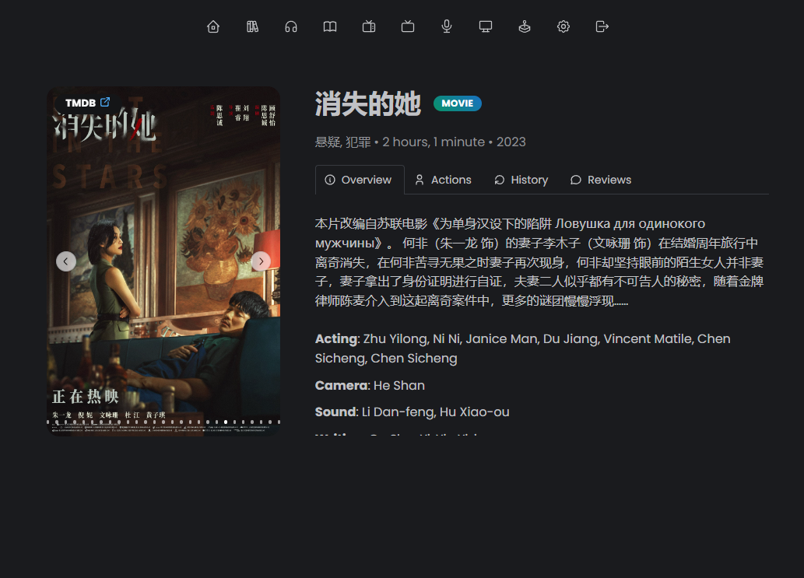

Gleiches gilt für Bewertungen, Standardvorgehen:


### Podcasts

Suche auf Englisch

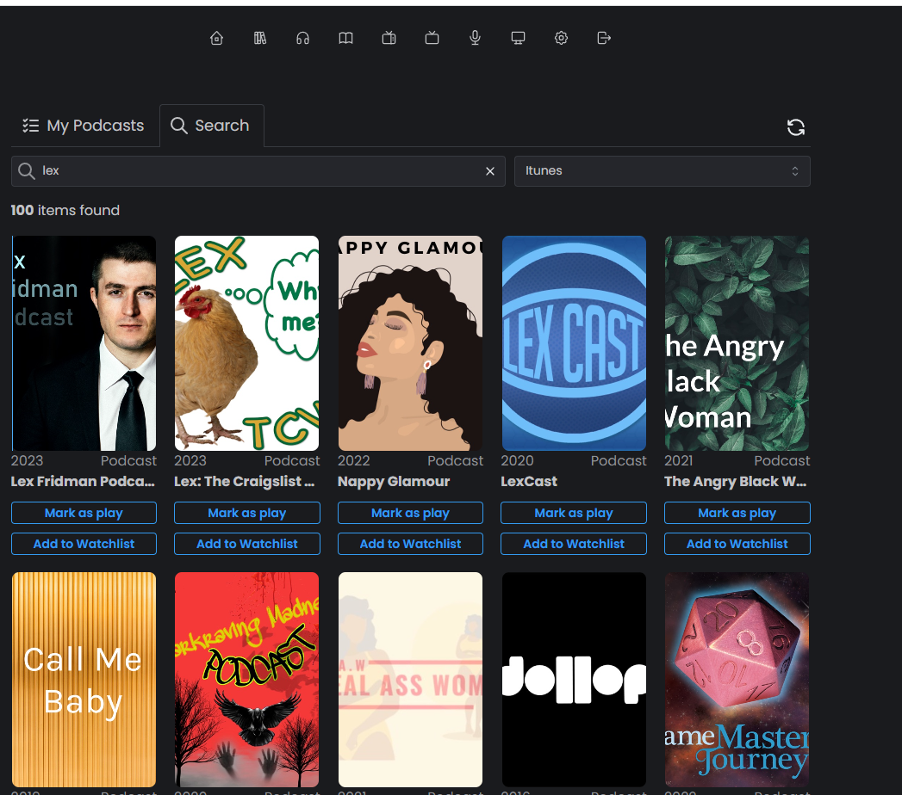

Suche nach chinesischen Kanälen


### TV-Shows

Suche auf Chinesisch

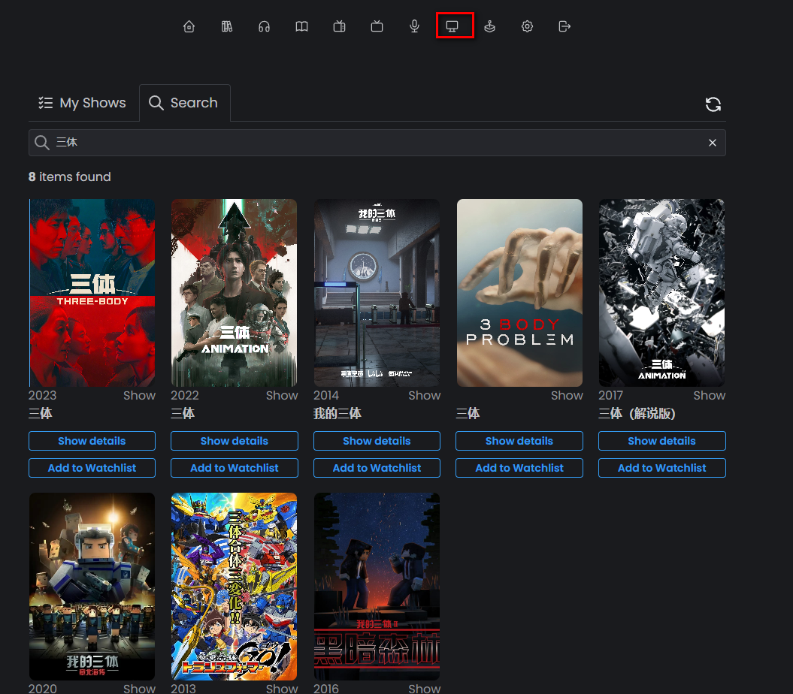

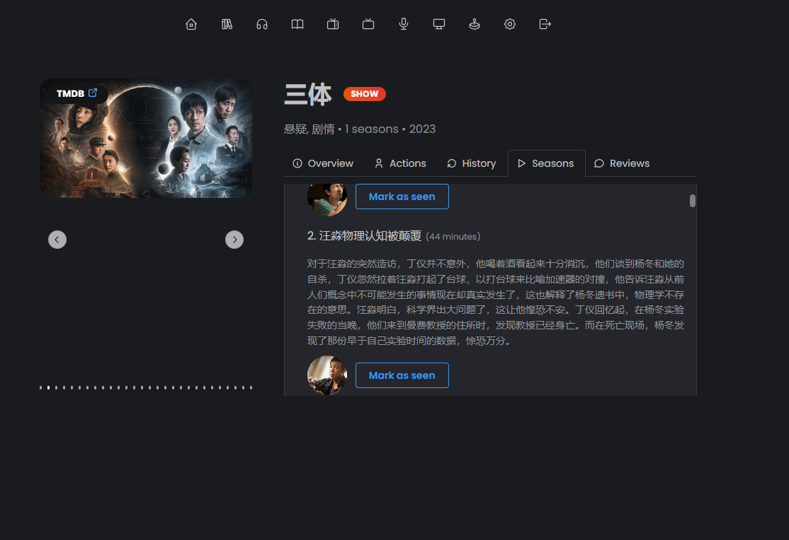

`Alle Episoden werden gescraped`, es gibt auch Einführungen und Sie können auch `den Fortschritt jeder Episode verfolgen`, jede Episode hat einen Status "gesehen" oder "ungesehen"


Lassen Sie uns eine weniger bekannte ausprobieren:


Versuchen wir es mit einer englischen, kein Problem:


### Spiele (Mein Favorit)

Richtig, `ryot kann auch deinen Spiel-Fortschritt verfolgen`!

Letztes Jahr "Elden Ring"


Mein Favorit "Arthur Morgan":


`Nur ein Spiel in den USA`:


Auf der Listen-Seite können Sie ganz einfach nach gespielten Spielen, Veröffentlichungsdatum und Bewertung sortieren:


Schließlich die Startseite:

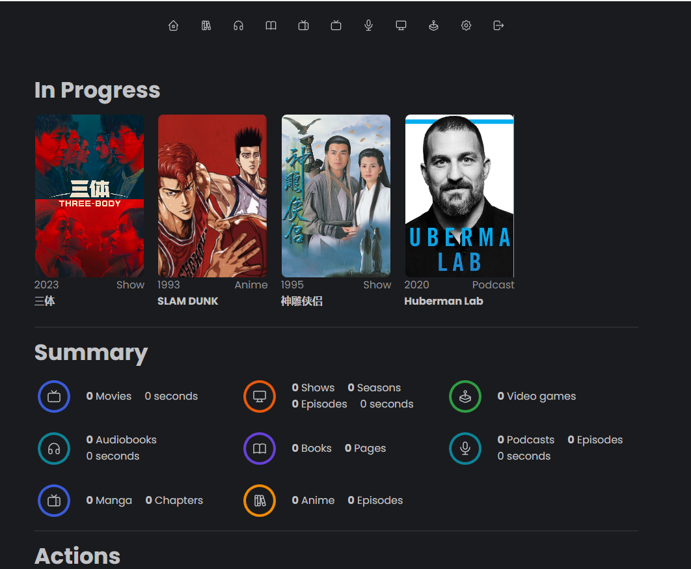

## Zum Schluss

Es gibt immer noch einige Probleme mit der Startseite.

1. Der Inhalt im Zusammenfassungsabschnitt wurde nicht aktualisiert. Ich vermute, dass ich möglicherweise SQLite als Datenbank verwende oder es einen Fehler gibt.
2. Das Konzept der "Sammlung" wird hier nicht reflektiert. Der Autor hat ein Konzept namens "Sammlung" entworfen, in dem Sie Ihre eigene Sammlung nach Ihren Vorlieben erstellen können. Wenn Sie zum Beispiel an Unternehmertum interessiert sind, können Sie alle Bücher, TV-Shows und Filme zum Thema Unternehmertum in dieser Sammlung zusammenstellen.

Was in der Zukunft erwartet werden kann:

1. Dieses Projekt arbeitet hart daran, sich mit anderen Projekten zu integrieren (derzeit mit audiobookshelf integriert, aber ich konnte es nicht erfolgreich bereitstellen), ich kenne den Grund nicht.

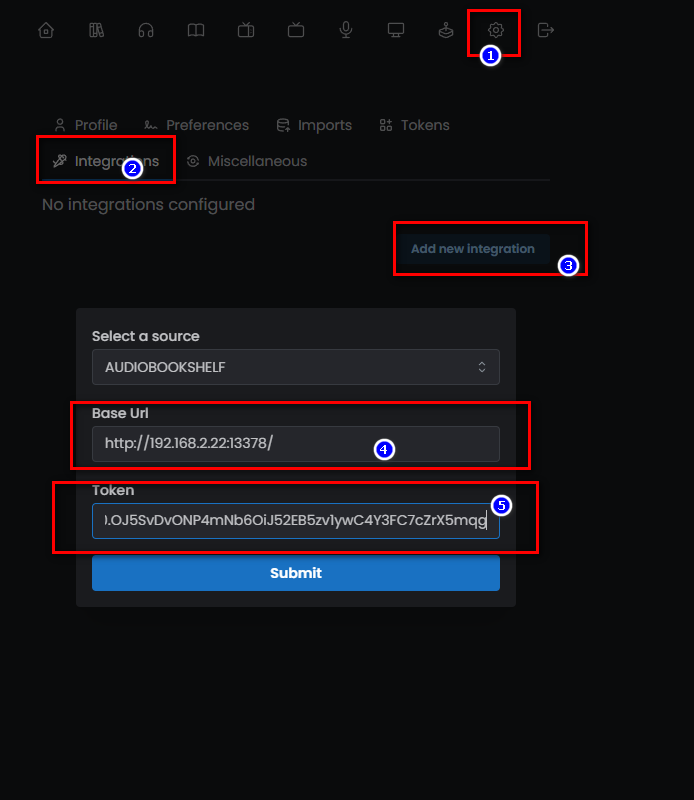

2. Es gibt auch andere Projekte wie Plex, Emby, usw. Ich glaube, dass sie im Laufe der Zeit den Zeitplan einholen werden.
3. Wenn ich Zeit habe, werde ich auch zur Open-Source-Community beitragen, um dieses Projekt zu verbessern.

Derzeit ist die Funktionalität zwar nicht perfekt, aber ich denke, sie ist ausreichend. Ich werde dieses Projekt auch in Zukunft weiterverfolgen und bei neuen Funktionen und Merkmalen zeitnah mit allen synchronisieren.

---

Zum Schluss möchte ich meine Geräte vorstellen: "1 weißes Kleid, 1 QNAP, 1 Schnecke (schwarzes Kleid), 1 PVE-Server". Ich empfehle Anfängern nicht, mit diesen Geräten herumzuspielen, wie ich es tue. Es wird Anfängern eher empfohlen, ein weißes Kleid oder QNAP zu wählen.

Wenn Ihnen dieser Artikel gefällt, denken Sie bitte daran, "Dad's Digital Garden" zu liken, zu bookmarken und zu folgen. Wir werden weiterhin praktische Anleitungen zur Selbstbauanwendung bringen. Gemeinsam nehmen wir unsere Daten in die Hand und schaffen unsere eigene digitale Welt!

Wenn Sie während des Einrichtungsprozesses auf Probleme stoßen oder Vorschläge haben, hinterlassen Sie bitte einen Kommentar für Diskussion und Lernen.