科技助力生活：自建Ryot，记录你的阅读、观影、游戏、健身情况。
<!--more-->


## 1. 前言

我迫不及待的想要和大家介绍我的Nas新玩具，教你搭建你的`私有化豆瓣`

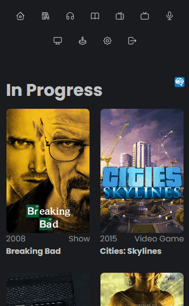

如果你能满足以下一项：

- 电子收藏控
- 文艺青年
- 电影，电视剧爱好者
- 游戏爱好者
- 漫画，二次元爱好者
- 读书爱好者

那么这一个玩具，一定不会让你失望。

这是一个集`搜索，搜刮，影评，书评`为一体，全面掌管你的数字生活（电影，漫画，电视剧，书籍，游戏）

另外还有不错的界面，俗话说用不用是我的事，`照片墙必须得有`


这里也必须得让我可以碎碎念，写影评，书评，游戏评价


---

## 介绍Ryot

Ryot（Roll Your Own Tracker，即“自定义跟踪器”），它帮助你跟踪生活中的各个方面，包括你`阅读的书籍、看过的电影、玩过的游戏`...

Ryot的界面非常友好。他提供了许多好看的图表和摘要，让你更好地理解和总结你的生活。

Ryot的主要功能如下：

- 支持记录你所有数字媒体（`漫画，书籍，播客，电影，电视剧，游戏`）
- 像豆瓣一样，影评，评分，进度等等，重要的是有我最爱的游戏啊


- nas部署，私有化数据。
- 速度极快（Ryot是用Rust编写的）。
- 免费开源
- 界面英文，支持中文搜索（未来会有中文）


---

搭建步骤：

## 1. 重点

`点个免费关注`，不迷路

## 2. 安装Portainer

教程参考：
[30秒安装Nas必备神器 Portainer](/how-to-install-portainer-in-nas/)

##  3. File Station

File Station 打开docker 文件夹，创建`Ryot`文件夹

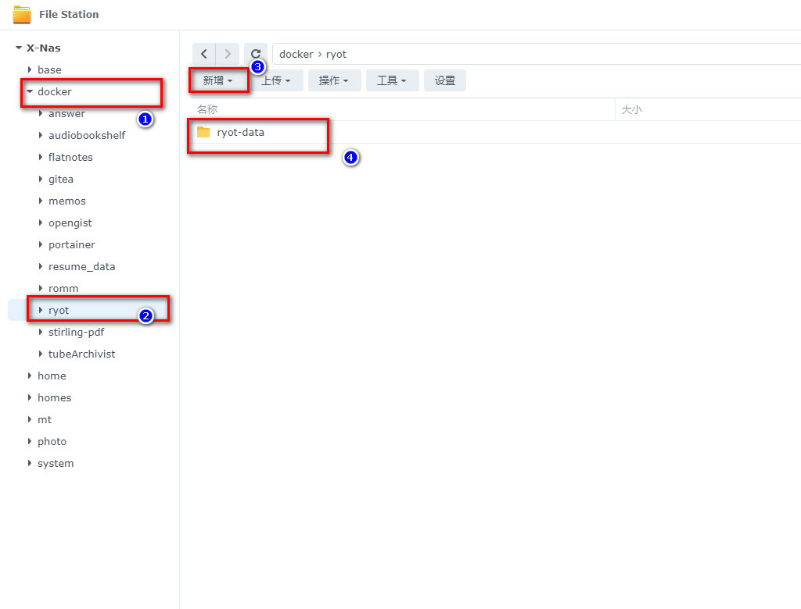

## 4. 创建stack


## 5.  部署代码

```yaml
version: '3.9'
services:
  ignisda:
    image: 'ghcr.io/ignisda/ryot:latest'
    volumes:
        - /volume1/docker/ryot/ryot-data:/data
    environment:
        - WEB_INSECURE_COOKIE=true
        - VIDEO_GAMES_TWITCH_CLIENT_ID=xxxx # 非必须，你的witch id,详细下文解释
        - VIDEO_GAMES_TWITCH_CLIENT_SECRET=xxxx # 非必须，# 你的witch secret,详细下文解释
        - MOVIES_TMDB_LOCALE=zh
        - SHOWS_TMDB_LOCALE=zh
        # - MOVIES_TMDB_ACCESS_TOKEN=XXX
        # - SHOWS_TMDB_ACCESS_TOKEN=XXX
        - ITUNES_LOCALE=en
        - USERS_ALLOW_REGISTRATION=true
    ports:
        - '18030:8000'
    pull_policy: always
    container_name: ryot
    restart: unless-stopped
```

1. 选择stack
2. name栏输入Ryot
3. edditor输入：上面代码
4. 点击deploy

### 参数解释

- WEB_INSECURE_COOKIE

如果你不是使用`https`，请按照这个设置

- VIDEO_GAMES_TWITCH_CLIENT_ID   VIDEO_GAMES_TWITCH_CLIENT_SECRET

这两项可以`不设置`，但是你将`没有游戏这一栏目`，这两项的设置可以参考这一篇

[30秒安装Nas必备神器 Portainer](/how-to-install-romm-on-your-nas/)


- MOVIES_TMDB_LOCALE SHOWS_TMDB_LOCALE 

这两项为tmdb中文选项

- MOVIES_TMDB_ACCESS_TOKEN  SHOWS_TMDB_ACCESS_TOKEN

设置tmdb的token，熟悉nastools或者emby，jellfin的人应该都有设置过，这里为什么空着呢

因为空着也不影响搜刮，但是我觉得应该是作者填写的自己的token供大家使用，所以如果有，还是自己填写下，或者日后失效后填写

- USERS_ALLOW_REGISTRATION

是否允许用户注册，第一次`一定设置为true`，否则无法注册，如果是`没有多人使用，后面设置为false`

## 6. 成功


## 7. 使用

浏览器进入程序：[ip]:[端口]

> ip为你nas所在ip（这里我的是172.16.23.106），端口为上面配置文件定义，如果你按照我的教程，则是18030

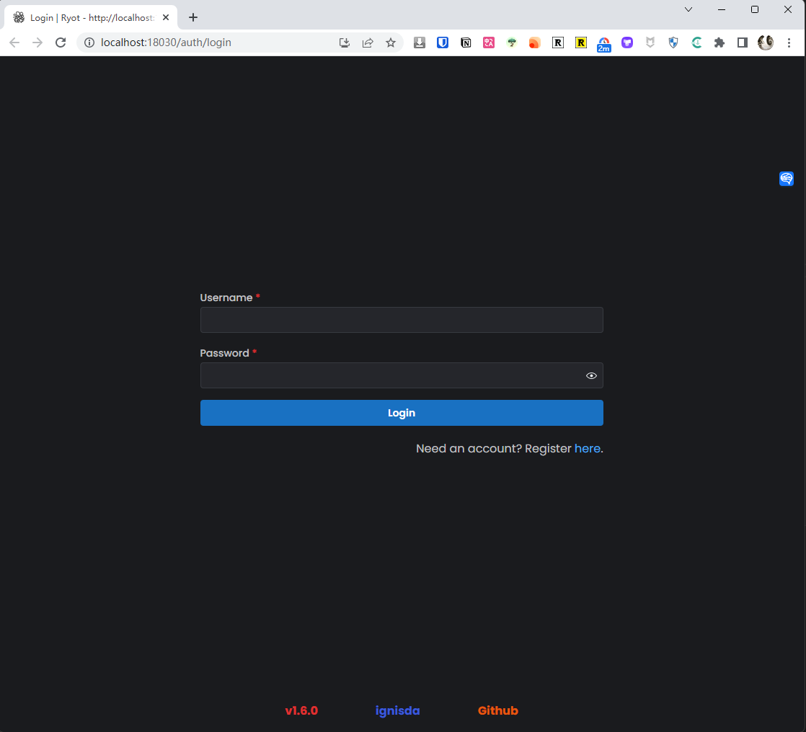

## 8. 注册

点击register，注册

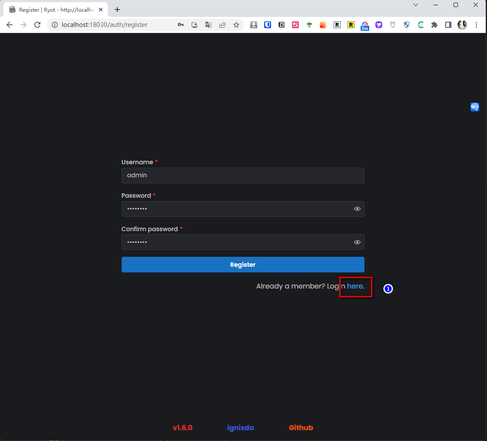


## 9. 详细使用

接下来我来演示各个模块的功能

### 搜索书（使用google book）

搜索一本《长安的荔枝》去年的畅销书


不错，信息都能出来

再找一本去年的上野千鹤子的《始于极限》，很遗憾，没有封面


好在里面内容还可以，只需要简单贴入封面即可


### 漫画

这里的漫画分为两种，animes 与mangas，顺便自己也被科普了下，这俩的区别

`animes 与mangas的区别`

【animes - 日本动画】

形式:动态的视觉产品,通过电视、电影等播放

制作:涉及动画师、配音演员等,制作周期长,预算高

特点:视觉效果和音效强烈,情节和人物刻画力强

代表作:《灌篮高手》《攻壳机动队》《死亡笔记》等

【mangas - 日本漫画】

形式:静态的印刷品,通过书籍、杂志发行

创作:主要由漫画家一人或少数人完成,周期短,成本低

特点:静态画面,视觉和听觉体验不如animes,情节和人物刻画略逊

代表作:《龙珠》《名侦探柯南》《海贼王》《火影忍者》等

### 漫画功能（Animes）

用中文搜索：死亡笔记


不错，看看详情页

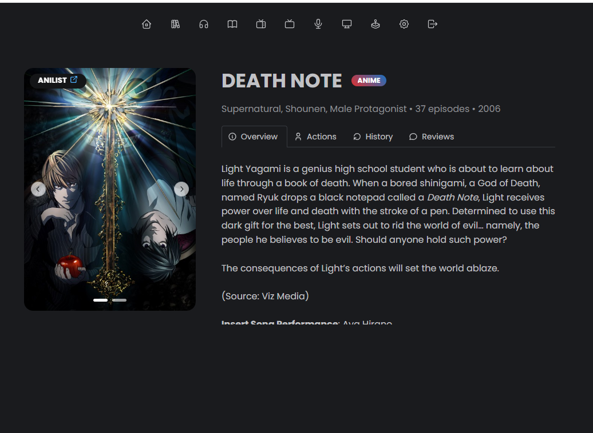

虽然是英文，但是符合我们的照片墙

这里着重讲一下`action`，这也是ryot一大特色，`track all your media`，追踪你所有的进度

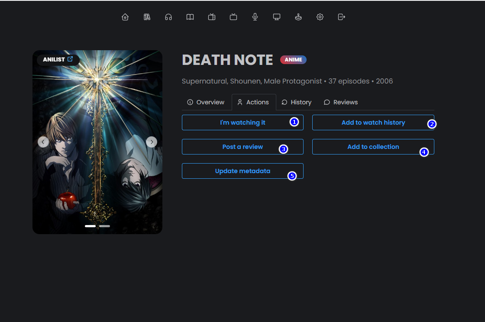

1. 我正在观看
2. 加入已观看列表
3. 写评论
4. 加入合集
5. 更新最新meta信息


这样就可以很清晰的知道自己有哪些没看完，有哪些已经看完

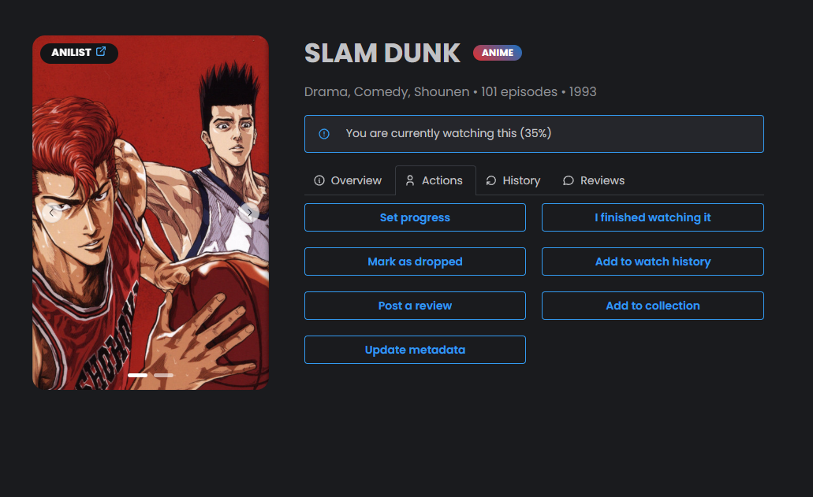

这里可以`书写评论`，这也是我一直无法割舍豆瓣的最大原因，没有一个很好的工具可以标记，写下当时的评论


支持`多条评论`，比如某一集

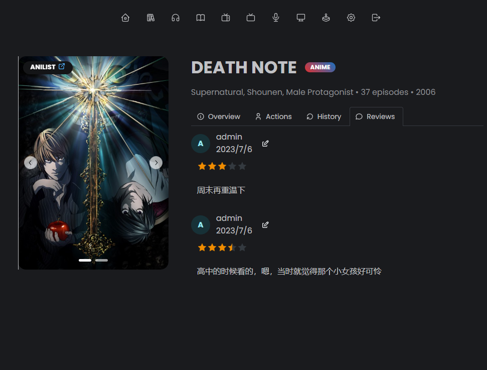


### 电影

接下来是电影部分，先找一个经典：《消失的爱人（gone girl》


tmdb资源就是丰富

再来看看最近和它类似的《消失的她》


消失的她，仅仅海报都有十多张，一次搜刮`大量的海报`，够你显摆了


同样评论，常规操作：


### podcast

搜索英文


搜索中文频道

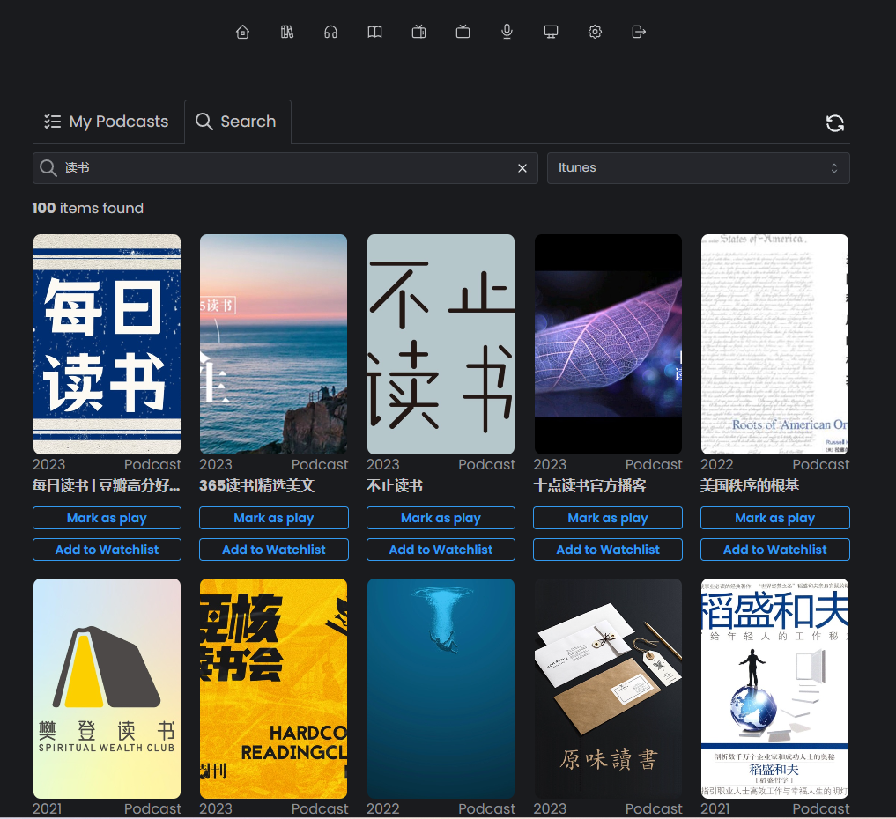


### 电视剧

搜索中文


`剧集也都搜刮了`，还有介绍，同时还能`分集追踪进度`，每一集都有一个已观看，未观看

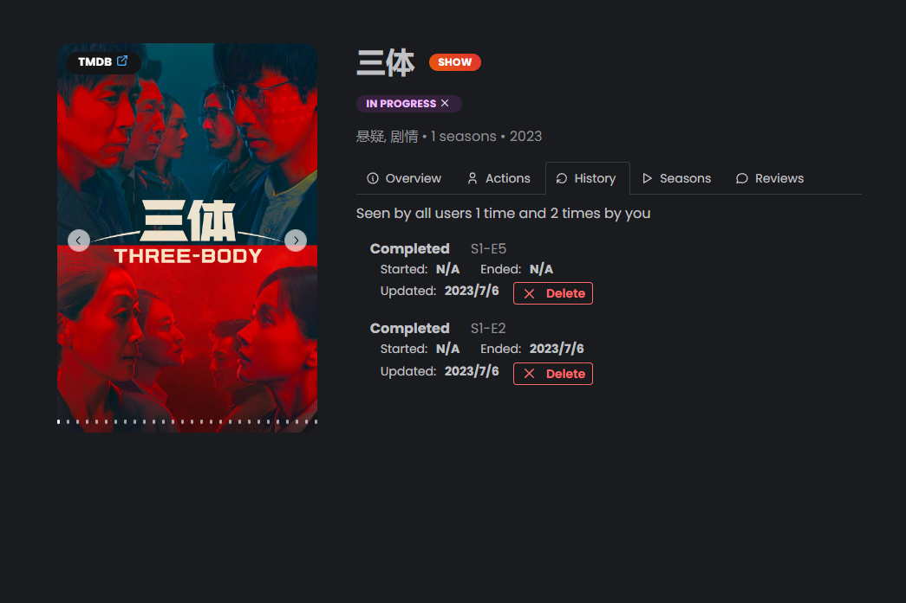

试一试冷门的：


试一下英文的，也没问题：

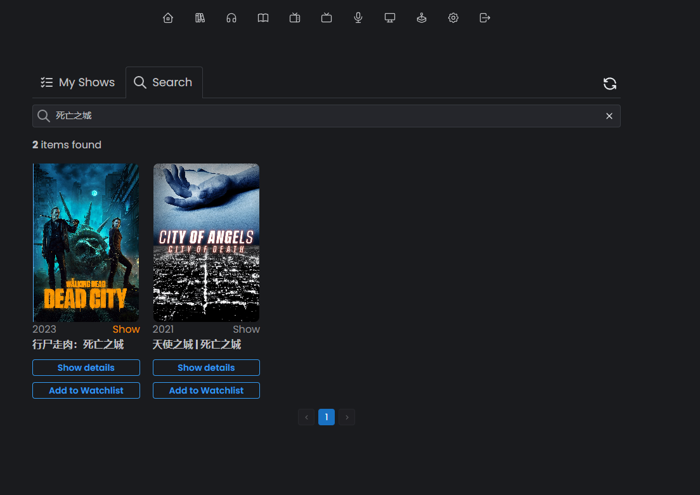


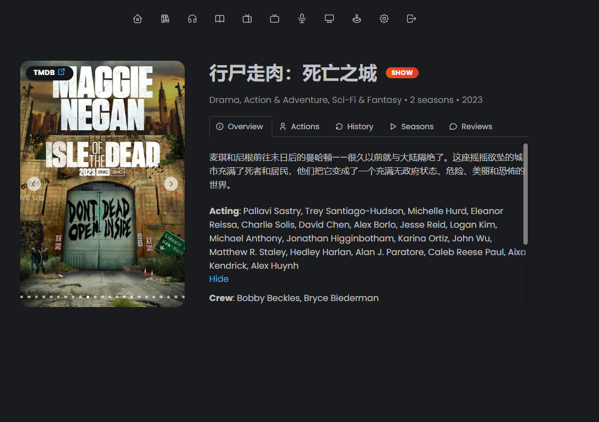


### 游戏（我的最爱）

没错，`tyot还能追踪你的游戏进度`！

去年的`艾尔邓法环`


最爱的`亚瑟摩根`：


`美末只有一部`


外面列表页可以轻松，按照是否玩过，发布日期，评分来`排序`：


最后就是首页：


## 最后

首页还有些问题

1. summary部分的内容没更新，我猜测可能我使用的是sqlite当作数据库，也有可能是bug
2. collection 没有体现，这里作者设计了个概念，collection，比如你可以随心创建自己的合集，比如创业，把所有创业相关的书籍，电视剧，电影都装在这个合集里


未来可以期待的：

1. 这个项目正在努力和其他项目打通（目前打通的有audiobookshelf，但是我没部署成功），不知道什么原因


2. 其他的还有plex，emby，等等相信假以时日，都会赶上日程
3. 如果我有时间的话，也会贡献自己的力量去开源社区，完善这个项目，添砖加瓦


就目前来说，`虽然功能不完善，但是我觉得够用了`，未来我也会持续关注这个项目，如果有最新的功能，和特性，我也会及时和大家同步


---

最后介绍一下我的设备，`1白裙，1威联通，1蜗牛(黑裙），1pve服务器`，不建议小白和我一样折腾，比较推荐新手玩家，选择白裙或者威联通


如果你喜欢这篇文章，请记得点赞，收藏，并关注【老爸的数字花园】，我们将会持续带来更多实用的自搭建应用指南。一起，让我们掌握自己的数据，创建自己的数字世界！

如果你在搭建过程中遇到任何问题，或者有任何建议，也欢迎在下方留言，一起探讨和学习。


