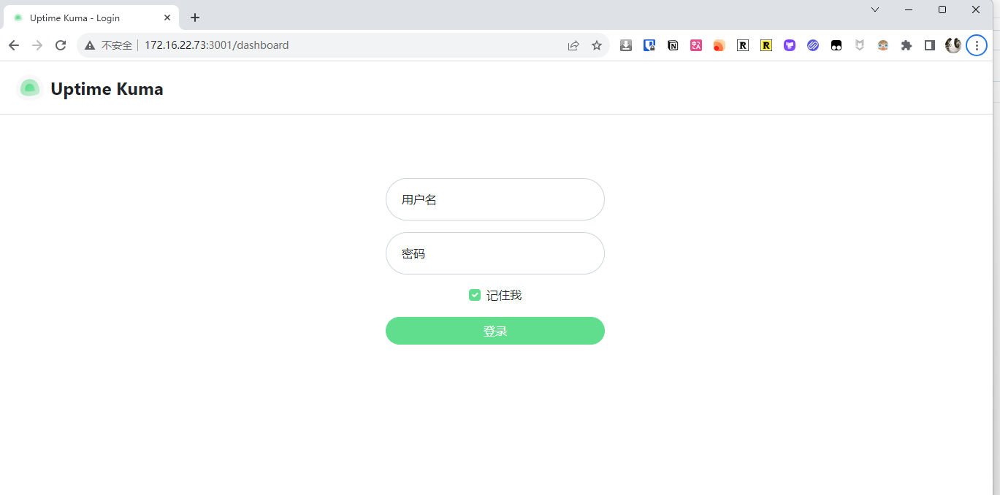
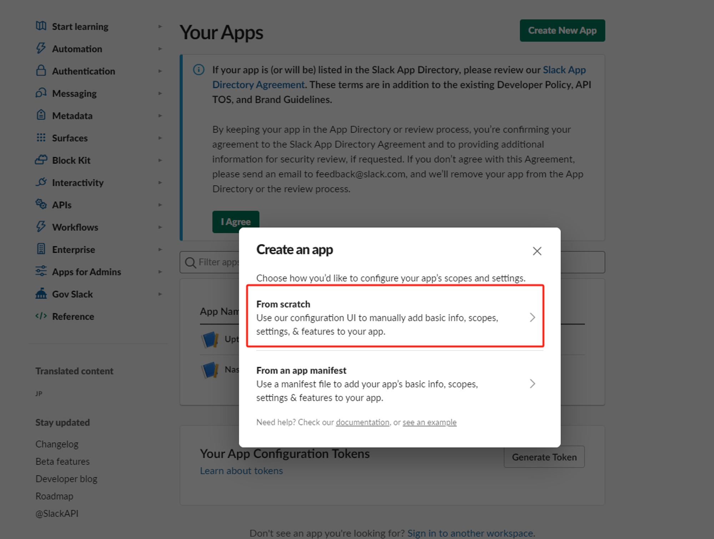
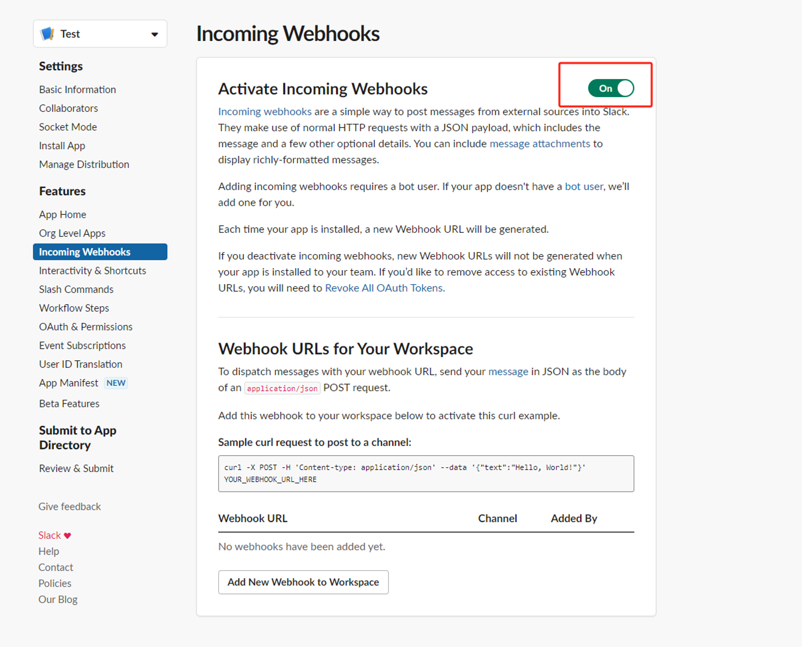
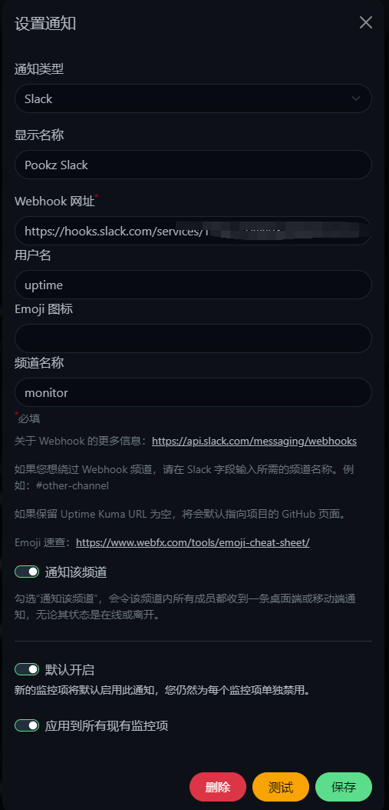

Das heute vorgestellte Tool ist ein unverzichtbares Werkzeug, das alles überwachen kann, ob es sich um Ihr NAS oder Ihre persönliche Website handelt. Und es geht nicht nur um die schöne Benutzeroberfläche, was noch wichtiger ist, ist, dass es bis zu 80 Arten von Benachrichtigungen unterstützt. Im späteren Teil dieses Artikels werden wir Sie auch darüber informieren, wie Sie kostenlose Benachrichtigungen (Slack-Bots) verwenden können, um Sie über dringende Situationen auf dem Laufenden zu halten.
<!--more-->


## 1. Einführung

Haben Sie jemals Angst um die Stabilität Ihres NAS gehabt? Haben Sie jemals festgestellt, dass Ihre Dienste lange Zeit ausgefallen sind, wenn Sie sie benötigen?

Wünschen Sie sich ein leistungsstarkes Tool, das Ihnen jederzeit und überall den Echtzeit-Gesundheitsstatus Ihrer Online-Dienste liefert?

Als NAS-Enthusiast sollten Sie in Betracht ziehen, Ihr eigenes Überwachungstool zu erstellen.

Das heute vorgestellte Tool ist ein unverzichtbares Werkzeug, das alles überwachen kann, ob es sich um Ihr NAS oder Ihre persönliche Website handelt.


Und es geht nicht nur um die schöne Benutzeroberfläche, was noch wichtiger ist, ist, dass es bis zu `80 Arten von Benachrichtigungen` unterstützt. Im späteren Teil dieses Artikels werden wir Sie auch darüber informieren, wie Sie kostenlose Benachrichtigungen (`Slack-Bots`) verwenden können, um Sie über `dringende Situationen` auf dem Laufenden zu halten.


---

## Einführung in Uptime Kuma

Uptime Kuma ist ein benutzerfreundliches, selbst gehostetes Überwachungstool, mit dem Sie den Gesundheitszustand Ihrer Online-Dienste jederzeit und überall in Echtzeit überwachen können. Hier sind seine Hauptfunktionen:

### ⭐ Funktionen

- **Mehrere Überwachungsmethoden**: Unterstützt die Überwachung von HTTP(s), TCP, HTTP(s)-Schlüsselwörtern, HTTP(s)-JSON-Abfragen, Ping, DNS-Einträgen, Benachrichtigungen, Steam-Spielservern, Docker-Containern und mehr.
- **Moderne Benutzeroberfläche**: Bietet ein schönes und responsives UI/UX-Design.
- **Vielfältige Benachrichtigungsmethoden**: Unterstützt Telegram, Discord, Gotify, Slack, Pushover, E-Mail (SMTP) und mehr sowie über 90 andere Benachrichtigungsdienste.
- **Hochfrequente Überwachung**: Unterstützt eine Überwachung alle 20 Sekunden.
- **Unterstützung mehrerer Sprachen**: Erfüllt die Bedürfnisse von Benutzern aus verschiedenen Ländern und Regionen.
- **Mehrere Statusseiten**: Bietet klare und detaillierte Berichte zum Gesundheitszustand des Dienstes.
- **Benutzerdefinierte Domain-Mapping**: Weist die Statusseite einer bestimmten Domain zu.
- **Ping-Diagramme**: Zeigt intuitiv die Änderungen der Ping-Werte für Dienste an.
- **Zertifikatsinformationen**: Überprüft bequem den SSL-Zertifikatsstatus von Diensten.
- **Proxy-Unterstützung**: Überwacht über einen Proxy, um die Privatsphäre und Sicherheit der Überwachung zu gewährleisten.
- **Zwei-Faktor-Authentifizierung**: Erhöht die Sicherheit von Konten.

---

Einrichtungsschritte:

## 1. Wichtiger Punkt

`Folgen Sie kostenlos`, verlaufen Sie sich nicht

## 2. Docker-Verwaltungsoberfläche

#### Synology DSM 7.2 oder höher kann direkt den *Container Manager* verwenden


#### QNAP ContainerStation


#### Portainer selbst installieren

Tutorial-Referenz:

[30-Sekunden-Installation des essentiellen Tools Portainer für NAS](/how-to-install-portainer-in-nas/)

Als nächstes verwenden wir Portainer als Beispiel.

## 3. File Station

Öffnen Sie die File Station und erstellen Sie einen Ordner mit dem Namen `Uptime-Kuma` im Docker-Ordner.


## 4. Erstellen Sie einen Stack


## 5. Den Code bereitstellen

```yaml
version: '3.3'

services:
  uptime-kuma:
    image: louislam/uptime-kuma:1
    container_name: uptime-kuma
    volumes:
      - /volume1/docker/uptime-kuma/data:/app/data
      - //var/run/docker.sock:/var/run/docker.sock  # Fügen Sie diese Zeile hinzu, wenn Sie Docker-Container überwachen müssen
    ports:
      - 3001:3001
    restart: always
    
```

1. Wählen Sie den Stack aus.
2. Geben Sie `Uptime-Kuma` im Namensfeld ein.
3. Geben Sie den obigen Code im Editor ein.
4. Klicken Sie auf Bereitstellen.

## 6. Erfolg


## 7. Verwendung

Greifen Sie über Ihren Browser auf das Programm zu: [ip]:[port]

> Ersetzen Sie `ip` durch die IP-Adresse Ihres NAS (in diesem Fall ist meine 172.16.22.73) und ersetzen Sie `port` durch den in der Konfigurationsdatei definierten Port (wenn Sie meinem Tutorial gefolgt sind, ist es 3001).



## 8. Sonstiges

### Wie man Überwachung hinzufügt

Sie können Ihre Überwachungsparameter und Wiederholungseinstellungen nach Bedarf anpassen.


### Wie man Benachrichtigungen konfiguriert

Uptime Kuma unterstützt fast alle gängigen Benachrichtigungsmethoden, einschließlich nationaler wie Feishu und WeChat Work.

Hier zeige ich Ihnen nur, wie Sie Slack-Benachrichtigungen (kostenlos) einrichten können.

#### Slack

> Ich werde nicht zeigen, wie man ein Slack-Konto erstellt. Die folgenden Schritte konzentrieren sich auf das Erstellen eines Slack-Bots und das Senden von Benachrichtigungen.

1. Erstellen Sie eine Slack-App

https://api.slack.com/apps/new



2. Wählen Sie Ihren Arbeitsbereich aus


3. Richten Sie einen Webhook ein


4. Aktivieren Sie den Bot



5. Richten Sie den Benachrichtigungskanal ein (erstellen Sie zuerst den Kanal)


6. Kopieren Sie schließlich die Webhook-URL


7. Setzen Sie die Slack-Benachrichtigungs-URL in Uptime



## Zum Schluss

Jetzt kennen Sie die leistungsstarken Funktionen und Verwendungsmöglichkeiten von Uptime Kuma. Warum versuchen Sie nicht, Ihr eigenes Überwachungstool zu erstellen?

Wenn Ihnen dieser Artikel gefallen hat, denken Sie bitte daran, [Dad's Digital Garden](https://example.com) zu liken, zu bookmarken und zu folgen. Wir werden Ihnen weiterhin praktische Anleitungen zur Erstellung eigener Anwendungen bieten. Übernehmen wir die Kontrolle über unsere eigenen Daten und schaffen wir unsere eigene digitale Welt!

Wenn Sie während des Einrichtungsprozesses auf Probleme stoßen oder Vorschläge haben, können Sie gerne einen Kommentar hinterlassen, um zu diskutieren und zu lernen.