The tool introduced today is a must-have tool that can monitor everything, whether it's your NAS or personal website. And it's not just about the beautiful interface, what's more important is that it supports up to 80 types of notifications. In the later part of this article, we will also guide you on how to use free notifications (Slack bots) to keep you informed of urgent situations.
<!--more-->


## 1. Introduction

Have you ever felt anxious about the stability of your NAS? Have you ever found that your services have been down for a long time when you need them?

Do you wish to have a powerful tool that can provide you with real-time health status of your online services anytime, anywhere?

As an NAS enthusiast, why not consider building your own monitoring tool?

The tool introduced today is a must-have tool that can monitor everything, whether it's your NAS or personal website.

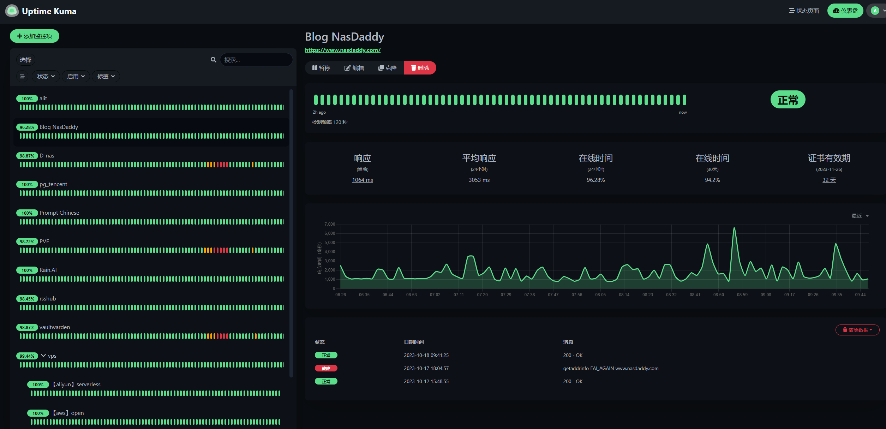


And it's not just about the beautiful interface, what's more important is that it supports up to `80 types of notifications`. In the later part of this article, we will also guide you on how to use free notifications (`Slack bots`) to keep you informed of `urgent situations`.

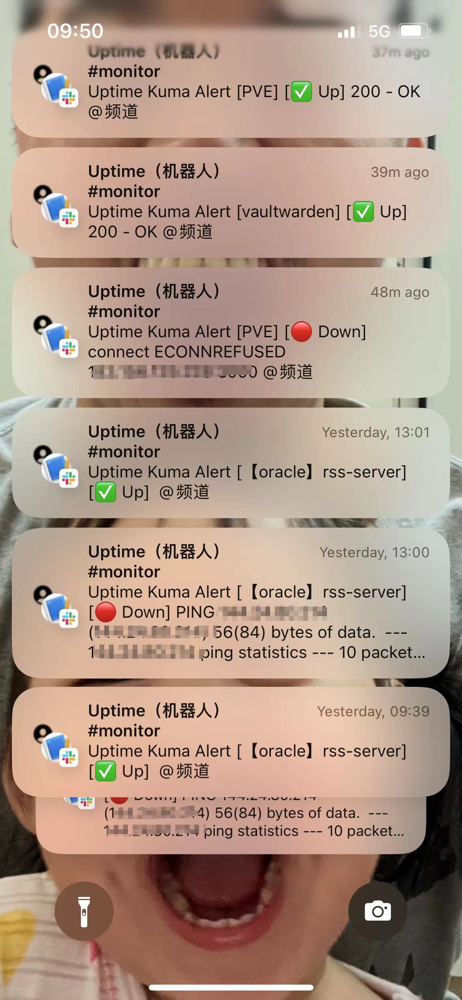


---

## Introduction to Uptime Kuma

Uptime Kuma is an easy-to-use self-hosted monitoring tool that allows you to monitor the health of your online services in real-time anytime, anywhere. Here are its main features:

### ⭐ Features

- **Multiple monitoring methods**: Supports monitoring of HTTP(s), TCP, HTTP(s) keywords, HTTP(s) JSON queries, Ping, DNS records, notifications, Steam game servers, Docker containers, and more.
- **Modern user interface**: Provides a beautiful and responsive UI/UX design.
- **Rich notification methods**: Supports Telegram, Discord, Gotify, Slack, Pushover, email (SMTP), and more, as well as over 90 other notification services.
- **High-frequency monitoring**: Supports monitoring every 20 seconds.
- **Multi-language support**: Meets the needs of users from different countries and regions.
- **Multiple status pages**: Provides clear and detailed service health status reports.
- **Custom domain mapping**: Maps the status page to a specified domain.
- **Ping charts**: Intuitively displays the changes in Ping values for services.
- **Certificate information**: Conveniently checks the SSL certificate status of services.
- **Proxy support**: Monitors through a proxy to ensure the privacy and security of monitoring.
- **Two-factor authentication**: Enhances the security of accounts.

---

Setup Steps:

## 1. Key Point

`Follow for free`, don't get lost

## 2. Docker Management GUI

#### Synology DSM 7.2 or above can directly use *Container Manager*


#### QNAP ContainerStation


#### Install Portainer by Yourself

Tutorial reference:

[30-second installation of the essential tool Portainer for NAS](/how-to-install-portainer-in-nas/)

Next, we will use Portainer as an example.

## 3. File Station

Open File Station and create a folder named `Uptime-Kuma` in the docker folder.

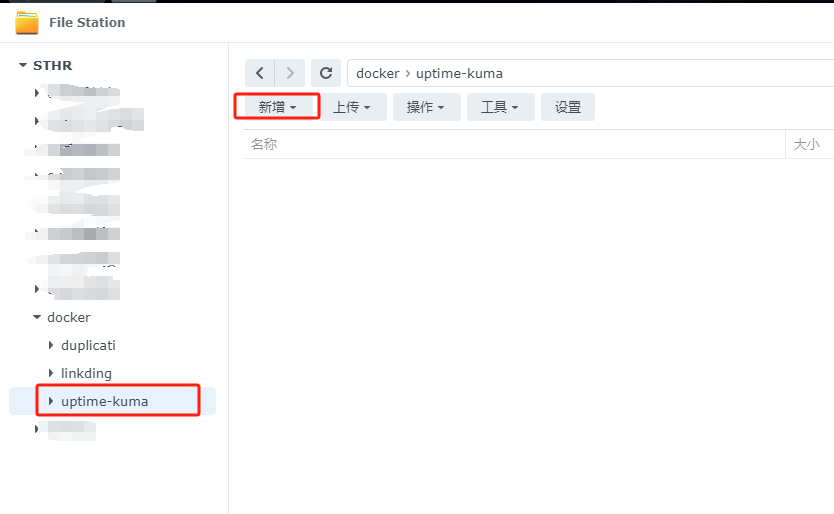

## 4. Create a stack


## 5. Deploy the code

```yaml
version: '3.3'

services:
  uptime-kuma:
    image: louislam/uptime-kuma:1
    container_name: uptime-kuma
    volumes:
      - /volume1/docker/uptime-kuma/data:/app/data
      - //var/run/docker.sock:/var/run/docker.sock  # Add this line if you need to monitor docker containers
    ports:
      - 3001:3001
    restart: always
    
```

1. Select stack.
2. Enter `Uptime-Kuma` in the name field.
3. Enter the above code in the editor.
4. Click on deploy.

## 6. Success


## 7. Usage

Access the program in your browser: [ip]:[port]

> Replace `ip` with the IP address of your NAS (in this case, mine is 172.16.22.73), and replace `port` with the port defined in the configuration file (if you followed my tutorial, it is 3001).

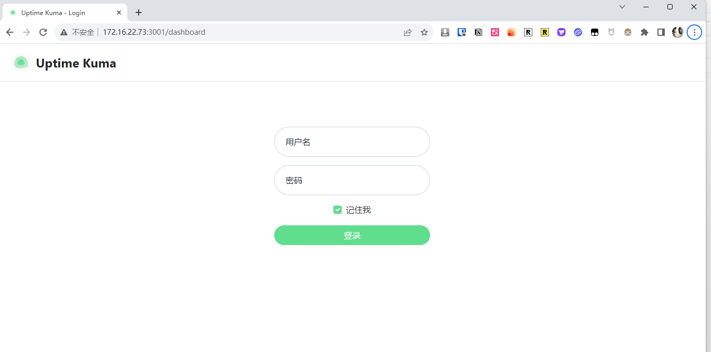

## 8. Other

### How to add monitoring

You can customize your monitoring parameters and retry settings as needed.

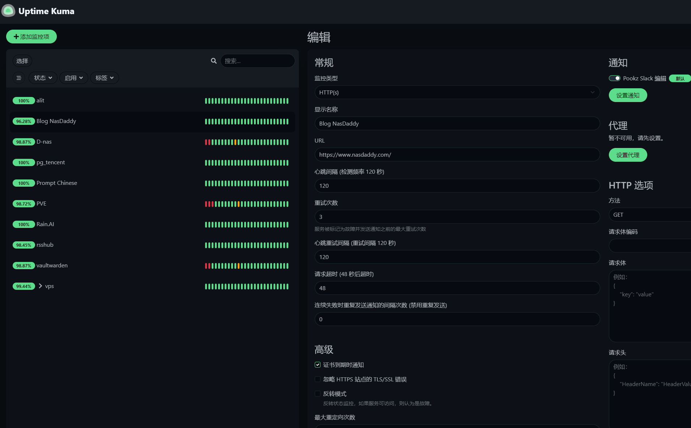

### How to configure notifications

Uptime Kuma supports almost all popular notification methods, including domestic ones like Feishu and WeChat Work.

Here, I will only show you how to set up Slack notifications (free).

#### Slack

> I won't demonstrate how to create a Slack account. The following steps focus on creating a Slack bot and sending notifications.

1. Create a Slack app

https://api.slack.com/apps/new

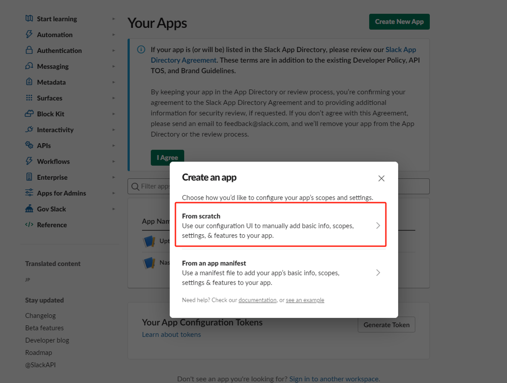

2. Select your workspace

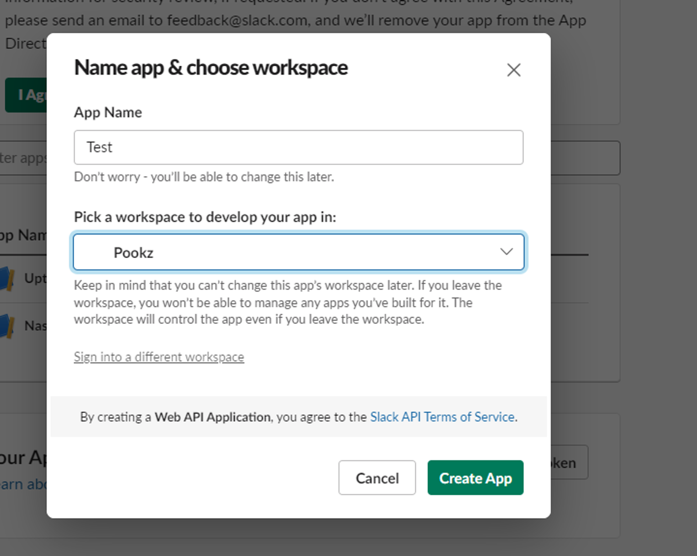

3. Set up a webhook

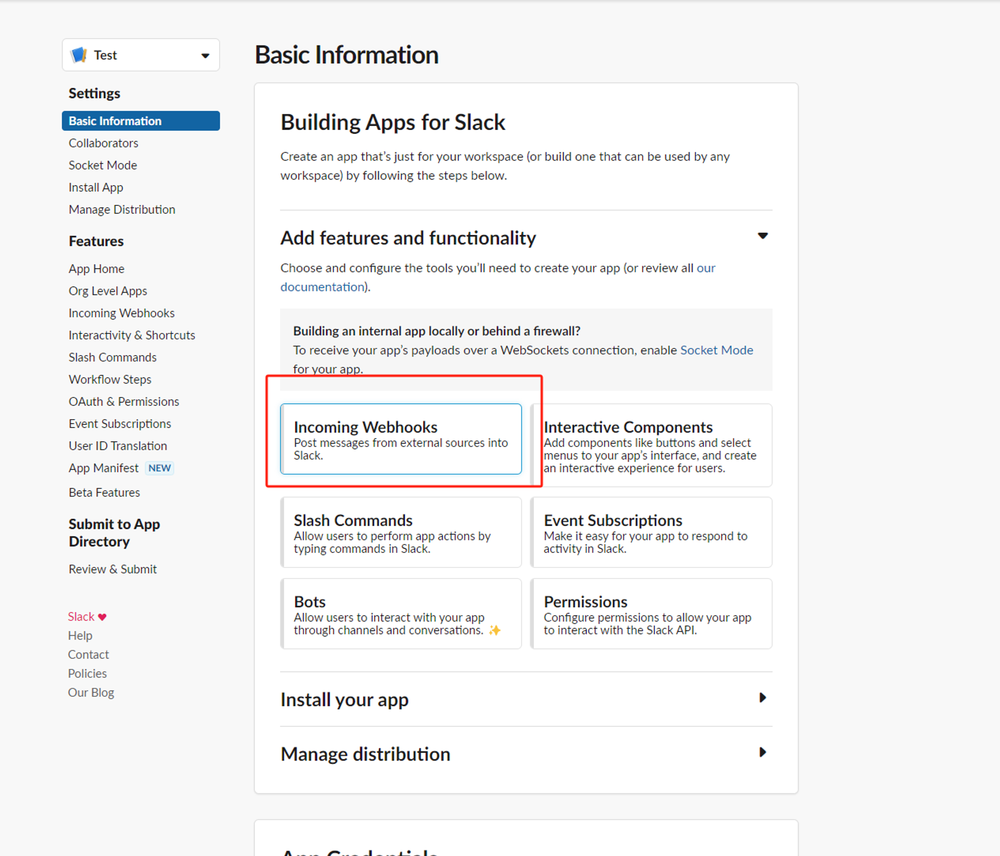

4. Activate the bot

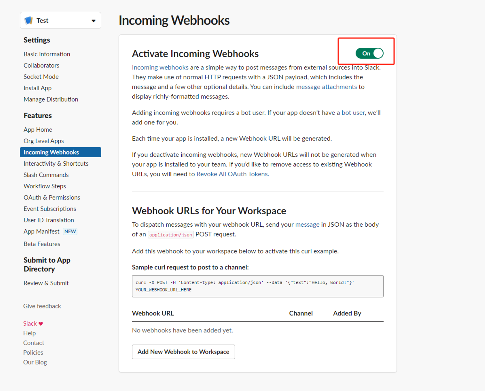

5. Set up the notification channel (create the channel first)

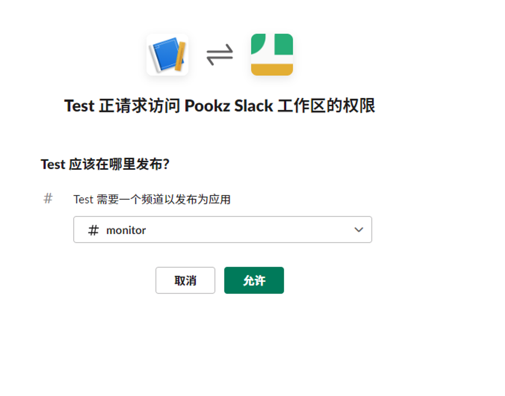

6. Finally, copy the webhook URL

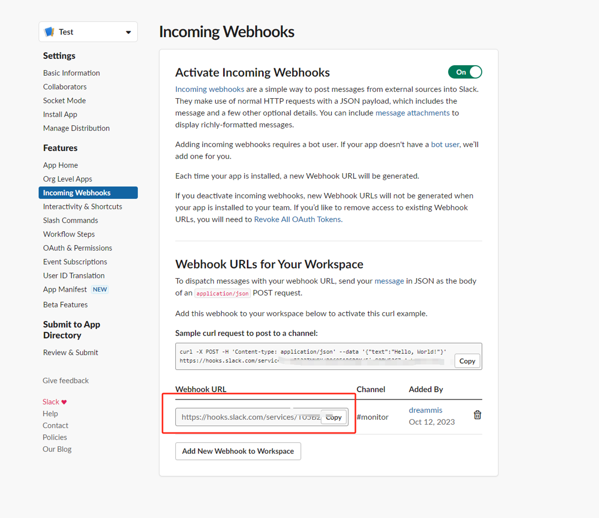

7. Set the Slack notification URL in Uptime

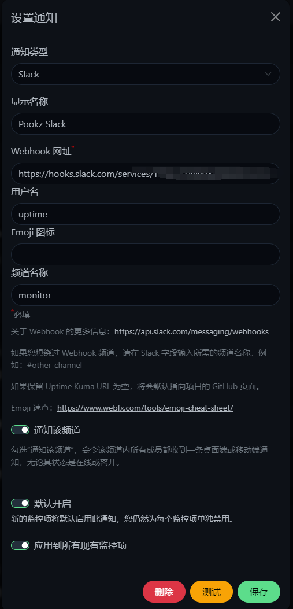

## Finally

Now you know the powerful features and uses of Uptime Kuma. Why not try building your own monitoring tool?

If you liked this article, please remember to like, bookmark, and follow [Dad's Digital Garden](https://example.com). We will continue to bring you more practical self-built application guides. Let's take control of our own data and create our own digital world!

If you encounter any problems or have any suggestions during the setup process, feel free to leave a comment below for discussion and learning.