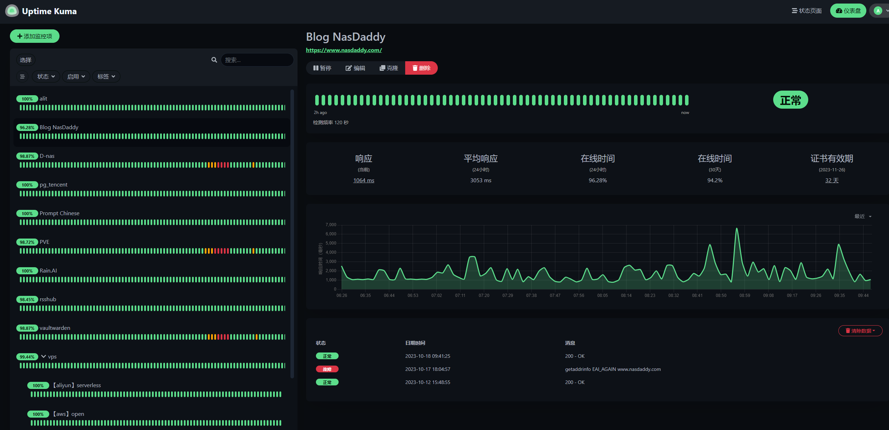
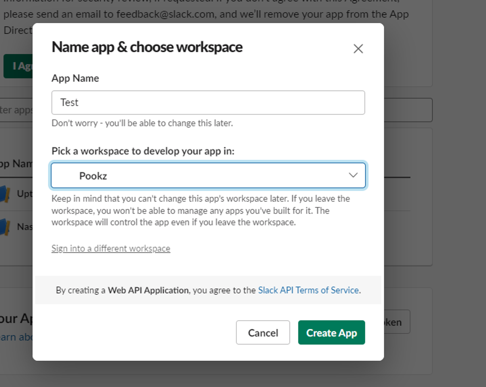
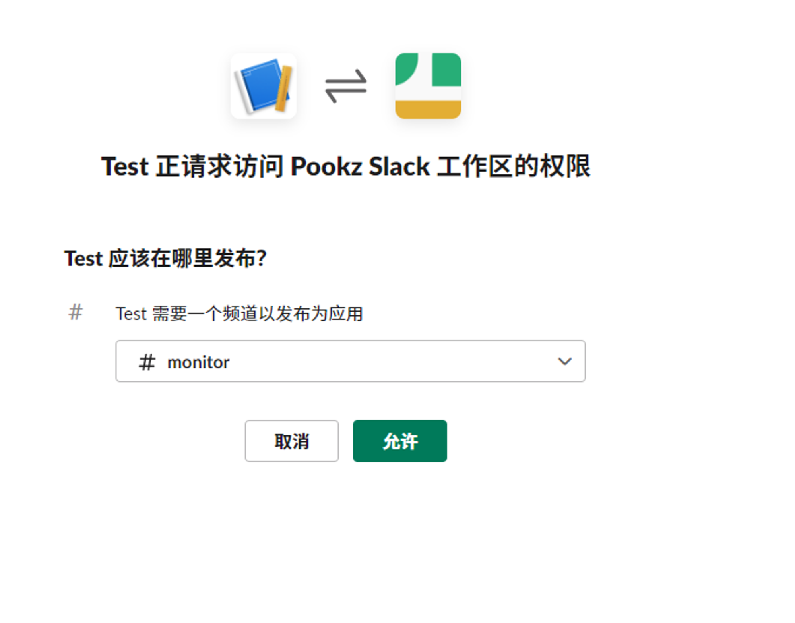
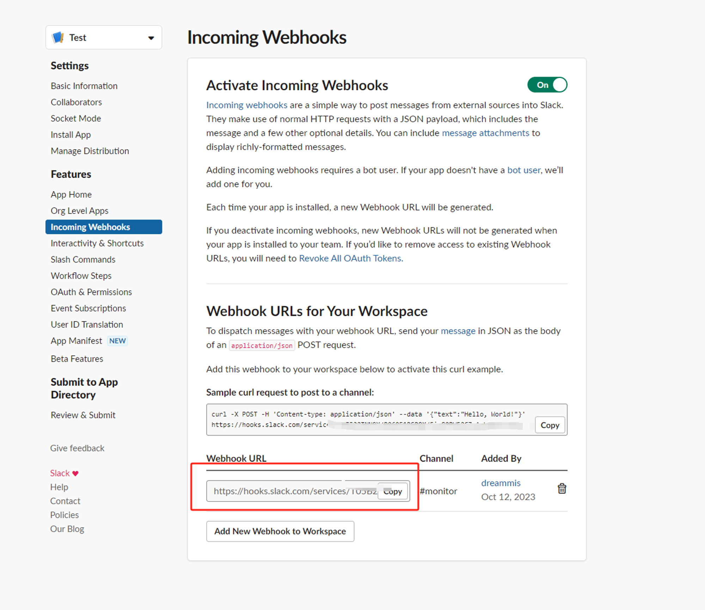

今天介绍的工具，这是一个必备工具，无论是你的nas，还是个人站，一切都可以监控
而且不仅仅是界面美观，更重要的是，它支持高达80种推送方式，本篇后面也会指导大家如何搭配免费推送（slack机器人），让你第一时间知晓紧急情况。
<!--more-->


## 1. 前言

你是否曾经对NAS的稳定性感到焦虑？你是否在需要用的时候，发现你的服务已经停摆许久？

你是否希望有一个强大的工具，可以随时随地为你提供线上服务的健康状况？

那么，作为nas爱好者，为什么不考虑自己搭建一个监控工具呢？

今天介绍的工具，这是一个必备工具，无论是你的nas，还是个人站，一切都可以监控




而且不仅仅是界面美观，更重要的是，它支持高达`80种推送方式`，本篇后面也会指导大家如何搭配免费推送（`slack机器人`），让你第一时间知晓`紧急情况`。


---

## 介绍Uptime Kuma

Uptime Kuma是一个易于使用的自托管监控工具，让你可以在任何时间、任何地方，对你的线上服务进行实时的健康监控。以下是它的主要功能特点：

### ⭐ 特点与功能

- **多种监控方式**：支持HTTP(s)、TCP、HTTP(s)关键词、HTTP(s) Json查询、Ping、DNS记录、推送、Steam游戏服务器、Docker容器等的监控。
- **现代化的用户界面**：提供美观、响应迅速的UI/UX设计。
- **丰富的通知方式**：支持Telegram、Discord、Gotify、Slack、Pushover、电子邮件（SMTP）等，还支持90多种其他通知服务。
- **高频监控**：支持每20秒进行一次监控。
- **多语言支持**：满足不同国家和地区用户的需求。
- **多重状态页面**：为你提供清晰、详细的服务健康状态报告。
- **自定义域名映射**：将状态页面映射到指定域名。
- **Ping图表**：直观显示服务的Ping值变化。
- **证书信息**：方便检查服务的SSL证书状态。
- **代理支持**：通过代理进行监控，确保监控的隐私和安全。
- **二次验证**：增强账号的安全性。

---

搭建步骤：

## 1. 重点

`点个免费关注`，不迷路

## 2. docker管理图形工具

#### 群晖 DSM 7.2版本以上可以直接使用 *Container Manager*


#### 威联通 ContainerStation 


#### 自行安装Portainer

教程参考：

[30秒安装Nas必备神器 Portainer](/how-to-install-portainer-in-nas/)


接下来以Portainer 为例

##  3. File Station

File Station 打开docker 文件夹，创建`Uptime-Kuma`文件夹


## 4. 创建stack


## 5.  部署代码

```yaml
version: '3.3'

services:
  uptime-kuma:
    image: louislam/uptime-kuma:1
    container_name: uptime-kuma
    volumes:
      - /volume1/docker/uptime-kuma/data:/app/data
      - //var/run/docker.sock:/var/run/docker.sock  # 如果需要监控docker 容器则加入这一行
    ports:
      - 3001:3001
    restart: always
    
```

1. 选择stack
2. name栏输入Uptime-Kuma
3. edditor输入：上面代码
4. 点击deploy

## 6. 成功


## 7. 使用

浏览器进入程序：[ip]:[端口]

> ip为你nas所在ip（这里我的是172.16.22.73），端口为上面配置文件定义，如果你按照我的教程，则是3001


## 8. 其他

### 如何添加监控

可按需设置自己的监控参数，重试方式


### 如何配置通知

因为uptime kuma 支持几乎所有主流推送方式，只有你想不到，没有它没涵盖的

甚至其中还包括国内的飞书，微信企业号等等

这里我只给大家展示如何搭建像我一样的slack 推送（free 免费）


#### slack

> 创建slack账号之类的我就不展示了，以下着重展示如何用创建slack机器人，发送推送

1. 创建slack app

https://api.slack.com/apps/new


2. 选择你的企业



3. 设置webhook


4. 激活bot


5. 设置推送频道（先行创建频道）




6. 最后复制webhook地址




7. 最后在uptime上设置slack 推送地址


## 最后

现在你已经知道了Uptime Kuma的强大功能和用途，不如尝试搭建一个属于你自己的监控工具吧！

如果你喜欢这篇文章，请记得点赞，收藏，并关注【老爸的数字花园】，我们将会持续带来更多实用的自搭建应用指南。一起，让我们掌握自己的数据，创建自己的数字世界！

如果你在搭建过程中遇到任何问题，或者有任何建议，也欢迎在下方留言，一起探讨和学习。