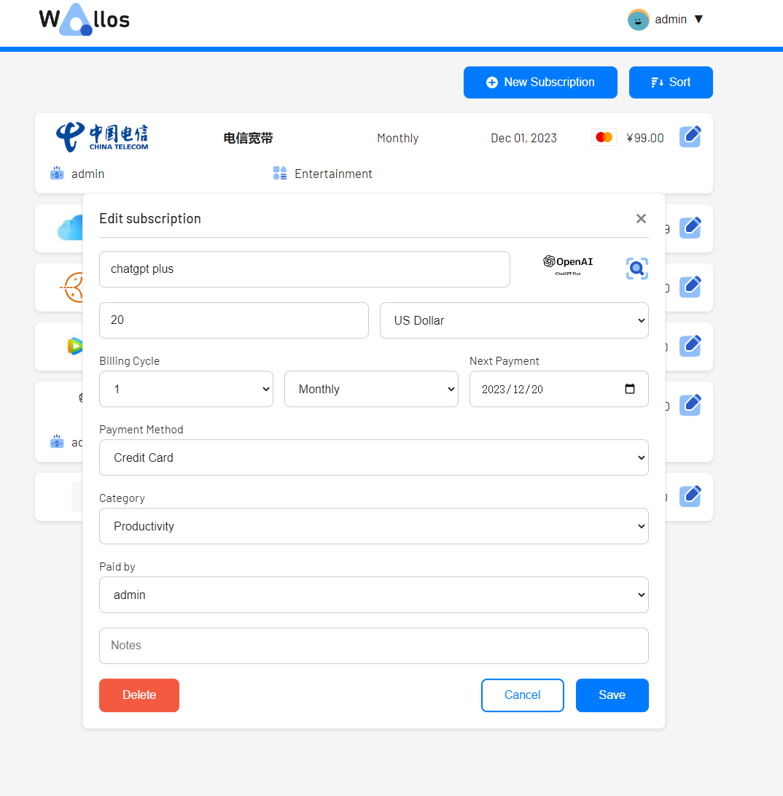
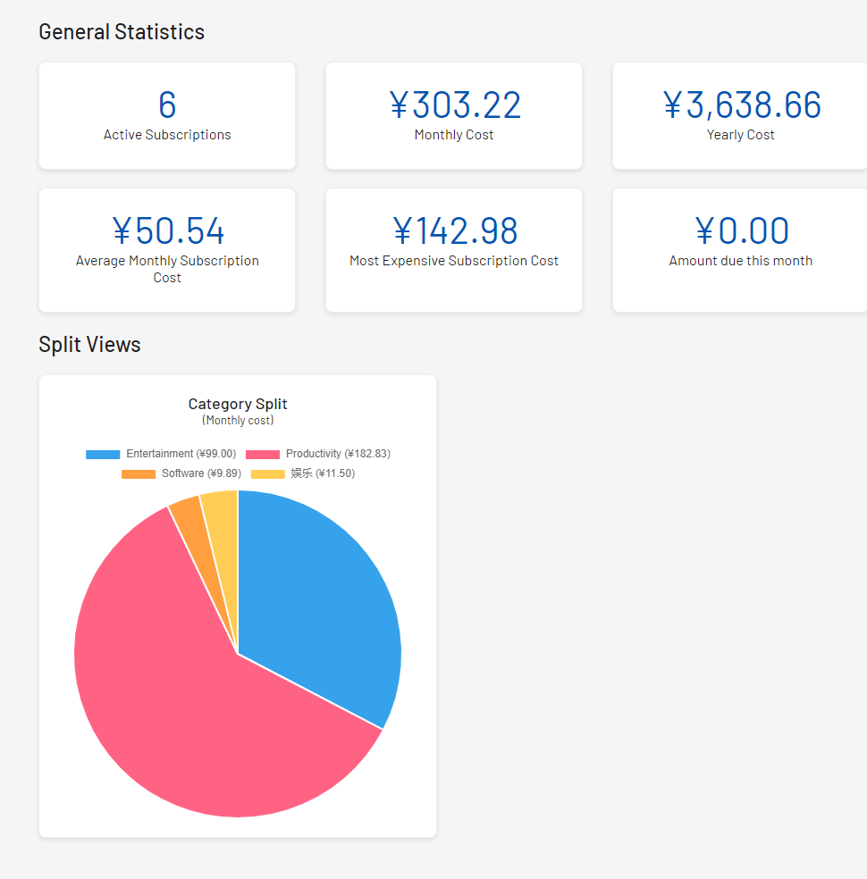
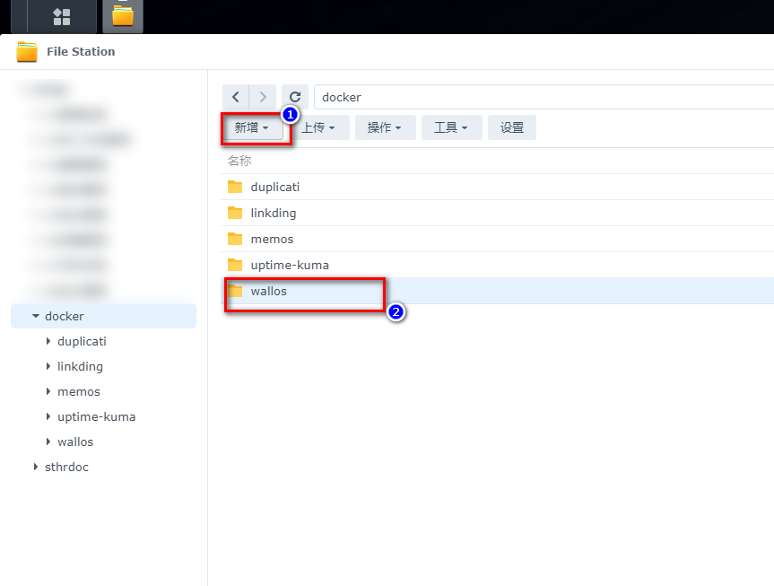
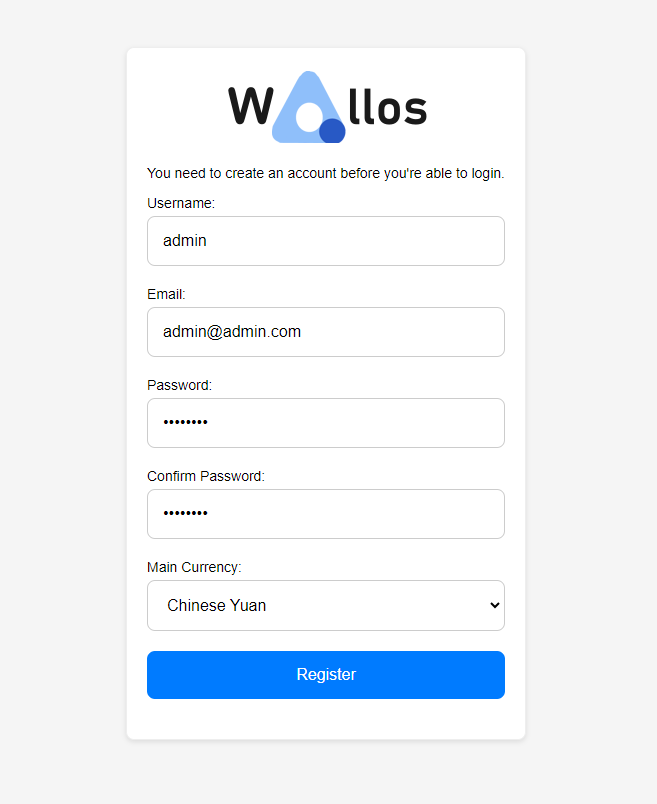
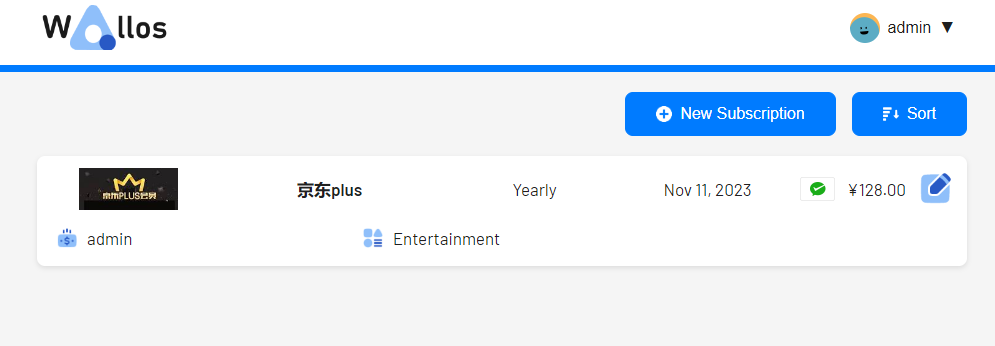

# Lazy Financial Management Tool für Nas-Enthusiasten: So richten Sie Wallos zur Verwaltung persönlicher Finanzen ein

## 1. Einführung

In dieser Ära, die von verschiedenen Abonnements und Mitgliedschaftsdiensten geprägt ist, waren Sie jemals von folgenden Dingen verwirrt:

- Wie viel Ihrer monatlichen Ausgaben sind versteckte Abonnement- und Mitgliedschaftsgebühren, die Sie fast vergessen haben?

- Haben Sie jemals Mitgliedschaften vergessen, die stillschweigend abgebucht werden?

- Haben Sie Auslandszahlungs-Mitgliedschaften/Abonnements, die aufgrund von Währungsumrechnungen Kopfschmerzen bereiten?

- Sind Sie, wie ich, kein akribischer Buchhaltungs-Enthusiast?

Als VIP-Supermitglied mehrerer Plattformen und jährlicher Abonnent (ein Lauch) bin ich auch ein Fan von Datenprivatisierung und Nas-Lösungen.

Heute werde ich Ihnen ein kleines Spielzeug vorstellen, das Ihnen helfen soll, dieses Problem zu lösen: `Wallos`.

Im Gegensatz zu herkömmlicher Buchhaltungssoftware, die sich auf jedes Detail konzentriert, geht es bei Wallos eher darum, Ihnen zu helfen, die stillschweigend abgebuchten Mitgliedschafts- und Abonnementgebühren zu verstehen und zu verwalten, die wir oft übersehen.


---

## Vorstellung von Wallos

Wallos ist nicht nur ein Finanzverwaltungstool; es ist eine neue Art der Verwaltung, die Ihnen dabei helfen kann, Ausgaben einfach zu verfolgen und Ihr finanzielles Leben besser zu kontrollieren. Werfen wir einen genaueren Blick auf die Funktionen und Eigenschaften von Wallos:

- **Abonnementverwaltung**: Verfolgen Sie wiederkehrende Abonnements und Zahlungen, um sicherzustellen, dass Sie keine Fristen verpassen.



- **Kategorienverwaltung**: Unterstützung von benutzerdefinierten Ausgabenkategorien, um Ihnen tiefere Einblicke in Ihre Ausgabegewohnheiten zu geben.


- **Unterstützung mehrerer Währungen**: Unterstützung mehrerer Währungen, um Finanzen in Ihrer gewählten Währung zu verwalten.

- **Währungsumrechnung**: Integration mit der Fixer API zur Bereitstellung von Wechselkursumrechnung und Anzeige aller Abonnements in wichtigen Währungen.

- **Statistiken**: Bieten eine andere Perspektive, um Ihre Ausgaben zu betrachten.



- **Datenschutz**: Als selbstgehostete Anwendung stellt Wallos sicher, dass Ihre finanziellen Daten privat und sicher auf Ihrem eigenen Server bleiben.

- **Logo-Suche**: Wenn Sie es nicht hochgeladen haben, kann Wallos im Web nach Abonnementlogos suchen.


- **Mobile Ansicht**: Verwenden Sie Wallos jederzeit und überall.

- **Benachrichtigungen**: Erhalten Sie Benachrichtigungen über anstehende Zahlungen per E-Mail.

---

Einrichtungsschritte:

## 1. Wichtiger Punkt

`Folgen Sie kostenlos`, um nicht den Überblick zu verlieren.

## 2. Docker-Verwaltungstool mit grafischer Benutzeroberfläche

#### Synology DSM 7.2 oder höher kann direkt *Container Manager* verwenden


#### QNAP ContainerStation


#### Installieren Sie Portainer selbst

Tutorial-Referenz:
[30-Sekunden-Installation von Portainer, ein Muss-Have-Tool für Nas](/how-to-install-portainer-in-nas/)

Als nächstes verwenden wir Portainer als Beispiel.

## 3. File Station

# Öffnen Sie den Docker-Ordner in der File Station und erstellen Sie den Ordner `Wallos`



## 4. Stack erstellen


## 5. Code bereitstellen

```yaml
version: '3.0'

services:
  wallos:
    container_name: wallos
    image: bellamy/wallos:latest
    ports:
      - "8282:80/tcp"
    environment:
      TZ: 'Asia/Shanghai'
    volumes:
      - '/volume1/docker/wallos/db:/var/www/html/db'
      - '/volume1/docker/wallos/logos:/var/www/html/images/uploads/logos'
    restart: unless-stopped
```

1. Stack auswählen
2. Geben Sie "Wallos" in das Namensfeld ein
3. Geben Sie den obigen Code in den Editor ein
4. Klicken Sie auf Bereitstellen

## 6. Erfolg


## 7. Verwendung

Greifen Sie über Ihren Browser auf das Programm zu: [ip]:[port]

> Ersetzen Sie "ip" durch die IP-Adresse Ihres NAS (bei mir ist es 172.16.23.106) und ersetzen Sie "port" durch den in der Konfigurationsdatei definierten Port (wenn Sie meinem Tutorial gefolgt sind, wäre es 8282).

Erstmalige Anmeldung und Registrierung:



## 8. Showcase besonderer Funktionen

### Mitglied/Abonnement hinzufügen


### Automatische Suche nach Bildern basierend auf dem Namen des Abonnements/Mitglieds (Sie können auch Ihre eigenen hochladen)




### Mehrere Benutzertags


### Abonnementkategorienverwaltung


### Kategoriestatistiken


### Währungsumrechnung

Wenn Sie, wie ich, einige Mitgliedschaften für ausländische Dienste haben, die eine Währungsumrechnung erfordern, müssen Sie ein Konto bei [Fixer](https://fixer.io/#pricing_plan) beantragen. Sie bieten 1000 kostenlose Aufrufe pro Monat an.


## Zum Schluss

Ich hoffe, dieses kleine Tool kann Ihnen helfen, Ihre Abonnements und Mitgliedschaften besser zu verwalten~

Wenn Ihnen dieser Artikel gefällt, denken Sie bitte daran, ihn zu liken, zu bookmarken und [Nasdaddy's Digital Garden](https://www.nasdaddy.com/) zu folgen. Wir werden Ihnen weiterhin praktische Anleitungen zur selbstgehosteten Anwendung bringen. Übernehmen wir die Kontrolle über unsere eigenen Daten und schaffen wir unsere eigene digitale Welt!

Wenn Sie während des Einrichtungsprozesses auf Probleme stoßen oder Vorschläge haben, können Sie gerne einen Kommentar hinterlassen. Lassen Sie uns gemeinsam erkunden und lernen.