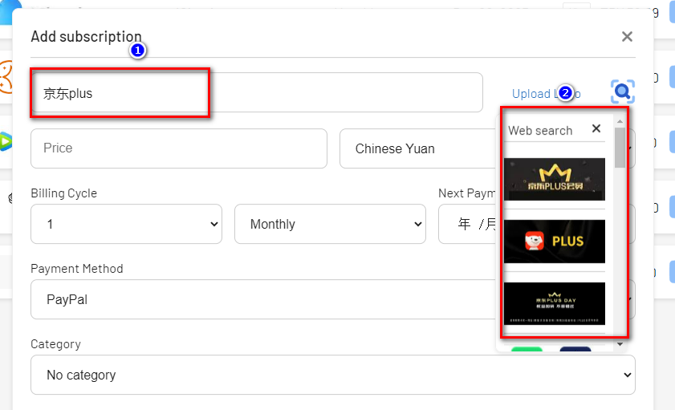
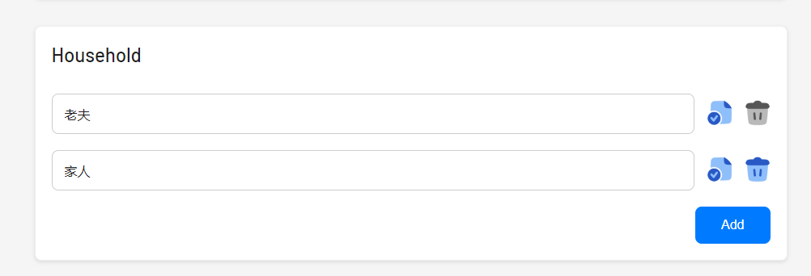

# Lazy Financial Management Tool for Nas Enthusiasts: How to Set Up Wallos to Manage Personal Finances

## 1. Introduction

In this era filled with various subscriptions and membership services, have you ever been confused by the following:

- How much of your monthly expenses are hidden subscription and membership fees that you almost forget?

- Have you ever encountered memberships that you have forgotten but are silently deducted?

- Do you have overseas payment memberships/subscriptions that give you a headache due to currency conversion?

- Are you, like me, not a meticulous accounting enthusiast?

As a VIP super member of multiple platforms and an annual subscriber (a leek), I am also a fanatic of data privatization and Nas solutions.

Today, I will bring you a little toy to help you solve this problem: `Wallos`.

Unlike traditional accounting software that focuses on every detail, Wallos is more about helping you understand and manage those silently deducted membership and subscription fees that we often overlook.


---

## Introducing Wallos

Wallos is not just a financial management tool; it is a new way of management that can help you easily track expenses and better control your financial life. Let's take a closer look at the features and functions of Wallos:

- **Subscription Management**: Track your recurring subscriptions and payments to ensure you don't miss any due dates.


- **Category Management**: Support custom expense categories to give you deeper insights into your spending habits.


- **Multi-Currency Support**: Support multiple currencies, allowing you to manage finances in your chosen currency.

- **Currency Conversion**: Integrated with Fixer API to provide exchange rate conversion and view all subscriptions in major currencies.

- **Statistics**: Provide another perspective to view your expenses.


- **Data Privacy**: As a self-hosted application, Wallos ensures that your financial data remains private and secure on your own server.

- **Logo Search**: If you haven't uploaded it, Wallos can search for subscription logos on the web.



- **Mobile View**: Use Wallos anytime, anywhere.

- **Notifications**: Receive upcoming payment notifications via email.

---

Setup Steps:

## 1. Key Point

`Follow for free` to avoid getting lost.

## 2. Docker Management GUI Tool

#### Synology DSM 7.2 or above can directly use *Container Manager*


#### QNAP ContainerStation


#### Install Portainer on your own

Tutorial reference:
[30-Second Installation of Portainer, a Must-Have Tool for Nas](/how-to-install-portainer-in-nas/)

Next, we will use Portainer as an example.

## 3. File Station

# File Station Open Docker Folder and Create `Wallos` Folder


## 4. Create Stack


## 5. Deploy Code

```yaml
version: '3.0'

services:
  wallos:
    container_name: wallos
    image: bellamy/wallos:latest
    ports:
      - "8282:80/tcp"
    environment:
      TZ: 'Asia/Shanghai'
    volumes:
      - '/volume1/docker/wallos/db:/var/www/html/db'
      - '/volume1/docker/wallos/logos:/var/www/html/images/uploads/logos'
    restart: unless-stopped
```

1. Select stack
2. Enter "Wallos" in the name field
3. Enter the above code in the editor
4. Click deploy

## 6. Success


## 7. Usage

Access the program in your browser: [ip]:[port]

> Replace "ip" with the IP address of your NAS (mine is 172.16.23.106), and replace "port" with the port defined in the configuration file (if you followed my tutorial, it would be 8282).

First-time login and registration:


## 8. Special Features Showcase

### Add Member/Subscription


### Automatically Search Images Based on Subscription/Member Name (You Can Upload Your Own)


### Multiple User Tags



### Subscription Category Management


### Category Statistics


### Currency Conversion

If you, like me, have some memberships for foreign services that require currency conversion, you need to apply for an account with [Fixer](https://fixer.io/#pricing_plan). They offer 1000 free calls per month.


## Finally

I hope this little tool can help you better manage your subscriptions and memberships~

If you like this article, please remember to like, bookmark, and follow [Nasdaddy's Digital Garden](https://www.nasdaddy.com/). We will continue to bring you more practical self-hosted application guides. Let's take control of our own data and create our own digital world!

If you encounter any problems or have any suggestions during the setup process, feel free to leave a comment below. Let's explore and learn together.