# Nas爱好者的懒人理财利器：如何搭建 Wallos 管理个人财务

## 1. 前言

在这个充斥着各式各样订阅与会员服务的时代，不知道你是否有过这样的困惑：

- 每月的花销中究竟隐藏着多少你几乎忘记的`订阅和会员费`？

- 你有没有遇到过，那些你都忘了，却在`默默扣费`的会员呢？

- 你是否有`海外支付`的会员/订阅，因为汇率转换头疼？

- 你是不是也和我一样，不是那种`事无巨细`的记账爱好者

  

作为一个多家平台的vip超级会员，年度订阅的人（韭菜），同时我也是数据私有化、nas解决方案的狂热份子者

今天我就带给大家一个小玩具帮助你解决这个问题：`Wallos`

它不同与事无巨细的传统记账软件，它更多的是帮助你清晰的了解并管理那些默默扣费，常常被我们忽视的会员和订阅费用

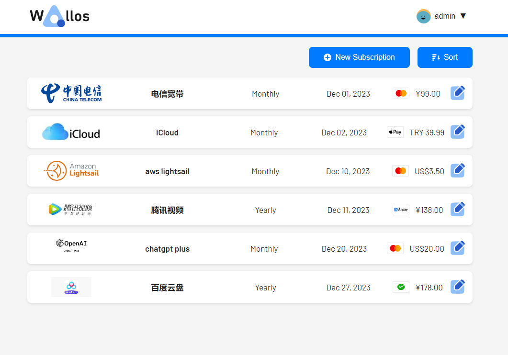


---

## 介绍Wallos

Wallos 不仅仅是一个财务管理工具，它是一种全新的管理方式，可以帮助您轻松追踪开支，更好地控制财务生活。让我们深入了解 Wallos 的特点和功能：

- **订阅管理**：追踪您的定期订阅和付款，确保您不会错过任何到期日。

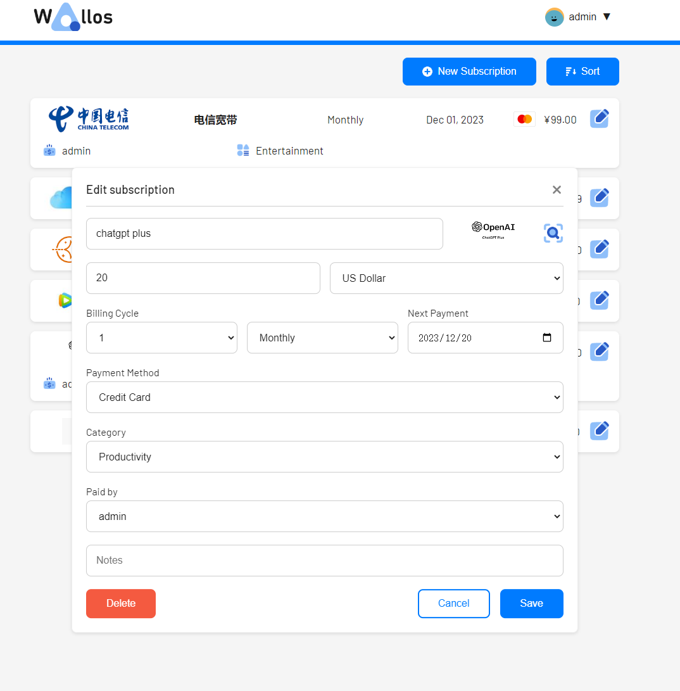

- **类别管理**：支持自定义开销类别，让您对消费习惯有更深入的洞察。

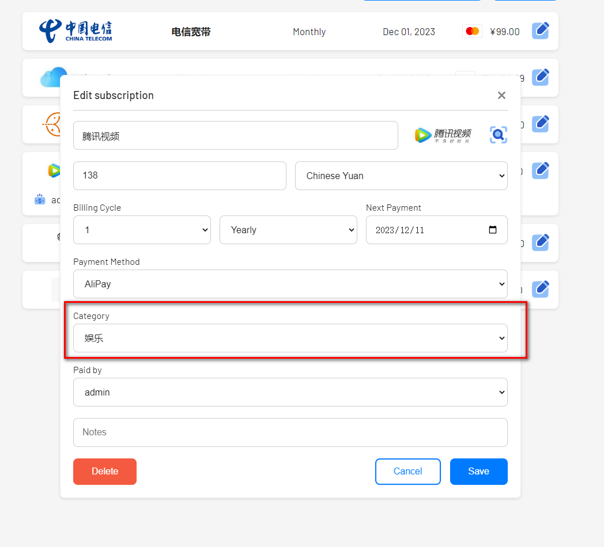

- **多币种支持**：支持多种货币，让您可以按照自己选择的货币管理财务。

- **货币转换**：集成 Fixer API，提供汇率转换，查看主要货币的所有订阅。

- **统计**：提供另一个角度来查看您的支出。

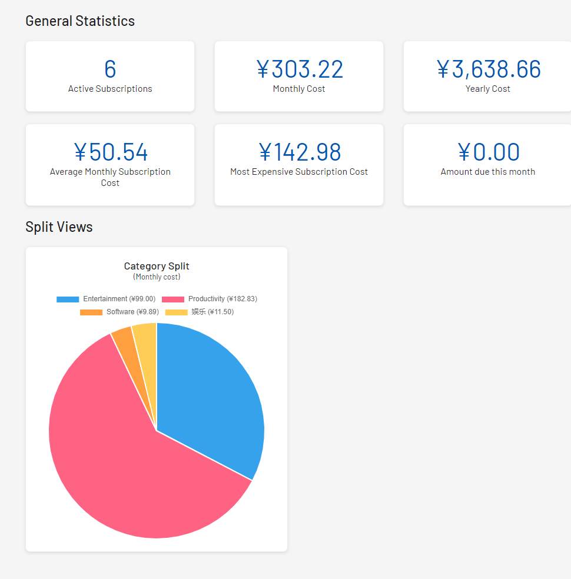

- **数据隐私**：作为自托管应用，Wallos 确保您的财务数据在自己的服务器上保持私密和安全。

- **标志搜索**：如果您没有上传，Wallos 可以在网络上搜索订阅的标志。

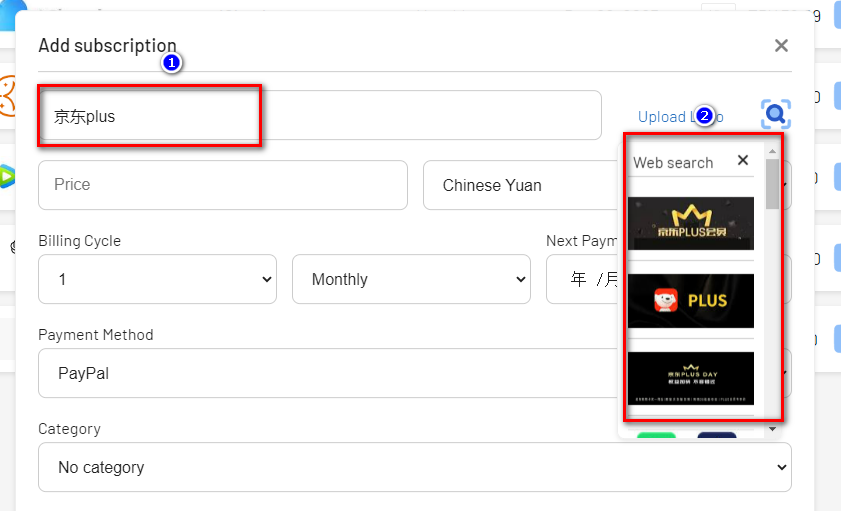

- **移动视图**：随时随地使用 Wallos。

- **通知**：通过电子邮件获得即将到来的付款通知。

---

搭建步骤：

## 1. 重点

`点个免费关注`，不迷路

## 2. docker管理图形工具

#### 群晖 DSM 7.2版本以上可以直接使用 *Container Manager*


#### 威联通 ContainerStation 


#### 自行安装Portainer

教程参考：
[30秒安装Nas必备神器 Portainer](/how-to-install-portainer-in-nas/)


接下来以Portainer 为例

##  3. File Station

File Station 打开docker 文件夹，创建`Wallos`文件夹


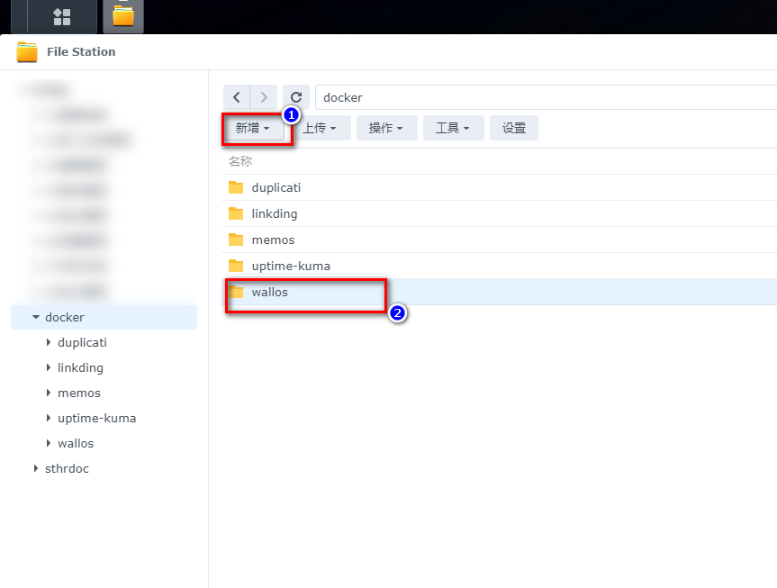

## 4. 创建stack


## 5.  部署代码

```yaml
version: '3.0'

services:
  wallos:
    container_name: wallos
    image: bellamy/wallos:latest
    ports:
      - "8282:80/tcp"
    environment:
      TZ: 'Asia/Shanghai'
    # Volumes store your data between container upgrades
    volumes:
      - '/volume1/docker/wallos/db:/var/www/html/db'
      - '/volume1/docker/wallos/logos:/var/www/html/images/uploads/logos'
    restart: unless-stopped
```

1. 选择stack
2. name栏输入Wallos
3. edditor输入：上面代码
4. 点击deploy

## 6. 成功


## 7. 使用

浏览器进入程序：[ip]:[端口]

> ip为你nas所在ip（这里我的是172.16.23.106），端口为上面配置文件定义，如果你按照我的教程，则是8282

初次登录注册：

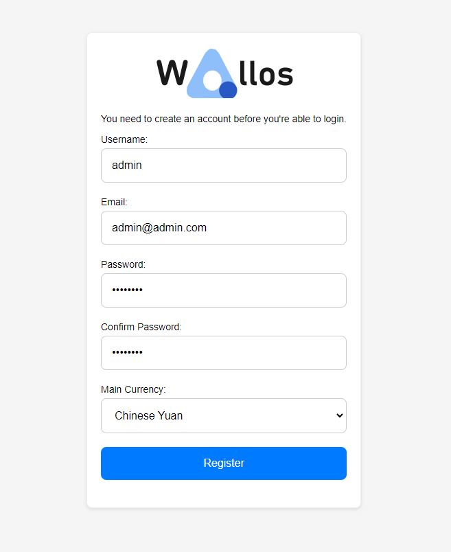

## 8. 特殊功能展示

### 添加会员/订阅

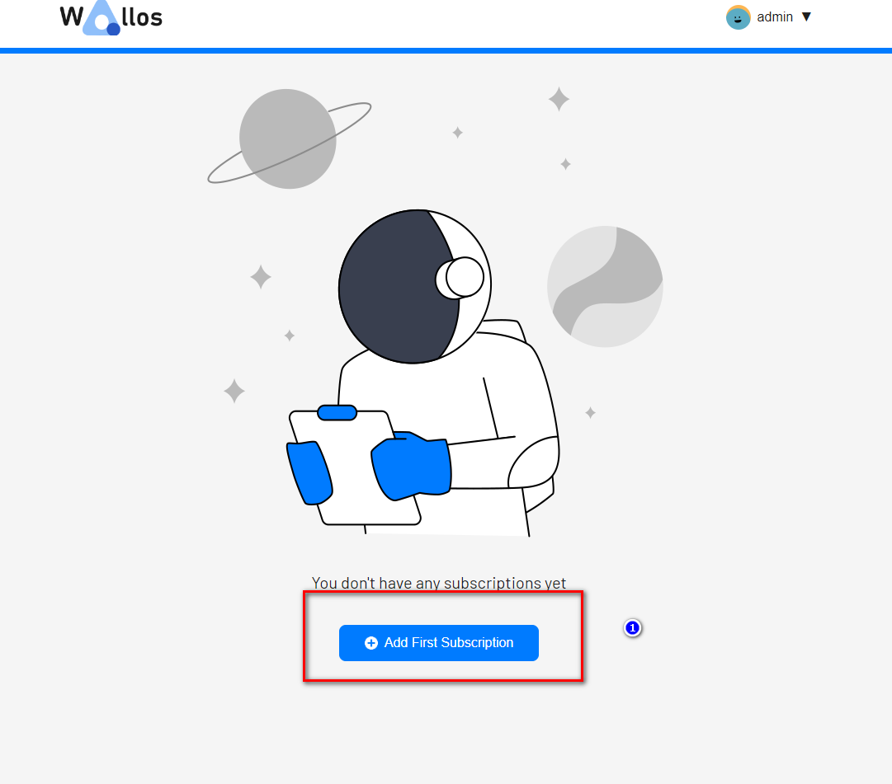

### 根据订阅/会员名称自动搜索图片（你可以自己上传）

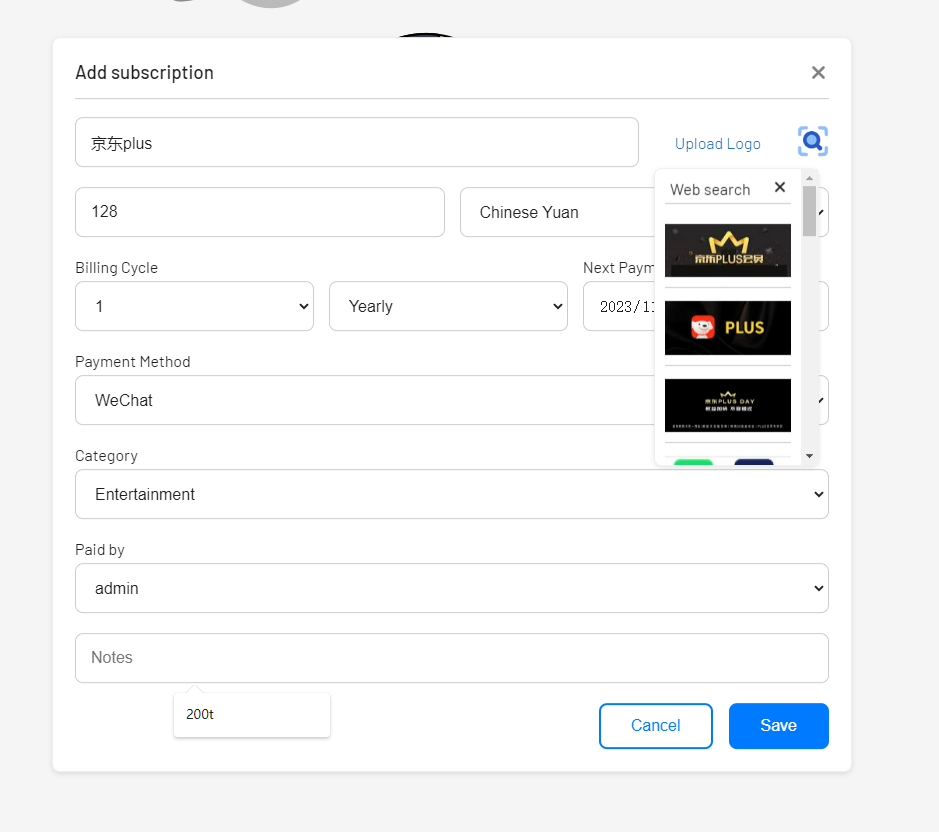

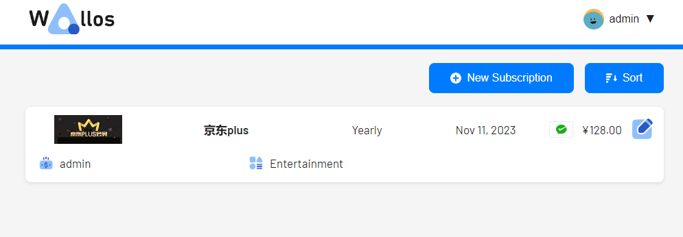

### 多用户标签

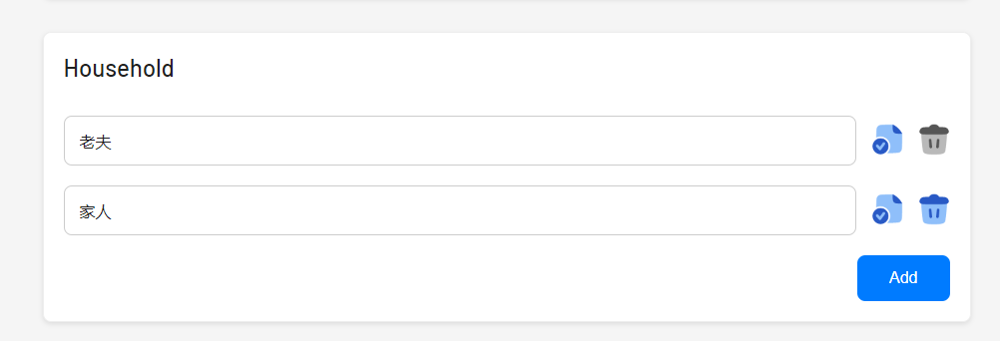

### 订阅分类管理

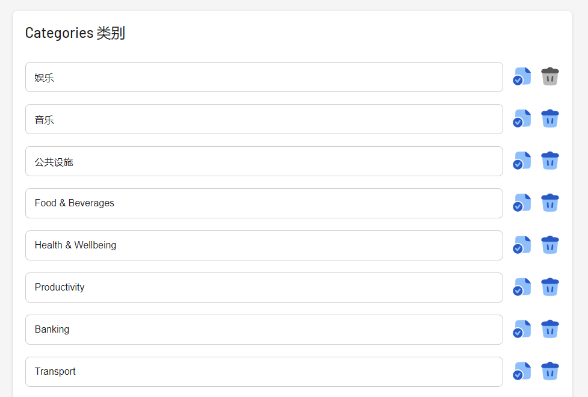


### 分类统计

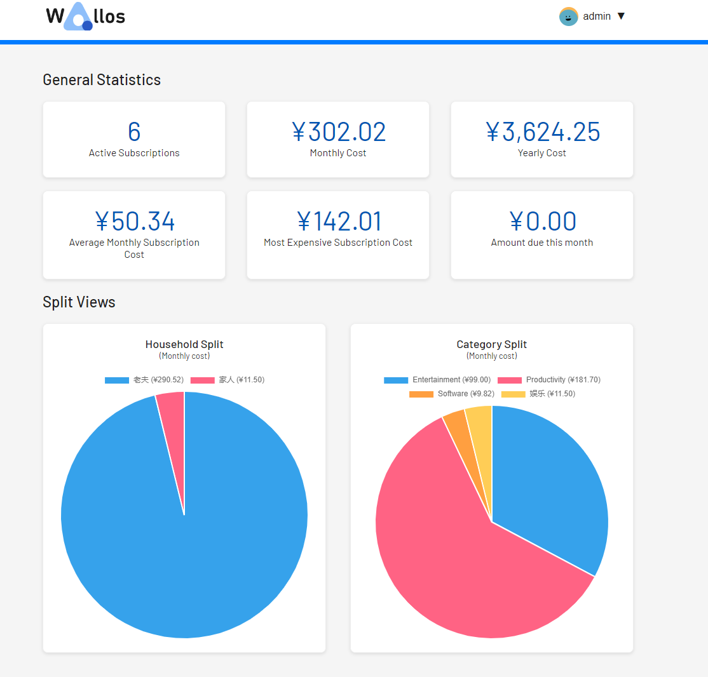


### 汇率转化

如果你也和我一样有一些国外服务的会员，需要汇率转化，那么你需要申请[Fixer](https://fixer.io/#pricing_plan)的账号，每个月有1000次免费调用

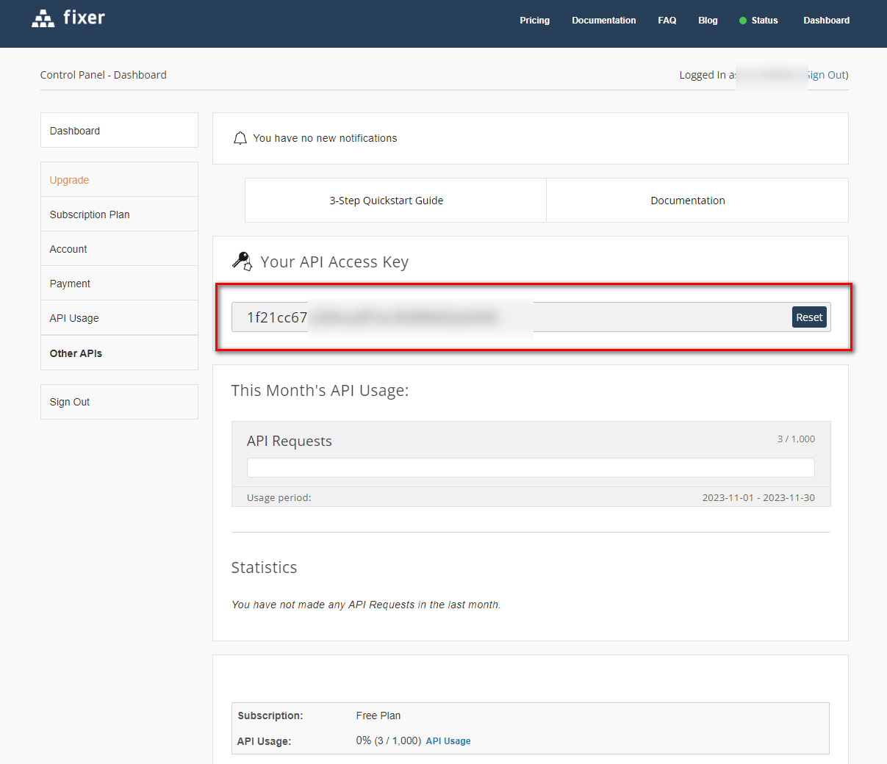


## 最后

最后希望这个小工具，可以帮助你，更好的管理自己的订阅和会员~


如果你喜欢这篇文章，请记得点赞，收藏，并关注【老爸的数字花园（nasdaddy)】，我们将会持续带来更多实用的自搭建应用指南。一起，让我们掌握自己的数据，创建自己的数字世界！

如果你在搭建过程中遇到任何问题，或者有任何建议，也欢迎在下方留言，一起探讨和学习。