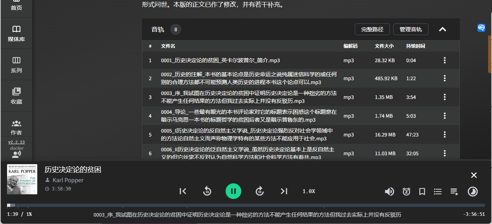
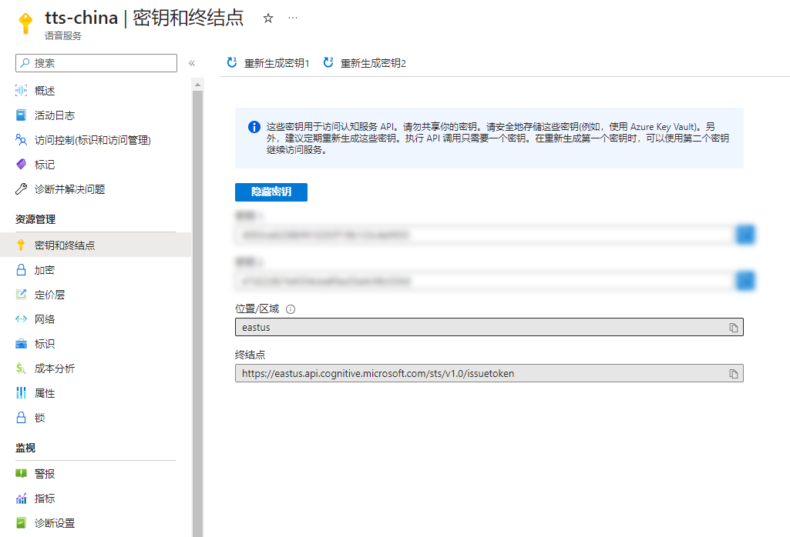
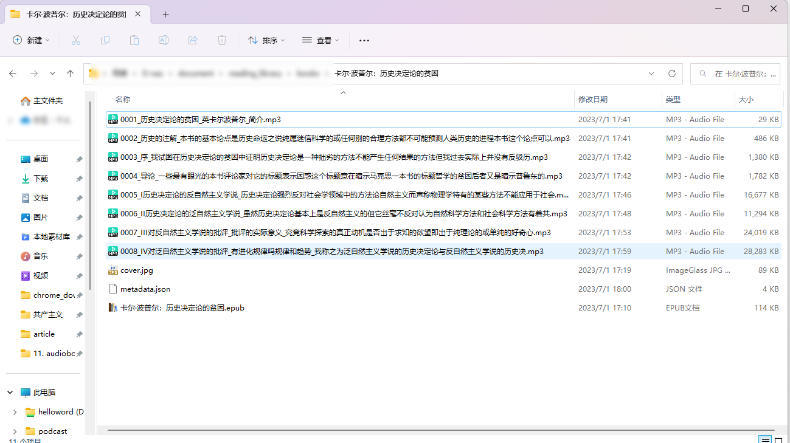
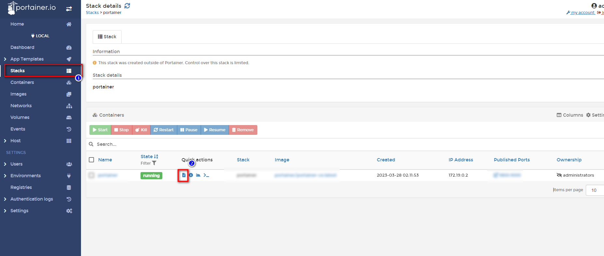
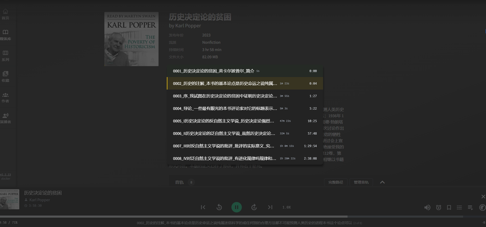
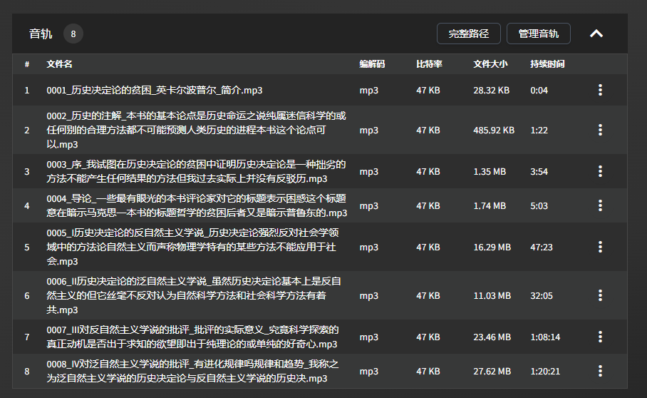

Erstellen Sie Ihre eigenen Hörbücher! Der Audiobook Maker verwandelt Ihre E-Books in Hörbücher. Genießen Sie das Lesevergnügen in Ihrer Freizeit mit verschiedenen Sprachoptionen. Klicken Sie hier, um mehr über das detaillierte Tutorial und Beispiele zu erfahren.
<!--more-->

## 1. Einführung

In meinem vorherigen Artikel habe ich "AudioBookShelf" vorgestellt, einen leistungsstarken Service zur Verwaltung von E-Books, Hörbüchern und Podcasts.

[So nutzen Sie Ihr NAS optimal: Erstellen Sie ein Audiobookshelf für ein All-in-One-Lese- und Hörerlebnis](/how-to-install-audiobookshelf-on-your-nas/)


Allerdings haben viele Freunde in den Kommentaren gefragt, wo sie Ressourcen finden können.

Einige haben die xxx-Cloud erwähnt, andere haben PT-Seiten erwähnt. Basierend auf meiner Beobachtung:

- Die Ressourcen im Internet sind `veraltet`.
- Viele `gute Bücher` sind seit Jahren auf dem Markt und haben immer noch `keine Hörbücher`.

Ich bin eine Person, die gerne selbstständig ist, daher bringe ich Ihnen heute diese kleine Sache, um Ihnen zu helfen, Ihre eigenen Hörbücher zu erstellen: `Audiobook Maker`.

Ich habe auf diese Weise bereits mehr als zehn Bücher "gelesen", ob auf dem Weg zur Arbeit oder beim Genießen der Nachmittagssonne.

---

## Vorstellung des Audiobook Makers

Der Audiobook Maker kann E-Books im `EPUB`-Format in Hörbücher umwandeln.

- `Microsoft Azure Speech Services` (kostenloses Kontingent von 500.000 Zeichen)
  Ich konvertiere jeden Monat ein paar Bücher und habe bisher nichts bezahlt.
- Perfekte Integration mit `audiobookshelf`
  Separate MP3-Dateien für jedes Kapitel




Heute werde ich das Buch "The Poverty of Historicism" von Karl Popper als Beispiel verwenden, um zu demonstrieren, wie Sie Ihre eigenen Hörbücher erstellen können.

> Dieses Buch hat definitiv kein Hörbuch und wird in der vertrauten Stimme von `Yun Shu` erzählt.

Wenn Sie nicht wissen, wer Yun Shu ist, haben Sie bestimmt schon einmal jemanden gehört, der Ihnen häufig Filme vorgelesen hat:

> Schau, vor dir, dieser Mann heißt Xiao Mei und diese Frau heißt Ah Qiang...

Lassen Sie uns zunächst einen Abschnitt des Vorworts von "The Poverty of Historicism" genießen, der von Yun Shu erzählt wird:



---

Einrichtungsschritte:

## 1. Schlüsselpunkt

`Klicken Sie hier, um kostenlos zu folgen` und verirren Sie sich nicht.

## 2. Vorbereitungen

### Azure-Konto

(Aufgrund von Plattformbeschränkungen können keine spezifischen Links bereitgestellt werden. Suchen Sie daher bitte selbst danach oder besuchen Sie Websites wie nasdaddy.com für detaillierte Anleitungen.)

- Azure-Registrierung - [Erstellen Sie ein kostenloses Konto](https://azure.microsoft.com/free/cognitive-services)
- Erstellen Sie eine [Speech Service-Ressource](https://portal.azure.com/#create/Microsoft.CognitiveServicesSpeechServices) im Azure-Portal
- In [Schlüssel und Endpunkt](https://learn.microsoft.com/en-us/azure/cognitive-services/cognitive-services-apis-create-account#get-the-keys-for-your-resource) können Sie Ihre Schlüssel anzeigen



Notieren Sie sich zwei wichtige Informationen:

1. `Schlüssel`, zum Beispiel: "323e6131234102934f19b133c4e9955"
2. `Standort und Region`, zum Beispiel: eastus

## 3. Portainer installieren

Anleitung zur Referenz:
[Installieren Sie Portainer, ein unverzichtbares Tool für NAS, in 30 Sekunden](/how-to-install-portainer-in-nas/)

## 4. Stack erstellen


## 5. Code bereitstellen

Wenn Sie meinem vorherigen Tutorial gefolgt sind, muss die meiste davon nicht geändert werden. `Die einzige Änderung besteht darin, auf die Datei zu verweisen, für die Sie das E-Book generieren möchten`

[Link]

```yaml
version: '3.9'
services:
    p0n1:
        command: '/books/卡尔·波普尔：历史决定论的贫困/卡尔·波普尔：历史决定论的贫困.epub /books/卡尔·波普尔：历史决定论的贫困/ --voice_name zh-CN-YunxiNeural --language ZhHans'
        container_name: audiobook_maker
        image: ghcr.io/p0n1/epub_to_audiobook
        environment:
            - MS_TTS_REGION=eastus  # Die Region aus Schritt 2
            - MS_TTS_KEY=323e6131234102934f19b133c4e9955  # Der Schlüssel aus Schritt 2 (dieser Schlüssel ist mein Schlüssel)
        volumes:
            - '/volume1/docker/audiobookshelf/audiobooks/:/books'

```

1. Stack auswählen
2. Geben Sie "audiobook_maker" in das Namensfeld ein
3. Geben Sie den obigen Code in den Editor ein
4. Klicken Sie auf Bereitstellen

---

### Hinweis:

Besondere Erklärung:

```
1. command
/books/卡尔·波普尔：历史决定论的贫困/卡尔·波普尔：历史决定论的贫困.epub /books/卡尔·波普尔：历史决定论的贫困/ --voice_name zh-CN-YunxiNeural --language ZhHans
Der Code ist in drei Teile unterteilt, achten Sie auf jeden Teil:
```

/books/卡尔·波普尔：历史决定论的贫困/卡尔·波普尔：历史决定论的贫困.epub: Das Verzeichnis des zu konvertierenden E-Books in diesem Fall, `books muss nicht geändert werden`, nur die Adresse danach muss geändert werden

/books/卡尔·波普尔：历史决定论的贫困/: Das Verzeichnis, in dem die Ausgabedateien gespeichert werden (`im selben Verzeichnis wie die EPUB-Datei`)

--voice_name zh-CN-YunxiNeural: `Yunxi Neural-Stimme`, ja, das ist diese Stimme, die in Filmen verwendet wird und schrecklich klingt. Es gibt auch Dutzende andere Stimmen mit unterschiedlichen Emotionen und Tonlagen, die Sie selbst erkunden können.

--language ZhHans: Der Text ist in chinesischer Sprache.

## 2024.3.31 update - docker run & unlimited epub make(free) 
### 1. Verwenden Sie docker run
Ich verwende compose, weil ich persönlich das klare Format von compose mag, aber einige Benutzer haben festgestellt, dass man in manchen Fällen J/N eingeben muss, also habe ich den Befehl docker run hinzugefügt.

```
docker run -d \
  --name audiobook_maker \
  -e MS_TTS_REGION=eastus \
  -e MS_TTS_KEY=323e6131234102934f19b133c4e9955 \
  -v /volume1/docker/audiobookshelf/audiobooks/:/books \
  ghcr.io/p0n1/epub_to_audiobook \
  /books/卡尔-波普尔：历史决定论的贫困/卡尔-波普尔：历史决定论的贫困.epub /books/卡尔-波普尔：历史决定论的贫困/ --voice_name zh-CN-YunxiNeural --language ZhHans

```
### 2. Verwenden Sie einen kostenlosen tts-Server
Verwenden Sie edge für kostenlose, unbegrenzte Text-to-Speech.

```
docker run -d \
  --name audiobook_maker \
  -v "/volume1/docker/audiobookshelf/audiobooks/:/app" \
  ghcr.io/p0n1/epub_to_audiobook \
  /卡尔-波普尔：历史决定论的贫困.epub audiobook_output --tts edge --language zh-CN --voice_name "zh-CN-YunxiNeural"

```
Die unterstützten Sprachen und Audiocodes können Sie auf [dieser Website] (https://speech.platform.bing.com/consumer/speech/synthesize/readaloud/voices/list?trustedclienttoken=6A5AA1D4EAFF4E9FB37E23D68491D6F4) nachlesen.

Locale" ist Ihre Region/Ihr Land

Kurzname" ist der Audiocode

`Gender` ist das Geschlecht des Audios (wählen Sie Ihren Favoriten, Sie brauchen ihn nicht anzugeben).

Ersetze es einfach 

Zum Beispiel:
```
{
    "Name": "Microsoft Server Speech Text to Speech Voice (de-DE, KatjaNeural)",
    "Kurzname": "de-DE-KatjaNeural",
    "Geschlecht": "Weiblich",
    "Gebietsschema": "de-DE",
    "SuggestedCodec": "audio-24khz-48kbitrate-mono-mp3",
    "FriendlyName": "Microsoft Katja Online (Natural) - Deutsch (Deutschland)",
    "Status": "GA",
    "VoiceTag": {
      "ContentCategories": [
        "General"
      ],
      "VoicePersonalities": [
        "Freundlich",
        "Positiv"
      ]
    }
  }
```
`Deutsch` de-DE

`Geschlecht` Weiblich

`Kurzname` de-DE-KatjaNeural


## 6. Erfolg


## 7. Überprüfung

Dieses Tool hat keine grafische Benutzeroberfläche. Es gibt zwei Möglichkeiten, den Fortschritt zu überprüfen:

1. Überprüfen Sie den Status der Dateigenerierung im `Verzeichnis` des E-Books



2. Überprüfen Sie die `Container-Protokolle`

   Da wir Portainer verwenden, können wir den Ausführungsstatus leicht in Portainer sehen

   

## 8. Verwendung

AudioBookShelf erkennt automatisch Ordneränderungen

Sie können dieses obskure Buch "The Poverty of Historicism" von Karl Popper in AudiobookShelf sehen


Und der gesamte Ton ist in Kapitel unterteilt, Sie können problemlos zwischen den Kapiteln in Audiobookshelf wechseln:





Sie können die Fortschrittsleiste sehen:

- Gesamtfortschritt
- Kapitelfortschritt
- Kapiteltitel


## Schließlich

Wenn Ihnen dieser Artikel gefällt, denken Sie bitte daran, ihn zu mögen, zu bookmarken und [Dad's Digital Garden](https://nasdaddy.com) zu folgen. Wir werden weiterhin praktische Anleitungen zur Selbstinstallation von Anwendungen bereitstellen. Gemeinsam nehmen wir unsere Daten in die Hand und schaffen unsere eigene digitale Welt!

Wenn Sie während des Einrichtungsprozesses auf Probleme stoßen oder Vorschläge haben, hinterlassen Sie bitte einen Kommentar unten. Lassen Sie uns diskutieren und gemeinsam lernen.