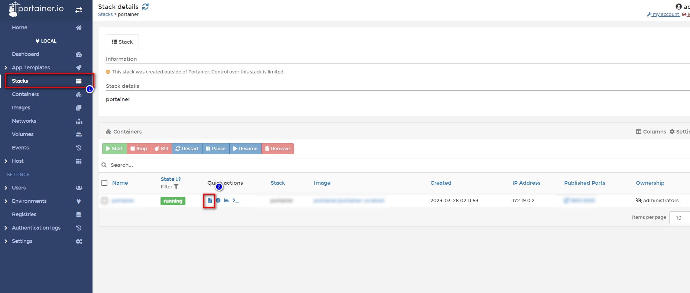
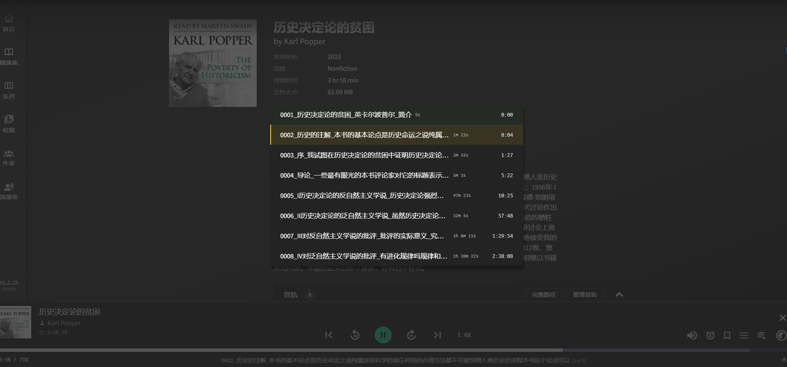
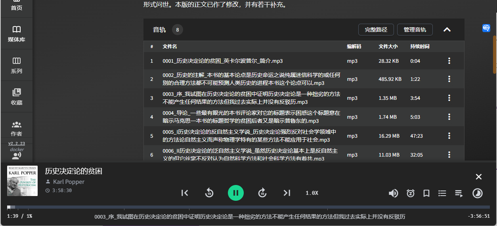

Create your own audiobooks! Audiobook Maker turns your e-books into audiobooks. Enjoy the pleasure of reading in your spare time with various voice options. Click to learn more about the detailed tutorial and examples.
<!--more-->

## 1. Introduction

In my previous article, I introduced `AudioBookShelf`, a powerful service for managing e-books, audiobooks, and podcasts.

[How to Make the Most of Your NAS: Build Audiobookshelf for an All-in-One Reading and Listening Experience](/how-to-install-audiobookshelf-on-your-nas/)


However, many friends in the comments section asked where to find resources.

Some mentioned xxx cloud, some mentioned PT sites. Based on my observation:

- The resources on the internet are `outdated`.
- Many `good books` have been on the market for years and still `lack audiobooks`.

I am a person who likes to be self-reliant, so today I bring you this little thing to help you make your own audiobooks: `Audiobook Maker`.

I have "read" more than ten books using this method, whether it's on my way to work or while enjoying the afternoon sun.

---

## Introducing Audiobook Maker

Audiobook Maker can convert e-books in `EPUB` format into audiobooks.

- `Microsoft Azure Speech Services` (free quota of 500,000 characters)
  I convert a few books every month and have not paid anything so far.
- Perfect integration with `audiobookshelf`
  Independent MP3 files for each chapter


Today, I will use Karl Popper's book "The Poverty of Historicism" as an example to demonstrate how to make your own audiobooks.

> This book definitely does not have an audiobook, and it will be narrated in the familiar voice of `Yun Shu`.

If you don't know who Yun Shu is, you must have heard someone frequently narrating movies to you:

> Look, in front of you, this man is called Xiao Mei, and that woman is called Ah Qiang...

First, let's enjoy a section of the preface of "The Poverty of Historicism" narrated by Yun Shu:



---

Setup Steps:

## 1. Key Point

`Click to follow for free` and don't get lost.

## 2. Preparations

### Azure Account

(Specific links cannot be provided due to platform limitations, so please search for them yourself or visit websites like nasdaddy.com for detailed tutorials.)

- Azure Registration - [Create one for free](https://azure.microsoft.com/free/cognitive-services)
- Create a [Speech Service resource](https://portal.azure.com/#create/Microsoft.CognitiveServicesSpeechServices) in the Azure portal
- In [Keys and Endpoint](https://learn.microsoft.com/en-us/azure/cognitive-services/cognitive-services-apis-create-account#get-the-keys-for-your-resource), view your keys


Record two key pieces of information:

1. `Key`, for example: "323e6131234102934f19b133c4e9955"
2. `Location and Region`, for example: eastus

## 3. Install Portainer

Tutorial reference:
[Install Portainer, a Must-Have Tool for NAS, in 30 Seconds](/how-to-install-portainer-in-nas/)

## 4. Create stack


## 5. Deploy code

If you followed my previous tutorial, most of it doesn't need to be changed, `the only change is to point to the file you want to generate the e-book for`

[Link]

```yaml
version: '3.9'
services:
    p0n1:
        command: '/books/卡尔·波普尔：历史决定论的贫困/卡尔·波普尔：历史决定论的贫困.epub /books/卡尔·波普尔：历史决定论的贫困/ --voice_name zh-CN-YunxiNeural --language ZhHans'
        container_name: audiobook_maker
        image: ghcr.io/p0n1/epub_to_audiobook
        environment:
            - MS_TTS_REGION=eastus  # The region from step 2
            - MS_TTS_KEY=323e6131234102934f19b133c4e9955  # The key obtained from step 2 (this key is my key)
        volumes:
            - '/volume1/docker/audiobookshelf/audiobooks/:/books'

```

1. Select stack
2. Enter "audiobook_maker" in the name field
3. Enter the above code in the editor
4. Click deploy

---

### Note:

Special explanation:

```
1. command
/books/卡尔·波普尔：历史决定论的贫困/卡尔·波普尔：历史决定论的贫困.epub /books/卡尔·波普尔：历史决定论的贫困/ --voice_name zh-CN-YunxiNeural --language ZhHans
The code is divided into three parts, pay attention to each part:
```

/books/卡尔·波普尔：历史决定论的贫困/卡尔·波普尔：历史决定论的贫困.epub: The directory of the e-book to be converted in this case, `books does not need to be modified`, only the address after it needs to be changed

/books/卡尔·波普尔：历史决定论的贫困/: The directory where the output results are stored (`in the same directory as the epub file`)

--voice_name zh-CN-YunxiNeural: `Yunxi Neural voice`, yes, it's that voice used in movies that sounds terrible. There are also dozens of other voices with different emotions and tones, you can explore them yourself.

--language ZhHans: Text language is Chinese.

## 6. Success


## 7. Check

This tool does not have a graphical interface, there are two ways to check the progress:

1. Check the file generation status in the `directory` of the e-book


2. Check the `container logs`

   Since we are using Portainer, we can easily see the running status in Portainer

   

## 8. Usage

AudioBookShelf will automatically detect folder changes

You will be able to see this obscure book "The Poverty of Historicism" by Karl Popper in AudiobookShelf


And the entire audio is divided into chapters, you can easily switch chapters in Audiobookshelf:




You can see the progress bar:

- Overall progress
- Chapter progress
- Chapter title




## Finally

If you like this article, please remember to like, bookmark, and follow [Dad's Digital Garden](https://example.com). We will continue to bring more practical self-built application guides. Together, let's take control of our own data and create our own digital world!

If you encounter any problems during the setup process, or if you have any suggestions, please feel free to leave a comment below. Let's discuss and learn together.