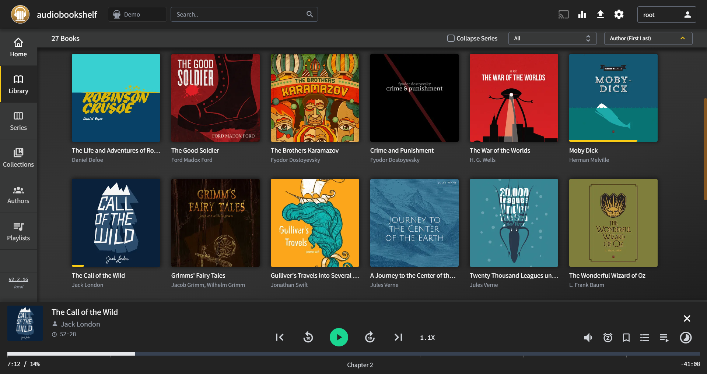
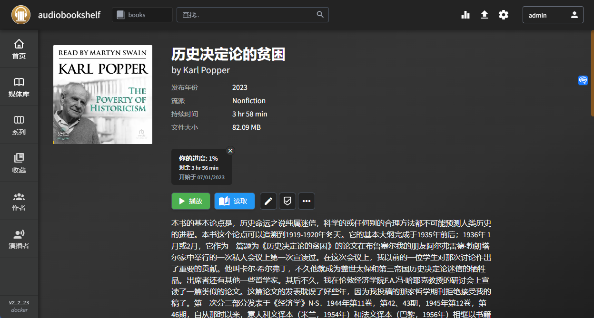
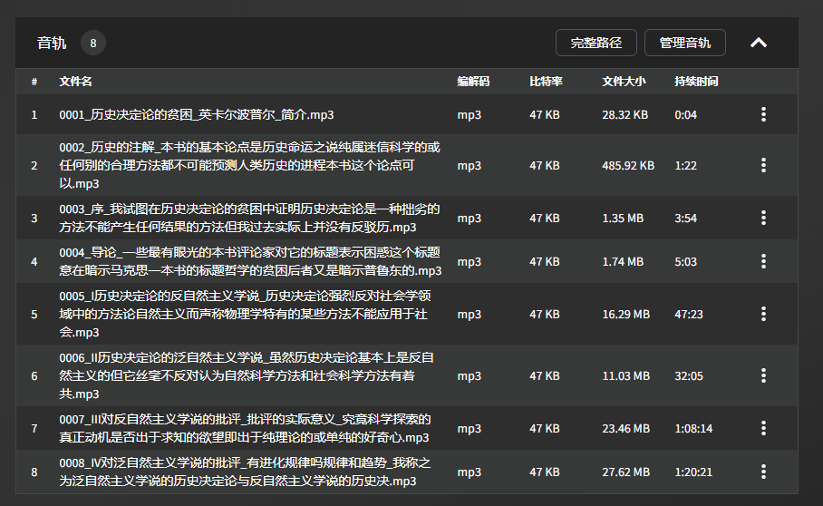

自己制作有声书籍！Audiobook Maker让你的电子书变成有声读物。享受碎片时间的阅读乐趣，云舒等多种语音选择。点击了解详细教程和案例.
<!--more-->

## 1. 前言

上一篇我介绍了`AudioBookShelf`，这个强大的管理电子书，有声书，播客的服务。

[如何充分利用你的NAS：搭建Audiobookshelf实现 一站式读书听书体验](/how-to-install-audiobookshelf-on-your-nas/)



但是评论区不少朋友留言，不知道去哪里找资源？

有的说xxx云，有的说什么pt站，目前我观察下来：

- 网络上`资源陈旧`
- 大量`好书`上市多年，至今`没有有声读物`

我这个人就是喜欢`自力更生`，于是我今天带来了这个小玩意儿，帮助你自己做自己的有声读物：`Audiobook Maker`

我就是通过这种方式，“阅读”了十多本书，无论是在上下班路上，还是看着午后的阳光

---

## 介绍Audiobook Maker

Audiobook Maker可以将`EPUB`格式的电子书转换为有声书。

- `微软Azure语音服务`（免费额度50w字符）
  我每个月转几本书，至今没有付费
- 与`audiobookshelf完美结合`
  每个章节独立的mp3文件




今天我就拿这本  卡尔波普尔的《`历史决定论的贫穷`》来给大家演示，如果靠自己制作有声书籍

> 这本书绝对没有有声书，而且还用大家熟悉的`云舒`口音

如果你不知道谁是云舒，那你一定听过一个人经常给你讲电影：

> 快看，眼前，这个男人叫小美，那个女人叫阿强...

先来欣赏一段，云舒的《历史决定论的贫穷》序：



---

搭建步骤：

## 1. 重点

`点个免费关注`，不迷路


##  2. 前期准备

### Azure 账户

（因平台限制无法贴链接，所以具体链接请自行查找，或去比如：nasdaddy.com 查看详细教程）

- Azure 注册 - [Create one for free](https://azure.microsoft.com/free/cognitive-services)
- 在Azure portal [创建语音服务 资源](https://portal.azure.com/#create/Microsoft.CognitiveServicesSpeechServices)
- 在[密钥与终结点](https://learn.microsoft.com/en-us/azure/cognitive-services/cognitive-services-apis-create-account#get-the-keys-for-your-resource)，查看你的密钥


记录2个关键信息：

1. `密钥`  例如：“323e6131234102934f19b133c4e9955”
2. `位置与区域` 例如：eastus

## 3. 安装Portainer

教程参考：
[30秒安装Nas必备神器 Portainer](/how-to-install-portainer-in-nas/)


## 4. 创建stack


## 5.  部署代码

如果你是按照我之前教程搭建的话，大部分不需要变，`唯一变化的是，指向你想要生成电子书的文件`

[链接]

```yaml
version: '3.9'
services:
    p0n1:
        command: '/books/卡尔·波普尔：历史决定论的贫困/卡尔·波普尔：历史决定论的贫困.epub /books/卡尔·波普尔：历史决定论的贫困/ --voice_name zh-CN-YunxiNeural --language ZhHans'
        container_name: audiobook_maker
        image: ghcr.io/p0n1/epub_to_audiobook
        environment:
            - MS_TTS_REGION=eastus  # 步骤2中的区域
            - MS_TTS_KEY=323e6131234102934f19b133c4e9955  # 步骤2中获取的密钥（此密钥是我的密钥）
        volumes:
            - '/volume1/docker/audiobookshelf/audiobooks/:/books'

```

1. 选择stack
2. name栏输入audiobook_maker
3. edditor输入：上面代码
4. 点击deploy


---

### 注意：

特殊解释：

```
1. command
/books/卡尔·波普尔：历史决定论的贫困/卡尔·波普尔：历史决定论的贫困.epub /books/卡尔·波普尔：历史决定论的贫困/ --voice_name zh-CN-YunxiNeural --language ZhHans
代码分三段注意看：
```

/books/卡尔·波普尔：历史决定论的贫困/卡尔·波普尔：历史决定论的贫困.epub ：为本次转化电子书的目录，`books不需要修改`，只需要改后面的地址

/books/卡尔·波普尔：历史决定论的贫困/  ：输出结果存放目录（`与epub文件处于同一个目录`）

--voice_name zh-CN-YunxiNeural  ： `云舒语音`，没错，就是那个电影解说用烂的语音，其他还有十几种语音，不同情绪，音调，可自行探索

--language ZhHans  ： 文本语言  中文


## 2024.3.31 update - docker run 指令 & 无限免费的制作epub 有声书
### 1. 使用 docker run
使用compose是因为我个人比较喜欢compose清晰的格式， 但有网友发现某些情况下可能会出现要输入Y/N的情况，故加入docker run指令

```
docker run -d \
  --name audiobook_maker \
  -e MS_TTS_REGION=eastus \
  -e MS_TTS_KEY=323e6131234102934f19b133c4e9955 \
  -v /volume1/docker/audiobookshelf/audiobooks/:/books \
  ghcr.io/p0n1/epub_to_audiobook \
  /books/卡尔·波普尔：历史决定论的贫困/卡尔·波普尔：历史决定论的贫困.epub /books/卡尔·波普尔：历史决定论的贫困/ --voice_name zh-CN-YunxiNeural --language ZhHans

```
### 2. 使用 free tts server
使用edge的可以实现免费，无限量的文字转语音

```
docker run -d \
  --name audiobook_maker \
  -v "/volume1/docker/audiobookshelf/audiobooks/:/app" \
  ghcr.io/p0n1/epub_to_audiobook \
  卡尔·波普尔：历史决定论的贫困/卡尔·波普尔：历史决定论的贫困.epub audiobook_output --tts edge --language zh-CN --voice_name "zh-CN-YunxiNeural"

```
你可以在[此网站](https://speech.platform.bing.com/consumer/speech/synthesize/readaloud/voices/list?trustedclienttoken=6A5AA1D4EAFF4E9FB37E23D68491D6F4)查询 支持的语言与音频code

Locale 为你所在的地区/国家

ShortName 为音频code

Gender 为音频的性别（选择你喜欢的，并不需要传入）

将其替换即可

比如：
```
{
    "Name": "Microsoft Server Speech Text to Speech Voice (de-DE, KatjaNeural)",
    "ShortName": "de-DE-KatjaNeural",
    "Gender": "Female",
    "Locale": "de-DE",
    "SuggestedCodec": "audio-24khz-48kbitrate-mono-mp3",
    "FriendlyName": "Microsoft Katja Online (Natural) - German (Germany)",
    "Status": "GA",
    "VoiceTag": {
      "ContentCategories": [
        "General"
      ],
      "VoicePersonalities": [
        "Friendly",
        "Positive"
      ]
    }
  }
```
德语 de-DE

性别 Female

ShortName de-DE-KatjaNeural


## 6. 成功


## 7. 查看

这个工具并没有图形界面，有两种方式查看进度：

1. 查看电子书`所在目录`文件生成情况


2. 查看`container日志`

   因为我们是portainer 搭建，所以可以在portainer中很轻松的看到运行情况

   

## 8. 使用

AudioBookShelf 自动会检测到文件夹变化

你就能看到这本冷门的 卡尔波普尔的《历史决定论的贫穷》


而且整个音频是分章节的，你在audiobookshelf可以轻松切换章节：




进度条可以看到：

- 整体进度
- 章节进度
- 章节标题


## 最后

如果你喜欢这篇文章，请记得点赞，收藏，并关注【老爸的数字花园】，我们将会持续带来更多实用的自搭建应用指南。一起，让我们掌握自己的数据，创建自己的数字世界！


如果你在搭建过程中遇到任何问题，或者有任何建议，也欢迎在下方留言，一起探讨和学习。